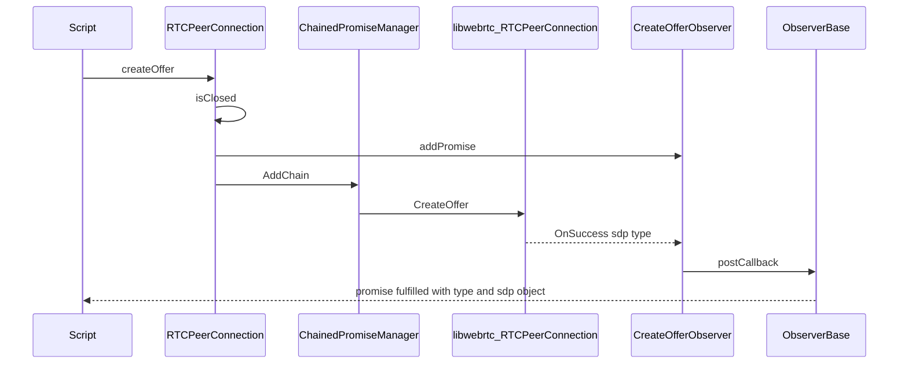
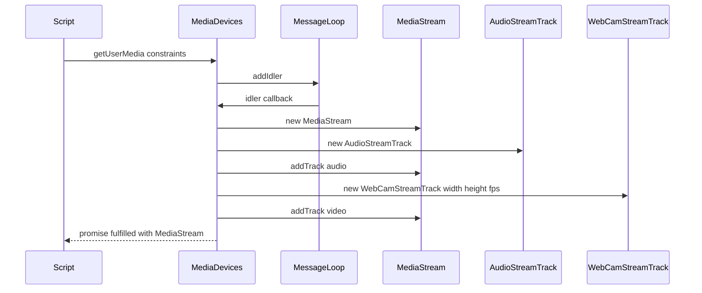
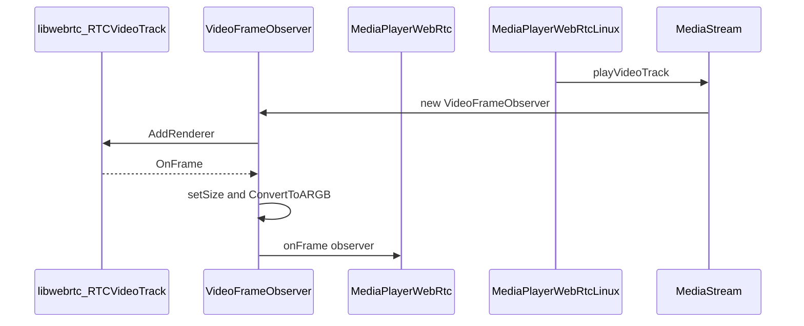

# Module Design Card: modules-mediastream

> **Relevant source files**
>
> - [src/core/modules/mediastream/ConstrainBooleanParameters.h](src:src/core/modules/mediastream/ConstrainBooleanParameters.h)
> - [src/core/modules/mediastream/ConstrainDOMStringParameters.h](src:src/core/modules/mediastream/ConstrainDOMStringParameters.h)
> - [src/core/modules/mediastream/ConstrainDoubleRange.h](src:src/core/modules/mediastream/ConstrainDoubleRange.h)
> - [src/core/modules/mediastream/ConstrainLongRange.h](src:src/core/modules/mediastream/ConstrainLongRange.h)
> - [src/core/modules/mediastream/DoubleRange.h](src:src/core/modules/mediastream/DoubleRange.h)
> - [src/core/modules/mediastream/MediaDevices.cpp](src:src/core/modules/mediastream/MediaDevices.cpp)
> - [src/core/modules/mediastream/MediaDevices.h](src:src/core/modules/mediastream/MediaDevices.h)
> - [src/core/modules/mediastream/MediaStream.cpp](src:src/core/modules/mediastream/MediaStream.cpp)
> - [src/core/modules/mediastream/MediaStream.h](src:src/core/modules/mediastream/MediaStream.h)
> - [src/core/modules/mediastream/MediaStreamTrack.cpp](src:src/core/modules/mediastream/MediaStreamTrack.cpp)
> - [src/core/modules/mediastream/MediaStreamTrack.h](src:src/core/modules/mediastream/MediaStreamTrack.h)
> - [src/core/modules/mediastream/MediaTrackConstraintSet.h](src:src/core/modules/mediastream/MediaTrackConstraintSet.h)
> - [src/core/modules/mediastream/MediaTrackConstraints.h](src:src/core/modules/mediastream/MediaTrackConstraints.h)
> - [src/core/modules/mediastream/RTCCertificate.cpp](src:src/core/modules/mediastream/RTCCertificate.cpp)
> - [src/core/modules/mediastream/RTCCertificate.h](src:src/core/modules/mediastream/RTCCertificate.h)
> - [src/core/modules/mediastream/RTCConfiguration.cpp](src:src/core/modules/mediastream/RTCConfiguration.cpp)
> - [src/core/modules/mediastream/RTCConfiguration.h](src:src/core/modules/mediastream/RTCConfiguration.h)
> - [src/core/modules/mediastream/RTCDataChannel.cpp](src:src/core/modules/mediastream/RTCDataChannel.cpp)
> - [src/core/modules/mediastream/RTCDataChannel.h](src:src/core/modules/mediastream/RTCDataChannel.h)
> - [src/core/modules/mediastream/RTCDataChannelEvent.cpp](src:src/core/modules/mediastream/RTCDataChannelEvent.cpp)
> - [src/core/modules/mediastream/RTCDataChannelEvent.h](src:src/core/modules/mediastream/RTCDataChannelEvent.h)
> - [src/core/modules/mediastream/RTCDtlsTransport.cpp](src:src/core/modules/mediastream/RTCDtlsTransport.cpp)
> - [src/core/modules/mediastream/RTCDtlsTransport.h](src:src/core/modules/mediastream/RTCDtlsTransport.h)
> - [src/core/modules/mediastream/RTCError.cpp](src:src/core/modules/mediastream/RTCError.cpp)
> - [src/core/modules/mediastream/RTCError.h](src:src/core/modules/mediastream/RTCError.h)
> - [src/core/modules/mediastream/RTCIceCandidate.cpp](src:src/core/modules/mediastream/RTCIceCandidate.cpp)
> - [src/core/modules/mediastream/RTCIceCandidate.h](src:src/core/modules/mediastream/RTCIceCandidate.h)
> - [src/core/modules/mediastream/RTCIceServer.cpp](src:src/core/modules/mediastream/RTCIceServer.cpp)
> - [src/core/modules/mediastream/RTCIceServer.h](src:src/core/modules/mediastream/RTCIceServer.h)
> - [src/core/modules/mediastream/RTCIceTransport.cpp](src:src/core/modules/mediastream/RTCIceTransport.cpp)
> - [src/core/modules/mediastream/RTCIceTransport.h](src:src/core/modules/mediastream/RTCIceTransport.h)
> - [src/core/modules/mediastream/RTCOAuthCredential.h](src:src/core/modules/mediastream/RTCOAuthCredential.h)
> - [src/core/modules/mediastream/RTCPeerConnection.cpp](src:src/core/modules/mediastream/RTCPeerConnection.cpp)
> - [src/core/modules/mediastream/RTCPeerConnection.h](src:src/core/modules/mediastream/RTCPeerConnection.h)
> - [src/core/modules/mediastream/RTCPeerConnectionIceErrorEvent.cpp](src:src/core/modules/mediastream/RTCPeerConnectionIceErrorEvent.cpp)
> - [src/core/modules/mediastream/RTCPeerConnectionIceErrorEvent.h](src:src/core/modules/mediastream/RTCPeerConnectionIceErrorEvent.h)
> - [src/core/modules/mediastream/RTCPeerConnectionIceEvent.cpp](src:src/core/modules/mediastream/RTCPeerConnectionIceEvent.cpp)
> - [src/core/modules/mediastream/RTCPeerConnectionIceEvent.h](src:src/core/modules/mediastream/RTCPeerConnectionIceEvent.h)
> - [src/core/modules/mediastream/RTCPeerConnectionStats.cpp](src:src/core/modules/mediastream/RTCPeerConnectionStats.cpp)
> - [src/core/modules/mediastream/RTCPeerConnectionStats.h](src:src/core/modules/mediastream/RTCPeerConnectionStats.h)
> - [src/core/modules/mediastream/RTCRtcpParameters.cpp](src:src/core/modules/mediastream/RTCRtcpParameters.cpp)
> - [src/core/modules/mediastream/RTCRtcpParameters.h](src:src/core/modules/mediastream/RTCRtcpParameters.h)
> - [src/core/modules/mediastream/RTCRtpCodec.cpp](src:src/core/modules/mediastream/RTCRtpCodec.cpp)
> - [src/core/modules/mediastream/RTCRtpCodec.h](src:src/core/modules/mediastream/RTCRtpCodec.h)
> - [src/core/modules/mediastream/RTCRtpCodecParameters.cpp](src:src/core/modules/mediastream/RTCRtpCodecParameters.cpp)
> - [src/core/modules/mediastream/RTCRtpCodecParameters.h](src:src/core/modules/mediastream/RTCRtpCodecParameters.h)
> - [src/core/modules/mediastream/RTCRtpCodingParameters.cpp](src:src/core/modules/mediastream/RTCRtpCodingParameters.cpp)
> - [src/core/modules/mediastream/RTCRtpCodingParameters.h](src:src/core/modules/mediastream/RTCRtpCodingParameters.h)
> - [src/core/modules/mediastream/RTCRtpEncodingParameters.cpp](src:src/core/modules/mediastream/RTCRtpEncodingParameters.cpp)
> - [src/core/modules/mediastream/RTCRtpEncodingParameters.h](src:src/core/modules/mediastream/RTCRtpEncodingParameters.h)
> - [src/core/modules/mediastream/RTCRtpHeaderExtensionParameters.cpp](src:src/core/modules/mediastream/RTCRtpHeaderExtensionParameters.cpp)
> - [src/core/modules/mediastream/RTCRtpHeaderExtensionParameters.h](src:src/core/modules/mediastream/RTCRtpHeaderExtensionParameters.h)
> - [src/core/modules/mediastream/RTCRtpParameters.cpp](src:src/core/modules/mediastream/RTCRtpParameters.cpp)
> - [src/core/modules/mediastream/RTCRtpParameters.h](src:src/core/modules/mediastream/RTCRtpParameters.h)
> - [src/core/modules/mediastream/RTCRtpReceiver.cpp](src:src/core/modules/mediastream/RTCRtpReceiver.cpp)
> - [src/core/modules/mediastream/RTCRtpReceiver.h](src:src/core/modules/mediastream/RTCRtpReceiver.h)
> - [src/core/modules/mediastream/RTCRtpSendParameters.cpp](src:src/core/modules/mediastream/RTCRtpSendParameters.cpp)
> - [src/core/modules/mediastream/RTCRtpSendParameters.h](src:src/core/modules/mediastream/RTCRtpSendParameters.h)
> - [src/core/modules/mediastream/RTCRtpSender.cpp](src:src/core/modules/mediastream/RTCRtpSender.cpp)
> - [src/core/modules/mediastream/RTCRtpSender.h](src:src/core/modules/mediastream/RTCRtpSender.h)
> - [src/core/modules/mediastream/RTCRtpTransceiver.cpp](src:src/core/modules/mediastream/RTCRtpTransceiver.cpp)
> - [src/core/modules/mediastream/RTCRtpTransceiver.h](src:src/core/modules/mediastream/RTCRtpTransceiver.h)
> - [src/core/modules/mediastream/RTCRtpTransceiverInit.cpp](src:src/core/modules/mediastream/RTCRtpTransceiverInit.cpp)
> - [src/core/modules/mediastream/RTCRtpTransceiverInit.h](src:src/core/modules/mediastream/RTCRtpTransceiverInit.h)
> - [src/core/modules/mediastream/RTCSctpTransport.cpp](src:src/core/modules/mediastream/RTCSctpTransport.cpp)
> - [src/core/modules/mediastream/RTCSctpTransport.h](src:src/core/modules/mediastream/RTCSctpTransport.h)
> - [src/core/modules/mediastream/RTCSessionDescription.cpp](src:src/core/modules/mediastream/RTCSessionDescription.cpp)
> - [src/core/modules/mediastream/RTCSessionDescription.h](src:src/core/modules/mediastream/RTCSessionDescription.h)
> - [src/core/modules/mediastream/RTCStats.cpp](src:src/core/modules/mediastream/RTCStats.cpp)
> - [src/core/modules/mediastream/RTCStats.h](src:src/core/modules/mediastream/RTCStats.h)
> - [src/core/modules/mediastream/RTCStatsReport.cpp](src:src/core/modules/mediastream/RTCStatsReport.cpp)
> - [src/core/modules/mediastream/RTCStatsReport.h](src:src/core/modules/mediastream/RTCStatsReport.h)
> - [src/core/modules/mediastream/RTCTrackEvent.cpp](src:src/core/modules/mediastream/RTCTrackEvent.cpp)
> - [src/core/modules/mediastream/RTCTrackEvent.h](src:src/core/modules/mediastream/RTCTrackEvent.h)
> - [src/core/modules/mediastream/ULongRange.h](src:src/core/modules/mediastream/ULongRange.h)
> - [src/core/modules/mediastream/WebRtcManager.cpp](src:src/core/modules/mediastream/WebRtcManager.cpp)
> - [src/core/modules/mediastream/WebRtcManager.h](src:src/core/modules/mediastream/WebRtcManager.h)
> - [src/core/page/Navigator.h](src:src/core/page/Navigator.h)
> - [src/core/page/Navigator.cpp](src:src/core/page/Navigator.cpp)
> - [src/core/dom/HTMLMediaElement.h](src:src/core/dom/HTMLMediaElement.h)
> - [src/core/dom/HTMLMediaElement.cpp](src:src/core/dom/HTMLMediaElement.cpp)
> - [src/core/dom/DOMException.h](src:src/core/dom/DOMException.h)
> - [src/binding/MediaStreamCustomBinding.cpp](src:src/binding/MediaStreamCustomBinding.cpp)
> - [src/platform/multimedia/MediaPlayerWebRtc.h](src:src/platform/multimedia/MediaPlayerWebRtc.h)
> - [src/platform/multimedia/MediaPlayerWebRtcLinux.cpp](src:src/platform/multimedia/MediaPlayerWebRtcLinux.cpp)
> - [src/platform/multimedia/MediaPlayerWebRtcTizen.cpp](src:src/platform/multimedia/MediaPlayerWebRtcTizen.cpp)
> - [src/core/modules/message_loop/MessageLoopInterface.h](src:src/core/modules/message_loop/MessageLoopInterface.h)
> - [src/core/modules/threading/Thread.h](src:src/core/modules/threading/Thread.h)
> - [src/StarfishBase.h](src:src/StarfishBase.h)
> - [src/StaticStrings.h](src:src/StaticStrings.h)
> - [build/config.cmake](src:build/config.cmake)

**Module**: `modules-mediastream` — 77 files under `src/core/modules/mediastream`
**Role**: Implements the script-facing MediaStream, MediaDevices and RTCPeerConnection object model and forwards every media/peer operation to a `libwebrtc` backend object held by each wrapper ([`RTCPeerConnection`](src:src/core/modules/mediastream/RTCPeerConnection.h#L332), [`WebRtcManager`](src:src/core/modules/mediastream/WebRtcManager.h#L36)).
**Module Boundary**: MediaStream/WebRTC directory (rtp, ice, peer, connection, track keywords)
**Confidence**: 0.92
**Core selection**: All approved modules are Core (boundary approved in W1 human review)
**Generated**: 2026-09-10

All files in this module are compiled only when `STARFISH_ENABLE_WEBRTC` is defined ([`RTCPeerConnection.h`](src:src/core/modules/mediastream/RTCPeerConnection.h#L20)); the build sets that define when the `WEBRTC` option is `1` ([`config.cmake`](src:build/config.cmake#L338)).

## Source Files

### Media capture and streams
- [src/core/modules/mediastream/MediaDevices.h](src:src/core/modules/mediastream/MediaDevices.h), [src/core/modules/mediastream/MediaDevices.cpp](src:src/core/modules/mediastream/MediaDevices.cpp)
- [src/core/modules/mediastream/MediaStream.h](src:src/core/modules/mediastream/MediaStream.h), [src/core/modules/mediastream/MediaStream.cpp](src:src/core/modules/mediastream/MediaStream.cpp)
- [src/core/modules/mediastream/MediaStreamTrack.h](src:src/core/modules/mediastream/MediaStreamTrack.h), [src/core/modules/mediastream/MediaStreamTrack.cpp](src:src/core/modules/mediastream/MediaStreamTrack.cpp)
- [src/core/modules/mediastream/WebRtcManager.h](src:src/core/modules/mediastream/WebRtcManager.h), [src/core/modules/mediastream/WebRtcManager.cpp](src:src/core/modules/mediastream/WebRtcManager.cpp)

### Constraint dictionaries
- [src/core/modules/mediastream/ConstrainBooleanParameters.h](src:src/core/modules/mediastream/ConstrainBooleanParameters.h)
- [src/core/modules/mediastream/ConstrainDOMStringParameters.h](src:src/core/modules/mediastream/ConstrainDOMStringParameters.h)
- [src/core/modules/mediastream/ConstrainDoubleRange.h](src:src/core/modules/mediastream/ConstrainDoubleRange.h)
- [src/core/modules/mediastream/ConstrainLongRange.h](src:src/core/modules/mediastream/ConstrainLongRange.h)
- [src/core/modules/mediastream/DoubleRange.h](src:src/core/modules/mediastream/DoubleRange.h)
- [src/core/modules/mediastream/ULongRange.h](src:src/core/modules/mediastream/ULongRange.h)
- [src/core/modules/mediastream/MediaTrackConstraintSet.h](src:src/core/modules/mediastream/MediaTrackConstraintSet.h)
- [src/core/modules/mediastream/MediaTrackConstraints.h](src:src/core/modules/mediastream/MediaTrackConstraints.h)

### Peer connection, configuration and session
- [src/core/modules/mediastream/RTCPeerConnection.h](src:src/core/modules/mediastream/RTCPeerConnection.h), [src/core/modules/mediastream/RTCPeerConnection.cpp](src:src/core/modules/mediastream/RTCPeerConnection.cpp)
- [src/core/modules/mediastream/RTCConfiguration.h](src:src/core/modules/mediastream/RTCConfiguration.h), [src/core/modules/mediastream/RTCConfiguration.cpp](src:src/core/modules/mediastream/RTCConfiguration.cpp)
- [src/core/modules/mediastream/RTCIceServer.h](src:src/core/modules/mediastream/RTCIceServer.h), [src/core/modules/mediastream/RTCIceServer.cpp](src:src/core/modules/mediastream/RTCIceServer.cpp)
- [src/core/modules/mediastream/RTCOAuthCredential.h](src:src/core/modules/mediastream/RTCOAuthCredential.h)
- [src/core/modules/mediastream/RTCCertificate.h](src:src/core/modules/mediastream/RTCCertificate.h), [src/core/modules/mediastream/RTCCertificate.cpp](src:src/core/modules/mediastream/RTCCertificate.cpp)
- [src/core/modules/mediastream/RTCSessionDescription.h](src:src/core/modules/mediastream/RTCSessionDescription.h), [src/core/modules/mediastream/RTCSessionDescription.cpp](src:src/core/modules/mediastream/RTCSessionDescription.cpp)
- [src/core/modules/mediastream/RTCIceCandidate.h](src:src/core/modules/mediastream/RTCIceCandidate.h), [src/core/modules/mediastream/RTCIceCandidate.cpp](src:src/core/modules/mediastream/RTCIceCandidate.cpp)
- [src/core/modules/mediastream/RTCError.h](src:src/core/modules/mediastream/RTCError.h), [src/core/modules/mediastream/RTCError.cpp](src:src/core/modules/mediastream/RTCError.cpp)

### RTP senders, receivers, transceivers and parameter dictionaries
- [src/core/modules/mediastream/RTCRtpSender.h](src:src/core/modules/mediastream/RTCRtpSender.h), [src/core/modules/mediastream/RTCRtpSender.cpp](src:src/core/modules/mediastream/RTCRtpSender.cpp)
- [src/core/modules/mediastream/RTCRtpReceiver.h](src:src/core/modules/mediastream/RTCRtpReceiver.h), [src/core/modules/mediastream/RTCRtpReceiver.cpp](src:src/core/modules/mediastream/RTCRtpReceiver.cpp)
- [src/core/modules/mediastream/RTCRtpTransceiver.h](src:src/core/modules/mediastream/RTCRtpTransceiver.h), [src/core/modules/mediastream/RTCRtpTransceiver.cpp](src:src/core/modules/mediastream/RTCRtpTransceiver.cpp)
- [src/core/modules/mediastream/RTCRtpTransceiverInit.h](src:src/core/modules/mediastream/RTCRtpTransceiverInit.h), [src/core/modules/mediastream/RTCRtpTransceiverInit.cpp](src:src/core/modules/mediastream/RTCRtpTransceiverInit.cpp)
- [src/core/modules/mediastream/RTCRtpParameters.h](src:src/core/modules/mediastream/RTCRtpParameters.h), [src/core/modules/mediastream/RTCRtpParameters.cpp](src:src/core/modules/mediastream/RTCRtpParameters.cpp)
- [src/core/modules/mediastream/RTCRtpSendParameters.h](src:src/core/modules/mediastream/RTCRtpSendParameters.h), [src/core/modules/mediastream/RTCRtpSendParameters.cpp](src:src/core/modules/mediastream/RTCRtpSendParameters.cpp)
- [src/core/modules/mediastream/RTCRtpCodec.h](src:src/core/modules/mediastream/RTCRtpCodec.h), [src/core/modules/mediastream/RTCRtpCodec.cpp](src:src/core/modules/mediastream/RTCRtpCodec.cpp)
- [src/core/modules/mediastream/RTCRtpCodecParameters.h](src:src/core/modules/mediastream/RTCRtpCodecParameters.h), [src/core/modules/mediastream/RTCRtpCodecParameters.cpp](src:src/core/modules/mediastream/RTCRtpCodecParameters.cpp)
- [src/core/modules/mediastream/RTCRtpCodingParameters.h](src:src/core/modules/mediastream/RTCRtpCodingParameters.h), [src/core/modules/mediastream/RTCRtpCodingParameters.cpp](src:src/core/modules/mediastream/RTCRtpCodingParameters.cpp)
- [src/core/modules/mediastream/RTCRtpEncodingParameters.h](src:src/core/modules/mediastream/RTCRtpEncodingParameters.h), [src/core/modules/mediastream/RTCRtpEncodingParameters.cpp](src:src/core/modules/mediastream/RTCRtpEncodingParameters.cpp)
- [src/core/modules/mediastream/RTCRtpHeaderExtensionParameters.h](src:src/core/modules/mediastream/RTCRtpHeaderExtensionParameters.h), [src/core/modules/mediastream/RTCRtpHeaderExtensionParameters.cpp](src:src/core/modules/mediastream/RTCRtpHeaderExtensionParameters.cpp)
- [src/core/modules/mediastream/RTCRtcpParameters.h](src:src/core/modules/mediastream/RTCRtcpParameters.h), [src/core/modules/mediastream/RTCRtcpParameters.cpp](src:src/core/modules/mediastream/RTCRtcpParameters.cpp)

### Data channels and transports
- [src/core/modules/mediastream/RTCDataChannel.h](src:src/core/modules/mediastream/RTCDataChannel.h), [src/core/modules/mediastream/RTCDataChannel.cpp](src:src/core/modules/mediastream/RTCDataChannel.cpp)
- [src/core/modules/mediastream/RTCSctpTransport.h](src:src/core/modules/mediastream/RTCSctpTransport.h), [src/core/modules/mediastream/RTCSctpTransport.cpp](src:src/core/modules/mediastream/RTCSctpTransport.cpp)
- [src/core/modules/mediastream/RTCDtlsTransport.h](src:src/core/modules/mediastream/RTCDtlsTransport.h), [src/core/modules/mediastream/RTCDtlsTransport.cpp](src:src/core/modules/mediastream/RTCDtlsTransport.cpp)
- [src/core/modules/mediastream/RTCIceTransport.h](src:src/core/modules/mediastream/RTCIceTransport.h), [src/core/modules/mediastream/RTCIceTransport.cpp](src:src/core/modules/mediastream/RTCIceTransport.cpp)

### Events and statistics
- [src/core/modules/mediastream/RTCTrackEvent.h](src:src/core/modules/mediastream/RTCTrackEvent.h), [src/core/modules/mediastream/RTCTrackEvent.cpp](src:src/core/modules/mediastream/RTCTrackEvent.cpp)
- [src/core/modules/mediastream/RTCDataChannelEvent.h](src:src/core/modules/mediastream/RTCDataChannelEvent.h), [src/core/modules/mediastream/RTCDataChannelEvent.cpp](src:src/core/modules/mediastream/RTCDataChannelEvent.cpp)
- [src/core/modules/mediastream/RTCPeerConnectionIceEvent.h](src:src/core/modules/mediastream/RTCPeerConnectionIceEvent.h), [src/core/modules/mediastream/RTCPeerConnectionIceEvent.cpp](src:src/core/modules/mediastream/RTCPeerConnectionIceEvent.cpp)
- [src/core/modules/mediastream/RTCPeerConnectionIceErrorEvent.h](src:src/core/modules/mediastream/RTCPeerConnectionIceErrorEvent.h), [src/core/modules/mediastream/RTCPeerConnectionIceErrorEvent.cpp](src:src/core/modules/mediastream/RTCPeerConnectionIceErrorEvent.cpp)
- [src/core/modules/mediastream/RTCStats.h](src:src/core/modules/mediastream/RTCStats.h), [src/core/modules/mediastream/RTCStats.cpp](src:src/core/modules/mediastream/RTCStats.cpp)
- [src/core/modules/mediastream/RTCStatsReport.h](src:src/core/modules/mediastream/RTCStatsReport.h), [src/core/modules/mediastream/RTCStatsReport.cpp](src:src/core/modules/mediastream/RTCStatsReport.cpp)
- [src/core/modules/mediastream/RTCPeerConnectionStats.h](src:src/core/modules/mediastream/RTCPeerConnectionStats.h), [src/core/modules/mediastream/RTCPeerConnectionStats.cpp](src:src/core/modules/mediastream/RTCPeerConnectionStats.cpp)

## Public Interface

| Function/Class | Signature | Main callers | Source |
|---|---|---|---|
| `WebRtcManager` | `class WebRtcManager : public gc` | [`Navigator::webRtcManager`](src:src/core/page/Navigator.cpp#L83) creates one per navigator | [`WebRtcManager`](src:src/core/modules/mediastream/WebRtcManager.h#L36) |
| `WebRtcManager::peerConnectionFactory` | `libwebrtc::scoped_refptr<libwebrtc::RTCPeerConnectionFactory> peerConnectionFactory()` | [`RTCPeerConnection::initializePeerConnection`](src:src/core/modules/mediastream/RTCPeerConnection.cpp#L714), [`MediaStream::MediaStream`](src:src/core/modules/mediastream/MediaStream.cpp#L216) | [`WebRtcManager::peerConnectionFactory`](src:src/core/modules/mediastream/WebRtcManager.cpp#L85) |
| `MediaDevices` | `class MediaDevices : public EventTarget, public DocumentHoldable` | [`Navigator::mediaDevices`](src:src/core/modules/mediastream/MediaDevices.cpp#L40) (declared in [`Navigator.h`](src:src/core/page/Navigator.h#L90)) | [`MediaDevices`](src:src/core/modules/mediastream/MediaDevices.h#L76) |
| `MediaDevices::getUserMedia` | `Promise* getUserMedia(MediaStreamConstraints constraints = MediaStreamConstraints())` | Script binding (not in repository) | [`MediaDevices::getUserMedia`](src:src/core/modules/mediastream/MediaDevices.cpp#L71) |
| `MediaStream` | `class MediaStream : public EventTarget, public MediaStreamTrackObserver` | [`mediastreamConstructor`](src:src/binding/MediaStreamCustomBinding.cpp#L30); aliased as `MediaProvider` in [`HTMLMediaElement.h`](src:src/core/dom/HTMLMediaElement.h#L44) | [`MediaStream`](src:src/core/modules/mediastream/MediaStream.h#L42) |
| `MediaStream::getVideoTracks` / `getAudioTracks` | `GCVector<MediaStreamTrack*> getVideoTracks()` | [`MediaPlayerWebRtcLinux::play`](src:src/platform/multimedia/MediaPlayerWebRtcLinux.cpp#L90) | [`MediaStream::getVideoTracks`](src:src/core/modules/mediastream/MediaStream.cpp#L349) |
| `MediaStream::playVideoTrack` / `playAudioTrack` | `void playVideoTrack(MediaStreamTrack* track)` | [`MediaPlayerWebRtcLinux::play`](src:src/platform/multimedia/MediaPlayerWebRtcLinux.cpp#L90) | [`MediaStream::playVideoTrack`](src:src/core/modules/mediastream/MediaStream.cpp#L441) |
| `MediaStream::setMediaPlayer` | `void setMediaPlayer(MediaPlayerWebRtc* mediaPlayer)` | [`MediaPlayerWebRtcLinux.cpp`](src:src/platform/multimedia/MediaPlayerWebRtcLinux.cpp#L122), [`MediaPlayerWebRtcTizen.cpp`](src:src/platform/multimedia/MediaPlayerWebRtcTizen.cpp#L136) | [`MediaStream::setMediaPlayer`](src:src/core/modules/mediastream/MediaStream.h#L210) |
| `MediaStream::VideoFrameObserver` | `class VideoFrameObserver : public gc, public libwebrtc::RTCVideoRenderer<...>` | [`MediaPlayerWebRtc::onFrame`](src:src/platform/multimedia/MediaPlayerWebRtc.h#L72) receives it | [`MediaStream::VideoFrameObserver`](src:src/core/modules/mediastream/MediaStream.h#L46) |
| `MediaStreamTrack` | `class MediaStreamTrack : public EventTarget` | [`MediaStreamCustomBinding.cpp`](src:src/binding/MediaStreamCustomBinding.cpp#L67), [`MediaPlayerWebRtcLinux::play`](src:src/platform/multimedia/MediaPlayerWebRtcLinux.cpp#L90) | [`MediaStreamTrack`](src:src/core/modules/mediastream/MediaStreamTrack.h#L42) |
| `RTCPeerConnection` | `class RTCPeerConnection : public EventTarget` | Script binding referenced by comment at [`RTCPeerConnection.h`](src:src/core/modules/mediastream/RTCPeerConnection.h#L67); no in-repository C++ caller outside the module | [`RTCPeerConnection`](src:src/core/modules/mediastream/RTCPeerConnection.h#L332) |
| `RTCPeerConnection::createOffer` | `Promise* createOffer(RTCOfferOptions options = RTCOfferOptions())` | Script binding (not in repository) | [`RTCPeerConnection::createOffer`](src:src/core/modules/mediastream/RTCPeerConnection.cpp#L789) |
| `RTCPeerConnection::setRemoteDescription` | `Promise* setRemoteDescription(RTCSessionDescriptionInit& description)` | Script binding (not in repository) | [`RTCPeerConnection::setRemoteDescription`](src:src/core/modules/mediastream/RTCPeerConnection.cpp#L1198) |
| `RTCPeerConnection::addIceCandidate` | `Promise* addIceCandidate(RTCIceCandidateInit candidate = RTCIceCandidateInit())` | Script binding (not in repository) | [`RTCPeerConnection::addIceCandidate`](src:src/core/modules/mediastream/RTCPeerConnection.cpp#L1309) |
| `RTCPeerConnection::addTrack` | `RTCRtpSender* addTrack(MediaStreamTrack* track, GCVector<MediaStream*>& streams)` | [`RTCPeerConnection::addStream`](src:src/core/modules/mediastream/RTCPeerConnection.cpp#L2084) | [`RTCPeerConnection::addTrack`](src:src/core/modules/mediastream/RTCPeerConnection.cpp#L1721) |
| `RTCPeerConnection::createDataChannel` | `RTCDataChannel* createDataChannel(String* label, RTCDataChannelInit dataChannelDict = RTCDataChannelInit())` | Script binding (not in repository) | [`RTCPeerConnection::createDataChannel`](src:src/core/modules/mediastream/RTCPeerConnection.cpp#L1602) |
| `RTCPeerConnection::getStats` | `Promise* getStats(MediaStreamTrack* selector = nullptr)` | Script binding (not in repository) | [`RTCPeerConnection::getStats`](src:src/core/modules/mediastream/RTCPeerConnection.cpp#L1946) |
| `RTCDataChannel::send` | `void send(String* data)` | Script binding (not in repository) | [`RTCDataChannel::send`](src:src/core/modules/mediastream/RTCDataChannel.cpp#L256) |
| `RTCRtpSender::setParameters` | `Promise* setParameters(RTCRtpSendParameters parameters)` | Script binding (not in repository) | [`RTCRtpSender::setParameters`](src:src/core/modules/mediastream/RTCRtpSender.cpp#L105) |
| `RTCConfiguration::genBackend` | `libwebrtc::RTCConfiguration genBackend()` | [`RTCPeerConnection::initializePeerConnection`](src:src/core/modules/mediastream/RTCPeerConnection.cpp#L714) | [`RTCConfiguration::genBackend`](src:src/core/modules/mediastream/RTCConfiguration.cpp#L139) |

## IPC / Message / Interface Contracts

- No cross-module IPC or message contract is identifiable in code for this module.
- The peer-to-peer media and data transport is not implemented in this module: every network-facing operation is a method call on a `libwebrtc::RTCPeerConnection` object obtained from the backend factory ([`RTCPeerConnection::initializePeerConnection`](src:src/core/modules/mediastream/RTCPeerConnection.cpp#L714), [`WebRtcManager::createPeerConnection`](src:src/core/modules/mediastream/WebRtcManager.cpp#L97)), and backend results arrive as in-process observer callbacks ([`PeerConnectionObserver`](src:src/core/modules/mediastream/RTCPeerConnection.h#L152), [`RTCDataChannelObserver`](src:src/core/modules/mediastream/RTCDataChannel.h#L55)). The build configuration states that signaling uses WebSocket and refuses `WEBRTC=1` without it ([`config.cmake`](src:build/config.cmake#L331)); no signaling code exists inside this module.

## Key Flow

Entry symbol: [`RTCPeerConnection::createOffer`](src:src/core/modules/mediastream/RTCPeerConnection.cpp#L789); the chained operation calls the backend and the result is settled through [`CreateOfferAnswerObserver::OnSuccess`](src:src/core/modules/mediastream/RTCPeerConnection.cpp#L474) after [`ObserverBase::postCallback`](src:src/core/modules/mediastream/RTCPeerConnection.cpp#L107) moves it to the main thread.

Entry symbol: [`MediaDevices::getUserMedia`](src:src/core/modules/mediastream/MediaDevices.cpp#L71); tracks are created by [`AudioStreamTrack::AudioStreamTrack`](src:src/core/modules/mediastream/MediaStreamTrack.cpp#L98) and [`WebCamStreamTrack::WebCamStreamTrack`](src:src/core/modules/mediastream/MediaStreamTrack.cpp#L239) and attached via [`MediaStream::addTrack`](src:src/core/modules/mediastream/MediaStream.cpp#L364).

Entry symbol: [`MediaStream::playVideoTrack`](src:src/core/modules/mediastream/MediaStream.cpp#L441); frames are converted in [`MediaStream::VideoFrameObserver::OnFrame`](src:src/core/modules/mediastream/MediaStream.cpp#L161) and handed to the platform player through [`MediaPlayerWebRtc::onFrame`](src:src/platform/multimedia/MediaPlayerWebRtc.h#L72).

## Architectural Rules

- [ ] Every wrapper object holds a `libwebrtc` backend reference named `m_backend` and reports "disposed" when that reference is null; `dispose()` is idempotent and logs a warning on repeat calls. [`RTCPeerConnection::dispose`](src:src/core/modules/mediastream/RTCPeerConnection.cpp#L753), [`MediaStream::dispose`](src:src/core/modules/mediastream/MediaStream.cpp#L286), [`RTCDataChannel::dispose`](src:src/core/modules/mediastream/RTCDataChannel.cpp#L168)
- [ ] Backend callbacks that may arrive on a non-main thread are re-posted to the main thread through the message loop before touching garbage-collected memory or dispatching events. [`ObserverBase::postCallback`](src:src/core/modules/mediastream/RTCPeerConnection.cpp#L107), [`RTCDataChannelObserver::OnStateChange`](src:src/core/modules/mediastream/RTCDataChannel.cpp#L61)
- [ ] Asynchronous peer-connection operations (offer, answer, local/remote description) are serialized: each promise is queued in `ChainedPromiseManager` and the next operation starts only when the previous promise settles; all queued promises are rejected with `INVALID_STATE_ERR` when the connection is closed. [`ChainedPromiseManager::AddChain`](src:src/core/modules/mediastream/RTCPeerConnection.cpp#L595)
- [ ] Every object in the module obtains the shared `WebRtcManager` through `executionContext()->document()->window()->navigator()->webRtcManager()` and registers itself with it so the manager can dispose all objects when the last peer connection is deleted. [`RTCPeerConnection::RTCPeerConnection`](src:src/core/modules/mediastream/RTCPeerConnection.cpp#L670), [`WebRtcManager::deletePeerConnectionFactory`](src:src/core/modules/mediastream/WebRtcManager.cpp#L54)
- [ ] Garbage-collected objects register a finalizer that runs the destructor (`GC_REGISTER_FINALIZER_NO_ORDER`). [`WebRtcManager::WebRtcManager`](src:src/core/modules/mediastream/WebRtcManager.cpp#L38), [`MediaStreamTrack::MediaStreamTrack`](src:src/core/modules/mediastream/MediaStreamTrack.cpp#L38)
- [ ] Script-visible state strings are cached on the wrapper and updated only from backend state-change callbacks; getters force "closed" when the connection is closed. [`PeerConnectionObserver::OnSignalingState`](src:src/core/modules/mediastream/RTCPeerConnection.cpp#L147), [`RTCPeerConnection::signalingState`](src:src/core/modules/mediastream/RTCPeerConnection.cpp#L1386)
- [ ] Dictionary types mirror optional members with `DEFINE_GETTER_SETTER_WITH_HASFLAG` (a value plus a `m_has*` flag) and are converted to backend structures by dedicated `gen*`/`to*` functions. [`RTCDataChannelInit`](src:src/core/modules/mediastream/RTCDataChannel.h#L34), [`RTCRtpTransceiverInit::toLibwebrtcRtpTransceiverInit`](src:src/core/modules/mediastream/RTCRtpTransceiverInit.cpp#L37), [`StarfishBase.h`](src:src/StarfishBase.h#L564)
- [ ] Unimplemented paths are marked explicitly with `STARFISH_UNSUPPORTED` instead of silently succeeding. [`RTCPeerConnection::getRemoteStreams`](src:src/core/modules/mediastream/RTCPeerConnection.cpp#L2093), [`PeerConnectionObserver::OnAddStream`](src:src/core/modules/mediastream/RTCPeerConnection.cpp#L456), [`StarfishBase.h`](src:src/StarfishBase.h#L525)

## Dependencies

### Internal modules

| Module | File(s) | Purpose | Source |
|---|---|---|---|
| core-dom | `core/dom/EventTarget.h`, `core/dom/Event.h`, `core/dom/DOMException.h`, `core/dom/ExecutionContext.h`, `core/dom/Document.h`, `core/dom/MessageEvent.h` | Base class for script-visible objects, event dispatch, exception codes | [`RTCPeerConnection.h`](src:src/core/modules/mediastream/RTCPeerConnection.h#L25), [`DOMException.h`](src:src/core/dom/DOMException.h#L40) |
| core-dom | `core/dom/HTMLMediaElement.h` | `MediaStream` is the `MediaProvider` type assigned by `srcObject` | [`HTMLMediaElement.h`](src:src/core/dom/HTMLMediaElement.h#L44), [`HTMLMediaElement::setSrcObject`](src:src/core/dom/HTMLMediaElement.cpp#L568) |
| core-page | `core/page/Window.h`, `core/page/Navigator.h`, `core/page/WebBase.h`, `core/page/GlobalScope.h` | Reach the per-navigator `WebRtcManager` and `MediaDevices`; access message loop and global scope | [`Navigator::webRtcManager`](src:src/core/page/Navigator.cpp#L83), [`MediaStream.cpp`](src:src/core/modules/mediastream/MediaStream.cpp#L29) |
| binding | `binding/ScriptWrappable.h`, `binding/ScriptBindingInstance.h`, `binding/Maplike.h`, `binding/generated/*Union.h` | Script wrapping, promise creation, map-like stats report, union dictionary types | [`RTCStatsReport`](src:src/core/modules/mediastream/RTCStatsReport.h#L32), [`RTCPeerConnection.h`](src:src/core/modules/mediastream/RTCPeerConnection.h#L37) |
| engine-entry | `StarfishConfig.h`, `Starfish.h` | Build configuration and engine-wide declarations included by every file | [`RTCPeerConnection.cpp`](src:src/core/modules/mediastream/RTCPeerConnection.cpp#L22) |
| modules-runtime | `core/modules/message_loop/MessageLoop.h`, `core/modules/threading/Thread.h`, `core/modules/threading/Mutex.h`, `core/modules/threading/Locker.h` | Main-thread re-posting of backend callbacks, `isMainThread`, frame buffer locking | [`ObserverBase::postCallback`](src:src/core/modules/mediastream/RTCPeerConnection.cpp#L107), [`Thread.h`](src:src/core/modules/threading/Thread.h#L39), [`MessageLoopInterface.h`](src:src/core/modules/message_loop/MessageLoopInterface.h#L26) |
| core-util | `core/util/String.h` | Engine string type used for all script-facing strings | [`RTCSessionDescription.h`](src:src/core/modules/mediastream/RTCSessionDescription.h#L27) |
| core-extras | `core/serialize/Serializer.h` | `RTCCertificate` implements `Serializable` | [`RTCCertificate`](src:src/core/modules/mediastream/RTCCertificate.h#L32) |
| platform-multimedia | `platform/multimedia/MediaPlayerWebRtc.h` | Frame/audio delivery target for decoded media | [`MediaStream.cpp`](src:src/core/modules/mediastream/MediaStream.cpp#L38), [`MediaPlayerWebRtc::onFrame`](src:src/platform/multimedia/MediaPlayerWebRtc.h#L72) |

### External libraries

| Library | Version | Purpose | Source |
|---|---|---|---|
| libwebrtc (`rtc_*.h`, `libwebrtc.h`, namespace `libwebrtc`) | Not specified in code | Peer connection factory, media tracks, data channels, session descriptions, statistics; include directory `third_party/webrtc/src/libwebrtc/include` | [`WebRtcManager.cpp`](src:src/core/modules/mediastream/WebRtcManager.cpp#L30), [`config.cmake`](src:build/config.cmake#L812) |
| `b2bua::AudioFrame` base class | Not specified in code | Audio frame sink interface implemented by `AudioTrackObserver`; defining header not in repository | [`MediaStream::AudioTrackObserver`](src:src/core/modules/mediastream/MediaStream.h#L102) |
| Escargot (`EscargotPublic.h`) | Not specified in code | Script value/object construction for session description init objects | [`RTCPeerConnection::createSessionDescriptionInitObject`](src:src/core/modules/mediastream/RTCPeerConnection.cpp#L962) |
| Garbage collector (`gc` base class, `GC_REGISTER_FINALIZER_NO_ORDER`) | Not specified in code | Managed allocation and finalizers for wrapper objects | [`WebRtcManager::WebRtcManager`](src:src/core/modules/mediastream/WebRtcManager.cpp#L38) |
| alsa (Linux build only) | Not specified in code | Required package when `WEBRTC=1` on Linux | [`config.cmake`](src:build/config.cmake#L587) |
| capi-media-player, capi-media-sound-manager, capi-media-camera, capi-media-tool, capi-system-device, capi-media-audio-io (Tizen build only) | Not specified in code | Required packages when `WEBRTC=1` on Tizen | [`config.cmake`](src:build/config.cmake#L685) |

## Quick Navigation

| To change… | Location |
|---|---|
| Camera/microphone acquisition and default capture size | [`MediaDevices::getUserMedia`](src:src/core/modules/mediastream/MediaDevices.cpp#L71), [`MediaDevices::kWidth`](src:src/core/modules/mediastream/MediaDevices.h#L78) |
| Audio input device selection | [`WebRtcManager::createAudioTrack`](src:src/core/modules/mediastream/WebRtcManager.cpp#L119) |
| Video capture device selection | [`WebCamStreamTrack::WebCamStreamTrack`](src:src/core/modules/mediastream/MediaStreamTrack.cpp#L239) |
| Peer connection configuration validation rules | [`RTCPeerConnection::setConfiguration`](src:src/core/modules/mediastream/RTCPeerConnection.cpp#L1429), [`RTCConfiguration::genBackend`](src:src/core/modules/mediastream/RTCConfiguration.cpp#L139) |
| Offer/answer state checks | [`RTCPeerConnection::createOffer`](src:src/core/modules/mediastream/RTCPeerConnection.cpp#L789), [`RTCPeerConnection::setRtcSessionDescription`](src:src/core/modules/mediastream/RTCPeerConnection.cpp#L1067) |
| Operation serialization | [`ChainedPromiseManager::AddChain`](src:src/core/modules/mediastream/RTCPeerConnection.cpp#L595) |
| Thread hand-off of backend callbacks | [`ObserverBase::postCallback`](src:src/core/modules/mediastream/RTCPeerConnection.cpp#L107) |
| State strings and events emitted for state changes | [`PeerConnectionObserver::OnSignalingState`](src:src/core/modules/mediastream/RTCPeerConnection.cpp#L147), [`PeerConnectionObserver::OnIceConnectionState`](src:src/core/modules/mediastream/RTCPeerConnection.cpp#L340) |
| Remote track arrival handling | [`PeerConnectionObserver::OnTrack`](src:src/core/modules/mediastream/RTCPeerConnection.cpp#L243), [`RTCRtpReceiver::track`](src:src/core/modules/mediastream/RTCRtpReceiver.cpp#L72) |
| Data channel creation limits | [`RTCPeerConnection::createDataChannel`](src:src/core/modules/mediastream/RTCPeerConnection.cpp#L1602) |
| Sender parameter read-only checks | [`RTCRtpSendParameters::validRTCRtpSendParameters`](src:src/core/modules/mediastream/RTCRtpSendParameters.cpp#L77) |
| Video frame conversion for rendering | [`MediaStream::VideoFrameObserver::OnFrame`](src:src/core/modules/mediastream/MediaStream.cpp#L161) |
| Statistics report construction | [`GetStatsObserver::OnSuccess`](src:src/core/modules/mediastream/RTCPeerConnection.cpp#L564), [`RTCStats::createScriptValueFromMediaRTCStats`](src:src/core/modules/mediastream/RTCStats.cpp#L51) |

## FR Linkage

- [FR-MODULES-MEDIASTREAM-001](../functional-requirements/modules-mediastream-fr.md#fr-modules-mediastream-001): Acquire local audio/video as a MediaStream
- [FR-MODULES-MEDIASTREAM-002](../functional-requirements/modules-mediastream-fr.md#fr-modules-mediastream-002): Manage tracks inside a MediaStream
- [FR-MODULES-MEDIASTREAM-003](../functional-requirements/modules-mediastream-fr.md#fr-modules-mediastream-003): Create and configure a peer connection
- [FR-MODULES-MEDIASTREAM-004](../functional-requirements/modules-mediastream-fr.md#fr-modules-mediastream-004): Negotiate sessions with offers and answers
- [FR-MODULES-MEDIASTREAM-005](../functional-requirements/modules-mediastream-fr.md#fr-modules-mediastream-005): Exchange ICE candidates
- [FR-MODULES-MEDIASTREAM-006](../functional-requirements/modules-mediastream-fr.md#fr-modules-mediastream-006): Attach and detach media tracks on a peer connection
- [FR-MODULES-MEDIASTREAM-007](../functional-requirements/modules-mediastream-fr.md#fr-modules-mediastream-007): Send data over data channels
- [FR-MODULES-MEDIASTREAM-008](../functional-requirements/modules-mediastream-fr.md#fr-modules-mediastream-008): Surface connection state changes and remote media as events
- [FR-MODULES-MEDIASTREAM-009](../functional-requirements/modules-mediastream-fr.md#fr-modules-mediastream-009): Report connection statistics
- [FR-MODULES-MEDIASTREAM-010](../functional-requirements/modules-mediastream-fr.md#fr-modules-mediastream-010): Render received media through the platform player
- [FR-MODULES-MEDIASTREAM-011](../functional-requirements/modules-mediastream-fr.md#fr-modules-mediastream-011): Release backend resources deterministically
