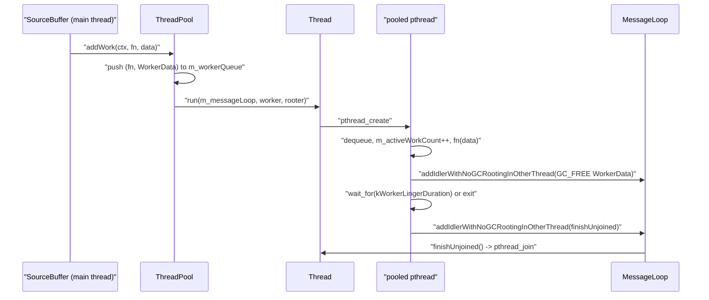
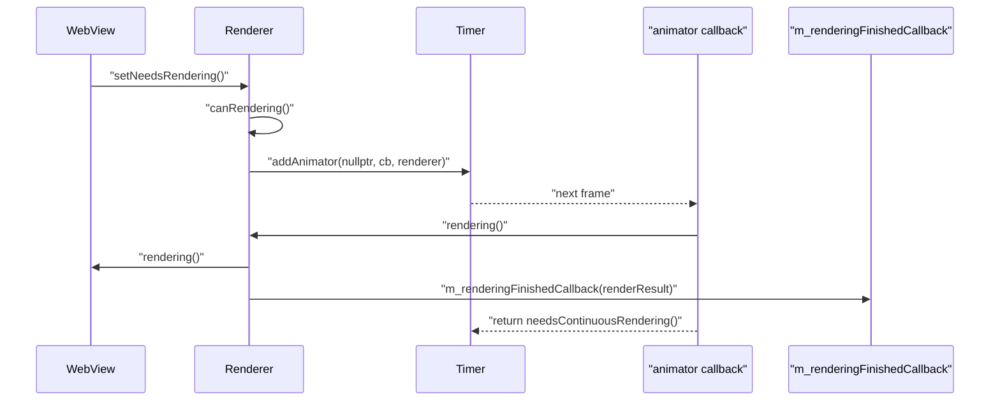
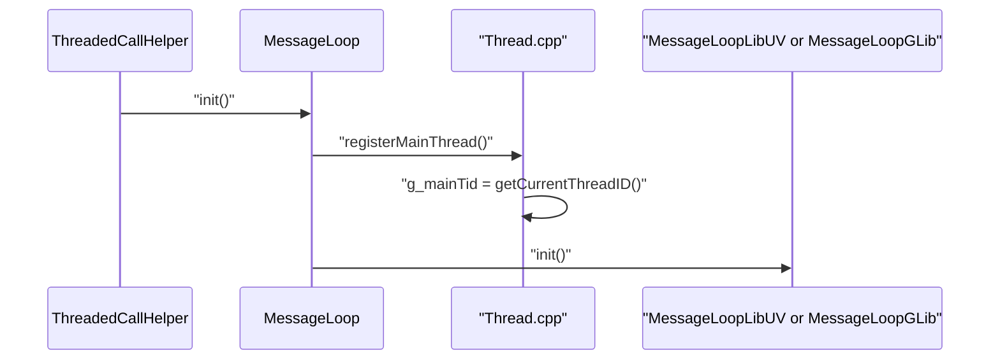

# Module Design Card: modules-runtime

> **Relevant source files**
>
> - [src/core/modules/message_loop/MessageLoop.cpp](src:src/core/modules/message_loop/MessageLoop.cpp)
> - [src/core/modules/message_loop/MessageLoop.h](src:src/core/modules/message_loop/MessageLoop.h)
> - [src/core/modules/message_loop/MessageLoopInterface.h](src:src/core/modules/message_loop/MessageLoopInterface.h)
> - [src/core/modules/message_loop/RunLoop.cpp](src:src/core/modules/message_loop/RunLoop.cpp)
> - [src/core/modules/message_loop/RunLoop.h](src:src/core/modules/message_loop/RunLoop.h)
> - [src/core/modules/message_loop/Timer.cpp](src:src/core/modules/message_loop/Timer.cpp)
> - [src/core/modules/message_loop/Timer.h](src:src/core/modules/message_loop/Timer.h)
> - [src/core/modules/profiling/FrameRateCounter.cpp](src:src/core/modules/profiling/FrameRateCounter.cpp)
> - [src/core/modules/profiling/FrameRateCounter.h](src:src/core/modules/profiling/FrameRateCounter.h)
> - [src/core/modules/profiling/LayoutFlowLoggerBuilder.cpp](src:src/core/modules/profiling/LayoutFlowLoggerBuilder.cpp)
> - [src/core/modules/profiling/LayoutFlowLoggerBuilder.h](src:src/core/modules/profiling/LayoutFlowLoggerBuilder.h)
> - [src/core/modules/profiling/Logger.h](src:src/core/modules/profiling/Logger.h)
> - [src/core/modules/profiling/Profiling.cpp](src:src/core/modules/profiling/Profiling.cpp)
> - [src/core/modules/profiling/Profiling.h](src:src/core/modules/profiling/Profiling.h)
> - [src/core/modules/renderer/Renderer.cpp](src:src/core/modules/renderer/Renderer.cpp)
> - [src/core/modules/renderer/Renderer.h](src:src/core/modules/renderer/Renderer.h)
> - [src/core/modules/renderer/RendererFactory.h](src:src/core/modules/renderer/RendererFactory.h)
> - [src/core/modules/renderer/RendererGL.cpp](src:src/core/modules/renderer/RendererGL.cpp)
> - [src/core/modules/renderer/RendererHeadless.cpp](src:src/core/modules/renderer/RendererHeadless.cpp)
> - [src/core/modules/renderer/RendererSoftware.cpp](src:src/core/modules/renderer/RendererSoftware.cpp)
> - [src/core/modules/renderer/VirtualCursor.h](src:src/core/modules/renderer/VirtualCursor.h)
> - [src/core/modules/renderer/VirtualCursorData.cpp](src:src/core/modules/renderer/VirtualCursorData.cpp)
> - [src/core/modules/threading/AdaptedThread.cpp](src:src/core/modules/threading/AdaptedThread.cpp)
> - [src/core/modules/threading/AdaptedThread.h](src:src/core/modules/threading/AdaptedThread.h)
> - [src/core/modules/threading/IRunnable.h](src:src/core/modules/threading/IRunnable.h)
> - [src/core/modules/threading/Locker.h](src:src/core/modules/threading/Locker.h)
> - [src/core/modules/threading/Mutex.cpp](src:src/core/modules/threading/Mutex.cpp)
> - [src/core/modules/threading/Mutex.h](src:src/core/modules/threading/Mutex.h)
> - [src/core/modules/threading/ParallelJobExecutor.h](src:src/core/modules/threading/ParallelJobExecutor.h)
> - [src/core/modules/threading/Semaphore.cpp](src:src/core/modules/threading/Semaphore.cpp)
> - [src/core/modules/threading/Semaphore.h](src:src/core/modules/threading/Semaphore.h)
> - [src/core/modules/threading/Thread.cpp](src:src/core/modules/threading/Thread.cpp)
> - [src/core/modules/threading/Thread.h](src:src/core/modules/threading/Thread.h)
> - [src/core/modules/threading/ThreadClient.h](src:src/core/modules/threading/ThreadClient.h)
> - [src/core/modules/threading/ThreadPool.cpp](src:src/core/modules/threading/ThreadPool.cpp)
> - [src/core/modules/threading/ThreadPool.h](src:src/core/modules/threading/ThreadPool.h)
> - [src/core/page/WebBase.h](src:src/core/page/WebBase.h)
> - [src/core/page/WebView.h](src:src/core/page/WebView.h)
> - [src/core/page/WebView.cpp](src:src/core/page/WebView.cpp)
> - [src/Starfish.h](src:src/Starfish.h)
> - [src/Starfish.cpp](src:src/Starfish.cpp)
> - [src/platform/message_loop/MessageLoopLibUV.h](src:src/platform/message_loop/MessageLoopLibUV.h)
> - [src/platform/message_loop/MessageLoopGLib.h](src:src/platform/message_loop/MessageLoopGLib.h)
> - [src/platform/message_loop/TimerLibUV.h](src:src/platform/message_loop/TimerLibUV.h)
> - [src/platform/message_loop/TimerGLib.h](src:src/platform/message_loop/TimerGLib.h)
> - [src/platform/message_loop/RunLoopLibUV.h](src:src/platform/message_loop/RunLoopLibUV.h)
> - [src/platform/message_loop/RunLoopGLib.h](src:src/platform/message_loop/RunLoopGLib.h)
> - [src/public/delegate/ThreadedCallHelper.cpp](src:src/public/delegate/ThreadedCallHelper.cpp)
> - [src/public/delegate/JavaScriptNativeHandler.cpp](src:src/public/delegate/JavaScriptNativeHandler.cpp)
> - [src/public/delegate/LWEWebContainerDelegate.cpp](src:src/public/delegate/LWEWebContainerDelegate.cpp)
> - [src/core/modules/mediasource/SourceBuffer.cpp](src:src/core/modules/mediasource/SourceBuffer.cpp)
> - [src/core/modules/sharedworker/host/SharedWorkerAgent.cpp](src:src/core/modules/sharedworker/host/SharedWorkerAgent.cpp)
> - [src/core/modules/worker/PerProcess.cpp](src:src/core/modules/worker/PerProcess.cpp)
> - [src/core/modules/worker/WebWorker.cpp](src:src/core/modules/worker/WebWorker.cpp)
> - [src/core/modules/worker/util/network/IORunnable.h](src:src/core/modules/worker/util/network/IORunnable.h)
> - [src/core/modules/cast/CastServer.cpp](src:src/core/modules/cast/CastServer.cpp)
> - [src/core/modules/canvas/filter/FilterTurbulence.cpp](src:src/core/modules/canvas/filter/FilterTurbulence.cpp)
> - [src/core/dom/HTMLSelectElement.cpp](src:src/core/dom/HTMLSelectElement.cpp)
> - [src/core/dom/HTMLImageElement.cpp](src:src/core/dom/HTMLImageElement.cpp)
> - [src/core/dom/Scrolling.cpp](src:src/core/dom/Scrolling.cpp)
> - [src/core/page/A11yTouchExploration.cpp](src:src/core/page/A11yTouchExploration.cpp)
> - [src/core/layout/StackingContext.cpp](src:src/core/layout/StackingContext.cpp)

**Module**: `modules-runtime` — 36 files under `src/core/modules/threading/`, `src/core/modules/message_loop/`, `src/core/modules/profiling/`, `src/core/modules/renderer/`
**Role**: Provides the engine's execution substrate: thread creation and joining tied to an owning message loop ([`Thread::run`](src:src/core/modules/threading/Thread.cpp#L144)), a short-task thread pool ([`ThreadPool::addWork`](src:src/core/modules/threading/ThreadPool.cpp#L88)), backend-selected message loops and timers ([`MessageLoop::create`](src:src/core/modules/message_loop/MessageLoop.cpp#L32), [`Timer::create`](src:src/core/modules/message_loop/Timer.cpp#L28)), elapsed-time profiling ([`ProfilerTimer`](src:src/core/modules/profiling/Profiling.h#L39)), and the per-WebView rendering scheduler and input-event front door ([`Renderer::setNeedsRendering`](src:src/core/modules/renderer/Renderer.cpp#L416)).
**Module Boundary**: Engine-runtime support sibling directories under modules (threading, message_loop, profiling, renderer) grouped as one infrastructure surface
**Confidence**: 0.78
**Core selection**: All approved modules are Core (boundary approved in W1 human review)
**Generated**: 2026-09-10

## Source Files

### `src/core/modules/threading/` — threads, pool, synchronization primitives
- [src/core/modules/threading/Thread.h](src:src/core/modules/threading/Thread.h)
- [src/core/modules/threading/Thread.cpp](src:src/core/modules/threading/Thread.cpp)
- [src/core/modules/threading/ThreadPool.h](src:src/core/modules/threading/ThreadPool.h)
- [src/core/modules/threading/ThreadPool.cpp](src:src/core/modules/threading/ThreadPool.cpp)
- [src/core/modules/threading/ThreadClient.h](src:src/core/modules/threading/ThreadClient.h)
- [src/core/modules/threading/AdaptedThread.h](src:src/core/modules/threading/AdaptedThread.h)
- [src/core/modules/threading/AdaptedThread.cpp](src:src/core/modules/threading/AdaptedThread.cpp)
- [src/core/modules/threading/IRunnable.h](src:src/core/modules/threading/IRunnable.h)
- [src/core/modules/threading/ParallelJobExecutor.h](src:src/core/modules/threading/ParallelJobExecutor.h)
- [src/core/modules/threading/Mutex.h](src:src/core/modules/threading/Mutex.h)
- [src/core/modules/threading/Mutex.cpp](src:src/core/modules/threading/Mutex.cpp)
- [src/core/modules/threading/Locker.h](src:src/core/modules/threading/Locker.h)
- [src/core/modules/threading/Semaphore.h](src:src/core/modules/threading/Semaphore.h)
- [src/core/modules/threading/Semaphore.cpp](src:src/core/modules/threading/Semaphore.cpp)

### `src/core/modules/message_loop/` — message loop, run loop, timers
- [src/core/modules/message_loop/MessageLoopInterface.h](src:src/core/modules/message_loop/MessageLoopInterface.h)
- [src/core/modules/message_loop/MessageLoop.h](src:src/core/modules/message_loop/MessageLoop.h)
- [src/core/modules/message_loop/MessageLoop.cpp](src:src/core/modules/message_loop/MessageLoop.cpp)
- [src/core/modules/message_loop/RunLoop.h](src:src/core/modules/message_loop/RunLoop.h)
- [src/core/modules/message_loop/RunLoop.cpp](src:src/core/modules/message_loop/RunLoop.cpp)
- [src/core/modules/message_loop/Timer.h](src:src/core/modules/message_loop/Timer.h)
- [src/core/modules/message_loop/Timer.cpp](src:src/core/modules/message_loop/Timer.cpp)

### `src/core/modules/profiling/` — timing, profiling, diagnostics
- [src/core/modules/profiling/Profiling.h](src:src/core/modules/profiling/Profiling.h)
- [src/core/modules/profiling/Profiling.cpp](src:src/core/modules/profiling/Profiling.cpp)
- [src/core/modules/profiling/FrameRateCounter.h](src:src/core/modules/profiling/FrameRateCounter.h)
- [src/core/modules/profiling/FrameRateCounter.cpp](src:src/core/modules/profiling/FrameRateCounter.cpp)
- [src/core/modules/profiling/Logger.h](src:src/core/modules/profiling/Logger.h)
- [src/core/modules/profiling/LayoutFlowLoggerBuilder.h](src:src/core/modules/profiling/LayoutFlowLoggerBuilder.h)
- [src/core/modules/profiling/LayoutFlowLoggerBuilder.cpp](src:src/core/modules/profiling/LayoutFlowLoggerBuilder.cpp)

### `src/core/modules/renderer/` — rendering scheduler, backends, input dispatch
- [src/core/modules/renderer/Renderer.h](src:src/core/modules/renderer/Renderer.h)
- [src/core/modules/renderer/Renderer.cpp](src:src/core/modules/renderer/Renderer.cpp)
- [src/core/modules/renderer/RendererFactory.h](src:src/core/modules/renderer/RendererFactory.h)
- [src/core/modules/renderer/RendererGL.cpp](src:src/core/modules/renderer/RendererGL.cpp)
- [src/core/modules/renderer/RendererSoftware.cpp](src:src/core/modules/renderer/RendererSoftware.cpp)
- [src/core/modules/renderer/RendererHeadless.cpp](src:src/core/modules/renderer/RendererHeadless.cpp)
- [src/core/modules/renderer/VirtualCursor.h](src:src/core/modules/renderer/VirtualCursor.h)
- [src/core/modules/renderer/VirtualCursorData.cpp](src:src/core/modules/renderer/VirtualCursorData.cpp)

## Public Interface

| Function/Class | Signature | Main callers | Source |
|---|---|---|---|
| `isMainThread` | `bool isMainThread()` | 25 files assert on it, e.g. `SourceBuffer.cpp`, `RTCPeerConnection.cpp`, `FetchCacheStream.cpp` | [`isMainThread`](src:src/core/modules/threading/Thread.cpp#L73) |
| `registerMainThread` | `void registerMainThread()` | `MessageLoop::init` | [`registerMainThread`](src:src/core/modules/threading/Thread.cpp#L68) |
| `numberOfCores` | `size_t numberOfCores()` | `ParallelJobExecutor` constructor | [`numberOfCores`](src:src/core/modules/threading/Thread.cpp#L51) |
| `Thread::run` | `void run(MessageLoop* msgLoop, ThreadWorker fn, void* data)` / `StoppableThreadWorker` overload | `ThreadPool::addWork`, `AdaptedThread::start`, `ParallelJobExecutor::execute` | [`Thread::run`](src:src/core/modules/threading/Thread.cpp#L144) |
| `Thread::joinIfNeeds` | `void joinIfNeeds()` | `AdaptedThread::join`, `ParallelJobExecutor::execute` | [`Thread::joinIfNeeds`](src:src/core/modules/threading/Thread.cpp#L213) |
| `Thread::stop` | `bool stop()` | Stoppable-worker owners | [`Thread::stop`](src:src/core/modules/threading/Thread.cpp#L237) |
| `ThreadPool::addWork` | `void addWork(ExecutionContext* ctx, ThreadWorker fn, void* data, bool dataPointerComesFromNoGC = false)` | `SourceBuffer.cpp`, `NetworkURLResourceRequestJobDelegate.cpp`, `serviceworker/util/ParallelTask.cpp`, `platform/loader/ImageResource.cpp` | [`ThreadPool::addWork`](src:src/core/modules/threading/ThreadPool.cpp#L88) |
| `ThreadPool::destroy` | `void destroy(bool waitForActiveWork = false)` | WebBase/WebView teardown | [`ThreadPool::destroy`](src:src/core/modules/threading/ThreadPool.cpp#L44) |
| `AdaptedThread::start` | `void start(IRunnable* runnable) override` | `CastServer.cpp`, `PerProcess.cpp`, `SocketLWS.cpp` | [`AdaptedThread::start`](src:src/core/modules/threading/AdaptedThread.cpp#L45) |
| `IRunnable` | `class IRunnable : public gc` (`run`, `stop`, `setStopper`) | `IORunnable` in `modules-workers` | [`IRunnable`](src:src/core/modules/threading/IRunnable.h#L25) |
| `ParallelJobExecutor::execute` | `void execute()` | `FilterTurbulence.cpp`, `style/FilterFunctions.cpp` | [`ParallelJobExecutor::execute`](src:src/core/modules/threading/ParallelJobExecutor.h#L73) |
| `Locker` | `Locker<T>(T& lock)` (RAII lock in constructor, unlock in destructor) | 19 files outside the module, e.g. `SourceBuffer.cpp` | [`Locker`](src:src/core/modules/threading/Locker.h#L26) |
| `Mutex::lock` | `void lock()` / `void unlock()` | `Locker<Mutex>`, `Thread`, `MessageLoop` | [`Mutex::lock`](src:src/core/modules/threading/Mutex.cpp#L66) |
| `MessageLoop::create` | `static MessageLoop* create()` | `WebView.cpp`, `PerProcess.cpp`, `CastServer.cpp`, `SharedWorkerAgent.cpp` | [`MessageLoop::create`](src:src/core/modules/message_loop/MessageLoop.cpp#L32) |
| `MessageLoop::init` | `static void init()` | `ThreadedCallHelper.cpp` | [`MessageLoop::init`](src:src/core/modules/message_loop/MessageLoop.cpp#L54) |
| `MessageLoop::runOnMainThreadSync` | `static void runOnMainThreadSync(const std::function<void()>& functor)` | `ThreadedCallHelper::PostTaskToLWEMainThreadSync` | [`MessageLoop::runOnMainThreadSync`](src:src/core/modules/message_loop/MessageLoop.cpp#L88) |
| `MessageLoop::runWithProcessMainThreadPausedSync` | `static void runWithProcessMainThreadPausedSync(const std::function<void()>& functor)` | `JavaScriptNativeHandler.cpp` | [`MessageLoop::runWithProcessMainThreadPausedSync`](src:src/core/modules/message_loop/MessageLoop.cpp#L99) |
| `MessageLoop::addIdler` | `virtual size_t addIdler(GlobalScope* globalScope, void (*fn)(size_t handle, void*), void* data) = 0` (+2 overloads) | 83 call sites, e.g. `ResourceRequest.cpp`, `RTCRtpSender.cpp`, `ServiceWorkerClientConnection.cpp` | [`MessageLoop::addIdler`](src:src/core/modules/message_loop/MessageLoop.h#L72) |
| `IMessageLoop::addIdlerWithNoGCRootingInOtherThread` | `virtual size_t addIdlerWithNoGCRootingInOtherThread(GlobalScope*, void (*fn)(size_t, void*), void* data) = 0` | `SourceBuffer.cpp`, `Avplay.cpp`, `SharedWorkerThread.cpp`, `cast/BaseRunnable.cpp` | [`IMessageLoop::addIdlerWithNoGCRootingInOtherThread`](src:src/core/modules/message_loop/MessageLoopInterface.h#L26) |
| `MessageLoop::calledOnValidThread` | `bool calledOnValidThread()` | 22 files outside the module, e.g. `SharedWorkerAgent.cpp` | [`MessageLoop::calledOnValidThread`](src:src/core/modules/message_loop/MessageLoop.cpp#L141) |
| `Timer::create` / `Timer::createForWorker` | `static Timer* create(WebBase* webBase)` | `WebView.cpp`, `WebWorker.cpp` | [`Timer::create`](src:src/core/modules/message_loop/Timer.cpp#L28) |
| `Timer::addTimer` | `virtual size_t addTimer(unsigned delay, GlobalScope* globalScope, TimerHandler handler, void* data, bool repetitive) = 0` | `HTMLImageElement.cpp`, `WorkerGlobalScope.cpp`, `A11yLiveRegion.cpp`, `NetworkURLResourceRequestJobDelegate.cpp` | [`Timer::addTimer`](src:src/core/modules/message_loop/Timer.h#L43) |
| `Timer::requestAnimationFrame` | `uint32_t requestAnimationFrame(GlobalScope* globalScope, TimerHandler handler, void* data)` | `Scrolling.cpp`, `Window` (friend) | [`Timer::requestAnimationFrame`](src:src/core/modules/message_loop/Timer.cpp#L58) |
| `tickCount` / `longTickCount` / `timestamp` | `uint64_t tickCount()` etc. | 22 files outside the module | [`tickCount`](src:src/core/modules/profiling/Profiling.cpp#L107) |
| `LongTaskFinder` | `LongTaskFinder(const char* msg, size_t loggingTimeInMS = 1)` | `StackingContext.cpp`, `ShadowBlur.cpp`, `Renderer.cpp` | [`LongTaskFinder`](src:src/core/modules/profiling/Profiling.h#L52) |
| `Profiler::report` | `void report()` | `WebView.cpp` (via `g_profiler`) | [`Profiler::report`](src:src/core/modules/profiling/Profiling.cpp#L204) |
| `FrameRateCounter::update` | `void update()` | `WebView.cpp` | [`FrameRateCounter::update`](src:src/core/modules/profiling/FrameRateCounter.cpp#L39) |
| `Renderer::create` | `static Renderer* create(Starfish* starfish, uint32_t width, uint32_t height)` | `WebView::WebView` | [`Renderer::create`](src:src/core/modules/renderer/Renderer.cpp#L71) |
| `Renderer::setNeedsRendering` | `void setNeedsRendering()` | `WebView::setNeedsRendering` | [`Renderer::setNeedsRendering`](src:src/core/modules/renderer/Renderer.cpp#L416) |
| `Renderer::dispatchMouseEvent` | `void dispatchMouseEvent(MouseEventKind kind, MouseData data, bool isSimulation = false)` | `A11yTouchExploration.cpp`, embedder delegates | [`Renderer::dispatchMouseEvent`](src:src/core/modules/renderer/Renderer.cpp#L199) |
| `Renderer::registerCallbackHandler` / `callHandler` | `void registerCallbackHandler(WindowHandlerKind, const std::function<void(void*)>&)` | `HTMLSelectElement.cpp`, `LWEWebContainerDelegate.cpp` | [`Renderer::registerCallbackHandler`](src:src/core/modules/renderer/Renderer.cpp#L488) |
| `Renderer::registerRenderingFinishedCallback` | `void registerRenderingFinishedCallback(const std::function<void(const RenderResult&)>& cb)` | `LWEWebContainerDelegate.cpp` | [`Renderer::registerRenderingFinishedCallback`](src:src/core/modules/renderer/Renderer.h#L223) |

## IPC / Message / Interface Contracts

- No cross-module IPC or message contract is identifiable in code for this module.

Cross-thread hand-offs inside the process go through [`IMessageLoop::addIdlerWithNoGCRootingInOtherThread`](src:src/core/modules/message_loop/MessageLoopInterface.h#L26); these are in-process callbacks, not a process boundary.

## Key Flow

Entry: [`ThreadPool::addWork`](src:src/core/modules/threading/ThreadPool.cpp#L88); a free slot is started with [`Thread::run`](src:src/core/modules/threading/Thread.cpp#L144), and the finished thread is joined back on the owning loop by [`Thread::finishUnjoined`](src:src/core/modules/threading/Thread.cpp#L91).

Entry: [`Renderer::setNeedsRendering`](src:src/core/modules/renderer/Renderer.cpp#L416) registers one animator via [`Timer::addAnimator`](src:src/core/modules/message_loop/Timer.h#L48); each tick runs [`Renderer::rendering`](src:src/core/modules/renderer/Renderer.cpp#L459).

Entry: [`MessageLoop::init`](src:src/core/modules/message_loop/MessageLoop.cpp#L54) records the main thread through [`registerMainThread`](src:src/core/modules/threading/Thread.cpp#L68) before delegating to the compile-time selected backend.

## Architectural Rules

- [ ] Every thread-lifecycle mutation is performed on the thread that owns the associated `MessageLoop`: [`Thread::run`](src:src/core/modules/threading/Thread.cpp#L144) asserts `msgLoop->calledOnValidThread()`, and [`ThreadPool::addWork`](src:src/core/modules/threading/ThreadPool.cpp#L88), [`ThreadPool::clearWork`](src:src/core/modules/threading/ThreadPool.cpp#L188), [`ThreadPool::destroy`](src:src/core/modules/threading/ThreadPool.cpp#L44), [`ThreadPool::onThreadStarted`](src:src/core/modules/threading/ThreadPool.cpp#L72) and [`Thread::finishUnjoined`](src:src/core/modules/threading/Thread.cpp#L91) do the same. The check compares the loop's recorded creator thread ID in [`MessageLoop::calledOnValidThread`](src:src/core/modules/message_loop/MessageLoop.cpp#L141).
- [ ] Main-thread-only components assert `isMainThread()`: [`ParallelJobExecutor`](src:src/core/modules/threading/ParallelJobExecutor.h#L33) asserts it in its constructor (line 42) and in [`ParallelJobExecutor::execute`](src:src/core/modules/threading/ParallelJobExecutor.h#L73); the identity is established once by [`registerMainThread`](src:src/core/modules/threading/Thread.cpp#L68), called from [`MessageLoop::init`](src:src/core/modules/message_loop/MessageLoop.cpp#L54).
- [ ] Results produced on a non-owning thread are never touched directly; they are posted back with [`IMessageLoop::addIdlerWithNoGCRootingInOtherThread`](src:src/core/modules/message_loop/MessageLoopInterface.h#L26), the only posting entry exposed on the interface for other threads. The module itself follows this in [`Thread::run`](src:src/core/modules/threading/Thread.cpp#L144) (line 193, self-join request) and in the pool worker in [`ThreadPool::addWork`](src:src/core/modules/threading/ThreadPool.cpp#L88) (line 138, freeing `WorkerData`).
- [ ] A `Mutex` may only be created through its default `operator new` (finalizer-backed) or with `NoGC` placement; [`Mutex::operator new`](src:src/core/modules/threading/Mutex.cpp#L37) asserts `placement == NoGC`, and `operator delete` is a no-op ([`Mutex`](src:src/core/modules/threading/Mutex.h#L25), line 40).
- [ ] Event-loop backend selection is a compile-time decision: [`MessageLoop::create`](src:src/core/modules/message_loop/MessageLoop.cpp#L32), [`RunLoop::create`](src:src/core/modules/message_loop/RunLoop.cpp#L28) and [`Timer::create`](src:src/core/modules/message_loop/Timer.cpp#L28) switch on `PORT_EVENTLOOP_BACKEND_LIBUV` / `PORT_EVENTLOOP_BACKEND_GLIB` and fail the build otherwise (`#error`).
- [ ] Renderer backend selection is a run-time decision from `starfish->rendererType()` in [`Renderer::create`](src:src/core/modules/renderer/Renderer.cpp#L71); concrete backends are only reachable through [`RendererFactory`](src:src/core/modules/renderer/RendererFactory.h#L28).
- [ ] Mouse-move input is rate limited before reaching the page: [`Renderer::dispatchMouseEvent`](src:src/core/modules/renderer/Renderer.cpp#L199) drops moves arriving sooner than `MOUSE_MOVE_EVENT_THRESHOLD` (100 ms) or, while the left button is held, `MOUSE_MOVE_DRAG_EVENT_THRESHOLD` (16 ms) ([`Renderer.cpp`](src:src/core/modules/renderer/Renderer.cpp#L44)).
- [ ] Profiling instrumentation compiles to nothing unless `STARFISH_ENABLE_PROFILE_TIMER` is defined: [`Profiling.h`](src:src/core/modules/profiling/Profiling.h#L107) defines `INSTALL_PROFILE_TIMER` / `INSTALL_RECORDABLE_PROFILE_TIMER` as empty otherwise, and `g_profiler` exists only under `STARFISH_ENABLE_PROFILE` ([`Starfish.h`](src:src/Starfish.h#L182)).

## Dependencies

### Internal modules

| Module | File(s) | Purpose | Source |
|---|---|---|---|
| platform-base | `src/platform/message_loop/MessageLoopLibUV.h`, `MessageLoopGLib.h`, `TimerLibUV.h`, `TimerGLib.h`, `RunLoopLibUV.h`, `RunLoopGLib.h` | Concrete backends instantiated by the factories in this module | [`MessageLoopLibUV`](src:src/platform/message_loop/MessageLoopLibUV.h#L33), [`TimerLibUV`](src:src/platform/message_loop/TimerLibUV.h#L30), [`RunLoopLibUV`](src:src/platform/message_loop/RunLoopLibUV.h#L30) |
| core-page | `src/core/page/WebBase.h`, `WebView.h`, `WebView.cpp`, `Window.h`, `BrowsingContext.h`, `RenderResult.h` | Owner of `MessageLoop`, `Timer`, `ThreadPool`, `Renderer`; target of rendering and input dispatch | [`WebBase::messageLoop`](src:src/core/page/WebBase.h#L210), [`WebBase::threadPool`](src:src/core/page/WebBase.h#L220), [`WebView::renderer`](src:src/core/page/WebView.h#L123) |
| [modules-canvas](modules-canvas.md) | `src/core/modules/canvas/Canvas.h`, `Compositor.h`, `font/Font.h`, `image/NativeImageData.h` | Painting surfaces, compositor contexts, FPS text and virtual-cursor image | [`FrameRateCounter::drawFps`](src:src/core/modules/profiling/FrameRateCounter.cpp#L54), [`Renderer::paintVirtualCursor`](src:src/core/modules/renderer/Renderer.cpp#L538) |
| [core-dom](core-dom.md) | `src/core/dom/ExecutionContext.h`, `Node.h`, `Element.h`, `MouseEvent.h`, `TouchEvent.h` | Work-queue ownership key (`ExecutionContext`), event payload types, layout-flow log details | [`ThreadPool::clearWork`](src:src/core/modules/threading/ThreadPool.cpp#L188), [`LayoutFlowLoggerBuilder.cpp`](src:src/core/modules/profiling/LayoutFlowLoggerBuilder.cpp#L22) |
| [core-layout](core-layout.md) | `src/core/layout/Frame.h`, `FrameBox.h`, `StackingContext.h` | Frame geometry printed by the layout flow logger; stacking context cleared on `clearResources` | [`LayoutFlowLoggerBuilder.cpp`](src:src/core/modules/profiling/LayoutFlowLoggerBuilder.cpp#L24), [`Renderer::clearResources`](src:src/core/modules/renderer/Renderer.cpp#L403) |
| [binding](binding.md) | `src/binding/WebViewHoldable.h`, `ScriptBindingInstance.h` | `ParallelJobExecutor` is `WebViewHoldable` | [`ParallelJobExecutor`](src:src/core/modules/threading/ParallelJobExecutor.h#L33) |
| engine-entry | `src/Starfish.h`, `src/Starfish.cpp` | `Starfish::rendererType()`, global `g_profiler` | [`Renderer::create`](src:src/core/modules/renderer/Renderer.cpp#L71), [`Starfish.cpp`](src:src/Starfish.cpp#L47) |
| platform-canvas | `src/platform/canvas/gl/GL.h` | GL function table owned by `Renderer` in non-headless builds | [`Renderer::gl`](src:src/core/modules/renderer/Renderer.cpp#L109) |
| core-extras | `src/core/event/EventModifierData.h` | Modifier-key state maintained by `dispatchKeyEvent` | [`Renderer::dispatchKeyEvent`](src:src/core/modules/renderer/Renderer.cpp#L253) |
| core-animation | `src/core/animation/AnimationTask.h` | Included by all renderer implementations | [`Renderer.cpp`](src:src/core/modules/renderer/Renderer.cpp#L25) |

### External libraries

| Library | Version | Purpose | Source |
|---|---|---|---|
| POSIX threads (`pthread_create`, `pthread_join`, `pthread_mutex_*`, `pthread_cleanup_push`) | Not specified in code | Native thread and mutex implementation | [`Thread::run`](src:src/core/modules/threading/Thread.cpp#L144), [`Mutex::Mutex`](src:src/core/modules/threading/Mutex.cpp#L52) |
| POSIX semaphores (`sem_init`, `sem_wait`, `sem_post`) | Not specified in code | `Semaphore` implementation | [`Semaphore::Semaphore`](src:src/core/modules/threading/Semaphore.cpp#L25) |
| Boehm GC (`GC_MALLOC_UNCOLLECTABLE`, `GC_FREE`, `GC_finalized_malloc`, `GC_REGISTER_FINALIZER_NO_ORDER`) | Not specified in code | Uncollectable thread data, finalizer-backed mutex/semaphore cleanup | [`Thread::run`](src:src/core/modules/threading/Thread.cpp#L144), [`Mutex::operator new`](src:src/core/modules/threading/Mutex.cpp#L31) |
| C++ standard library (`std::mutex`, `std::condition_variable`, `std::promise`/`std::future`, `std::chrono`) | Not specified in code | Pool work queue, stop signalling, linger timeout | [`ThreadPool`](src:src/core/modules/threading/ThreadPool.h#L36), [`ThreadData`](src:src/core/modules/threading/Thread.h#L44) |
| `<sys/syscall.h>`, `<unistd.h>` / `<Windows.h>` | Not specified in code | Thread ID and core count | [`getCurrentThreadID`](src:src/core/modules/threading/Thread.cpp#L38), [`numberOfCores`](src:src/core/modules/threading/Thread.cpp#L51) |
| `<sys/time.h>` (`gettimeofday`, with a Windows replacement in-file) | Not specified in code | Millisecond/microsecond clocks | [`tickCount`](src:src/core/modules/profiling/Profiling.cpp#L107) |
| Skia (`<SkMatrix.h>`) | Not specified in code | Included by renderer implementations | [`Renderer.cpp`](src:src/core/modules/renderer/Renderer.cpp#L19) |

## Quick Navigation

| To change… | Location |
|---|---|
| How the main thread is identified | [`registerMainThread`](src:src/core/modules/threading/Thread.cpp#L68), [`isMainThread`](src:src/core/modules/threading/Thread.cpp#L73) |
| Thread start / self-join hand-off | [`Thread::run`](src:src/core/modules/threading/Thread.cpp#L144), [`Thread::finishUnjoined`](src:src/core/modules/threading/Thread.cpp#L91) |
| Cooperative stop of a worker | [`Thread::stop`](src:src/core/modules/threading/Thread.cpp#L237), [`IRunnable::setStopper`](src:src/core/modules/threading/IRunnable.h#L30) |
| Pool queue, worker linger time, shutdown wait | [`ThreadPool::addWork`](src:src/core/modules/threading/ThreadPool.cpp#L88), [`ThreadPool.cpp`](src:src/core/modules/threading/ThreadPool.cpp#L30), [`ThreadPool::destroy`](src:src/core/modules/threading/ThreadPool.cpp#L44) |
| Fan-out of one job over N cores | [`ParallelJobExecutor::execute`](src:src/core/modules/threading/ParallelJobExecutor.h#L73) |
| Mutex allocation policy | [`Mutex::operator new`](src:src/core/modules/threading/Mutex.cpp#L31) |
| Event-loop backend selection | [`MessageLoop::create`](src:src/core/modules/message_loop/MessageLoop.cpp#L32), [`RunLoop::create`](src:src/core/modules/message_loop/RunLoop.cpp#L28), [`Timer::create`](src:src/core/modules/message_loop/Timer.cpp#L28) |
| Idle-task posting API | [`MessageLoop::addIdler`](src:src/core/modules/message_loop/MessageLoop.h#L72), [`IMessageLoop::addIdlerWithNoGCRootingInOtherThread`](src:src/core/modules/message_loop/MessageLoopInterface.h#L26) |
| Animation-frame bookkeeping | [`Timer::requestAnimationFrame`](src:src/core/modules/message_loop/Timer.cpp#L58), [`Timer::cancelAnimationFrame`](src:src/core/modules/message_loop/Timer.cpp#L74) |
| Profile timing output and report | [`ProfilerTimer::~ProfilerTimer`](src:src/core/modules/profiling/Profiling.cpp#L144), [`Profiler::report`](src:src/core/modules/profiling/Profiling.cpp#L204) |
| FPS measurement window | [`FrameRateCounter::update`](src:src/core/modules/profiling/FrameRateCounter.cpp#L39) |
| Renderer backend choice | [`Renderer::create`](src:src/core/modules/renderer/Renderer.cpp#L71), [`RendererFactory::createGL`](src:src/core/modules/renderer/RendererGL.cpp#L433), [`RendererFactory::createSoftware`](src:src/core/modules/renderer/RendererSoftware.cpp#L146), [`RendererFactory::createHeadless`](src:src/core/modules/renderer/RendererHeadless.cpp#L98) |
| Rendering scheduling and continuous rendering | [`Renderer::setNeedsRendering`](src:src/core/modules/renderer/Renderer.cpp#L416), [`Renderer::rendering`](src:src/core/modules/renderer/Renderer.cpp#L459) |
| Mouse-move throttling thresholds | [`Renderer.cpp`](src:src/core/modules/renderer/Renderer.cpp#L44) |
| Virtual cursor keyboard navigation | [`Renderer::dispatchKeyEvent`](src:src/core/modules/renderer/Renderer.cpp#L253), [`Renderer::paintVirtualCursor`](src:src/core/modules/renderer/Renderer.cpp#L538) |
| Host window callbacks (dropdown, alert) | [`Renderer::registerCallbackHandler`](src:src/core/modules/renderer/Renderer.cpp#L488), [`Renderer::callHandler`](src:src/core/modules/renderer/Renderer.cpp#L499) |

## FR Linkage

- [FR-MODULES-RUNTIME-001](../functional-requirements/modules-runtime-fr.md#fr-modules-runtime-001): Register and identify the main thread
- [FR-MODULES-RUNTIME-002](../functional-requirements/modules-runtime-fr.md#fr-modules-runtime-002): Run a worker function on a dedicated thread and join it back on the owning loop
- [FR-MODULES-RUNTIME-003](../functional-requirements/modules-runtime-fr.md#fr-modules-runtime-003): Queue short-lived work on a bounded thread pool with lingering workers
- [FR-MODULES-RUNTIME-004](../functional-requirements/modules-runtime-fr.md#fr-modules-runtime-004): Adapt runnable objects and parallel jobs onto engine threads
- [FR-MODULES-RUNTIME-005](../functional-requirements/modules-runtime-fr.md#fr-modules-runtime-005): Provide mutual exclusion primitives whose native resources are released by the collector
- [FR-MODULES-RUNTIME-006](../functional-requirements/modules-runtime-fr.md#fr-modules-runtime-006): Create backend-specific message loops and post idle tasks to them
- [FR-MODULES-RUNTIME-007](../functional-requirements/modules-runtime-fr.md#fr-modules-runtime-007): Schedule timers, animators and animation-frame requests
- [FR-MODULES-RUNTIME-008](../functional-requirements/modules-runtime-fr.md#fr-modules-runtime-008): Measure elapsed time, detect long tasks and report per-kind profiles
- [FR-MODULES-RUNTIME-009](../functional-requirements/modules-runtime-fr.md#fr-modules-runtime-009): Select a rendering backend and schedule frames through the timer
- [FR-MODULES-RUNTIME-010](../functional-requirements/modules-runtime-fr.md#fr-modules-runtime-010): Normalize and dispatch input events and host window callbacks
