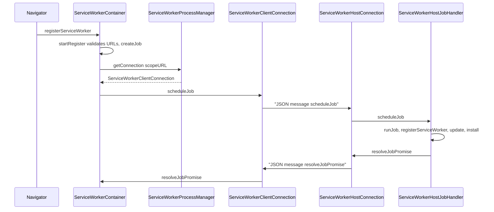
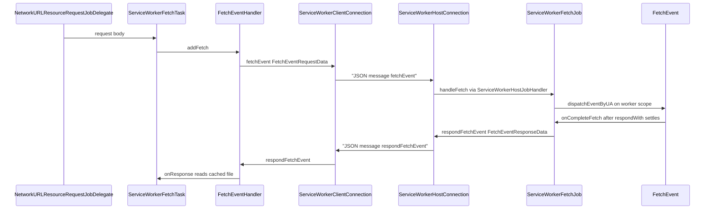
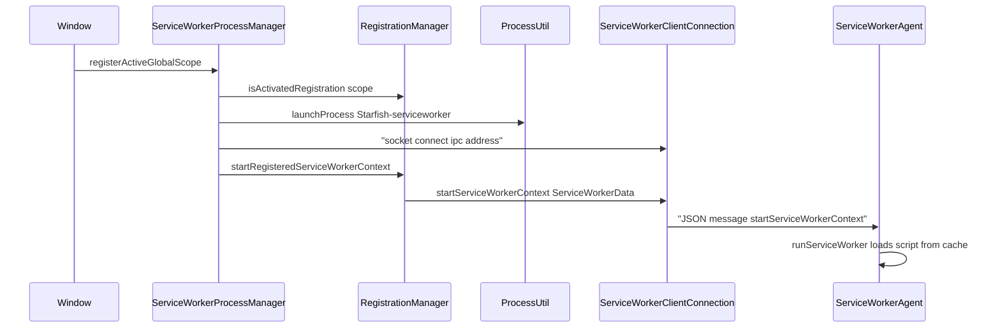

# Module Design Card: modules-serviceworker

> **Relevant source files**
>
> - [src/core/modules/serviceworker/ConnectionInterface.h](src:src/core/modules/serviceworker/ConnectionInterface.h)
> - [src/core/modules/serviceworker/ExceptionData.cpp](src:src/core/modules/serviceworker/ExceptionData.cpp)
> - [src/core/modules/serviceworker/ExceptionData.h](src:src/core/modules/serviceworker/ExceptionData.h)
> - [src/core/modules/serviceworker/FetchCacheStream.cpp](src:src/core/modules/serviceworker/FetchCacheStream.cpp)
> - [src/core/modules/serviceworker/FetchCacheStream.h](src:src/core/modules/serviceworker/FetchCacheStream.h)
> - [src/core/modules/serviceworker/FetchEventData.cpp](src:src/core/modules/serviceworker/FetchEventData.cpp)
> - [src/core/modules/serviceworker/FetchEventData.h](src:src/core/modules/serviceworker/FetchEventData.h)
> - [src/core/modules/serviceworker/JobQueue.cpp](src:src/core/modules/serviceworker/JobQueue.cpp)
> - [src/core/modules/serviceworker/JobQueue.h](src:src/core/modules/serviceworker/JobQueue.h)
> - [src/core/modules/serviceworker/Message.cpp](src:src/core/modules/serviceworker/Message.cpp)
> - [src/core/modules/serviceworker/Message.h](src:src/core/modules/serviceworker/Message.h)
> - [src/core/modules/serviceworker/MessageServiceWorker.cpp](src:src/core/modules/serviceworker/MessageServiceWorker.cpp)
> - [src/core/modules/serviceworker/MessageServiceWorker.h](src:src/core/modules/serviceworker/MessageServiceWorker.h)
> - [src/core/modules/serviceworker/RegistrationOptions.cpp](src:src/core/modules/serviceworker/RegistrationOptions.cpp)
> - [src/core/modules/serviceworker/RegistrationOptions.h](src:src/core/modules/serviceworker/RegistrationOptions.h)
> - [src/core/modules/serviceworker/RegistrationStore.cpp](src:src/core/modules/serviceworker/RegistrationStore.cpp)
> - [src/core/modules/serviceworker/RegistrationStore.h](src:src/core/modules/serviceworker/RegistrationStore.h)
> - [src/core/modules/serviceworker/ServiceWorker.cpp](src:src/core/modules/serviceworker/ServiceWorker.cpp)
> - [src/core/modules/serviceworker/ServiceWorker.h](src:src/core/modules/serviceworker/ServiceWorker.h)
> - [src/core/modules/serviceworker/ServiceWorkerContainer.cpp](src:src/core/modules/serviceworker/ServiceWorkerContainer.cpp)
> - [src/core/modules/serviceworker/ServiceWorkerContainer.h](src:src/core/modules/serviceworker/ServiceWorkerContainer.h)
> - [src/core/modules/serviceworker/ServiceWorkerData.cpp](src:src/core/modules/serviceworker/ServiceWorkerData.cpp)
> - [src/core/modules/serviceworker/ServiceWorkerData.h](src:src/core/modules/serviceworker/ServiceWorkerData.h)
> - [src/core/modules/serviceworker/ServiceWorkerJob.cpp](src:src/core/modules/serviceworker/ServiceWorkerJob.cpp)
> - [src/core/modules/serviceworker/ServiceWorkerJob.h](src:src/core/modules/serviceworker/ServiceWorkerJob.h)
> - [src/core/modules/serviceworker/ServiceWorkerJobData.cpp](src:src/core/modules/serviceworker/ServiceWorkerJobData.cpp)
> - [src/core/modules/serviceworker/ServiceWorkerJobData.h](src:src/core/modules/serviceworker/ServiceWorkerJobData.h)
> - [src/core/modules/serviceworker/ServiceWorkerRegistration.cpp](src:src/core/modules/serviceworker/ServiceWorkerRegistration.cpp)
> - [src/core/modules/serviceworker/ServiceWorkerRegistration.h](src:src/core/modules/serviceworker/ServiceWorkerRegistration.h)
> - [src/core/modules/serviceworker/ServiceWorkerRegistrationData.cpp](src:src/core/modules/serviceworker/ServiceWorkerRegistrationData.cpp)
> - [src/core/modules/serviceworker/ServiceWorkerRegistrationData.h](src:src/core/modules/serviceworker/ServiceWorkerRegistrationData.h)
> - [src/core/modules/serviceworker/ServiceWorkerRequest.cpp](src:src/core/modules/serviceworker/ServiceWorkerRequest.cpp)
> - [src/core/modules/serviceworker/ServiceWorkerRequest.h](src:src/core/modules/serviceworker/ServiceWorkerRequest.h)
> - [src/core/modules/serviceworker/ServiceWorkerTypes.h](src:src/core/modules/serviceworker/ServiceWorkerTypes.h)
> - [src/core/modules/serviceworker/ServiceWorkerUpdateViaCache.h](src:src/core/modules/serviceworker/ServiceWorkerUpdateViaCache.h)
> - [src/core/modules/serviceworker/Task.h](src:src/core/modules/serviceworker/Task.h)
> - [src/core/modules/serviceworker/cache/CachePolyfillLoader.cpp](src:src/core/modules/serviceworker/cache/CachePolyfillLoader.cpp)
> - [src/core/modules/serviceworker/cache/CachePolyfillLoader.h](src:src/core/modules/serviceworker/cache/CachePolyfillLoader.h)
> - [src/core/modules/serviceworker/cache/CustomStorage.cpp](src:src/core/modules/serviceworker/cache/CustomStorage.cpp)
> - [src/core/modules/serviceworker/cache/CustomStorage.h](src:src/core/modules/serviceworker/cache/CustomStorage.h)
> - [src/core/modules/serviceworker/cache/deps/cache-storage/rollup.config.js](src:src/core/modules/serviceworker/cache/deps/cache-storage/rollup.config.js)
> - [src/core/modules/serviceworker/cache/deps/cache-storage/src/cache-storage.js](src:src/core/modules/serviceworker/cache/deps/cache-storage/src/cache-storage.js)
> - [src/core/modules/serviceworker/cache/deps/cache-storage/src/cache.js](src:src/core/modules/serviceworker/cache/deps/cache-storage/src/cache.js)
> - [src/core/modules/serviceworker/cache/deps/cache-storage/src/index.js](src:src/core/modules/serviceworker/cache/deps/cache-storage/src/index.js)
> - [src/core/modules/serviceworker/cache/deps/cache-storage/test/cache-add.js](src:src/core/modules/serviceworker/cache/deps/cache-storage/test/cache-add.js)
> - [src/core/modules/serviceworker/cache/deps/cache-storage/test/cache-delete.js](src:src/core/modules/serviceworker/cache/deps/cache-storage/test/cache-delete.js)
> - [src/core/modules/serviceworker/cache/deps/cache-storage/test/cache-keys.js](src:src/core/modules/serviceworker/cache/deps/cache-storage/test/cache-keys.js)
> - [src/core/modules/serviceworker/cache/deps/cache-storage/test/cache-match.js](src:src/core/modules/serviceworker/cache/deps/cache-storage/test/cache-match.js)
> - [src/core/modules/serviceworker/cache/deps/cache-storage/test/cache-matchAll.js](src:src/core/modules/serviceworker/cache/deps/cache-storage/test/cache-matchAll.js)
> - [src/core/modules/serviceworker/cache/deps/cache-storage/test/cache-put.js](src:src/core/modules/serviceworker/cache/deps/cache-storage/test/cache-put.js)
> - [src/core/modules/serviceworker/cache/deps/cache-storage/test/mocha.js](src:src/core/modules/serviceworker/cache/deps/cache-storage/test/mocha.js)
> - [src/core/modules/serviceworker/cache/deps/cache-storage/test/test.js](src:src/core/modules/serviceworker/cache/deps/cache-storage/test/test.js)
> - [src/core/modules/serviceworker/client/FetchEventHandler.cpp](src:src/core/modules/serviceworker/client/FetchEventHandler.cpp)
> - [src/core/modules/serviceworker/client/FetchEventHandler.h](src:src/core/modules/serviceworker/client/FetchEventHandler.h)
> - [src/core/modules/serviceworker/client/RegistrationManager.cpp](src:src/core/modules/serviceworker/client/RegistrationManager.cpp)
> - [src/core/modules/serviceworker/client/RegistrationManager.h](src:src/core/modules/serviceworker/client/RegistrationManager.h)
> - [src/core/modules/serviceworker/client/ServiceWorkerClientConnection.cpp](src:src/core/modules/serviceworker/client/ServiceWorkerClientConnection.cpp)
> - [src/core/modules/serviceworker/client/ServiceWorkerClientConnection.h](src:src/core/modules/serviceworker/client/ServiceWorkerClientConnection.h)
> - [src/core/modules/serviceworker/client/ServiceWorkerFetchTask.cpp](src:src/core/modules/serviceworker/client/ServiceWorkerFetchTask.cpp)
> - [src/core/modules/serviceworker/client/ServiceWorkerFetchTask.h](src:src/core/modules/serviceworker/client/ServiceWorkerFetchTask.h)
> - [src/core/modules/serviceworker/client/ServiceWorkerJobClientInterface.h](src:src/core/modules/serviceworker/client/ServiceWorkerJobClientInterface.h)
> - [src/core/modules/serviceworker/client/ServiceWorkerProcessManager.cpp](src:src/core/modules/serviceworker/client/ServiceWorkerProcessManager.cpp)
> - [src/core/modules/serviceworker/client/ServiceWorkerProcessManager.h](src:src/core/modules/serviceworker/client/ServiceWorkerProcessManager.h)
> - [src/core/modules/serviceworker/host/ExtendableEvent.cpp](src:src/core/modules/serviceworker/host/ExtendableEvent.cpp)
> - [src/core/modules/serviceworker/host/ExtendableEvent.h](src:src/core/modules/serviceworker/host/ExtendableEvent.h)
> - [src/core/modules/serviceworker/host/FetchEvent.cpp](src:src/core/modules/serviceworker/host/FetchEvent.cpp)
> - [src/core/modules/serviceworker/host/FetchEvent.h](src:src/core/modules/serviceworker/host/FetchEvent.h)
> - [src/core/modules/serviceworker/host/Internal.cpp](src:src/core/modules/serviceworker/host/Internal.cpp)
> - [src/core/modules/serviceworker/host/Internal.h](src:src/core/modules/serviceworker/host/Internal.h)
> - [src/core/modules/serviceworker/host/ServiceWorkerAgent.cpp](src:src/core/modules/serviceworker/host/ServiceWorkerAgent.cpp)
> - [src/core/modules/serviceworker/host/ServiceWorkerAgent.h](src:src/core/modules/serviceworker/host/ServiceWorkerAgent.h)
> - [src/core/modules/serviceworker/host/ServiceWorkerFetchJob.cpp](src:src/core/modules/serviceworker/host/ServiceWorkerFetchJob.cpp)
> - [src/core/modules/serviceworker/host/ServiceWorkerFetchJob.h](src:src/core/modules/serviceworker/host/ServiceWorkerFetchJob.h)
> - [src/core/modules/serviceworker/host/ServiceWorkerGlobalScope.cpp](src:src/core/modules/serviceworker/host/ServiceWorkerGlobalScope.cpp)
> - [src/core/modules/serviceworker/host/ServiceWorkerGlobalScope.h](src:src/core/modules/serviceworker/host/ServiceWorkerGlobalScope.h)
> - [src/core/modules/serviceworker/host/ServiceWorkerHostConnection.cpp](src:src/core/modules/serviceworker/host/ServiceWorkerHostConnection.cpp)
> - [src/core/modules/serviceworker/host/ServiceWorkerHostConnection.h](src:src/core/modules/serviceworker/host/ServiceWorkerHostConnection.h)
> - [src/core/modules/serviceworker/host/ServiceWorkerHostJobHandler.cpp](src:src/core/modules/serviceworker/host/ServiceWorkerHostJobHandler.cpp)
> - [src/core/modules/serviceworker/host/ServiceWorkerHostJobHandler.h](src:src/core/modules/serviceworker/host/ServiceWorkerHostJobHandler.h)
> - [src/core/modules/serviceworker/host/ServiceWorkerScriptController.cpp](src:src/core/modules/serviceworker/host/ServiceWorkerScriptController.cpp)
> - [src/core/modules/serviceworker/host/ServiceWorkerScriptController.h](src:src/core/modules/serviceworker/host/ServiceWorkerScriptController.h)
> - [src/core/modules/serviceworker/host/ServiceWorkerServer.cpp](src:src/core/modules/serviceworker/host/ServiceWorkerServer.cpp)
> - [src/core/modules/serviceworker/host/ServiceWorkerServer.h](src:src/core/modules/serviceworker/host/ServiceWorkerServer.h)
> - [src/core/modules/serviceworker/host/ServiceWorkerServerInterface.h](src:src/core/modules/serviceworker/host/ServiceWorkerServerInterface.h)
> - [src/core/modules/serviceworker/notification/Notification.cpp](src:src/core/modules/serviceworker/notification/Notification.cpp)
> - [src/core/modules/serviceworker/notification/Notification.h](src:src/core/modules/serviceworker/notification/Notification.h)
> - [src/core/modules/serviceworker/notification/NotificationJob.cpp](src:src/core/modules/serviceworker/notification/NotificationJob.cpp)
> - [src/core/modules/serviceworker/notification/NotificationJob.h](src:src/core/modules/serviceworker/notification/NotificationJob.h)
> - [src/core/modules/serviceworker/notification/NotificationOptions.h](src:src/core/modules/serviceworker/notification/NotificationOptions.h)
> - [src/core/modules/serviceworker/notification/NotificationService.cpp](src:src/core/modules/serviceworker/notification/NotificationService.cpp)
> - [src/core/modules/serviceworker/notification/NotificationService.h](src:src/core/modules/serviceworker/notification/NotificationService.h)
> - [src/core/modules/serviceworker/push/PushManager.cpp](src:src/core/modules/serviceworker/push/PushManager.cpp)
> - [src/core/modules/serviceworker/push/PushManager.h](src:src/core/modules/serviceworker/push/PushManager.h)
> - [src/core/modules/serviceworker/push/PushServiceAgent.cpp](src:src/core/modules/serviceworker/push/PushServiceAgent.cpp)
> - [src/core/modules/serviceworker/push/PushServiceAgent.h](src:src/core/modules/serviceworker/push/PushServiceAgent.h)
> - [src/core/modules/serviceworker/push/PushSubscription.cpp](src:src/core/modules/serviceworker/push/PushSubscription.cpp)
> - [src/core/modules/serviceworker/push/PushSubscription.h](src:src/core/modules/serviceworker/push/PushSubscription.h)
> - [src/core/modules/serviceworker/push/PushSubscriptionOptions.cpp](src:src/core/modules/serviceworker/push/PushSubscriptionOptions.cpp)
> - [src/core/modules/serviceworker/push/PushSubscriptionOptions.h](src:src/core/modules/serviceworker/push/PushSubscriptionOptions.h)
> - [src/core/modules/serviceworker/util/MessageQueue/MessageQueue.h](src:src/core/modules/serviceworker/util/MessageQueue/MessageQueue.h)
> - [src/core/modules/serviceworker/util/MessageQueue/Queue.h](src:src/core/modules/serviceworker/util/MessageQueue/Queue.h)
> - [src/core/modules/serviceworker/util/ParallelTask.cpp](src:src/core/modules/serviceworker/util/ParallelTask.cpp)
> - [src/core/modules/serviceworker/util/ParallelTask.h](src:src/core/modules/serviceworker/util/ParallelTask.h)
> - [src/core/modules/worker/util/network/Connection.h](src:src/core/modules/worker/util/network/Connection.h)
> - [src/core/modules/worker/util/network/Connection.cpp](src:src/core/modules/worker/util/network/Connection.cpp)
> - [src/core/modules/worker/util/network/SocketNN.h](src:src/core/modules/worker/util/network/SocketNN.h)
> - [src/core/modules/worker/util/network/IORunnable.h](src:src/core/modules/worker/util/network/IORunnable.h)
> - [src/core/modules/worker/WorkerIPCAddress.h](src:src/core/modules/worker/WorkerIPCAddress.h)
> - [src/core/modules/worker/WorkerIPCAddress.cpp](src:src/core/modules/worker/WorkerIPCAddress.cpp)
> - [src/core/modules/worker/WorkerConfig.h](src:src/core/modules/worker/WorkerConfig.h)
> - [src/core/modules/worker/WorkerSettings.h](src:src/core/modules/worker/WorkerSettings.h)
> - [src/core/modules/worker/PerProcess.h](src:src/core/modules/worker/PerProcess.h)
> - [src/core/modules/worker/WorkerAgent.h](src:src/core/modules/worker/WorkerAgent.h)
> - [src/core/modules/worker/WorkerGlobalScope.h](src:src/core/modules/worker/WorkerGlobalScope.h)
> - [src/core/modules/worker/WorkerScriptController.h](src:src/core/modules/worker/WorkerScriptController.h)
> - [src/core/modules/worker/WebWorker.h](src:src/core/modules/worker/WebWorker.h)
> - [src/core/modules/worker/client/WorkerClientManager.cpp](src:src/core/modules/worker/client/WorkerClientManager.cpp)
> - [src/core/util/Archiver.h](src:src/core/util/Archiver.h)
> - [src/core/util/Archivable.h](src:src/core/util/Archivable.h)
> - [src/core/util/Id.h](src:src/core/util/Id.h)
> - [src/core/dom/ExecutionContext.h](src:src/core/dom/ExecutionContext.h)
> - [src/core/dom/EventTarget.h](src:src/core/dom/EventTarget.h)
> - [src/core/dom/Event.h](src:src/core/dom/Event.h)
> - [src/core/dom/DOMException.h](src:src/core/dom/DOMException.h)
> - [src/core/modules/message_loop/MessageLoop.h](src:src/core/modules/message_loop/MessageLoop.h)
> - [src/core/modules/networking/Socket.h](src:src/core/modules/networking/Socket.h)
> - [src/core/modules/resource_request/ResourceRequest.h](src:src/core/modules/resource_request/ResourceRequest.h)
> - [src/core/modules/resource_request/NetworkURLResourceRequestJobDelegate.cpp](src:src/core/modules/resource_request/NetworkURLResourceRequestJobDelegate.cpp)
> - [src/core/page/Navigator.cpp](src:src/core/page/Navigator.cpp)
> - [src/core/page/Window.cpp](src:src/core/page/Window.cpp)
> - [src/core/fetch/Response.h](src:src/core/fetch/Response.h)
> - [src/binding/ScriptWrappable.h](src:src/binding/ScriptWrappable.h)
> - [src/platform/process/base/Process.cpp](src:src/platform/process/base/Process.cpp)
> - [src/StoragePathProvider.h](src:src/StoragePathProvider.h)
> - [src/launcher/ServiceWorkerEntry.cpp](src:src/launcher/ServiceWorkerEntry.cpp)
> - [src/public/delegate/LWEWorkerDelegate.cpp](src:src/public/delegate/LWEWorkerDelegate.cpp)
> - [build/config.cmake](src:build/config.cmake)
> - [build/worker.cmake](src:build/worker.cmake)

**Module**: `modules-serviceworker` — 103 files under `src/core/modules/serviceworker/` (root, `client/`, `host/`, `cache/`, `notification/`, `push/`, `util/`)
**Role**: Implements the service worker feature as a split client/host system: the page-side [`ServiceWorkerContainer`](src:src/core/modules/serviceworker/ServiceWorkerContainer.h#L51) creates registration jobs that are serialized as JSON [`Message`](src:src/core/modules/serviceworker/Message.h#L25) objects and sent over a socket [`Connection`](src:src/core/modules/worker/util/network/Connection.h#L31) to a host process whose [`ServiceWorkerHostJobHandler`](src:src/core/modules/serviceworker/host/ServiceWorkerHostJobHandler.h#L50) runs the register/update/install/activate life-cycle and dispatches fetch events to a [`ServiceWorkerGlobalScope`](src:src/core/modules/serviceworker/host/ServiceWorkerGlobalScope.h#L39).
**Module Boundary**: ServiceWorker feature directory with host/ and client/ process-side subtrees (registration, job, fetch, message keywords)
**Confidence**: 0.92
**Core selection**: All approved modules are Core (boundary approved in W1 human review)
**Generated**: 2026-09-10

## Source Files

### Shared data model and serialization (root)
- [src/core/modules/serviceworker/ConnectionInterface.h](src:src/core/modules/serviceworker/ConnectionInterface.h) — `IServiceWorkerHostConnection` / `IServiceWorkerClientConnection` send contracts
- [src/core/modules/serviceworker/Message.h](src:src/core/modules/serviceworker/Message.h), [src/core/modules/serviceworker/Message.cpp](src:src/core/modules/serviceworker/Message.cpp) — named message with archivable parameters, JSON archive
- [src/core/modules/serviceworker/MessageServiceWorker.h](src:src/core/modules/serviceworker/MessageServiceWorker.h), [src/core/modules/serviceworker/MessageServiceWorker.cpp](src:src/core/modules/serviceworker/MessageServiceWorker.cpp) — `UpdateRegistrationState`, `UpdateWorkerStateData`, `ContextRequestData` payloads
- [src/core/modules/serviceworker/ServiceWorkerTypes.h](src:src/core/modules/serviceworker/ServiceWorkerTypes.h) — state enums and `Id<>` aliases
- [src/core/modules/serviceworker/ServiceWorkerData.h](src:src/core/modules/serviceworker/ServiceWorkerData.h), [src/core/modules/serviceworker/ServiceWorkerData.cpp](src:src/core/modules/serviceworker/ServiceWorkerData.cpp)
- [src/core/modules/serviceworker/ServiceWorkerRegistrationData.h](src:src/core/modules/serviceworker/ServiceWorkerRegistrationData.h), [src/core/modules/serviceworker/ServiceWorkerRegistrationData.cpp](src:src/core/modules/serviceworker/ServiceWorkerRegistrationData.cpp)
- [src/core/modules/serviceworker/ServiceWorkerJob.h](src:src/core/modules/serviceworker/ServiceWorkerJob.h), [src/core/modules/serviceworker/ServiceWorkerJob.cpp](src:src/core/modules/serviceworker/ServiceWorkerJob.cpp), [src/core/modules/serviceworker/ServiceWorkerJobData.h](src:src/core/modules/serviceworker/ServiceWorkerJobData.h), [src/core/modules/serviceworker/ServiceWorkerJobData.cpp](src:src/core/modules/serviceworker/ServiceWorkerJobData.cpp)
- [src/core/modules/serviceworker/JobQueue.h](src:src/core/modules/serviceworker/JobQueue.h), [src/core/modules/serviceworker/JobQueue.cpp](src:src/core/modules/serviceworker/JobQueue.cpp)
- [src/core/modules/serviceworker/ServiceWorkerRequest.h](src:src/core/modules/serviceworker/ServiceWorkerRequest.h), [src/core/modules/serviceworker/ServiceWorkerRequest.cpp](src:src/core/modules/serviceworker/ServiceWorkerRequest.cpp), [src/core/modules/serviceworker/Task.h](src:src/core/modules/serviceworker/Task.h)
- [src/core/modules/serviceworker/ExceptionData.h](src:src/core/modules/serviceworker/ExceptionData.h), [src/core/modules/serviceworker/ExceptionData.cpp](src:src/core/modules/serviceworker/ExceptionData.cpp)
- [src/core/modules/serviceworker/FetchEventData.h](src:src/core/modules/serviceworker/FetchEventData.h), [src/core/modules/serviceworker/FetchEventData.cpp](src:src/core/modules/serviceworker/FetchEventData.cpp)
- [src/core/modules/serviceworker/FetchCacheStream.h](src:src/core/modules/serviceworker/FetchCacheStream.h), [src/core/modules/serviceworker/FetchCacheStream.cpp](src:src/core/modules/serviceworker/FetchCacheStream.cpp)
- [src/core/modules/serviceworker/RegistrationStore.h](src:src/core/modules/serviceworker/RegistrationStore.h), [src/core/modules/serviceworker/RegistrationStore.cpp](src:src/core/modules/serviceworker/RegistrationStore.cpp)
- [src/core/modules/serviceworker/RegistrationOptions.h](src:src/core/modules/serviceworker/RegistrationOptions.h), [src/core/modules/serviceworker/RegistrationOptions.cpp](src:src/core/modules/serviceworker/RegistrationOptions.cpp), [src/core/modules/serviceworker/ServiceWorkerUpdateViaCache.h](src:src/core/modules/serviceworker/ServiceWorkerUpdateViaCache.h)
- [src/core/modules/serviceworker/ServiceWorkerContainer.h](src:src/core/modules/serviceworker/ServiceWorkerContainer.h), [src/core/modules/serviceworker/ServiceWorkerContainer.cpp](src:src/core/modules/serviceworker/ServiceWorkerContainer.cpp) — `navigator.serviceWorker`
- [src/core/modules/serviceworker/ServiceWorkerRegistration.h](src:src/core/modules/serviceworker/ServiceWorkerRegistration.h), [src/core/modules/serviceworker/ServiceWorkerRegistration.cpp](src:src/core/modules/serviceworker/ServiceWorkerRegistration.cpp)
- [src/core/modules/serviceworker/ServiceWorker.h](src:src/core/modules/serviceworker/ServiceWorker.h), [src/core/modules/serviceworker/ServiceWorker.cpp](src:src/core/modules/serviceworker/ServiceWorker.cpp)

### client/ (page process side)
- [src/core/modules/serviceworker/client/ServiceWorkerProcessManager.h](src:src/core/modules/serviceworker/client/ServiceWorkerProcessManager.h), [src/core/modules/serviceworker/client/ServiceWorkerProcessManager.cpp](src:src/core/modules/serviceworker/client/ServiceWorkerProcessManager.cpp)
- [src/core/modules/serviceworker/client/ServiceWorkerClientConnection.h](src:src/core/modules/serviceworker/client/ServiceWorkerClientConnection.h), [src/core/modules/serviceworker/client/ServiceWorkerClientConnection.cpp](src:src/core/modules/serviceworker/client/ServiceWorkerClientConnection.cpp)
- [src/core/modules/serviceworker/client/ServiceWorkerJobClientInterface.h](src:src/core/modules/serviceworker/client/ServiceWorkerJobClientInterface.h)
- [src/core/modules/serviceworker/client/RegistrationManager.h](src:src/core/modules/serviceworker/client/RegistrationManager.h), [src/core/modules/serviceworker/client/RegistrationManager.cpp](src:src/core/modules/serviceworker/client/RegistrationManager.cpp)
- [src/core/modules/serviceworker/client/FetchEventHandler.h](src:src/core/modules/serviceworker/client/FetchEventHandler.h), [src/core/modules/serviceworker/client/FetchEventHandler.cpp](src:src/core/modules/serviceworker/client/FetchEventHandler.cpp)
- [src/core/modules/serviceworker/client/ServiceWorkerFetchTask.h](src:src/core/modules/serviceworker/client/ServiceWorkerFetchTask.h), [src/core/modules/serviceworker/client/ServiceWorkerFetchTask.cpp](src:src/core/modules/serviceworker/client/ServiceWorkerFetchTask.cpp)

### host/ (service worker process side)
- [src/core/modules/serviceworker/host/ServiceWorkerAgent.h](src:src/core/modules/serviceworker/host/ServiceWorkerAgent.h), [src/core/modules/serviceworker/host/ServiceWorkerAgent.cpp](src:src/core/modules/serviceworker/host/ServiceWorkerAgent.cpp)
- [src/core/modules/serviceworker/host/ServiceWorkerServer.h](src:src/core/modules/serviceworker/host/ServiceWorkerServer.h), [src/core/modules/serviceworker/host/ServiceWorkerServer.cpp](src:src/core/modules/serviceworker/host/ServiceWorkerServer.cpp), [src/core/modules/serviceworker/host/ServiceWorkerServerInterface.h](src:src/core/modules/serviceworker/host/ServiceWorkerServerInterface.h)
- [src/core/modules/serviceworker/host/ServiceWorkerHostConnection.h](src:src/core/modules/serviceworker/host/ServiceWorkerHostConnection.h), [src/core/modules/serviceworker/host/ServiceWorkerHostConnection.cpp](src:src/core/modules/serviceworker/host/ServiceWorkerHostConnection.cpp)
- [src/core/modules/serviceworker/host/ServiceWorkerHostJobHandler.h](src:src/core/modules/serviceworker/host/ServiceWorkerHostJobHandler.h), [src/core/modules/serviceworker/host/ServiceWorkerHostJobHandler.cpp](src:src/core/modules/serviceworker/host/ServiceWorkerHostJobHandler.cpp)
- [src/core/modules/serviceworker/host/ServiceWorkerGlobalScope.h](src:src/core/modules/serviceworker/host/ServiceWorkerGlobalScope.h), [src/core/modules/serviceworker/host/ServiceWorkerGlobalScope.cpp](src:src/core/modules/serviceworker/host/ServiceWorkerGlobalScope.cpp)
- [src/core/modules/serviceworker/host/ServiceWorkerScriptController.h](src:src/core/modules/serviceworker/host/ServiceWorkerScriptController.h), [src/core/modules/serviceworker/host/ServiceWorkerScriptController.cpp](src:src/core/modules/serviceworker/host/ServiceWorkerScriptController.cpp)
- [src/core/modules/serviceworker/host/ExtendableEvent.h](src:src/core/modules/serviceworker/host/ExtendableEvent.h), [src/core/modules/serviceworker/host/ExtendableEvent.cpp](src:src/core/modules/serviceworker/host/ExtendableEvent.cpp)
- [src/core/modules/serviceworker/host/FetchEvent.h](src:src/core/modules/serviceworker/host/FetchEvent.h), [src/core/modules/serviceworker/host/FetchEvent.cpp](src:src/core/modules/serviceworker/host/FetchEvent.cpp)
- [src/core/modules/serviceworker/host/ServiceWorkerFetchJob.h](src:src/core/modules/serviceworker/host/ServiceWorkerFetchJob.h), [src/core/modules/serviceworker/host/ServiceWorkerFetchJob.cpp](src:src/core/modules/serviceworker/host/ServiceWorkerFetchJob.cpp)
- [src/core/modules/serviceworker/host/Internal.h](src:src/core/modules/serviceworker/host/Internal.h), [src/core/modules/serviceworker/host/Internal.cpp](src:src/core/modules/serviceworker/host/Internal.cpp) — native backend for the cache polyfill

### cache/
- [src/core/modules/serviceworker/cache/CachePolyfillLoader.h](src:src/core/modules/serviceworker/cache/CachePolyfillLoader.h), [src/core/modules/serviceworker/cache/CachePolyfillLoader.cpp](src:src/core/modules/serviceworker/cache/CachePolyfillLoader.cpp)
- [src/core/modules/serviceworker/cache/CustomStorage.h](src:src/core/modules/serviceworker/cache/CustomStorage.h), [src/core/modules/serviceworker/cache/CustomStorage.cpp](src:src/core/modules/serviceworker/cache/CustomStorage.cpp)
- JavaScript polyfill sources: [rollup.config.js](src:src/core/modules/serviceworker/cache/deps/cache-storage/rollup.config.js), [src/cache-storage.js](src:src/core/modules/serviceworker/cache/deps/cache-storage/src/cache-storage.js), [src/cache.js](src:src/core/modules/serviceworker/cache/deps/cache-storage/src/cache.js), [src/index.js](src:src/core/modules/serviceworker/cache/deps/cache-storage/src/index.js)
- Polyfill tests: [test/cache-add.js](src:src/core/modules/serviceworker/cache/deps/cache-storage/test/cache-add.js), [test/cache-delete.js](src:src/core/modules/serviceworker/cache/deps/cache-storage/test/cache-delete.js), [test/cache-keys.js](src:src/core/modules/serviceworker/cache/deps/cache-storage/test/cache-keys.js), [test/cache-match.js](src:src/core/modules/serviceworker/cache/deps/cache-storage/test/cache-match.js), [test/cache-matchAll.js](src:src/core/modules/serviceworker/cache/deps/cache-storage/test/cache-matchAll.js), [test/cache-put.js](src:src/core/modules/serviceworker/cache/deps/cache-storage/test/cache-put.js), [test/mocha.js](src:src/core/modules/serviceworker/cache/deps/cache-storage/test/mocha.js), [test/test.js](src:src/core/modules/serviceworker/cache/deps/cache-storage/test/test.js)

### notification/ and push/
- [src/core/modules/serviceworker/notification/Notification.h](src:src/core/modules/serviceworker/notification/Notification.h), [src/core/modules/serviceworker/notification/Notification.cpp](src:src/core/modules/serviceworker/notification/Notification.cpp), [src/core/modules/serviceworker/notification/NotificationJob.h](src:src/core/modules/serviceworker/notification/NotificationJob.h), [src/core/modules/serviceworker/notification/NotificationJob.cpp](src:src/core/modules/serviceworker/notification/NotificationJob.cpp), [src/core/modules/serviceworker/notification/NotificationOptions.h](src:src/core/modules/serviceworker/notification/NotificationOptions.h), [src/core/modules/serviceworker/notification/NotificationService.h](src:src/core/modules/serviceworker/notification/NotificationService.h), [src/core/modules/serviceworker/notification/NotificationService.cpp](src:src/core/modules/serviceworker/notification/NotificationService.cpp)
- [src/core/modules/serviceworker/push/PushManager.h](src:src/core/modules/serviceworker/push/PushManager.h), [src/core/modules/serviceworker/push/PushManager.cpp](src:src/core/modules/serviceworker/push/PushManager.cpp), [src/core/modules/serviceworker/push/PushServiceAgent.h](src:src/core/modules/serviceworker/push/PushServiceAgent.h), [src/core/modules/serviceworker/push/PushServiceAgent.cpp](src:src/core/modules/serviceworker/push/PushServiceAgent.cpp), [src/core/modules/serviceworker/push/PushSubscription.h](src:src/core/modules/serviceworker/push/PushSubscription.h), [src/core/modules/serviceworker/push/PushSubscription.cpp](src:src/core/modules/serviceworker/push/PushSubscription.cpp), [src/core/modules/serviceworker/push/PushSubscriptionOptions.h](src:src/core/modules/serviceworker/push/PushSubscriptionOptions.h), [src/core/modules/serviceworker/push/PushSubscriptionOptions.cpp](src:src/core/modules/serviceworker/push/PushSubscriptionOptions.cpp)

### util/
- [src/core/modules/serviceworker/util/ParallelTask.h](src:src/core/modules/serviceworker/util/ParallelTask.h), [src/core/modules/serviceworker/util/ParallelTask.cpp](src:src/core/modules/serviceworker/util/ParallelTask.cpp) — `IdleTask` (message-loop idler) and `ParallelTask` (thread pool)
- [src/core/modules/serviceworker/util/MessageQueue/MessageQueue.h](src:src/core/modules/serviceworker/util/MessageQueue/MessageQueue.h), [src/core/modules/serviceworker/util/MessageQueue/Queue.h](src:src/core/modules/serviceworker/util/MessageQueue/Queue.h) — blocking queue used by the in-thread host mode

## Public Interface

| Function/Class | Signature | Main callers | Source |
|---|---|---|---|
| `ServiceWorkerContainer` | `ServiceWorkerContainer(ExecutionContext* executionContext)` | [`Navigator::serviceWorker`](src:src/core/page/Navigator.cpp#L73) creates it lazily | [`ServiceWorkerContainer`](src:src/core/modules/serviceworker/ServiceWorkerContainer.h#L51) |
| `ServiceWorkerContainer::registerServiceWorker` | `Promise* registerServiceWorker(String* url, RegistrationOptions& options)` | Script binding (marked `binding interface` in the header) | [`ServiceWorkerContainer::registerServiceWorker`](src:src/core/modules/serviceworker/ServiceWorkerContainer.h#L64) |
| `ServiceWorkerContainer::getRegistration` | `Promise* getRegistration(NULLABLE String* scriptURL = nullptr)` | Script binding | [`ServiceWorkerContainer::getRegistration`](src:src/core/modules/serviceworker/ServiceWorkerContainer.h#L66) |
| `ServiceWorkerRegistration::unregister` | `Promise* unregister()` | Script binding | [`ServiceWorkerRegistration::unregister`](src:src/core/modules/serviceworker/ServiceWorkerRegistration.h#L56) |
| `ServiceWorkerProcessManager::instance` | `static ServiceWorkerProcessManager* instance()` | [`Window.cpp`](src:src/core/page/Window.cpp#L150), [`WorkerClientManager.cpp`](src:src/core/modules/worker/client/WorkerClientManager.cpp#L42) | [`ServiceWorkerProcessManager::instance`](src:src/core/modules/serviceworker/client/ServiceWorkerProcessManager.cpp#L81) |
| `ServiceWorkerProcessManager::registerActiveGlobalScope` | `void registerActiveGlobalScope(Id<GlobalScope> id, GlobalScope* globalScope)` | [`Window.cpp`](src:src/core/page/Window.cpp#L150) on window creation | [`ServiceWorkerProcessManager::registerActiveGlobalScope`](src:src/core/modules/serviceworker/client/ServiceWorkerProcessManager.cpp#L309) |
| `ServiceWorkerProcessManager::deregisterActiveGlobalScope` | `void deregisterActiveGlobalScope(Id<GlobalScope> id)` | [`Window.cpp`](src:src/core/page/Window.cpp#L225) on window teardown | [`ServiceWorkerProcessManager::deregisterActiveGlobalScope`](src:src/core/modules/serviceworker/client/ServiceWorkerProcessManager.cpp#L344) |
| `ServiceWorkerFetchTask` | `ServiceWorkerFetchTask(ResourceRequest* resourceRequest)`; `bool request(String* body)` | [`NetworkURLResourceRequestJobDelegate.cpp`](src:src/core/modules/resource_request/NetworkURLResourceRequestJobDelegate.cpp#L432) constructs it and calls `request` at [`NetworkURLResourceRequestJobDelegate.cpp`](src:src/core/modules/resource_request/NetworkURLResourceRequestJobDelegate.cpp#L443) | [`ServiceWorkerFetchTask`](src:src/core/modules/serviceworker/client/ServiceWorkerFetchTask.h#L32) |
| `ServiceWorkerAgent` | `static ServiceWorkerAgent* instance()`; `void start() override` | Created through [`WorkerAgent::create`](src:src/core/modules/serviceworker/host/ServiceWorkerAgent.cpp#L51), which is called from [`LWEWorkerDelegate.cpp`](src:src/public/delegate/LWEWorkerDelegate.cpp#L67) | [`ServiceWorkerAgent`](src:src/core/modules/serviceworker/host/ServiceWorkerAgent.h#L39) |
| `ServiceWorkerServer::start` | `void start()` | [`ServiceWorkerAgent::start`](src:src/core/modules/serviceworker/host/ServiceWorkerAgent.cpp#L94) | [`ServiceWorkerServer::start`](src:src/core/modules/serviceworker/host/ServiceWorkerServer.cpp#L83) |
| `ServiceWorkerGlobalScope` | `ServiceWorkerGlobalScope(WebWorker* webWorker, ResourceURL* url, String* charSet)` | [`ServiceWorkerAgent::runServiceWorker`](src:src/core/modules/serviceworker/host/ServiceWorkerAgent.cpp#L138); also included by `WebWorker.cpp`, `WorkerGlobalScope.cpp`, `ScriptBindingInstance.cpp` | [`ServiceWorkerGlobalScope`](src:src/core/modules/serviceworker/host/ServiceWorkerGlobalScope.h#L39) |
| `ServiceWorkerGlobalScope::skipWaiting` | `Promise* skipWaiting()` | Script binding | [`ServiceWorkerGlobalScope::skipWaiting`](src:src/core/modules/serviceworker/host/ServiceWorkerGlobalScope.cpp#L132) |
| `ExtendableEvent::waitUntil` | `void waitUntil(Promise* promise)` | Script binding | [`ExtendableEvent::waitUntil`](src:src/core/modules/serviceworker/host/ExtendableEvent.cpp#L43) |
| `FetchEvent::respondWith` | `void respondWith(Promise* response)` | Script binding | [`FetchEvent::respondWith`](src:src/core/modules/serviceworker/host/FetchEvent.cpp#L44) |
| `ServiceWorkerScriptController` | `ServiceWorkerScriptController(ExecutionContext* executionContext, RegistrationStore* registrationStore)` | [`ServiceWorkerGlobalScope.cpp`](src:src/core/modules/serviceworker/host/ServiceWorkerGlobalScope.cpp#L68); header included by `WorkerScriptController.cpp` | [`ServiceWorkerScriptController`](src:src/core/modules/serviceworker/host/ServiceWorkerScriptController.h#L55) |
| `Internal` | `Promise* open(String* cacheName)`; `Promise* put(...)`; `Promise* matchAll(...)`; `Promise* cache_storage_keys()` | Cache polyfill script loaded by [`CachePolyfillLoader::load`](src:src/core/modules/serviceworker/cache/CachePolyfillLoader.cpp#L74) (marked `binding interface`) | [`Internal`](src:src/core/modules/serviceworker/host/Internal.h#L45) |
| `Message` | `Message(const char* msgname = "")`; `void addParam(NULLABLE Archivable* param)`; `void archive(Archiver& arch)` | Both connection classes and [`RegistrationStoreLocalStorage::add`](src:src/core/modules/serviceworker/RegistrationStore.cpp#L177) | [`Message`](src:src/core/modules/serviceworker/Message.h#L25) |
| `IServiceWorkerHostConnection` / `IServiceWorkerClientConnection` | pure-virtual send contracts (see IPC section) | Implemented by [`ServiceWorkerClientConnection`](src:src/core/modules/serviceworker/client/ServiceWorkerClientConnection.h#L36) and [`ServiceWorkerHostConnection`](src:src/core/modules/serviceworker/host/ServiceWorkerHostConnection.h#L38) | [`IServiceWorkerHostConnection`](src:src/core/modules/serviceworker/ConnectionInterface.h#L40), [`IServiceWorkerClientConnection`](src:src/core/modules/serviceworker/ConnectionInterface.h#L60) |

## IPC / Message / Interface Contracts

- **Transport**: both sides derive from [`Connection`](src:src/core/modules/worker/util/network/Connection.h#L31), whose default constructor creates a [`SocketNN`](src:src/core/modules/worker/util/network/SocketNN.h#L31) with `kPairProtocol` ([`Connection.cpp`](src:src/core/modules/worker/util/network/Connection.cpp#L49)). The host binds an `ipc://` address built by [`WorkerIPCAddress::createIPCAddress`](src:src/core/modules/worker/WorkerIPCAddress.cpp#L53) in [`ServiceWorkerServer::start`](src:src/core/modules/serviceworker/host/ServiceWorkerServer.cpp#L83); the client connects to the same address in [`ServiceWorkerProcessManager::getConnection`](src:src/core/modules/serviceworker/client/ServiceWorkerProcessManager.cpp#L188). The address suffix is `WORKER_IPC_PROCESS_NAME` (`"ipc"`, [`WorkerConfig.h`](src:src/core/modules/worker/WorkerConfig.h#L27)) when `SERVICE_WORKER_USE_SINGLE_HOST_CONNECTION` is defined ([`config.cmake`](src:build/config.cmake#L389)), otherwise the Base64-encoded origin ([`ServiceWorkerProcessManager.cpp`](src:src/core/modules/serviceworker/client/ServiceWorkerProcessManager.cpp#L201)).
- **Wire format**: every message is a [`Message`](src:src/core/modules/serviceworker/Message.h#L25) archived through `JsonWriter` as an object `{ "name": ..., "params": [ { "_archiveId": <type>, ... }, ... ] }` ([`Message::archive`](src:src/core/modules/serviceworker/Message.cpp#L76)); the receiver reconstructs each parameter from `_archiveId` via the `ARCHIVE` registry ([`Message::archive`](src:src/core/modules/serviceworker/Message.cpp#L142)), which registers `ServiceWorkerRequest`, `ServiceWorkerJobData`, `ServiceWorkerRegistrationData`, `ServiceWorkerData`, `ExceptionData`, `UpdateRegistrationState`, `UpdateWorkerStateData`, `ContextRequestData`, `FetchEventRequestData`, `FetchEventResponseData` ([`Message.cpp`](src:src/core/modules/serviceworker/Message.cpp#L192)). A comment in the same function records that JSON was chosen over a binary format because life-cycle management is not performance-sensitive ([`Message.cpp`](src:src/core/modules/serviceworker/Message.cpp#L79)).
- **Client → Host messages** (sent by [`ServiceWorkerClientConnection::sendMessage`](src:src/core/modules/serviceworker/client/ServiceWorkerClientConnection.cpp#L119), dispatched by name in [`ServiceWorkerHostConnection::onReceived`](src:src/core/modules/serviceworker/host/ServiceWorkerHostConnection.cpp#L165)): `scheduleJob` (param `ServiceWorkerJobData`), `matchRegistration` (`ServiceWorkerRequest`, client URL string), `updateServiceWorkerClient` (`ContextRequestData`), `fetchEvent` (`FetchEventRequestData`), `startServiceWorkerContext` (`ServiceWorkerData`). Unknown names are logged and hit `STARFISH_ASSERT_NOT_REACHED` ([`ServiceWorkerHostConnection.cpp`](src:src/core/modules/serviceworker/host/ServiceWorkerHostConnection.cpp#L214)). While the server is terminating, received data is ignored ([`ServiceWorkerHostConnection.cpp`](src:src/core/modules/serviceworker/host/ServiceWorkerHostConnection.cpp#L171)).
- **Host → Client messages** (built in [`ServiceWorkerHostConnection.cpp`](src:src/core/modules/serviceworker/host/ServiceWorkerHostConnection.cpp#L62), dispatched by name in [`ServiceWorkerClientConnection::onReceived`](src:src/core/modules/serviceworker/client/ServiceWorkerClientConnection.cpp#L143)): `resolveJobPromise` (`ServiceWorkerJobData`, nullable `ServiceWorkerRegistrationData`), `rejectJobPromise` (`ServiceWorkerJobData`, `ExceptionData`), `resolveRequest` (`ServiceWorkerRequest`, nullable archivable), `updateRegistrationState` (`UpdateRegistrationState`), `updateWorkerState` (`UpdateWorkerStateData`), `fireEventRequest` (two strings: script URL, event name), `respondFetchEvent` (`FetchEventResponseData`).
- **Process launch**: when a connection for an unseen origin is requested under `STARFISH_USE_WORKER_PROCESS`, the client either calls the embedder-provided executor from [`WorkerSettings::serviceWorkerProcessExecutor`](src:src/core/modules/worker/WorkerSettings.h#L34) or spawns `./Starfish-serviceworker` with `--debug-worker=` through [`ProcessUtil::launchProcess`](src:src/platform/process/base/Process.cpp#L43) if no IPC handle file exists yet ([`ServiceWorkerProcessManager.cpp`](src:src/core/modules/serviceworker/client/ServiceWorkerProcessManager.cpp#L229)). Without `STARFISH_USE_WORKER_PROCESS` the host runs as a detached `std::thread` with its own [`MessageQueue`](src:src/core/modules/serviceworker/util/MessageQueue/MessageQueue.h#L27) ([`ServiceWorkerProcessManager::startWorkerOnThread`](src:src/core/modules/serviceworker/client/ServiceWorkerProcessManager.cpp#L123)).
- **Persistence contract (not IPC, same serializer)**: a registration is written to a file named `registration` using a `Message("registration")` with a `ServiceWorkerRegistrationData` param ([`RegistrationStoreLocalStorage::add`](src:src/core/modules/serviceworker/RegistrationStore.cpp#L177)); the client-side [`RegistrationManager`](src:src/core/modules/serviceworker/client/RegistrationManager.h#L28) reads the same store to decide whether a page origin already has an installed worker.
- The 12 leads listed for this module in the interface inventory all come from `emit(...)` calls inside the bundled test runner [`mocha.js`](src:src/core/modules/serviceworker/cache/deps/cache-storage/test/mocha.js#L5513); they are in-process test-framework events, not cross-process contracts, and are therefore not listed above.

The connection pair is the process boundary of the feature: the page process never touches registration state directly; it enqueues jobs/requests keyed by `Id<>` values ([`ServiceWorkerTypes.h`](src:src/core/modules/serviceworker/ServiceWorkerTypes.h#L68)) and later matches asynchronous replies back to the owning `ServiceWorkerContainer` via `contextId` ([`ServiceWorkerClientConnection::findServiceWorkerContainer`](src:src/core/modules/serviceworker/client/ServiceWorkerClientConnection.cpp#L526)). All reply handling on the client is re-posted onto the page's message loop with `addIdler` ([`ServiceWorkerClientConnection.cpp`](src:src/core/modules/serviceworker/client/ServiceWorkerClientConnection.cpp#L285)), decoupling socket I/O from DOM event dispatch.

## Key Flow

Entry: [`ServiceWorkerContainer::registerServiceWorker`](src:src/core/modules/serviceworker/ServiceWorkerContainer.cpp#L87); the host-side chain is [`ServiceWorkerHostJobHandler::scheduleJob`](src:src/core/modules/serviceworker/host/ServiceWorkerHostJobHandler.cpp#L219) → [`runJob`](src:src/core/modules/serviceworker/host/ServiceWorkerHostJobHandler.cpp#L339) → [`registerServiceWorker`](src:src/core/modules/serviceworker/host/ServiceWorkerHostJobHandler.cpp#L396) → [`update`](src:src/core/modules/serviceworker/host/ServiceWorkerHostJobHandler.cpp#L461) → [`install`](src:src/core/modules/serviceworker/host/ServiceWorkerHostJobHandler.cpp#L534).

Entry: [`ServiceWorkerFetchTask::request`](src:src/core/modules/serviceworker/client/ServiceWorkerFetchTask.cpp#L58); host side [`ServiceWorkerHostJobHandler::handleFetch`](src:src/core/modules/serviceworker/host/ServiceWorkerHostJobHandler.cpp#L1304) → [`ServiceWorkerFetchJob::handleFetch`](src:src/core/modules/serviceworker/host/ServiceWorkerFetchJob.cpp#L50) → [`FetchEvent::respondWith`](src:src/core/modules/serviceworker/host/FetchEvent.cpp#L44) → [`ServiceWorkerFetchJob::successJob`](src:src/core/modules/serviceworker/host/ServiceWorkerFetchJob.cpp#L192).

Entry: [`ServiceWorkerProcessManager::registerActiveGlobalScope`](src:src/core/modules/serviceworker/client/ServiceWorkerProcessManager.cpp#L309), called from [`Window.cpp`](src:src/core/page/Window.cpp#L150); the host receives `startServiceWorkerContext` in [`ServiceWorkerHostJobHandler::startServiceWorkerContext`](src:src/core/modules/serviceworker/host/ServiceWorkerHostJobHandler.cpp#L526) and runs [`ServiceWorkerAgent::runServiceWorker`](src:src/core/modules/serviceworker/host/ServiceWorkerAgent.cpp#L138) with `forceBypassCache = true`.

## Architectural Rules

- [ ] Every file in the module is compiled only under `STARFISH_ENABLE_SERVICE_WORKER`; `host/` files additionally require `STARFISH_WEBWORKER_HOST`, and client-only branches use `STARFISH_WEBWORKER_NOT_HOST` (e.g. [`ServiceWorkerHostConnection.h`](src:src/core/modules/serviceworker/host/ServiceWorkerHostConnection.h#L20), [`ServiceWorkerContainer.cpp`](src:src/core/modules/serviceworker/ServiceWorkerContainer.cpp#L277)); the flags are set in [`worker.cmake`](src:build/worker.cmake#L36) and [`config.cmake`](src:build/config.cmake#L394).
- [ ] Any object crossing the connection must derive from [`Archivable`](src:src/core/util/Archivable.h#L28) and be registered in the `ARCHIVE` list of [`Message.cpp`](src:src/core/modules/serviceworker/Message.cpp#L192); unregistered types are logged as errors and left unarchived ([`Message.cpp`](src:src/core/modules/serviceworker/Message.cpp#L205)).
- [ ] Message names are string literals matched by `if/else` in the two `onReceived` handlers; adding a message requires a send method on the interface in [`ConnectionInterface.h`](src:src/core/modules/serviceworker/ConnectionInterface.h#L40) and a branch in both [`ServiceWorkerHostConnection::onReceived`](src:src/core/modules/serviceworker/host/ServiceWorkerHostConnection.cpp#L165) or [`ServiceWorkerClientConnection::onReceived`](src:src/core/modules/serviceworker/client/ServiceWorkerClientConnection.cpp#L143).
- [ ] Host-side job execution never runs inline on the socket thread: [`ServiceWorkerHostJobHandler::runJob`](src:src/core/modules/serviceworker/host/ServiceWorkerHostJobHandler.cpp#L339) posts to the per-process message loop through [`queueTask`](src:src/core/modules/serviceworker/host/ServiceWorkerHostJobHandler.cpp#L389); client-side reply handling likewise posts idlers ([`ServiceWorkerClientConnection.cpp`](src:src/core/modules/serviceworker/client/ServiceWorkerClientConnection.cpp#L285)).
- [ ] One [`JobQueue`](src:src/core/modules/serviceworker/JobQueue.h#L32) exists per scope URL and only one job may be in flight per queue; scheduling while the queue is non-empty is `STARFISH_UNSUPPORTED` ([`ServiceWorkerHostJobHandler.cpp`](src:src/core/modules/serviceworker/host/ServiceWorkerHostJobHandler.cpp#L256)).
- [ ] Registration and worker state changes are broadcast to every connected client via `getConnections` ([`ServiceWorkerHostJobHandler::updateWorkerState`](src:src/core/modules/serviceworker/host/ServiceWorkerHostJobHandler.cpp#L1099), [`updateRegistrationState`](src:src/core/modules/serviceworker/host/ServiceWorkerHostJobHandler.cpp#L1017)); the server tracks all connections in [`ServiceWorkerServer::registerConnection`](src:src/core/modules/serviceworker/host/ServiceWorkerServer.cpp#L119).
- [ ] Singletons: [`ServiceWorkerProcessManager::instance`](src:src/core/modules/serviceworker/client/ServiceWorkerProcessManager.cpp#L81) on the client and [`ServiceWorkerAgent::instance`](src:src/core/modules/serviceworker/host/ServiceWorkerAgent.cpp#L63) on the host are the only entry points to connections and worker scopes.
- [ ] The host process only stays alive while registrations exist: `Unregister` jobs call [`ServiceWorkerServer::tryTerminate`](src:src/core/modules/serviceworker/host/ServiceWorkerServer.cpp#L145), which destroys the server once [`isEmptyRegistrationMap`](src:src/core/modules/serviceworker/host/ServiceWorkerHostJobHandler.h#L100) is true.

## Dependencies

### Internal modules

| Module | File(s) | Purpose | Source |
|---|---|---|---|
| [modules-workers](modules-workers.md) | `core/modules/worker/util/network/Connection.h`, `IORunnable.h`, `WorkerIPCAddress.h`, `WorkerConfig.h`, `PerProcess.h`, `WorkerAgent.h`, `WorkerGlobalScope.h`, `WorkerScriptController.h`, `WebWorker.h`, `WorkerSettings.h` | Socket connection base, IPC address, per-process loop/thread pool, worker agent/global-scope/script-controller base classes | [`ServiceWorkerHostConnection.h`](src:src/core/modules/serviceworker/host/ServiceWorkerHostConnection.h#L24), [`ServiceWorkerAgent.h`](src:src/core/modules/serviceworker/host/ServiceWorkerAgent.h#L39), [`ServiceWorkerGlobalScope.h`](src:src/core/modules/serviceworker/host/ServiceWorkerGlobalScope.h#L39) |
| [core-util](core-util.md) | `core/util/Archiver.h`, `Archivable.h`, `Id.h`, `String.h`, `debug/Trace.h` | JSON archiver (`JsonWriter`/`JsonReader`), `Archivable` base, `Id<>` identifiers, tracing | [`Message.cpp`](src:src/core/modules/serviceworker/Message.cpp#L25), [`ServiceWorkerTypes.h`](src:src/core/modules/serviceworker/ServiceWorkerTypes.h#L26) |
| [engine-entry](engine-entry.md) | `StarfishConfig.h`, `Starfish.h`, `StoragePathProvider.h`, `launcher/ServiceWorkerEntry.cpp` | Build config, engine instance, service-worker data directory, standalone host executable entry | [`ServiceWorkerProcessManager.cpp`](src:src/core/modules/serviceworker/client/ServiceWorkerProcessManager.cpp#L22), [`StoragePathProvider::getServiceWorkerDataDirectoryPath`](src:src/StoragePathProvider.h#L33), [`ServiceWorkerEntry.cpp`](src:src/launcher/ServiceWorkerEntry.cpp#L55) |
| [core-dom](core-dom.md) | `core/dom/ExecutionContext.h`, `EventTarget.h`, `Event.h`, `DOMException.h`, `Document.h` | Execution context as service worker environment, event base classes, exception codes | [`ServiceWorkerTypes.h`](src:src/core/modules/serviceworker/ServiceWorkerTypes.h#L64), [`ExtendableEvent.h`](src:src/core/modules/serviceworker/host/ExtendableEvent.h#L41), [`ExceptionData.h`](src:src/core/modules/serviceworker/ExceptionData.h#L25) |
| [modules-runtime](modules-runtime.md) | `core/modules/message_loop/MessageLoop.h`, `core/modules/threading/IRunnable.h`, `ThreadPool.h`, `AdaptedThread.h` | Idler posting (`addIdler`) for job and reply handling; thread pool for `ParallelTask` | [`ServiceWorkerHostJobHandler::queueTask`](src:src/core/modules/serviceworker/host/ServiceWorkerHostJobHandler.cpp#L389), [`ParallelTask::queue`](src:src/core/modules/serviceworker/util/ParallelTask.cpp#L62) |
| [modules-web-apis](modules-web-apis.md) | `core/modules/networking/Socket.h`, `core/modules/resource_request/ResourceRequest.h`, `NetworkURLResourceRequestJobDelegate.cpp` | Socket abstraction, resource request/client used for script fetch and fetch interception | [`FetchEventData.h`](src:src/core/modules/serviceworker/FetchEventData.h#L28), [`ServiceWorkerHostJobHandler.cpp`](src:src/core/modules/serviceworker/host/ServiceWorkerHostJobHandler.cpp#L60) |
| [core-fetch](core-fetch.md) | `core/fetch/Response.h`, `Request.h` | Fetch `Request`/`Response` objects handed to `FetchEvent` and written by `FetchCacheStream` | [`ServiceWorkerFetchJob.cpp`](src:src/core/modules/serviceworker/host/ServiceWorkerFetchJob.cpp#L32) |
| [core-page](core-page.md) | `core/page/GlobalScope.h`, `Navigator.h`, `Window.h`, `WebBase.h` | Global-scope ids, `navigator.serviceWorker` owner, window life-cycle hooks | [`ServiceWorkerClientConnection.cpp`](src:src/core/modules/serviceworker/client/ServiceWorkerClientConnection.cpp#L63), [`Navigator.cpp`](src:src/core/page/Navigator.cpp#L73) |
| [binding](binding.md) | `binding/ScriptWrappable.h` | `ScriptWrappable`, `Promise`, script function creation for `waitUntil`/`respondWith` callbacks | [`Internal.h`](src:src/core/modules/serviceworker/host/Internal.h#L45), [`ExtendableEvent.cpp`](src:src/core/modules/serviceworker/host/ExtendableEvent.cpp#L76) |
| [platform-base](platform-base.md) | `platform/process/base/Process.h`, `ProcessType.h`, `platform/file/PlatformFile.h` | Process launch and PID type, path joining | [`ServiceWorkerProcessManager.cpp`](src:src/core/modules/serviceworker/client/ServiceWorkerProcessManager.cpp#L29) |
| [core-storage-fileapi](core-storage-fileapi.md) | `core/storage/StorageNamespace.h` | Local-storage namespace exposed as `CustomStorage` in the worker scope | [`ServiceWorkerGlobalScope::initCacheStorage`](src:src/core/modules/serviceworker/host/ServiceWorkerGlobalScope.cpp#L83) |

### External libraries

| Library | Version | Purpose | Source |
|---|---|---|---|
| Escargot (`<EscargotPublic.h>`) | Not specified in code | JavaScript engine types (`ObjectRef`, `ValueVectorRef`, `Globals::supportsThreading`) | [`ServiceWorkerProcessManager.cpp`](src:src/core/modules/serviceworker/client/ServiceWorkerProcessManager.cpp#L64), [`Internal.h`](src:src/core/modules/serviceworker/host/Internal.h#L29) |
| Boehm GC (`GC_MALLOC_EXPLICITLY_TYPED`, `GC_REGISTER_FINALIZER_NO_ORDER`) | Not specified in code | Typed allocation of `ServiceWorkerGlobalScope`; finalizer for the registration store | [`ServiceWorkerGlobalScope.cpp`](src:src/core/modules/serviceworker/host/ServiceWorkerGlobalScope.cpp#L194), [`RegistrationStore.cpp`](src:src/core/modules/serviceworker/RegistrationStore.cpp#L77) |
| nanomsg (via `SocketNN`, `AF_SP`) | Not specified in code | Pair-protocol IPC socket used by `Connection` | [`Connection.cpp`](src:src/core/modules/worker/util/network/Connection.cpp#L50) |
| C++ standard library (`<future>`, `<mutex>`, `<condition_variable>`, `<atomic>`, `<queue>`) | Not specified in code | In-thread host mode and blocking queue | [`MessageQueue.h`](src:src/core/modules/serviceworker/util/MessageQueue/MessageQueue.h#L27), [`Queue.h`](src:src/core/modules/serviceworker/util/MessageQueue/Queue.h#L29) |
| POSIX `<sys/stat.h>` | Not specified in code | Existence check of the IPC handle file before launching a process | [`ServiceWorkerProcessManager.cpp`](src:src/core/modules/serviceworker/client/ServiceWorkerProcessManager.cpp#L170) |
| cache-storage JavaScript polyfill (bundled with rollup as `__cachePolyfill`) | Not specified in code | Provides `caches`/`Cache` API inside the worker scope, backed by `Internal` | [`rollup.config.js`](src:src/core/modules/serviceworker/cache/deps/cache-storage/rollup.config.js#L32), [`CachePolyfillLoader::load`](src:src/core/modules/serviceworker/cache/CachePolyfillLoader.cpp#L74) |

## Quick Navigation

| To change… | Location |
|---|---|
| Add or rename a client→host message | [`IServiceWorkerHostConnection`](src:src/core/modules/serviceworker/ConnectionInterface.h#L40), [`ServiceWorkerHostConnection::onReceived`](src:src/core/modules/serviceworker/host/ServiceWorkerHostConnection.cpp#L165) |
| Add or rename a host→client message | [`IServiceWorkerClientConnection`](src:src/core/modules/serviceworker/ConnectionInterface.h#L60), [`ServiceWorkerClientConnection::onReceived`](src:src/core/modules/serviceworker/client/ServiceWorkerClientConnection.cpp#L143) |
| Register a new serializable payload type | [`Message::archive`](src:src/core/modules/serviceworker/Message.cpp#L142) |
| URL validation for `register()` | [`ServiceWorkerContainer::startRegister`](src:src/core/modules/serviceworker/ServiceWorkerContainer.cpp#L129) |
| Job type dispatch (Register / Update / Unregister) | [`ServiceWorkerHostJobHandler::runJob`](src:src/core/modules/serviceworker/host/ServiceWorkerHostJobHandler.cpp#L339) |
| Install / activate sequencing | [`ServiceWorkerHostJobHandler::install`](src:src/core/modules/serviceworker/host/ServiceWorkerHostJobHandler.cpp#L534), [`ServiceWorkerHostJobHandler::activate`](src:src/core/modules/serviceworker/host/ServiceWorkerHostJobHandler.cpp#L714) |
| Scope matching for `getRegistration()` | [`ServiceWorkerHostJobHandler::matchRegistration`](src:src/core/modules/serviceworker/host/ServiceWorkerHostJobHandler.cpp#L1209) |
| How the host process/thread is started and addressed | [`ServiceWorkerProcessManager::getConnection`](src:src/core/modules/serviceworker/client/ServiceWorkerProcessManager.cpp#L188), [`ServiceWorkerServer::start`](src:src/core/modules/serviceworker/host/ServiceWorkerServer.cpp#L83) |
| Fetch interception on the page side | [`ServiceWorkerFetchTask::request`](src:src/core/modules/serviceworker/client/ServiceWorkerFetchTask.cpp#L58), [`FetchEventHandler::sendEvent`](src:src/core/modules/serviceworker/client/FetchEventHandler.cpp#L90) |
| Fetch event dispatch and response transfer on the host | [`ServiceWorkerFetchJob::handleFetch`](src:src/core/modules/serviceworker/host/ServiceWorkerFetchJob.cpp#L50), [`ServiceWorkerFetchJob::successJob`](src:src/core/modules/serviceworker/host/ServiceWorkerFetchJob.cpp#L192) |
| Registration/script persistence layout | [`RegistrationStoreLocalStorage::add`](src:src/core/modules/serviceworker/RegistrationStore.cpp#L177), [`RegistrationStoreLocalStorage::saveWorkerScripts`](src:src/core/modules/serviceworker/RegistrationStore.cpp#L247) |
| Cache polyfill native backend | [`Internal::open`](src:src/core/modules/serviceworker/host/Internal.cpp#L124), [`Internal::put`](src:src/core/modules/serviceworker/host/Internal.cpp#L170), [`Internal::matchAll`](src:src/core/modules/serviceworker/host/Internal.cpp#L204) |

## FR Linkage

- [FR-MODULES-SERVICEWORKER-001](../functional-requirements/modules-serviceworker-fr.md#fr-modules-serviceworker-001): Register a service worker from a page
- [FR-MODULES-SERVICEWORKER-002](../functional-requirements/modules-serviceworker-fr.md#fr-modules-serviceworker-002): Serialize jobs per scope on the host
- [FR-MODULES-SERVICEWORKER-003](../functional-requirements/modules-serviceworker-fr.md#fr-modules-serviceworker-003): Fetch the worker script and install a new worker
- [FR-MODULES-SERVICEWORKER-004](../functional-requirements/modules-serviceworker-fr.md#fr-modules-serviceworker-004): Activate a waiting worker, including skipWaiting and waitUntil
- [FR-MODULES-SERVICEWORKER-005](../functional-requirements/modules-serviceworker-fr.md#fr-modules-serviceworker-005): Unregister a registration and terminate the host when idle
- [FR-MODULES-SERVICEWORKER-006](../functional-requirements/modules-serviceworker-fr.md#fr-modules-serviceworker-006): Propagate registration and worker state to page objects
- [FR-MODULES-SERVICEWORKER-007](../functional-requirements/modules-serviceworker-fr.md#fr-modules-serviceworker-007): Resolve getRegistration by longest matching scope
- [FR-MODULES-SERVICEWORKER-008](../functional-requirements/modules-serviceworker-fr.md#fr-modules-serviceworker-008): Establish the host process/thread and its socket connection
- [FR-MODULES-SERVICEWORKER-009](../functional-requirements/modules-serviceworker-fr.md#fr-modules-serviceworker-009): Intercept page resource requests with fetch events
- [FR-MODULES-SERVICEWORKER-010](../functional-requirements/modules-serviceworker-fr.md#fr-modules-serviceworker-010): Persist registrations and scripts and restart workers from disk
- [FR-MODULES-SERVICEWORKER-011](../functional-requirements/modules-serviceworker-fr.md#fr-modules-serviceworker-011): Serialize messages as typed JSON objects
- [FR-MODULES-SERVICEWORKER-012](../functional-requirements/modules-serviceworker-fr.md#fr-modules-serviceworker-012): Provide cache storage inside the worker scope
