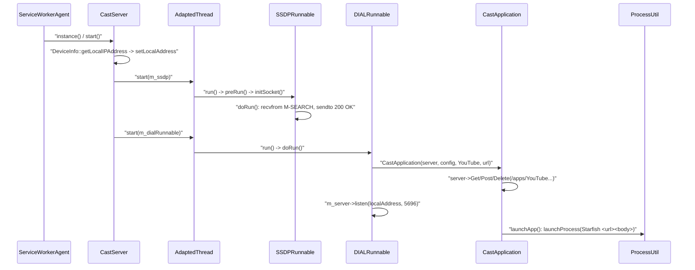
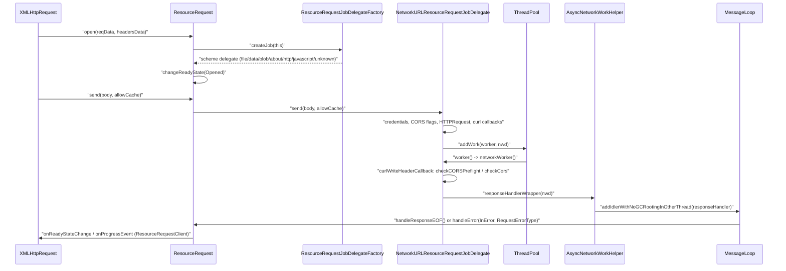

# Module Design Card: modules-web-apis

> **Relevant source files**
>
> - [src/core/modules/battery/Battery.cpp](src:src/core/modules/battery/Battery.cpp)
> - [src/core/modules/battery/Battery.h](src:src/core/modules/battery/Battery.h)
> - [src/core/modules/cast/BaseRunnable.cpp](src:src/core/modules/cast/BaseRunnable.cpp)
> - [src/core/modules/cast/BaseRunnable.h](src:src/core/modules/cast/BaseRunnable.h)
> - [src/core/modules/cast/CastApplication.cpp](src:src/core/modules/cast/CastApplication.cpp)
> - [src/core/modules/cast/CastApplication.h](src:src/core/modules/cast/CastApplication.h)
> - [src/core/modules/cast/CastConfig.cpp](src:src/core/modules/cast/CastConfig.cpp)
> - [src/core/modules/cast/CastConfig.h](src:src/core/modules/cast/CastConfig.h)
> - [src/core/modules/cast/CastServer.cpp](src:src/core/modules/cast/CastServer.cpp)
> - [src/core/modules/cast/CastServer.h](src:src/core/modules/cast/CastServer.h)
> - [src/core/modules/cast/DIALRunnable.cpp](src:src/core/modules/cast/DIALRunnable.cpp)
> - [src/core/modules/cast/DIALRunnable.h](src:src/core/modules/cast/DIALRunnable.h)
> - [src/core/modules/cast/SSDPRunnable.cpp](src:src/core/modules/cast/SSDPRunnable.cpp)
> - [src/core/modules/cast/SSDPRunnable.h](src:src/core/modules/cast/SSDPRunnable.h)
> - [src/core/modules/crypto/Crypto.cpp](src:src/core/modules/crypto/Crypto.cpp)
> - [src/core/modules/crypto/Crypto.h](src:src/core/modules/crypto/Crypto.h)
> - [src/core/modules/location/Coordinates.cpp](src:src/core/modules/location/Coordinates.cpp)
> - [src/core/modules/location/Coordinates.h](src:src/core/modules/location/Coordinates.h)
> - [src/core/modules/location/Geolocation.cpp](src:src/core/modules/location/Geolocation.cpp)
> - [src/core/modules/location/Geolocation.h](src:src/core/modules/location/Geolocation.h)
> - [src/core/modules/location/GeolocationTizen.cpp](src:src/core/modules/location/GeolocationTizen.cpp)
> - [src/core/modules/location/Geoposition.cpp](src:src/core/modules/location/Geoposition.cpp)
> - [src/core/modules/location/Geoposition.h](src:src/core/modules/location/Geoposition.h)
> - [src/core/modules/location/PositionError.cpp](src:src/core/modules/location/PositionError.cpp)
> - [src/core/modules/location/PositionError.h](src:src/core/modules/location/PositionError.h)
> - [src/core/modules/networking/BinaryType.h](src:src/core/modules/networking/BinaryType.h)
> - [src/core/modules/networking/LWSRunnable.cpp](src:src/core/modules/networking/LWSRunnable.cpp)
> - [src/core/modules/networking/LWSRunnable.h](src:src/core/modules/networking/LWSRunnable.h)
> - [src/core/modules/networking/Socket.h](src:src/core/modules/networking/Socket.h)
> - [src/core/modules/networking/SocketLWS.cpp](src:src/core/modules/networking/SocketLWS.cpp)
> - [src/core/modules/networking/SocketLWS.h](src:src/core/modules/networking/SocketLWS.h)
> - [src/core/modules/networking/WebSocket.cpp](src:src/core/modules/networking/WebSocket.cpp)
> - [src/core/modules/networking/WebSocket.h](src:src/core/modules/networking/WebSocket.h)
> - [src/core/modules/resize_observer/ResizeObserver.cpp](src:src/core/modules/resize_observer/ResizeObserver.cpp)
> - [src/core/modules/resize_observer/ResizeObserver.h](src:src/core/modules/resize_observer/ResizeObserver.h)
> - [src/core/modules/resize_observer/ResizeObserverEntry.cpp](src:src/core/modules/resize_observer/ResizeObserverEntry.cpp)
> - [src/core/modules/resize_observer/ResizeObserverEntry.h](src:src/core/modules/resize_observer/ResizeObserverEntry.h)
> - [src/core/modules/resize_observer/ResizeObserverOptions.cpp](src:src/core/modules/resize_observer/ResizeObserverOptions.cpp)
> - [src/core/modules/resize_observer/ResizeObserverOptions.h](src:src/core/modules/resize_observer/ResizeObserverOptions.h)
> - [src/core/modules/resize_observer/ResizeObserverSize.h](src:src/core/modules/resize_observer/ResizeObserverSize.h)
> - [src/core/modules/resource_request/NetworkURLResourceRequestJobDelegate.cpp](src:src/core/modules/resource_request/NetworkURLResourceRequestJobDelegate.cpp)
> - [src/core/modules/resource_request/NetworkURLResourceRequestJobDelegate.h](src:src/core/modules/resource_request/NetworkURLResourceRequestJobDelegate.h)
> - [src/core/modules/resource_request/ResourceRequest.cpp](src:src/core/modules/resource_request/ResourceRequest.cpp)
> - [src/core/modules/resource_request/ResourceRequest.h](src:src/core/modules/resource_request/ResourceRequest.h)
> - [src/core/modules/resource_request/ResourceRequestJob.cpp](src:src/core/modules/resource_request/ResourceRequestJob.cpp)
> - [src/core/modules/resource_request/ResourceRequestJob.h](src:src/core/modules/resource_request/ResourceRequestJob.h)
> - [src/core/modules/tts/A11yLiveRegion.cpp](src:src/core/modules/tts/A11yLiveRegion.cpp)
> - [src/core/modules/tts/A11yLiveRegion.h](src:src/core/modules/tts/A11yLiveRegion.h)
> - [src/core/modules/tts/SpeechSynthesis.cpp](src:src/core/modules/tts/SpeechSynthesis.cpp)
> - [src/core/modules/tts/SpeechSynthesis.h](src:src/core/modules/tts/SpeechSynthesis.h)
> - [src/core/modules/tts/SpeechSynthesisEvent.h](src:src/core/modules/tts/SpeechSynthesisEvent.h)
> - [src/core/modules/tts/TTS.h](src:src/core/modules/tts/TTS.h)
> - [src/core/modules/tts/TextAlternativeHelper.cpp](src:src/core/modules/tts/TextAlternativeHelper.cpp)
> - [src/core/modules/tts/TextAlternativeHelper.h](src:src/core/modules/tts/TextAlternativeHelper.h)
> - [src/core/dom/ExecutionContext.cpp](src:src/core/dom/ExecutionContext.cpp)
> - [src/core/dom/Document.cpp](src:src/core/dom/Document.cpp)
> - [src/core/dom/CharacterData.cpp](src:src/core/dom/CharacterData.cpp)
> - [src/core/dom/Element.cpp](src:src/core/dom/Element.cpp)
> - [src/core/page/Navigator.cpp](src:src/core/page/Navigator.cpp)
> - [src/core/page/Window.cpp](src:src/core/page/Window.cpp)
> - [src/core/xml/XMLHttpRequest.cpp](src:src/core/xml/XMLHttpRequest.cpp)
> - [src/core/cdp/domains/EmulationDomain.cpp](src:src/core/cdp/domains/EmulationDomain.cpp)
> - [src/core/modules/serviceworker/host/ServiceWorkerAgent.cpp](src:src/core/modules/serviceworker/host/ServiceWorkerAgent.cpp)
> - [src/platform/process/base/Process.cpp](src:src/platform/process/base/Process.cpp)
> - [build/config.cmake](src:build/config.cmake)

**Module**: `modules-web-apis` — 54 files under `src/core/modules/cast`, `src/core/modules/location`, `src/core/modules/networking`, `src/core/modules/tts`, `src/core/modules/resize_observer`, `src/core/modules/resource_request`, `src/core/modules/battery`, `src/core/modules/crypto`
**Role**: Implements eight page-facing web APIs and their engine back-ends: a network resource loader whose scheme delegates are chosen by [`ResourceRequestJobDelegateFactory::createJob`](src:src/core/modules/resource_request/ResourceRequestJob.cpp#L219), a WebSocket client driven by [`SocketLWS::lwsEventCallback`](src:src/core/modules/networking/SocketLWS.cpp#L111), a cast discovery/launch service started by [`CastServer::start`](src:src/core/modules/cast/CastServer.cpp#L70), plus geolocation, speech synthesis, resize observation, battery and random-value APIs.
**Module Boundary**: Remaining small sibling web-API feature directories (cast, location, networking/WebSocket, tts, resize_observer, resource_request, battery, crypto) merged as one review surface to avoid eight tiny modules
**Confidence**: 0.75
**Core selection**: All approved modules are Core (boundary approved in W1 human review)
**Generated**: 2026-09-10

## Source Files

### cast (SSDP discovery responder, DIAL HTTP server, shared thread runnable)
- [src/core/modules/cast/BaseRunnable.h](src:src/core/modules/cast/BaseRunnable.h)
- [src/core/modules/cast/BaseRunnable.cpp](src:src/core/modules/cast/BaseRunnable.cpp)
- [src/core/modules/cast/CastApplication.h](src:src/core/modules/cast/CastApplication.h)
- [src/core/modules/cast/CastApplication.cpp](src:src/core/modules/cast/CastApplication.cpp)
- [src/core/modules/cast/CastConfig.h](src:src/core/modules/cast/CastConfig.h)
- [src/core/modules/cast/CastConfig.cpp](src:src/core/modules/cast/CastConfig.cpp)
- [src/core/modules/cast/CastServer.h](src:src/core/modules/cast/CastServer.h)
- [src/core/modules/cast/CastServer.cpp](src:src/core/modules/cast/CastServer.cpp)
- [src/core/modules/cast/DIALRunnable.h](src:src/core/modules/cast/DIALRunnable.h)
- [src/core/modules/cast/DIALRunnable.cpp](src:src/core/modules/cast/DIALRunnable.cpp)
- [src/core/modules/cast/SSDPRunnable.h](src:src/core/modules/cast/SSDPRunnable.h)
- [src/core/modules/cast/SSDPRunnable.cpp](src:src/core/modules/cast/SSDPRunnable.cpp)

### networking (WebSocket client over libwebsockets)
- [src/core/modules/networking/BinaryType.h](src:src/core/modules/networking/BinaryType.h)
- [src/core/modules/networking/LWSRunnable.h](src:src/core/modules/networking/LWSRunnable.h)
- [src/core/modules/networking/LWSRunnable.cpp](src:src/core/modules/networking/LWSRunnable.cpp)
- [src/core/modules/networking/Socket.h](src:src/core/modules/networking/Socket.h)
- [src/core/modules/networking/SocketLWS.h](src:src/core/modules/networking/SocketLWS.h)
- [src/core/modules/networking/SocketLWS.cpp](src:src/core/modules/networking/SocketLWS.cpp)
- [src/core/modules/networking/WebSocket.h](src:src/core/modules/networking/WebSocket.h)
- [src/core/modules/networking/WebSocket.cpp](src:src/core/modules/networking/WebSocket.cpp)

### resource_request (URL loading: local schemes and HTTP(S) over curl)
- [src/core/modules/resource_request/ResourceRequest.h](src:src/core/modules/resource_request/ResourceRequest.h)
- [src/core/modules/resource_request/ResourceRequest.cpp](src:src/core/modules/resource_request/ResourceRequest.cpp)
- [src/core/modules/resource_request/ResourceRequestJob.h](src:src/core/modules/resource_request/ResourceRequestJob.h)
- [src/core/modules/resource_request/ResourceRequestJob.cpp](src:src/core/modules/resource_request/ResourceRequestJob.cpp)
- [src/core/modules/resource_request/NetworkURLResourceRequestJobDelegate.h](src:src/core/modules/resource_request/NetworkURLResourceRequestJobDelegate.h)
- [src/core/modules/resource_request/NetworkURLResourceRequestJobDelegate.cpp](src:src/core/modules/resource_request/NetworkURLResourceRequestJobDelegate.cpp)

### location (Geolocation API, default and Tizen back-ends)
- [src/core/modules/location/Coordinates.h](src:src/core/modules/location/Coordinates.h)
- [src/core/modules/location/Coordinates.cpp](src:src/core/modules/location/Coordinates.cpp)
- [src/core/modules/location/Geolocation.h](src:src/core/modules/location/Geolocation.h)
- [src/core/modules/location/Geolocation.cpp](src:src/core/modules/location/Geolocation.cpp)
- [src/core/modules/location/GeolocationTizen.cpp](src:src/core/modules/location/GeolocationTizen.cpp)
- [src/core/modules/location/Geoposition.h](src:src/core/modules/location/Geoposition.h)
- [src/core/modules/location/Geoposition.cpp](src:src/core/modules/location/Geoposition.cpp)
- [src/core/modules/location/PositionError.h](src:src/core/modules/location/PositionError.h)
- [src/core/modules/location/PositionError.cpp](src:src/core/modules/location/PositionError.cpp)

### tts (SpeechSynthesis API, engine TTS front-end, accessibility text and live regions)
- [src/core/modules/tts/TTS.h](src:src/core/modules/tts/TTS.h)
- [src/core/modules/tts/SpeechSynthesis.h](src:src/core/modules/tts/SpeechSynthesis.h)
- [src/core/modules/tts/SpeechSynthesis.cpp](src:src/core/modules/tts/SpeechSynthesis.cpp)
- [src/core/modules/tts/SpeechSynthesisEvent.h](src:src/core/modules/tts/SpeechSynthesisEvent.h)
- [src/core/modules/tts/A11yLiveRegion.h](src:src/core/modules/tts/A11yLiveRegion.h)
- [src/core/modules/tts/A11yLiveRegion.cpp](src:src/core/modules/tts/A11yLiveRegion.cpp)
- [src/core/modules/tts/TextAlternativeHelper.h](src:src/core/modules/tts/TextAlternativeHelper.h)
- [src/core/modules/tts/TextAlternativeHelper.cpp](src:src/core/modules/tts/TextAlternativeHelper.cpp)

### resize_observer (ResizeObserver API)
- [src/core/modules/resize_observer/ResizeObserver.h](src:src/core/modules/resize_observer/ResizeObserver.h)
- [src/core/modules/resize_observer/ResizeObserver.cpp](src:src/core/modules/resize_observer/ResizeObserver.cpp)
- [src/core/modules/resize_observer/ResizeObserverEntry.h](src:src/core/modules/resize_observer/ResizeObserverEntry.h)
- [src/core/modules/resize_observer/ResizeObserverEntry.cpp](src:src/core/modules/resize_observer/ResizeObserverEntry.cpp)
- [src/core/modules/resize_observer/ResizeObserverOptions.h](src:src/core/modules/resize_observer/ResizeObserverOptions.h)
- [src/core/modules/resize_observer/ResizeObserverOptions.cpp](src:src/core/modules/resize_observer/ResizeObserverOptions.cpp)
- [src/core/modules/resize_observer/ResizeObserverSize.h](src:src/core/modules/resize_observer/ResizeObserverSize.h)

### battery, crypto
- [src/core/modules/battery/Battery.h](src:src/core/modules/battery/Battery.h)
- [src/core/modules/battery/Battery.cpp](src:src/core/modules/battery/Battery.cpp)
- [src/core/modules/crypto/Crypto.h](src:src/core/modules/crypto/Crypto.h)
- [src/core/modules/crypto/Crypto.cpp](src:src/core/modules/crypto/Crypto.cpp)

Build gates: `cast/` compiles only under `STARFISH_ENABLE_CAST_SERVICE` ([`CastConfig.h`](src:src/core/modules/cast/CastConfig.h#L20)); `networking/` under `STARFISH_ENABLE_WEBSOCKET`, which is tied to the `USE_LIBWEBSOCKETS` flag in [`config.cmake`](src:build/config.cmake#L115); `tts/` under `STARFISH_ENABLE_TTS` ([`TTS.h`](src:src/core/modules/tts/TTS.h#L20)) with `A11yLiveRegion` additionally under `STARFISH_ENABLE_A11Y_TOUCH_EXPLORATION` ([`A11yLiveRegion.h`](src:src/core/modules/tts/A11yLiveRegion.h#L20)); `battery/` under `STARFISH_ENABLE_BATTERY_STATUS` ([`Battery.h`](src:src/core/modules/battery/Battery.h#L20)); the Tizen geolocation back-end under `STARFISH_TIZEN_CAPI_LOCATION_MANAGER_ENABLED` ([`Geolocation.cpp`](src:src/core/modules/location/Geolocation.cpp#L91)).

## Public Interface

| Function/Class | Signature | Main callers | Source |
|---|---|---|---|
| `ResourceRequest` | `class ResourceRequest : public gc, public ResourceRequestJobInterface` | `XMLHttpRequest`, `Resource`/`ResourceLoader`, `Fetch`/`Body`, `HTMLScriptElement`, `HTMLFormElement`, service worker fetch handling, CDP `NetworkDomain` | [`ResourceRequest`](src:src/core/modules/resource_request/ResourceRequest.h#L111) |
| `ResourceRequest::open` | `void open(RequestData* reqData, HeadersData* headersData)` | [`XMLHttpRequest.cpp`](src:src/core/xml/XMLHttpRequest.cpp#L468) | [`ResourceRequest::open`](src:src/core/modules/resource_request/ResourceRequest.cpp#L328) |
| `ResourceRequest::send` | `virtual void send(String* body = String::emptyString, bool allowCache = false)` | [`XMLHttpRequest.cpp`](src:src/core/xml/XMLHttpRequest.cpp#L388) | [`ResourceRequest::send`](src:src/core/modules/resource_request/ResourceRequest.cpp#L378) |
| `ResourceRequest::abort` | `void abort(bool isExplicitAction = true)` | `XMLHttpRequest`, [`ExecutionContext.cpp`](src:src/core/dom/ExecutionContext.cpp#L175) | [`ResourceRequest::abort`](src:src/core/modules/resource_request/ResourceRequest.cpp#L355) |
| `ResourceRequestClient` | `class ResourceRequestClient : public gc` (virtual `onProgressEvent`, `onReadyStateChange`) | `XMLHttpRequest`, loader `Resource` subclasses | [`ResourceRequestClient`](src:src/core/modules/resource_request/ResourceRequest.h#L96) |
| `ResourceRequestJobDelegateFactory::createJob` | `static ResourceRequestJobInterface* createJob(ResourceRequest* proxy)` | [`ResourceRequest::open`](src:src/core/modules/resource_request/ResourceRequest.cpp#L351) | [`ResourceRequestJobDelegateFactory::createJob`](src:src/core/modules/resource_request/ResourceRequestJob.cpp#L219) |
| `NetworkURLWorkerData` | `struct NetworkURLWorkerData` (per-request worker state, curl transaction, CORS flags) | `HTTPCache` (`src/platform/network/http/HTTPCache.cpp`) | [`NetworkURLWorkerData`](src:src/core/modules/resource_request/NetworkURLResourceRequestJobDelegate.h#L36) |
| `WebSocket` | `class WebSocket : public EventTarget` (`WebSocket(ExecutionContext*, String* url[, String* protocols])`) | Script binding; [`ExecutionContext::addActiveWebSockets`](src:src/core/dom/ExecutionContext.cpp#L182) | [`WebSocket`](src:src/core/modules/networking/WebSocket.h#L33) |
| `WebSocket::send` | `void send(String* data)`, `void send(Blob* data)`, `void send(ScriptArrayBuffer data)`, `void send(ScriptArrayBufferView data)` | Script binding | [`WebSocket::send`](src:src/core/modules/networking/WebSocket.h#L109) |
| `WebSocket::close` / `WebSocket::dispose` | `void close(uint16_t code, String* reason)`, `void dispose()` | Script binding; [`ExecutionContext::disposeActiveWebSockets`](src:src/core/dom/ExecutionContext.cpp#L196) | [`WebSocket::close`](src:src/core/modules/networking/WebSocket.cpp#L236), [`WebSocket::dispose`](src:src/core/modules/networking/WebSocket.cpp#L272) |
| `Socket` | `class Socket : public gc` (abstract: `bind`, `connect`, `send`, `recv`, `close`, `getFd`, `shutdown`, …) | `SocketNN` (worker IPC), service worker host/client connections | [`Socket`](src:src/core/modules/networking/Socket.h#L24) |
| `CastServer::instance` / `CastServer::start` | `static CastServer* instance()`, `bool start()` | [`ServiceWorkerAgent.cpp`](src:src/core/modules/serviceworker/host/ServiceWorkerAgent.cpp#L90) | [`CastServer::instance`](src:src/core/modules/cast/CastServer.cpp#L40), [`CastServer::start`](src:src/core/modules/cast/CastServer.cpp#L70) |
| `BaseRunnable` | `class BaseRunnable : public IRunnable` (`run`, `stop`, `setStopper`, `addClient`; hooks `preRun`/`doRun`/`postRun`) | `SSDPRunnable`, `DIALRunnable`, `LWSRunnable` | [`BaseRunnable`](src:src/core/modules/cast/BaseRunnable.h#L29) |
| `Geolocation::create` | `static Geolocation* create(Document* document)` | [`Navigator.cpp`](src:src/core/page/Navigator.cpp#L58) | [`Geolocation::create`](src:src/core/modules/location/Geolocation.cpp#L92) (default), [`Geolocation::create`](src:src/core/modules/location/GeolocationTizen.cpp#L123) (Tizen) |
| `Geolocation::getCurrentPosition` / `watchPosition` / `clearWatch` | `virtual void getCurrentPosition(GeoPositionCallback cb, void* cbData, GeoPositionErrorCallback errorCb, void* errorCbData, bool enableHighAccuracy, int32_t timeout, int32_t maximumAge)` | `GeolocationCustomBinding.cpp` | [`Geolocation::getCurrentPosition`](src:src/core/modules/location/Geolocation.h#L44) |
| `Geolocation::setOverride` / `clearOverride` | `static void setOverride(double latitude, double longitude, double accuracy)`, `static void clearOverride()` | [`EmulationDomain.cpp`](src:src/core/cdp/domains/EmulationDomain.cpp#L152) | [`Geolocation::setOverride`](src:src/core/modules/location/Geolocation.cpp#L41) |
| `SpeechSynthesis` | `class SpeechSynthesis : public EventTarget, public DocumentHoldable` (`speak`, `cancel`, `pause`, `resume`, `getVoices`) | [`Window.cpp`](src:src/core/page/Window.cpp#L146) | [`SpeechSynthesis`](src:src/core/modules/tts/SpeechSynthesis.h#L210) |
| `TTS` | `class TTS : public gc, public WebViewHoldable` (`speech`, `cancel`, `pause`, `resume`, `isSpeaking`, `liveRegion`) | `WebView`, `Element`, `A11yTouchExploration`, platform back-ends `TTSTizen`/`TTSTV`/`TTSBase`, `LWEWebContainerDelegate` | [`TTS`](src:src/core/modules/tts/TTS.h#L39) |
| `A11yLiveRegion::nodeInserted` / `characterDataChanged` | `static void nodeInserted(Document* document, Node* newChild)`, `static void characterDataChanged(Node* node)` | [`Document.cpp`](src:src/core/dom/Document.cpp#L1688), [`CharacterData.cpp`](src:src/core/dom/CharacterData.cpp#L122) | [`A11yLiveRegion::nodeInserted`](src:src/core/modules/tts/A11yLiveRegion.cpp#L55) |
| `TextAlternativeHelper::getComputedTextAlternative` | `String* getComputedTextAlternative(Node* node)` | [`Element.cpp`](src:src/core/dom/Element.cpp#L1079), `A11yTouchExploration`, `A11yAtspiTreeSource` | [`TextAlternativeHelper::getComputedTextAlternative`](src:src/core/modules/tts/TextAlternativeHelper.cpp#L44) |
| `ResizeObserver` | `class ResizeObserver : public ScriptWrappable` (`observe`, `unobserve`, `disconnect`, `takeRecords`, `notify`, `queueResizeObserverEntry`) | Script binding; [`Document.cpp`](src:src/core/dom/Document.cpp#L2735) | [`ResizeObserver`](src:src/core/modules/resize_observer/ResizeObserver.h#L44) |
| `Crypto::create` / `getRandomValues` | `static Crypto* create(ExecutionContext*)`, `ScriptArrayBufferView getRandomValues(ScriptArrayBufferView array)` | [`Window.cpp`](src:src/core/page/Window.cpp#L954), `WorkerGlobalScope` | [`Crypto::getRandomValues`](src:src/core/modules/crypto/Crypto.cpp#L31) |
| `BatteryManager` | `class BatteryManager : public EventTarget` (`virtual double level()`) | [`Navigator.cpp`](src:src/core/page/Navigator.cpp#L99) | [`BatteryManager`](src:src/core/modules/battery/Battery.h#L30) |

## IPC / Message / Interface Contracts

- **SSDP discovery responder (UDP multicast, LAN peers)**: [`SSDPRunnable::initSocket`](src:src/core/modules/cast/SSDPRunnable.cpp#L118) opens a non-blocking `AF_INET`/`SOCK_DGRAM` socket ([`SSDPRunnable.cpp`](src:src/core/modules/cast/SSDPRunnable.cpp#L125)), sets `SO_REUSEADDR`, binds to [`SSDP_GROUP`](src:src/core/modules/cast/CastConfig.h#L27) `"239.255.255.250"` : [`SSDP_PORT`](src:src/core/modules/cast/CastConfig.h#L28) `1900`, and joins the group with `IP_ADD_MEMBERSHIP` on the local interface address ([`SSDPRunnable.cpp`](src:src/core/modules/cast/SSDPRunnable.cpp#L152)). [`SSDPRunnable::doRun`](src:src/core/modules/cast/SSDPRunnable.cpp#L48) loops every [`RECV_SLEEP_MS`](src:src/core/modules/cast/SSDPRunnable.cpp#L30) (300 ms) on `recvfrom`, accepts only datagrams that start with `M-SEARCH` and contain [`SSDP_ST`](src:src/core/modules/cast/CastConfig.h#L29) `"urn:dial-multiscreen-org:service:dial:1"` ([`SSDPRunnable.cpp`](src:src/core/modules/cast/SSDPRunnable.cpp#L85)), and answers the sender with `sendto` ([`SSDPRunnable.cpp`](src:src/core/modules/cast/SSDPRunnable.cpp#L97)) using the `HTTP/1.1 200 OK` response format string at [`CastConfig.cpp`](src:src/core/modules/cast/CastConfig.cpp#L67) (`LOCATION: http://<local>:<LOCATION_PORT>/deviceDescription.xml`, `CACHE-CONTROL: max-age=1800`, `USN: uuid:` + [`DEVICE_UUID`](src:src/core/modules/cast/CastConfig.cpp#L32), `ST:` header). A failed `sendto` ends the loop (`return false`).
- **DIAL HTTP server (TCP, LAN peers)**: [`DIALRunnable::doRun`](src:src/core/modules/cast/DIALRunnable.cpp#L43) runs an `httplib::Server` bound to the local address on [`LOCATION_PORT`](src:src/core/modules/cast/CastConfig.h#L31) `5696` ([`DIALRunnable.cpp`](src:src/core/modules/cast/DIALRunnable.cpp#L76)). Routes: `GET` [`LOCATION_DESC`](src:src/core/modules/cast/CastConfig.h#L32) `/deviceDescription.xml` returns the device description XML at [`CastConfig.cpp`](src:src/core/modules/cast/CastConfig.cpp#L43) with header `Application-URL: http://<local>:5696` + [`CAST_APP_URL`](src:src/core/modules/cast/CastConfig.h#L33) ([`DIALRunnable.cpp`](src:src/core/modules/cast/DIALRunnable.cpp#L51)). Per application ([`CastApplication::CastApplication`](src:src/core/modules/cast/CastApplication.cpp#L104), one instance `"YouTube"` → `"http://www.youtube.com/tv?"` at [`DIALRunnable.cpp`](src:src/core/modules/cast/DIALRunnable.cpp#L61)): `GET /apps/<name>` returns the application-state XML at [`CastConfig.cpp`](src:src/core/modules/cast/CastConfig.cpp#L81) with `<state>running|stopped</state>` ([`CastApplication.cpp`](src:src/core/modules/cast/CastApplication.cpp#L113)); `POST /apps/<name>` with params `v` and `pairingCode` launches the app process and returns `201` + `LOCATION: http://<local>:5696/apps/<name>/run`, `200` if already running, `503` on launch failure, and `200` without the params ([`CastApplication.cpp`](src:src/core/modules/cast/CastApplication.cpp#L130)); `DELETE /apps/<name>/run` stops it with `200`, or `400` when not running ([`CastApplication.cpp`](src:src/core/modules/cast/CastApplication.cpp#L165)).
- **Process boundary (DIAL launch)**: [`launchApp`](src:src/core/modules/cast/CastApplication.cpp#L90) spawns a new `Starfish` process with the launch URL plus request body via [`ProcessUtil::launchProcess`](src:src/platform/process/base/Process.cpp#L43) and records its `PID`; [`stopApp`](src:src/core/modules/cast/CastApplication.cpp#L99) kills that PID with `ProcessUtil::killProcess`.
- **WebSocket client (ws/wss over TCP, remote servers)**: [`SocketLWS::SocketLWS`](src:src/core/modules/networking/SocketLWS.cpp#L232) parses the URL with `lws_parse_uri` ([`SocketLWS.cpp`](src:src/core/modules/networking/SocketLWS.cpp#L275)), sends the script origin (or `"null"` for opaque/`file://`) as the `Origin` header ([`SocketLWS.cpp`](src:src/core/modules/networking/SocketLWS.cpp#L268)), sets the sub-protocol from `WebSocket::protocol()`, creates an `lws_context` with `CONTEXT_PORT_NO_LISTEN` ([`SocketLWS.cpp`](src:src/core/modules/networking/SocketLWS.cpp#L343)), and for `wss`/`https` enables `LCCSCF_USE_SSL` with CA file `/etc/ssl/certs/ca-certificates.crt` (Tizen: `/opt/share/cert-svc/ca-certificate.crt`) ([`SocketLWSDefaultCertPath`](src:src/core/modules/networking/SocketLWS.cpp#L53)); certificate checks are relaxed only when `WebSecurityMode::Disable` ([`SocketLWS.cpp`](src:src/core/modules/networking/SocketLWS.cpp#L329)). The connection is opened by [`LWSRunnable::preRun`](src:src/core/modules/networking/LWSRunnable.cpp#L64) (`lws_client_connect_via_info`) and serviced by [`SocketLWS::run`](src:src/core/modules/networking/SocketLWS.cpp#L431) (`lws_service` at [`SocketLWS.cpp`](src:src/core/modules/networking/SocketLWS.cpp#L436)) on a dedicated thread. Outbound frames: queued by [`SocketLWS::send`](src:src/core/modules/networking/SocketLWS.cpp#L501) (text when `flags == 0`, else binary; queue bounded by [`SocketLWS::kMaxTxBufferSize`](src:src/core/modules/networking/SocketLWS.h#L140) 16 MiB, overflow fails the connection with `MessageTooBig`) and written one frame per `LWS_CALLBACK_CLIENT_WRITEABLE` by [`SocketLWS::serviceTxQueueLocked`](src:src/core/modules/networking/SocketLWS.cpp#L79) (`lws_write` at [`SocketLWS.cpp`](src:src/core/modules/networking/SocketLWS.cpp#L87), `LWS_WRITE_TEXT`/`LWS_WRITE_BINARY`). Inbound frames: fragments accumulate via [`SocketLWS::addToRxBuffer`](src:src/core/modules/networking/SocketLWS.cpp#L556) up to [`SocketLWS::kMaxRxBufferSize`](src:src/core/modules/networking/SocketLWS.h#L138) 16 MiB (excess → `lws_close_reason(LWS_CLOSE_STATUS_MESSAGE_TOO_LARGE)` at [`SocketLWS.cpp`](src:src/core/modules/networking/SocketLWS.cpp#L160)), and a complete message is published on `lws_is_final_fragment` ([`SocketLWS.cpp`](src:src/core/modules/networking/SocketLWS.cpp#L164)). Close: the stored code/reason is replayed as an RFC close frame with `lws_close_reason` in the WRITEABLE callback ([`SocketLWS.cpp`](src:src/core/modules/networking/SocketLWS.cpp#L187)); connection errors publish `error` then close with [`WebSocket::CloseCode`](src:src/core/modules/networking/WebSocket.h#L37) `AbnormalClosure` ([`SocketLWS.cpp`](src:src/core/modules/networking/SocketLWS.cpp#L170)).
- **HTTP(S) resource fetch (client, curl-backed)**: [`NetworkURLResourceRequestJobDelegate::send`](src:src/core/modules/resource_request/NetworkURLResourceRequestJobDelegate.cpp#L437) builds an `HTTPRequest` (URL, host, method, headers, entity body, credentials flag) on an `HTTPTransaction`, installs curl callbacks ([`NetworkURLResourceRequestJobDelegate::curlWriteHeaderCallback`](src:src/core/modules/resource_request/NetworkURLResourceRequestJobDelegate.cpp#L1036), [`NetworkURLResourceRequestJobDelegate::curlWriteCallback`](src:src/core/modules/resource_request/NetworkURLResourceRequestJobDelegate.cpp#L778), [`NetworkURLResourceRequestJobDelegate::curlProgressCallback`](src:src/core/modules/resource_request/NetworkURLResourceRequestJobDelegate.cpp#L762), upload callback for `PUT` at [`NetworkURLResourceRequestJobDelegate.cpp`](src:src/core/modules/resource_request/NetworkURLResourceRequestJobDelegate.cpp#L538)), applies the request timeout and proxy URL, and runs [`NetworkURLResourceRequestJobDelegate::worker`](src:src/core/modules/resource_request/NetworkURLResourceRequestJobDelegate.cpp#L725) synchronously, on a dedicated `Thread` for `text/event-stream`, or on the `ThreadPool` otherwise ([`NetworkURLResourceRequestJobDelegate.cpp`](src:src/core/modules/resource_request/NetworkURLResourceRequestJobDelegate.cpp#L554)). Cross-origin responses must pass [`checkCors`](src:src/core/modules/resource_request/NetworkURLResourceRequestJobDelegate.cpp#L978) (`Access-Control-Allow-Origin` present; `*` accepted only without `Include` credentials; otherwise must equal the request `Origin`; credentials additionally require `Access-Control-Allow-Credentials: true`) and, when flagged, [`checkCORSPreflight`](src:src/core/modules/resource_request/NetworkURLResourceRequestJobDelegate.cpp#L881); both are bypassed when `WebSecurityMode::Disable` ([`NetworkURLResourceRequestJobDelegate.cpp`](src:src/core/modules/resource_request/NetworkURLResourceRequestJobDelegate.cpp#L986)). curl result codes map to [`RequestErrorType`](src:src/core/modules/resource_request/ResourceRequest.h#L77) in [`NetworkURLWorkerHelper::responseHandler`](src:src/core/modules/resource_request/NetworkURLResourceRequestJobDelegate.cpp#L265) (`CURLE_OPERATION_TIMEDOUT` → `TimeoutError`, `CURLE_COULDNT_RESOLVE_HOST` → `HostLookupError`, `CURLE_COULDNT_CONNECT` → `ConnectError`, `CURLE_UNSUPPORTED_PROTOCOL` → `UnsupportedSchemeError`, else `UnknownError`).
- **Not IPC**: [`ResourceRequestClient`](src:src/core/modules/resource_request/ResourceRequest.h#L96) callbacks, [`BaseRunnable::Client`](src:src/core/modules/cast/BaseRunnable.h#L31) stop notifications, [`ResizeObserver::notify`](src:src/core/modules/resize_observer/ResizeObserver.cpp#L118), WebSocket DOM events dispatched by [`SocketLWS::publishEvent`](src:src/core/modules/networking/SocketLWS.cpp#L626), and the geolocation callbacks are in-process message-loop idlers or direct calls. The Tizen location back-end calls the platform `location_manager_*` C API in-process ([`GeolocationTizen.cpp`](src:src/core/modules/location/GeolocationTizen.cpp#L273)).

Architecturally, every network contract in this module runs its blocking I/O on a worker thread (`AdaptedThread` from the `WebBase`/`CastServer` thread pool, or `ThreadPool::addWork` for HTTP) and marshals results back to the owning `MessageLoop` with `addIdlerWithNoGCRootingInOtherThread` ([`SocketLWS::updateState`](src:src/core/modules/networking/SocketLWS.cpp#L581), [`AsyncNetworkWorkHelper::responseHandlerWrapper`](src:src/core/modules/resource_request/NetworkURLResourceRequestJobDelegate.cpp#L395), [`BaseRunnable::postRun`](src:src/core/modules/cast/BaseRunnable.cpp#L86)), so script-visible state changes and DOM events happen on the page thread. The cast service is the only server-side listener; it is owned by the service-worker host process ([`ServiceWorkerAgent.cpp`](src:src/core/modules/serviceworker/host/ServiceWorkerAgent.cpp#L90)) rather than by a page.

## Key Flow


Entry symbol: [`CastServer::start`](src:src/core/modules/cast/CastServer.cpp#L70) creates two `AdaptedThread`s on a 5-thread pool and starts the SSDP responder and the DIAL server; a `POST /apps/YouTube` reaches [`launchApp`](src:src/core/modules/cast/CastApplication.cpp#L90).

```mermaid
sequenceDiagram
    participant WebSocket
    participant SocketLWS
    participant LWSRunnable
    participant libwebsockets
    participant MessageLoop
    WebSocket->>WebSocket: "init(url, protocol): validate, throw SyntaxError"
    WebSocket->>SocketLWS: "new SocketLWS(this)"
    SocketLWS->>libwebsockets: "lws_parse_uri / lws_create_context"
    SocketLWS->>LWSRunnable: "m_thread->start(m_runnable)"
    LWSRunnable->>libwebsockets: "preRun(): lws_client_connect_via_info"
    LWSRunnable->>SocketLWS: "doRun(): run() while !isStopRequested()"
    SocketLWS->>libwebsockets: "lws_service(m_lwsContext, 0)"
    libwebsockets->>SocketLWS: "lwsEventCallback(LWS_CALLBACK_CLIENT_ESTABLISHED)"
    SocketLWS->>MessageLoop: "updateState(OPEN) / publishEvent(OPEN) via addIdlerWithNoGCRootingInOtherThread"
    MessageLoop->>WebSocket: "setReadyState(OPEN); dispatchEventByUA(open)"
    WebSocket->>SocketLWS: "send(buf, len, flags): queue + wakeService()"
    SocketLWS->>libwebsockets: "lws_cancel_service -> EVENT_WAIT_CANCELLED -> lws_callback_on_writable"
    libwebsockets->>SocketLWS: "lwsEventCallback(LWS_CALLBACK_CLIENT_WRITEABLE)"
    SocketLWS->>libwebsockets: "serviceTxQueueLocked(): lws_write"
    libwebsockets->>SocketLWS: "lwsEventCallback(LWS_CALLBACK_CLIENT_RECEIVE): addToRxBuffer"
    SocketLWS->>MessageLoop: "publishEvent(ONMESSAGE, isBinary)"
    MessageLoop->>WebSocket: "dispatchEventByUA(MessageEvent)"
```
Entry symbol: [`WebSocket::init`](src:src/core/modules/networking/WebSocket.cpp#L150) validates the URL and sub-protocol and constructs [`SocketLWS::SocketLWS`](src:src/core/modules/networking/SocketLWS.cpp#L232), which starts the service thread; all later I/O is driven by [`SocketLWS::lwsEventCallback`](src:src/core/modules/networking/SocketLWS.cpp#L111).


Entry symbol: [`ResourceRequest::open`](src:src/core/modules/resource_request/ResourceRequest.cpp#L328) selects the delegate; [`ResourceRequest::send`](src:src/core/modules/resource_request/ResourceRequest.cpp#L378) forwards to it and the HTTP delegate completes through [`NetworkURLWorkerHelper::responseHandler`](src:src/core/modules/resource_request/NetworkURLResourceRequestJobDelegate.cpp#L265).

```mermaid
sequenceDiagram
    participant Script
    participant ResizeObserver
    participant Element
    participant Document
    Script->>ResizeObserver: "observe(target, options)"
    ResizeObserver->>Element: "appendResizeObserverRegistration(registration)"
    ResizeObserver->>Document: "addResizeObserver(this); window()->requestAnimationFrame"
    Document->>Document: "updateResizeObservation(): compare previousSize vs content size"
    Document->>ResizeObserver: "queueResizeObserverEntry(new ResizeObserverEntry)"
    Document->>ResizeObserver: "notify()"
    ResizeObserver->>Script: "callScriptFunction(callback, [entries])"
```
Entry symbol: [`ResizeObserver::observe`](src:src/core/modules/resize_observer/ResizeObserver.cpp#L59) registers the target; [`Document::updateResizeObservation`](src:src/core/dom/Document.cpp#L2735) queues entries and calls [`ResizeObserver::notify`](src:src/core/modules/resize_observer/ResizeObserver.cpp#L118).

## Architectural Rules

- [ ] Every blocking network loop runs in a `BaseRunnable` subclass on an `AdaptedThread`; `run()` calls `preRun()` once, then `doRun()` until it returns `false` or a stop is requested, then `postRun()` notifies registered clients on the owning message loop. [`BaseRunnable::run`](src:src/core/modules/cast/BaseRunnable.cpp#L50), [`BaseRunnable::postRun`](src:src/core/modules/cast/BaseRunnable.cpp#L86)
- [ ] `lws_cancel_service()` is the only libwebsockets entry point invoked from the main thread; all other lws calls are deferred to `LWS_CALLBACK_EVENT_WAIT_CANCELLED` on the service thread. [`SocketLWS::wakeService`](src:src/core/modules/networking/SocketLWS.cpp#L401), [`SocketLWS.cpp`](src:src/core/modules/networking/SocketLWS.cpp#L125)
- [ ] Cross-thread completions never touch script state directly: they post to the `MessageLoop` with `addIdlerWithNoGCRootingInOtherThread` and hold a `ref()` on the socket/request until the idler runs. [`SocketLWS::publishEvent`](src:src/core/modules/networking/SocketLWS.cpp#L626), [`AsyncNetworkWorkHelper::responseHandlerWrapper`](src:src/core/modules/resource_request/NetworkURLResourceRequestJobDelegate.cpp#L395)
- [ ] Scheme delegates complete through the shared `dispatchWorker` trampoline, which wraps the worker in a `MicroTaskExecutionManager` scope on both the synchronous and idler paths. [`ResourceRequestJobInterface::dispatchWorker`](src:src/core/modules/resource_request/ResourceRequestJob.cpp#L191)
- [ ] `ResourceRequest::changeReadyState` and `changeProgress` assert `isContextThread()`; a `Done` state clears the job delegate and unroots the request via an idler. [`ResourceRequest::changeReadyState`](src:src/core/modules/resource_request/ResourceRequest.cpp#L201), [`ResourceRequest::changeProgress`](src:src/core/modules/resource_request/ResourceRequest.cpp#L310)
- [ ] Receive and send buffers are bounded (16 MiB each); exceeding them fails the connection with an explicit close code instead of growing memory. [`SocketLWS::kMaxRxBufferSize`](src:src/core/modules/networking/SocketLWS.h#L138), [`SocketLWS::send`](src:src/core/modules/networking/SocketLWS.cpp#L501)
- [ ] Web-security relaxations (TLS checks for `wss`, CORS/preflight checks for HTTP) are gated on a single embedder switch, `WebBase::getWebSecurityMode() == LWE::WebSecurityMode::Disable`. [`SocketLWS.cpp`](src:src/core/modules/networking/SocketLWS.cpp#L329), [`checkCors`](src:src/core/modules/resource_request/NetworkURLResourceRequestJobDelegate.cpp#L978)
- [ ] Geolocation results and errors are always delivered asynchronously through a message-loop idler, never from inside the API call. [`Geolocation::getCurrentPosition`](src:src/core/modules/location/Geolocation.cpp#L126), [`GeolocationTizen.cpp`](src:src/core/modules/location/GeolocationTizen.cpp#L149)

## Dependencies

### Internal modules

| Module | File(s) | Purpose | Source |
|---|---|---|---|
| modules-runtime | `core/modules/message_loop/MessageLoop.h`, `Timer.h`, `core/modules/threading/ThreadPool.h`, `AdaptedThread.h`, `Thread.h`, `Mutex.h`, `Locker.h`, `IRunnable.h` | Worker threads for SSDP/DIAL/lws/HTTP, idler marshalling to the page thread, mutexes for tx/close state, live-region drain timer | [`BaseRunnable.h`](src:src/core/modules/cast/BaseRunnable.h#L23), [`SocketLWS.cpp`](src:src/core/modules/networking/SocketLWS.cpp#L29), [`NetworkURLResourceRequestJobDelegate.cpp`](src:src/core/modules/resource_request/NetworkURLResourceRequestJobDelegate.cpp#L46) |
| core-dom | `core/dom/EventTarget.h`, `ExecutionContext.h`, `Document.h`, `Element.h`, `Event.h`, `CloseEvent.h`, `MessageEvent.h`, `DOMException.h`, `WebOrigin.h`, `DOMRectReadOnly.h`, `Node.h`, `Text.h`, HTML element headers | Event dispatch for WebSocket/SpeechSynthesis/Battery, DOMException throwing, origin comparison for CORS, live-region and text-alternative traversal, resize entries | [`WebSocket.h`](src:src/core/modules/networking/WebSocket.h#L25), [`ResourceRequest.cpp`](src:src/core/modules/resource_request/ResourceRequest.cpp#L389), [`TextAlternativeHelper.cpp`](src:src/core/modules/tts/TextAlternativeHelper.cpp#L25) |
| core-page | `core/page/WebBase.h`, `Window.h`, `WebView.h`, `BrowsingContext.h`, `GlobalScope.h` | Access to `messageLoop()`, `threadPool()`, `getWebSecurityMode()`, `proxyURL()`, `tts()`, `requestAnimationFrame` | [`SocketLWS.cpp`](src:src/core/modules/networking/SocketLWS.cpp#L34), [`SpeechSynthesis.cpp`](src:src/core/modules/tts/SpeechSynthesis.cpp#L27), [`ResizeObserver.cpp`](src:src/core/modules/resize_observer/ResizeObserver.cpp#L27) |
| binding | `binding/ScriptWrappable.h`, `ScriptBindingInstance.h`, `ScriptEngineInstance.h`, `DocumentHoldable.h`, `WebViewHoldable.h`, `WindowHoldable.h`, `generated/ElementOrDocumentUnion.h` | Script-object wrapping for all API classes; `MicroTaskExecutionManager`; calling the ResizeObserver callback | [`Crypto.h`](src:src/core/modules/crypto/Crypto.h#L23), [`ResizeObserver.h`](src:src/core/modules/resize_observer/ResizeObserver.h#L25), [`ResourceRequestJob.cpp`](src:src/core/modules/resource_request/ResourceRequestJob.cpp#L25) |
| core-fetch | `core/fetch/RequestData.h`, `ResponseData.h`, `HeadersData.h`, `FetchUtils.h`, `Response.h`, `Body.h` | Request/response data model, CORS-safelisted method/header helpers | [`ResourceRequest.h`](src:src/core/modules/resource_request/ResourceRequest.h#L24), [`NetworkURLResourceRequestJobDelegate.cpp`](src:src/core/modules/resource_request/NetworkURLResourceRequestJobDelegate.cpp#L494) |
| platform-network-loader | `platform/network/http/HTTPTransaction.h`, `HTTPRequest.h`, `HTTPResponse.h`, `HTTPHeaderMap.h`, `HTTPCache.h`, `HTTPCacheEntry.h`, `HTTPStatus.h`, `HTTPUtil.h`, `platform/network/curl/NetworkSharedResourceManager.h`, `platform/loader/ResourceURL.h` | curl transaction wrapper, header constants (`kAccessControlAllowOrigin`), HTTP cache, URL model for WebSocket | [`NetworkURLResourceRequestJobDelegate.cpp`](src:src/core/modules/resource_request/NetworkURLResourceRequestJobDelegate.cpp#L991), [`WebSocket.cpp`](src:src/core/modules/networking/WebSocket.cpp#L63) |
| platform-base | `platform/file/PlatformFile.h`, `platform/public/DeviceInfo.h`, `platform/process/base/Process.h`, `ProcessType.h` | Local file reads for `file:` URLs, local IP lookup for cast, process launch/kill for DIAL apps | [`ResourceRequestJob.cpp`](src:src/core/modules/resource_request/ResourceRequestJob.cpp#L300), [`CastServer.cpp`](src:src/core/modules/cast/CastServer.cpp#L74), [`CastApplication.cpp`](src:src/core/modules/cast/CastApplication.cpp#L96) |
| core-storage-fileapi | `core/fileapi/Blob.h` | Blob payloads for WebSocket binary messages and `blob:` URL loading | [`WebSocket.cpp`](src:src/core/modules/networking/WebSocket.cpp#L60), [`ResourceRequestJob.cpp`](src:src/core/modules/resource_request/ResourceRequestJob.cpp#L490) |
| core-util | `core/util/URL.h`, `RandomEngine.h`, `GlobalOptions.h` | URL helpers, `mt19937` source for `getRandomValues`, `DEBUG_CAST` log-level option | [`Crypto.cpp`](src:src/core/modules/crypto/Crypto.cpp#L22), [`CastConfig.h`](src:src/core/modules/cast/CastConfig.h#L23) |
| modules-serviceworker | `core/modules/serviceworker/client/ServiceWorkerFetchTask.h` | Routes HTTP requests through a service worker before network when built as a non-host worker | [`NetworkURLResourceRequestJobDelegate.cpp`](src:src/core/modules/resource_request/NetworkURLResourceRequestJobDelegate.cpp#L443) |
| core-csp, core-extras | `core/csp/ContentSecurityPolicy.h`, `core/xml/FormData.h` | Policy checks and form-data encoding used by `ResourceRequest` | [`ResourceRequest::encodeFormDataSet`](src:src/core/modules/resource_request/ResourceRequest.cpp#L445) |
| engine-entry | `StarfishConfig.h`, `Starfish.h`, `StarfishInfo.h` | Build configuration macros, `Starfish` root-set registration, product name/version strings for DIAL descriptors | [`CastConfig.cpp`](src:src/core/modules/cast/CastConfig.cpp#L23), [`SocketLWS.cpp`](src:src/core/modules/networking/SocketLWS.cpp#L361) |
| public-embedder-api | `PlatformIntegrationData.h` | `LWE::WebSecurityMode`, `LWE::TTSMode` enumerations shared with embedders | [`TTS.h`](src:src/core/modules/tts/TTS.h#L24), [`SocketLWS.cpp`](src:src/core/modules/networking/SocketLWS.cpp#L24) |

### External libraries

| Library | Version | Purpose | Source |
|---|---|---|---|
| libwebsockets (`<libwebsockets.h>`) | Not specified in code (sub-build selected by `USE_LIBWEBSOCKETS` in [`config.cmake`](src:build/config.cmake#L115)) | WebSocket client: context, connect, service loop, frame write/close | [`SocketLWS.h`](src:src/core/modules/networking/SocketLWS.h#L24) |
| cpp-httplib (`<httplib.h>`) | Not specified in code | DIAL HTTP server (`httplib::Server` routes and `listen`) | [`DIALRunnable.cpp`](src:src/core/modules/cast/DIALRunnable.cpp#L22), [`CastApplication.cpp`](src:src/core/modules/cast/CastApplication.cpp#L22) |
| libcurl (`<curl/curl.h>`) | Not specified in code | HTTP(S) transfer callbacks and result codes for network resource requests | [`NetworkURLResourceRequestJobDelegate.cpp`](src:src/core/modules/resource_request/NetworkURLResourceRequestJobDelegate.cpp#L21), [`ResourceRequestJob.cpp`](src:src/core/modules/resource_request/ResourceRequestJob.cpp#L21) |
| Escargot (`<EscargotPublic.h>`) | Not specified in code | Script values, array buffers, evaluator for callback invocation | [`WebSocket.cpp`](src:src/core/modules/networking/WebSocket.cpp#L50), [`Crypto.cpp`](src:src/core/modules/crypto/Crypto.cpp#L20), [`ResizeObserver.cpp`](src:src/core/modules/resize_observer/ResizeObserver.cpp#L28) |
| Tizen location manager (`<locations.h>`) | Not specified in code | `location_manager_*` position requests and updates (Tizen build only) | [`GeolocationTizen.cpp`](src:src/core/modules/location/GeolocationTizen.cpp#L34) |
| Tizen TTS (`<tts.h>`) | Not specified in code | `tts_h` handle held by `TTS` on Tizen builds | [`TTS.h`](src:src/core/modules/tts/TTS.h#L28) |
| POSIX sockets (`<netinet/in.h>`, `<arpa/inet.h>`) | Not specified in code | UDP multicast socket for SSDP | [`SSDPRunnable.h`](src:src/core/modules/cast/SSDPRunnable.h#L23), [`SSDPRunnable.cpp`](src:src/core/modules/cast/SSDPRunnable.cpp#L24) |
| Boehm GC (`gc`, `GC_REGISTER_FINALIZER_NO_ORDER`, `GC_finalized_malloc`) | Not specified in code | Garbage-collected base for API objects and finalizers | [`BaseRunnable.cpp`](src:src/core/modules/cast/BaseRunnable.cpp#L35), [`ResourceRequest.cpp`](src:src/core/modules/resource_request/ResourceRequest.cpp#L49) |

## Quick Navigation

| To change… | Location |
|---|---|
| SSDP multicast group, port, search target, DIAL port and descriptor path | [`SSDP_GROUP`](src:src/core/modules/cast/CastConfig.h#L27), [`LOCATION_PORT`](src:src/core/modules/cast/CastConfig.h#L31) |
| SSDP response headers or device description XML | [`CastConfig.cpp`](src:src/core/modules/cast/CastConfig.cpp#L43), [`CastConfig.cpp`](src:src/core/modules/cast/CastConfig.cpp#L67) |
| Which cast applications are exposed and their launch URL | [`DIALRunnable::doRun`](src:src/core/modules/cast/DIALRunnable.cpp#L43) |
| DIAL launch/stop HTTP status semantics | [`CastApplication::CastApplication`](src:src/core/modules/cast/CastApplication.cpp#L104) |
| WebSocket constructor validation and thrown DOMExceptions | [`WebSocket::init`](src:src/core/modules/networking/WebSocket.cpp#L150) |
| Close-code range and reason-length rules | [`WebSocket::close`](src:src/core/modules/networking/WebSocket.cpp#L236) |
| TLS CA path and insecure-mode flags for `wss` | [`SocketLWSDefaultCertPath`](src:src/core/modules/networking/SocketLWS.cpp#L53), [`SocketLWS::SocketLWS`](src:src/core/modules/networking/SocketLWS.cpp#L232) |
| lws callback handling (open/receive/writeable/close/error) | [`SocketLWS::lwsEventCallback`](src:src/core/modules/networking/SocketLWS.cpp#L111) |
| Send/receive buffer limits | [`SocketLWS::kMaxRxBufferSize`](src:src/core/modules/networking/SocketLWS.h#L138), [`SocketLWS::kMaxTxBufferSize`](src:src/core/modules/networking/SocketLWS.h#L140) |
| Mapping of URL scheme to loader delegate | [`ResourceRequestJobDelegateFactory::createJob`](src:src/core/modules/resource_request/ResourceRequestJob.cpp#L219) |
| CORS response and preflight checks | [`checkCors`](src:src/core/modules/resource_request/NetworkURLResourceRequestJobDelegate.cpp#L978), [`checkCORSPreflight`](src:src/core/modules/resource_request/NetworkURLResourceRequestJobDelegate.cpp#L881) |
| curl error to `RequestErrorType` mapping | [`NetworkURLWorkerHelper::responseHandler`](src:src/core/modules/resource_request/NetworkURLResourceRequestJobDelegate.cpp#L265) |
| Ready-state / progress state machine and header post-processing | [`ResourceRequest::changeReadyState`](src:src/core/modules/resource_request/ResourceRequest.cpp#L201) |
| Geolocation override used by CDP emulation | [`Geolocation::setOverride`](src:src/core/modules/location/Geolocation.cpp#L41) |
| Tizen position request and watch behaviour | [`GeolocationTizen::getCurrentPosition`](src:src/core/modules/location/GeolocationTizen.cpp#L219), [`GeolocationTizen::watchPosition`](src:src/core/modules/location/GeolocationTizen.cpp#L384) |
| Live-region politeness handling and drain interval | [`A11yLiveRegion::onMutation`](src:src/core/modules/tts/A11yLiveRegion.cpp#L126), [`kDrainIntervalMs`](src:src/core/modules/tts/A11yLiveRegion.cpp#L38) |
| Accessible-name computation rules | [`TextAlternativeHelper::appendTextAlternativeIfNeeds`](src:src/core/modules/tts/TextAlternativeHelper.cpp#L50) |
| Resize entry creation and callback delivery | [`Document::updateResizeObservation`](src:src/core/dom/Document.cpp#L2735), [`ResizeObserver::notify`](src:src/core/modules/resize_observer/ResizeObserver.cpp#L118) |
| Accepted typed arrays and byte limit for `getRandomValues` | [`Crypto::getRandomValues`](src:src/core/modules/crypto/Crypto.cpp#L31), [`Crypto::isIntTypeArray`](src:src/core/modules/crypto/Crypto.cpp#L62) |

## FR Linkage

- [FR-MODULES-WEB-APIS-001](../functional-requirements/modules-web-apis-fr.md#fr-modules-web-apis-001): Answer SSDP discovery searches for the DIAL service
- [FR-MODULES-WEB-APIS-002](../functional-requirements/modules-web-apis-fr.md#fr-modules-web-apis-002): Serve DIAL device description and launch/stop cast applications over HTTP
- [FR-MODULES-WEB-APIS-003](../functional-requirements/modules-web-apis-fr.md#fr-modules-web-apis-003): Open a WebSocket connection after validating URL and sub-protocol
- [FR-MODULES-WEB-APIS-004](../functional-requirements/modules-web-apis-fr.md#fr-modules-web-apis-004): Transfer WebSocket text and binary messages with bounded buffers
- [FR-MODULES-WEB-APIS-005](../functional-requirements/modules-web-apis-fr.md#fr-modules-web-apis-005): Close and dispose WebSocket connections with RFC close codes
- [FR-MODULES-WEB-APIS-006](../functional-requirements/modules-web-apis-fr.md#fr-modules-web-apis-006): Drive the resource request lifecycle and select a loader by URL scheme
- [FR-MODULES-WEB-APIS-007](../functional-requirements/modules-web-apis-fr.md#fr-modules-web-apis-007): Load local-scheme resources (file, data, blob, about, javascript, unknown)
- [FR-MODULES-WEB-APIS-008](../functional-requirements/modules-web-apis-fr.md#fr-modules-web-apis-008): Fetch HTTP(S) resources with credentials, CORS and preflight enforcement
- [FR-MODULES-WEB-APIS-009](../functional-requirements/modules-web-apis-fr.md#fr-modules-web-apis-009): Observe element content-box size changes
- [FR-MODULES-WEB-APIS-010](../functional-requirements/modules-web-apis-fr.md#fr-modules-web-apis-010): Provide geolocation positions, errors and emulation overrides
- [FR-MODULES-WEB-APIS-011](../functional-requirements/modules-web-apis-fr.md#fr-modules-web-apis-011): Speak utterances and announce live-region changes
- [FR-MODULES-WEB-APIS-012](../functional-requirements/modules-web-apis-fr.md#fr-modules-web-apis-012): Report battery level and fill typed arrays with random values
