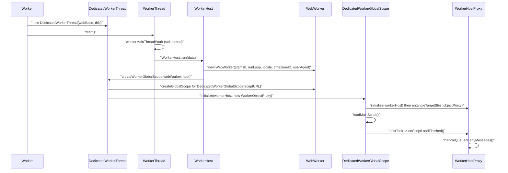
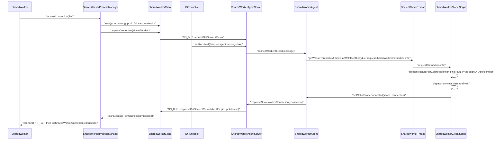
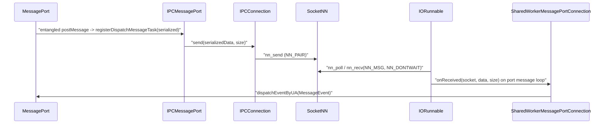

# Module Design Card: modules-workers

> **Relevant source files**
>
> - [src/core/modules/sharedworker/IPCConnection.cpp](src:src/core/modules/sharedworker/IPCConnection.cpp)
> - [src/core/modules/sharedworker/IPCConnection.h](src:src/core/modules/sharedworker/IPCConnection.h)
> - [src/core/modules/sharedworker/IPCMessageHandler.cpp](src:src/core/modules/sharedworker/IPCMessageHandler.cpp)
> - [src/core/modules/sharedworker/IPCMessageHandler.h](src:src/core/modules/sharedworker/IPCMessageHandler.h)
> - [src/core/modules/sharedworker/IPCMessagePort.cpp](src:src/core/modules/sharedworker/IPCMessagePort.cpp)
> - [src/core/modules/sharedworker/IPCMessagePort.h](src:src/core/modules/sharedworker/IPCMessagePort.h)
> - [src/core/modules/sharedworker/IPCMessageSerializer.cpp](src:src/core/modules/sharedworker/IPCMessageSerializer.cpp)
> - [src/core/modules/sharedworker/IPCMessageSerializer.h](src:src/core/modules/sharedworker/IPCMessageSerializer.h)
> - [src/core/modules/sharedworker/SharedWorker.cpp](src:src/core/modules/sharedworker/SharedWorker.cpp)
> - [src/core/modules/sharedworker/SharedWorker.h](src:src/core/modules/sharedworker/SharedWorker.h)
> - [src/core/modules/sharedworker/SharedWorkerClient.cpp](src:src/core/modules/sharedworker/SharedWorkerClient.cpp)
> - [src/core/modules/sharedworker/SharedWorkerClient.h](src:src/core/modules/sharedworker/SharedWorkerClient.h)
> - [src/core/modules/sharedworker/SharedWorkerKey.cpp](src:src/core/modules/sharedworker/SharedWorkerKey.cpp)
> - [src/core/modules/sharedworker/SharedWorkerKey.h](src:src/core/modules/sharedworker/SharedWorkerKey.h)
> - [src/core/modules/sharedworker/SharedWorkerMessage.cpp](src:src/core/modules/sharedworker/SharedWorkerMessage.cpp)
> - [src/core/modules/sharedworker/SharedWorkerMessage.h](src:src/core/modules/sharedworker/SharedWorkerMessage.h)
> - [src/core/modules/sharedworker/SharedWorkerMessagePortConnection.cpp](src:src/core/modules/sharedworker/SharedWorkerMessagePortConnection.cpp)
> - [src/core/modules/sharedworker/SharedWorkerMessagePortConnection.h](src:src/core/modules/sharedworker/SharedWorkerMessagePortConnection.h)
> - [src/core/modules/sharedworker/SharedWorkerProcessManager.cpp](src:src/core/modules/sharedworker/SharedWorkerProcessManager.cpp)
> - [src/core/modules/sharedworker/SharedWorkerProcessManager.h](src:src/core/modules/sharedworker/SharedWorkerProcessManager.h)
> - [src/core/modules/sharedworker/host/SharedWorkerAgent.cpp](src:src/core/modules/sharedworker/host/SharedWorkerAgent.cpp)
> - [src/core/modules/sharedworker/host/SharedWorkerAgent.h](src:src/core/modules/sharedworker/host/SharedWorkerAgent.h)
> - [src/core/modules/sharedworker/host/SharedWorkerAgentServer.cpp](src:src/core/modules/sharedworker/host/SharedWorkerAgentServer.cpp)
> - [src/core/modules/sharedworker/host/SharedWorkerAgentServer.h](src:src/core/modules/sharedworker/host/SharedWorkerAgentServer.h)
> - [src/core/modules/sharedworker/host/SharedWorkerGlobalScope.cpp](src:src/core/modules/sharedworker/host/SharedWorkerGlobalScope.cpp)
> - [src/core/modules/sharedworker/host/SharedWorkerGlobalScope.h](src:src/core/modules/sharedworker/host/SharedWorkerGlobalScope.h)
> - [src/core/modules/sharedworker/host/SharedWorkerThread.cpp](src:src/core/modules/sharedworker/host/SharedWorkerThread.cpp)
> - [src/core/modules/sharedworker/host/SharedWorkerThread.h](src:src/core/modules/sharedworker/host/SharedWorkerThread.h)
> - [src/core/modules/worker/AbstractWorker.cpp](src:src/core/modules/worker/AbstractWorker.cpp)
> - [src/core/modules/worker/AbstractWorker.h](src:src/core/modules/worker/AbstractWorker.h)
> - [src/core/modules/worker/DedicatedWorkerGlobalScope.cpp](src:src/core/modules/worker/DedicatedWorkerGlobalScope.cpp)
> - [src/core/modules/worker/DedicatedWorkerGlobalScope.h](src:src/core/modules/worker/DedicatedWorkerGlobalScope.h)
> - [src/core/modules/worker/DedicatedWorkerThread.cpp](src:src/core/modules/worker/DedicatedWorkerThread.cpp)
> - [src/core/modules/worker/DedicatedWorkerThread.h](src:src/core/modules/worker/DedicatedWorkerThread.h)
> - [src/core/modules/worker/PerProcess.cpp](src:src/core/modules/worker/PerProcess.cpp)
> - [src/core/modules/worker/PerProcess.h](src:src/core/modules/worker/PerProcess.h)
> - [src/core/modules/worker/WebWorker.cpp](src:src/core/modules/worker/WebWorker.cpp)
> - [src/core/modules/worker/WebWorker.h](src:src/core/modules/worker/WebWorker.h)
> - [src/core/modules/worker/Worker.cpp](src:src/core/modules/worker/Worker.cpp)
> - [src/core/modules/worker/Worker.h](src:src/core/modules/worker/Worker.h)
> - [src/core/modules/worker/WorkerAgent.cpp](src:src/core/modules/worker/WorkerAgent.cpp)
> - [src/core/modules/worker/WorkerAgent.h](src:src/core/modules/worker/WorkerAgent.h)
> - [src/core/modules/worker/WorkerConfig.h](src:src/core/modules/worker/WorkerConfig.h)
> - [src/core/modules/worker/WorkerDummyClass.h](src:src/core/modules/worker/WorkerDummyClass.h)
> - [src/core/modules/worker/WorkerGlobalScope.cpp](src:src/core/modules/worker/WorkerGlobalScope.cpp)
> - [src/core/modules/worker/WorkerGlobalScope.h](src:src/core/modules/worker/WorkerGlobalScope.h)
> - [src/core/modules/worker/WorkerHost.cpp](src:src/core/modules/worker/WorkerHost.cpp)
> - [src/core/modules/worker/WorkerHost.h](src:src/core/modules/worker/WorkerHost.h)
> - [src/core/modules/worker/WorkerHostInitData.h](src:src/core/modules/worker/WorkerHostInitData.h)
> - [src/core/modules/worker/WorkerHostManager.cpp](src:src/core/modules/worker/WorkerHostManager.cpp)
> - [src/core/modules/worker/WorkerHostManager.h](src:src/core/modules/worker/WorkerHostManager.h)
> - [src/core/modules/worker/WorkerHostProxy.cpp](src:src/core/modules/worker/WorkerHostProxy.cpp)
> - [src/core/modules/worker/WorkerHostProxy.h](src:src/core/modules/worker/WorkerHostProxy.h)
> - [src/core/modules/worker/WorkerIPCAddress.cpp](src:src/core/modules/worker/WorkerIPCAddress.cpp)
> - [src/core/modules/worker/WorkerIPCAddress.h](src:src/core/modules/worker/WorkerIPCAddress.h)
> - [src/core/modules/worker/WorkerLocation.cpp](src:src/core/modules/worker/WorkerLocation.cpp)
> - [src/core/modules/worker/WorkerLocation.h](src:src/core/modules/worker/WorkerLocation.h)
> - [src/core/modules/worker/WorkerManager.cpp](src:src/core/modules/worker/WorkerManager.cpp)
> - [src/core/modules/worker/WorkerManager.h](src:src/core/modules/worker/WorkerManager.h)
> - [src/core/modules/worker/WorkerNavigator.cpp](src:src/core/modules/worker/WorkerNavigator.cpp)
> - [src/core/modules/worker/WorkerNavigator.h](src:src/core/modules/worker/WorkerNavigator.h)
> - [src/core/modules/worker/WorkerObjectProxy.cpp](src:src/core/modules/worker/WorkerObjectProxy.cpp)
> - [src/core/modules/worker/WorkerObjectProxy.h](src:src/core/modules/worker/WorkerObjectProxy.h)
> - [src/core/modules/worker/WorkerOptions.cpp](src:src/core/modules/worker/WorkerOptions.cpp)
> - [src/core/modules/worker/WorkerOptions.h](src:src/core/modules/worker/WorkerOptions.h)
> - [src/core/modules/worker/WorkerProxy.cpp](src:src/core/modules/worker/WorkerProxy.cpp)
> - [src/core/modules/worker/WorkerProxy.h](src:src/core/modules/worker/WorkerProxy.h)
> - [src/core/modules/worker/WorkerScriptController.cpp](src:src/core/modules/worker/WorkerScriptController.cpp)
> - [src/core/modules/worker/WorkerScriptController.h](src:src/core/modules/worker/WorkerScriptController.h)
> - [src/core/modules/worker/WorkerSettings.h](src:src/core/modules/worker/WorkerSettings.h)
> - [src/core/modules/worker/WorkerThread.cpp](src:src/core/modules/worker/WorkerThread.cpp)
> - [src/core/modules/worker/WorkerThread.h](src:src/core/modules/worker/WorkerThread.h)
> - [src/core/modules/worker/WorkerType.h](src:src/core/modules/worker/WorkerType.h)
> - [src/core/modules/worker/client/WorkerClientManager.cpp](src:src/core/modules/worker/client/WorkerClientManager.cpp)
> - [src/core/modules/worker/client/WorkerClientManager.h](src:src/core/modules/worker/client/WorkerClientManager.h)
> - [src/core/modules/worker/util/LocalStorageHelper.cpp](src:src/core/modules/worker/util/LocalStorageHelper.cpp)
> - [src/core/modules/worker/util/LocalStorageHelper.h](src:src/core/modules/worker/util/LocalStorageHelper.h)
> - [src/core/modules/worker/util/network/Connection.cpp](src:src/core/modules/worker/util/network/Connection.cpp)
> - [src/core/modules/worker/util/network/Connection.h](src:src/core/modules/worker/util/network/Connection.h)
> - [src/core/modules/worker/util/network/IORunnable.cpp](src:src/core/modules/worker/util/network/IORunnable.cpp)
> - [src/core/modules/worker/util/network/IORunnable.h](src:src/core/modules/worker/util/network/IORunnable.h)
> - [src/core/modules/worker/util/network/SocketNN.cpp](src:src/core/modules/worker/util/network/SocketNN.cpp)
> - [src/core/modules/worker/util/network/SocketNN.h](src:src/core/modules/worker/util/network/SocketNN.h)
> - [src/Starfish.cpp](src:src/Starfish.cpp)
> - [src/StoragePathProvider.cpp](src:src/StoragePathProvider.cpp)
> - [src/public/delegate/LWEWorkerDelegate.cpp](src:src/public/delegate/LWEWorkerDelegate.cpp)
> - [src/core/modules/networking/Socket.h](src:src/core/modules/networking/Socket.h)
> - [src/core/modules/serviceworker/host/ServiceWorkerAgent.h](src:src/core/modules/serviceworker/host/ServiceWorkerAgent.h)
> - [src/core/modules/serviceworker/host/ServiceWorkerAgent.cpp](src:src/core/modules/serviceworker/host/ServiceWorkerAgent.cpp)
> - [src/core/modules/serviceworker/host/ServiceWorkerGlobalScope.h](src:src/core/modules/serviceworker/host/ServiceWorkerGlobalScope.h)
> - [src/core/modules/serviceworker/client/ServiceWorkerProcessManager.cpp](src:src/core/modules/serviceworker/client/ServiceWorkerProcessManager.cpp)
> - [build/third_party.cmake](src:build/third_party.cmake)
> - [build/worker.cmake](src:build/worker.cmake)
> - [build/config.cmake](src:build/config.cmake)

**Module**: `modules-workers` — 83 files under `src/core/modules/worker/` (including `client/`, `util/`, `util/network/`) and `src/core/modules/sharedworker/` (including `host/`)
**Role**: Runs dedicated workers on in-process threads and shared workers in a separate host process, using a nanomsg socket transport over `ipc://` addresses derived from the shared-worker storage directory. [`Worker`](src:src/core/modules/worker/Worker.h#L33), [`SharedWorker`](src:src/core/modules/sharedworker/SharedWorker.h#L33), [`WorkerIPCAddress::createIPCAddress`](src:src/core/modules/worker/WorkerIPCAddress.cpp#L53)
**Module Boundary**: Dedicated worker and shared worker sibling directories are one workers review surface (worker, host, proxy, message port keywords; sharedworker contains IPCConnection/IPCMessageHandler)
**Confidence**: 0.88
**Core selection**: All approved modules are Core (boundary approved in W1 human review)
**Generated**: 2026-09-10

## Source Files

### `src/core/modules/worker/` — dedicated worker objects, threads, proxies
- [src/core/modules/worker/AbstractWorker.h](src:src/core/modules/worker/AbstractWorker.h), [src/core/modules/worker/AbstractWorker.cpp](src:src/core/modules/worker/AbstractWorker.cpp)
- [src/core/modules/worker/Worker.h](src:src/core/modules/worker/Worker.h), [src/core/modules/worker/Worker.cpp](src:src/core/modules/worker/Worker.cpp)
- [src/core/modules/worker/WorkerOptions.h](src:src/core/modules/worker/WorkerOptions.h), [src/core/modules/worker/WorkerOptions.cpp](src:src/core/modules/worker/WorkerOptions.cpp)
- [src/core/modules/worker/WorkerType.h](src:src/core/modules/worker/WorkerType.h)
- [src/core/modules/worker/WorkerThread.h](src:src/core/modules/worker/WorkerThread.h), [src/core/modules/worker/WorkerThread.cpp](src:src/core/modules/worker/WorkerThread.cpp)
- [src/core/modules/worker/DedicatedWorkerThread.h](src:src/core/modules/worker/DedicatedWorkerThread.h), [src/core/modules/worker/DedicatedWorkerThread.cpp](src:src/core/modules/worker/DedicatedWorkerThread.cpp)
- [src/core/modules/worker/WorkerHost.h](src:src/core/modules/worker/WorkerHost.h), [src/core/modules/worker/WorkerHost.cpp](src:src/core/modules/worker/WorkerHost.cpp)
- [src/core/modules/worker/WorkerHostInitData.h](src:src/core/modules/worker/WorkerHostInitData.h)
- [src/core/modules/worker/WebWorker.h](src:src/core/modules/worker/WebWorker.h), [src/core/modules/worker/WebWorker.cpp](src:src/core/modules/worker/WebWorker.cpp)
- [src/core/modules/worker/WorkerProxy.h](src:src/core/modules/worker/WorkerProxy.h), [src/core/modules/worker/WorkerProxy.cpp](src:src/core/modules/worker/WorkerProxy.cpp)
- [src/core/modules/worker/WorkerHostProxy.h](src:src/core/modules/worker/WorkerHostProxy.h), [src/core/modules/worker/WorkerHostProxy.cpp](src:src/core/modules/worker/WorkerHostProxy.cpp)
- [src/core/modules/worker/WorkerObjectProxy.h](src:src/core/modules/worker/WorkerObjectProxy.h), [src/core/modules/worker/WorkerObjectProxy.cpp](src:src/core/modules/worker/WorkerObjectProxy.cpp)
- [src/core/modules/worker/WorkerGlobalScope.h](src:src/core/modules/worker/WorkerGlobalScope.h), [src/core/modules/worker/WorkerGlobalScope.cpp](src:src/core/modules/worker/WorkerGlobalScope.cpp)
- [src/core/modules/worker/DedicatedWorkerGlobalScope.h](src:src/core/modules/worker/DedicatedWorkerGlobalScope.h), [src/core/modules/worker/DedicatedWorkerGlobalScope.cpp](src:src/core/modules/worker/DedicatedWorkerGlobalScope.cpp)
- [src/core/modules/worker/WorkerScriptController.h](src:src/core/modules/worker/WorkerScriptController.h), [src/core/modules/worker/WorkerScriptController.cpp](src:src/core/modules/worker/WorkerScriptController.cpp)
- [src/core/modules/worker/WorkerLocation.h](src:src/core/modules/worker/WorkerLocation.h), [src/core/modules/worker/WorkerLocation.cpp](src:src/core/modules/worker/WorkerLocation.cpp)
- [src/core/modules/worker/WorkerNavigator.h](src:src/core/modules/worker/WorkerNavigator.h), [src/core/modules/worker/WorkerNavigator.cpp](src:src/core/modules/worker/WorkerNavigator.cpp)
- [src/core/modules/worker/WorkerDummyClass.h](src:src/core/modules/worker/WorkerDummyClass.h)

### `src/core/modules/worker/` — process model (managers, agent, IPC address, config)
- [src/core/modules/worker/WorkerManager.h](src:src/core/modules/worker/WorkerManager.h), [src/core/modules/worker/WorkerManager.cpp](src:src/core/modules/worker/WorkerManager.cpp)
- [src/core/modules/worker/WorkerHostManager.h](src:src/core/modules/worker/WorkerHostManager.h), [src/core/modules/worker/WorkerHostManager.cpp](src:src/core/modules/worker/WorkerHostManager.cpp)
- [src/core/modules/worker/client/WorkerClientManager.h](src:src/core/modules/worker/client/WorkerClientManager.h), [src/core/modules/worker/client/WorkerClientManager.cpp](src:src/core/modules/worker/client/WorkerClientManager.cpp)
- [src/core/modules/worker/WorkerAgent.h](src:src/core/modules/worker/WorkerAgent.h), [src/core/modules/worker/WorkerAgent.cpp](src:src/core/modules/worker/WorkerAgent.cpp)
- [src/core/modules/worker/PerProcess.h](src:src/core/modules/worker/PerProcess.h), [src/core/modules/worker/PerProcess.cpp](src:src/core/modules/worker/PerProcess.cpp)
- [src/core/modules/worker/WorkerSettings.h](src:src/core/modules/worker/WorkerSettings.h)
- [src/core/modules/worker/WorkerConfig.h](src:src/core/modules/worker/WorkerConfig.h)
- [src/core/modules/worker/WorkerIPCAddress.h](src:src/core/modules/worker/WorkerIPCAddress.h), [src/core/modules/worker/WorkerIPCAddress.cpp](src:src/core/modules/worker/WorkerIPCAddress.cpp)

### `src/core/modules/worker/util/` — file helper and nanomsg transport
- [src/core/modules/worker/util/LocalStorageHelper.h](src:src/core/modules/worker/util/LocalStorageHelper.h), [src/core/modules/worker/util/LocalStorageHelper.cpp](src:src/core/modules/worker/util/LocalStorageHelper.cpp)
- [src/core/modules/worker/util/network/SocketNN.h](src:src/core/modules/worker/util/network/SocketNN.h), [src/core/modules/worker/util/network/SocketNN.cpp](src:src/core/modules/worker/util/network/SocketNN.cpp)
- [src/core/modules/worker/util/network/Connection.h](src:src/core/modules/worker/util/network/Connection.h), [src/core/modules/worker/util/network/Connection.cpp](src:src/core/modules/worker/util/network/Connection.cpp)
- [src/core/modules/worker/util/network/IORunnable.h](src:src/core/modules/worker/util/network/IORunnable.h), [src/core/modules/worker/util/network/IORunnable.cpp](src:src/core/modules/worker/util/network/IORunnable.cpp)

### `src/core/modules/sharedworker/` — client side (page process)
- [src/core/modules/sharedworker/SharedWorker.h](src:src/core/modules/sharedworker/SharedWorker.h), [src/core/modules/sharedworker/SharedWorker.cpp](src:src/core/modules/sharedworker/SharedWorker.cpp)
- [src/core/modules/sharedworker/SharedWorkerKey.h](src:src/core/modules/sharedworker/SharedWorkerKey.h), [src/core/modules/sharedworker/SharedWorkerKey.cpp](src:src/core/modules/sharedworker/SharedWorkerKey.cpp)
- [src/core/modules/sharedworker/SharedWorkerClient.h](src:src/core/modules/sharedworker/SharedWorkerClient.h), [src/core/modules/sharedworker/SharedWorkerClient.cpp](src:src/core/modules/sharedworker/SharedWorkerClient.cpp)
- [src/core/modules/sharedworker/SharedWorkerProcessManager.h](src:src/core/modules/sharedworker/SharedWorkerProcessManager.h), [src/core/modules/sharedworker/SharedWorkerProcessManager.cpp](src:src/core/modules/sharedworker/SharedWorkerProcessManager.cpp)

### `src/core/modules/sharedworker/` — IPC framing shared by both processes
- [src/core/modules/sharedworker/IPCConnection.h](src:src/core/modules/sharedworker/IPCConnection.h), [src/core/modules/sharedworker/IPCConnection.cpp](src:src/core/modules/sharedworker/IPCConnection.cpp)
- [src/core/modules/sharedworker/IPCMessageHandler.h](src:src/core/modules/sharedworker/IPCMessageHandler.h), [src/core/modules/sharedworker/IPCMessageHandler.cpp](src:src/core/modules/sharedworker/IPCMessageHandler.cpp)
- [src/core/modules/sharedworker/IPCMessageSerializer.h](src:src/core/modules/sharedworker/IPCMessageSerializer.h), [src/core/modules/sharedworker/IPCMessageSerializer.cpp](src:src/core/modules/sharedworker/IPCMessageSerializer.cpp)
- [src/core/modules/sharedworker/IPCMessagePort.h](src:src/core/modules/sharedworker/IPCMessagePort.h), [src/core/modules/sharedworker/IPCMessagePort.cpp](src:src/core/modules/sharedworker/IPCMessagePort.cpp)
- [src/core/modules/sharedworker/SharedWorkerMessage.h](src:src/core/modules/sharedworker/SharedWorkerMessage.h), [src/core/modules/sharedworker/SharedWorkerMessage.cpp](src:src/core/modules/sharedworker/SharedWorkerMessage.cpp)
- [src/core/modules/sharedworker/SharedWorkerMessagePortConnection.h](src:src/core/modules/sharedworker/SharedWorkerMessagePortConnection.h), [src/core/modules/sharedworker/SharedWorkerMessagePortConnection.cpp](src:src/core/modules/sharedworker/SharedWorkerMessagePortConnection.cpp)

### `src/core/modules/sharedworker/host/` — host process (`STARFISH_WEBWORKER_HOST`)
- [src/core/modules/sharedworker/host/SharedWorkerAgent.h](src:src/core/modules/sharedworker/host/SharedWorkerAgent.h), [src/core/modules/sharedworker/host/SharedWorkerAgent.cpp](src:src/core/modules/sharedworker/host/SharedWorkerAgent.cpp)
- [src/core/modules/sharedworker/host/SharedWorkerAgentServer.h](src:src/core/modules/sharedworker/host/SharedWorkerAgentServer.h), [src/core/modules/sharedworker/host/SharedWorkerAgentServer.cpp](src:src/core/modules/sharedworker/host/SharedWorkerAgentServer.cpp)
- [src/core/modules/sharedworker/host/SharedWorkerThread.h](src:src/core/modules/sharedworker/host/SharedWorkerThread.h), [src/core/modules/sharedworker/host/SharedWorkerThread.cpp](src:src/core/modules/sharedworker/host/SharedWorkerThread.cpp)
- [src/core/modules/sharedworker/host/SharedWorkerGlobalScope.h](src:src/core/modules/sharedworker/host/SharedWorkerGlobalScope.h), [src/core/modules/sharedworker/host/SharedWorkerGlobalScope.cpp](src:src/core/modules/sharedworker/host/SharedWorkerGlobalScope.cpp)

## Public Interface

| Function/Class | Signature | Main callers | Source |
|---|---|---|---|
| `Worker` constructor | `Worker(ExecutionContext* executionContext, String* scriptURL, const WorkerOptions& workerOptions = {})` | Script binding (`DECLARE_SCRIPT_BINDING_REQUIRED_FUNCTIONS`) | [`Worker::Worker`](src:src/core/modules/worker/Worker.cpp#L30) |
| `Worker::postMessage` | `void postMessage(ScriptValue message, const StructuredSerializeOptions& options = {})` | Script binding | [`Worker::postMessage`](src:src/core/modules/worker/Worker.cpp#L50) |
| `Worker::terminate` | `void terminate()` | Script binding; `WorkerObjectProxy::terminateWorker` | [`Worker::terminate`](src:src/core/modules/worker/Worker.cpp#L60) |
| `SharedWorker` constructor | `SharedWorker(ExecutionContext* executionContext, String* scriptURL, DOMStringOrWorkerOptions nameOrOptions = DOMStringOrWorkerOptions())` | Script binding | [`SharedWorker::SharedWorker`](src:src/core/modules/sharedworker/SharedWorker.cpp#L38) |
| `SharedWorker::port` | `MessagePort* port() const` | Script binding; `SharedWorkerProcessManager::createMessagePortConnection` | [`SharedWorker::port`](src:src/core/modules/sharedworker/SharedWorker.cpp#L85) |
| `WorkerManager::create` | `static WorkerManager* create(Starfish* starfish)` | [`Starfish.cpp`](src:src/Starfish.cpp#L102) | [`WorkerManager::create`](src:src/core/modules/worker/WorkerManager.cpp#L32) |
| `WorkerAgent::create` | `static WorkerAgent* create(Starfish* starfish)` | [`LWEWorkerDelegate.cpp`](src:src/public/delegate/LWEWorkerDelegate.cpp#L67) | [`WorkerAgent::create`](src:src/core/modules/sharedworker/host/SharedWorkerAgent.cpp#L44) |
| `WorkerAgent::registerOnStatusChangedHandler` | `void registerOnStatusChangedHandler(WorkerAgentStateHandler cb)` | [`LWEWorkerDelegate.cpp`](src:src/public/delegate/LWEWorkerDelegate.cpp#L85) | [`WorkerAgent::registerOnStatusChangedHandler`](src:src/core/modules/worker/WorkerAgent.cpp#L51) |
| `WorkerGlobalScope` | `class WorkerGlobalScope : public EventTarget, public GlobalScope` | [`ServiceWorkerGlobalScope`](src:src/core/modules/serviceworker/host/ServiceWorkerGlobalScope.h#L39) (derives), `XMLHttpRequest.cpp` | [`WorkerGlobalScope`](src:src/core/modules/worker/WorkerGlobalScope.h#L42) |
| `WorkerScriptController::loadJavaScript` | `virtual ScriptLoadResult loadJavaScript(ResourceURL* resourceURL)` | `WorkerGlobalScope::importScript`; `ServiceWorkerScriptController` | [`WorkerScriptController::loadJavaScript`](src:src/core/modules/worker/WorkerScriptController.cpp#L97) |
| `WebWorker::createGlobalScope` | `GlobalScopeType* createGlobalScope(ResourceURL* scriptURL)` (generic over `GlobalScopeType`) | `DedicatedWorkerThread`, `SharedWorkerThread`, service worker host | [`WebWorker::createGlobalScope`](src:src/core/modules/worker/WebWorker.cpp#L110) |
| `PerProcess::initialize` | `void initialize()` | `SharedWorkerProcessManager::start`, `SharedWorkerAgent`, [`ServiceWorkerProcessManager.cpp`](src:src/core/modules/serviceworker/client/ServiceWorkerProcessManager.cpp#L89) | [`PerProcess::initialize`](src:src/core/modules/worker/PerProcess.cpp#L60) |
| `IORunnable::addClient` | `void addClient(Client* connection)` | `IPCConnection::bind`, `IPCConnection::connect`, service worker connections | [`IORunnable::addClient`](src:src/core/modules/worker/util/network/IORunnable.cpp#L201) |
| `Connection::send` | `void send(const char* data, size_t len)` | `IPCMessageHandler::sendMessage`, `IPCMessagePort`, service worker connections | [`Connection::send`](src:src/core/modules/worker/util/network/Connection.cpp#L60) |
| `WorkerIPCAddress::createIPCAddress` | `virtual const std::string createIPCAddress(const std::string& last = "")` | `SharedWorkerProcessManager::start`, `SharedWorkerAgent`, `SharedWorkerGlobalScope`, service worker | [`WorkerIPCAddress::createIPCAddress`](src:src/core/modules/worker/WorkerIPCAddress.cpp#L53) |
| `WorkerTypeUtils::stringToWorkerType` | `static Optional<WorkerType> stringToWorkerType(String* workerType)` | `WorkerOptions::setType`; service worker registration data | [`WorkerTypeUtils`](src:src/core/modules/worker/WorkerType.h#L35) |
| `LocalStorageHelper::File::mkdirIfNotExists` | `static void mkdirIfNotExists(const std::string& path)` | `WorkerIPCAddress::acquire`; service worker registration store | [`LocalStorageHelper::File::mkdirIfNotExists`](src:src/core/modules/worker/util/LocalStorageHelper.cpp#L45) |
| `SharedWorkerProcessManager::instance` | `static SharedWorkerProcessManager* instance()` | `WorkerClientManager`, `SharedWorker`, `SharedWorkerClient` | [`SharedWorkerProcessManager::instance`](src:src/core/modules/sharedworker/SharedWorkerProcessManager.cpp#L40) |

## IPC / Message / Interface Contracts

- **Transport**: every process boundary in this module is a nanomsg socket wrapped by [`SocketNN`](src:src/core/modules/worker/util/network/SocketNN.h#L31). The socket is created with `nn_socket(domain, protocol)` in [`SocketNN::SocketNN`](src:src/core/modules/worker/util/network/SocketNN.cpp#L48); sends go through `nn_send` in [`SocketNN::send`](src:src/core/modules/worker/util/network/SocketNN.cpp#L132) and receives through `nn_recv` in [`SocketNN::recv`](src:src/core/modules/worker/util/network/SocketNN.cpp#L144). Two protocols are exposed: [`SocketNN::kBusProtocol`](src:src/core/modules/worker/util/network/SocketNN.cpp#L35) (`NN_BUS`) and [`SocketNN::kPairProtocol`](src:src/core/modules/worker/util/network/SocketNN.cpp#L36) (`NN_PAIR`). A [`Connection`](src:src/core/modules/worker/util/network/Connection.h#L31) owns one socket (domain `AF_SP`, default protocol pair) and its first `send` blocks (`SCK_WAIT`), later sends are non-blocking (`SCK_DONTWAIT`). [`Connection::send`](src:src/core/modules/worker/util/network/Connection.cpp#L60)
- **Receive loop**: one [`IORunnable`](src:src/core/modules/worker/util/network/IORunnable.h#L35) per process polls up to `MAX_LISTEN_SOCKET` (50) client sockets with `nn_poll`, receives with `NN_MSG | NN_DONTWAIT`, and hands each buffer to the client's `onReceived` on the client's message loop (or the process message loop when the client returns none) via `addIdlerWithNoGCRootingInOtherThread`. The poll timeout is `IO_EVENT_POLLING_TIMEOUT_MS` (300 ms). [`IORunnable::run`](src:src/core/modules/worker/util/network/IORunnable.cpp#L59), [`PerProcess::initialize`](src:src/core/modules/worker/PerProcess.cpp#L60)
- **Address scheme**: addresses are `"ipc://" + <resourceDirPath> + "/" + <last>`; `<resourceDirPath>` is the shared-worker storage directory (`<storage>/shared_worker`, see [`StoragePathProvider::getSharedWorkerDataDirectoryPath`](src:src/StoragePathProvider.cpp#L60) and [`StoragePathProvider.cpp`](src:src/StoragePathProvider.cpp#L30)). The host `acquire`s the directory (creates it and clears the handle directory) and `release`s it at shutdown. [`WorkerIPCAddress::createIPCAddress`](src:src/core/modules/worker/WorkerIPCAddress.cpp#L53), [`WorkerIPCAddress::acquire`](src:src/core/modules/worker/WorkerIPCAddress.cpp#L63), [`WorkerIPCAddress::release`](src:src/core/modules/worker/WorkerIPCAddress.cpp#L72)
- **Control channel (bus)**: host binds a `NN_BUS` socket at `ipc://<storage>/shared_worker/ipc` ([`WORKER_IPC_PROCESS_NAME`](src:src/core/modules/worker/WorkerConfig.h#L27) = `"ipc"`); each page process connects a `NN_BUS` socket to the same address. Host: [`SharedWorkerAgentServer::SharedWorkerAgentServer`](src:src/core/modules/sharedworker/host/SharedWorkerAgentServer.cpp#L36), [`IPCConnection::bind`](src:src/core/modules/sharedworker/IPCConnection.cpp#L43). Client: [`SharedWorkerClient::SharedWorkerClient`](src:src/core/modules/sharedworker/SharedWorkerClient.cpp#L35), [`IPCConnection::connect`](src:src/core/modules/sharedworker/IPCConnection.cpp#L64) (sleeps one second after `nn_connect`).
- **Control message framing**: a message is a string message ID followed by tagged fields; tags are [`IPCMessageTag`](src:src/core/modules/sharedworker/IPCMessageSerializer.h#L29) (`kBoolean`, `kUInt32`, `kSizeNumber`, `kString`; strings are tag + `size_t` length + raw bytes) written through `MemorySerializeWriter` and closed with `writeTerminator`. Receivers read the ID and dispatch to a handler registered by string ID in a map. [`IPCMessageSerializer::IPCMessageSerializer`](src:src/core/modules/sharedworker/IPCMessageSerializer.cpp#L28), [`IPCMessageHandler::sendMessage`](src:src/core/modules/sharedworker/IPCMessageHandler.cpp#L42), [`IPCMessageHandler::onReceiveMessage`](src:src/core/modules/sharedworker/IPCMessageHandler.cpp#L51), [`IPCMessageHandler::setMessageReceiveHandler`](src:src/core/modules/sharedworker/IPCMessageHandler.cpp#L65)
- **Control messages** (namespace `SharedWorkerMessage`):
  - `"requestGetSharedWorker"` client → host: `clientID:u32, pid:u32, sharedWorkerKey:size_t, name:string, baseURL, url, locale, timezoneID, userAgent:string`. Handled by host `onRequestSharedWorkerMessage` → `SharedWorkerAgent::connectWorkerThread`. [`RequestGetSharedWorker`](src:src/core/modules/sharedworker/SharedWorkerMessage.h#L36), [`RequestGetSharedWorker::serialize`](src:src/core/modules/sharedworker/SharedWorkerMessage.cpp#L56), [`SharedWorkerAgentServer.cpp`](src:src/core/modules/sharedworker/host/SharedWorkerAgentServer.cpp#L59)
  - `"responseGetSharedWorker"` host → all bus peers: `clientID:u32, pid:u32, ipcAddress:string`. Each client ignores it unless `pid` equals its own process ID, then opens the data channel. [`ResponseGetSharedWorker`](src:src/core/modules/sharedworker/SharedWorkerMessage.h#L63), [`SharedWorkerClient.cpp`](src:src/core/modules/sharedworker/SharedWorkerClient.cpp#L83), [`SharedWorkerProcessManager::startMessagePortConnection`](src:src/core/modules/sharedworker/SharedWorkerProcessManager.cpp#L157)
  - `"requestCloseSharedWorker"` client → host: `pid:u32`. Host closes every data connection owned by that pid. [`RequestCloseSharedWorker`](src:src/core/modules/sharedworker/SharedWorkerMessage.h#L86), [`SharedWorkerAgentServer.cpp`](src:src/core/modules/sharedworker/host/SharedWorkerAgentServer.cpp#L84), [`SharedWorkerAgent::closeSharedWorker`](src:src/core/modules/sharedworker/host/SharedWorkerAgent.cpp#L211)
- **Client request pacing**: the client sends at most one outstanding control request; further requests are copied into a `std::deque` and flushed one at a time each time any message is received on the bus. [`SharedWorkerClient::sendMessage`](src:src/core/modules/sharedworker/SharedWorkerClient.cpp#L103), [`SharedWorkerClient::sendPendingMessage`](src:src/core/modules/sharedworker/SharedWorkerClient.cpp#L124)
- **Data channel (pair)**: per client connection the host allocates a random `identifier` (`IdHash` of `SharedWorkerIdentifier::generate()`, retried while a file of that name exists under the handle directory), binds a `NN_PAIR` socket at `ipc://<storage>/shared_worker/ipc/<identifier>`, and reports that address in `responseGetSharedWorker`; the client connects a `NN_PAIR` socket to it. Payload on this channel is the raw `MemorySerializer::serializeWithTransfer` buffer of a `MessagePort.postMessage` value; the receiver wraps it into a `MessageEvent` and dispatches on the local `MessagePort`. [`SharedWorkerAgent::createIdentifier`](src:src/core/modules/sharedworker/host/SharedWorkerAgent.cpp#L127), [`SharedWorkerGlobalScope::createMessagePortConnection`](src:src/core/modules/sharedworker/host/SharedWorkerGlobalScope.cpp#L115), [`SharedWorkerMessagePortConnection::SharedWorkerMessagePortConnection`](src:src/core/modules/sharedworker/SharedWorkerMessagePortConnection.cpp#L36), [`IPCMessagePort::registerDispatchMessageTask`](src:src/core/modules/sharedworker/IPCMessagePort.cpp#L43), [`SharedWorkerMessagePortConnection::onReceived`](src:src/core/modules/sharedworker/SharedWorkerMessagePortConnection.cpp#L49)
- **Not IPC**: dedicated workers (`Worker` / `DedicatedWorkerGlobalScope`) exchange messages in-process across threads through `WorkerProxy` idlers on message loops; no socket is involved. [`WorkerProxy::postMessageToEntangledEventTarget`](src:src/core/modules/worker/WorkerProxy.cpp#L87)

Architecturally the bus socket is a single rendezvous point shared by the host and every page process, used only for short control messages; each shared-worker connection then gets its own pair socket so structured-clone payloads flow point-to-point. All socket receives are marshalled back onto the owning message loop, so handlers run on the page thread (client) or the agent/worker thread (host) rather than on the I/O thread. The build enables nanomsg for this purpose ([`third_party.cmake`](src:build/third_party.cmake#L110)); page-process code is compiled with `STARFISH_ENABLE_SHARED_WORKER` + `STARFISH_USE_WORKER_PROCESS` and the host additionally with `STARFISH_WEBWORKER_HOST` ([`worker.cmake`](src:build/worker.cmake#L12), [`config.cmake`](src:build/config.cmake#L378)).

## Key Flow

Entry: [`Worker::Worker`](src:src/core/modules/worker/Worker.cpp#L30) starts the thread; the thread body is [`WorkerHost::run`](src:src/core/modules/worker/WorkerHost.cpp#L41) and script load completion is signalled back through [`WorkerHostProxy::onScriptLoadFinished`](src:src/core/modules/worker/WorkerHostProxy.cpp#L68).

Entry: [`SharedWorker::SharedWorker`](src:src/core/modules/sharedworker/SharedWorker.cpp#L38) in the page process; the host-side handler is [`SharedWorkerAgent::connectWorkerThread`](src:src/core/modules/sharedworker/host/SharedWorkerAgent.cpp#L157) and the reply path ends at [`SharedWorker::didSharedWorkerConnected`](src:src/core/modules/sharedworker/SharedWorker.cpp#L73).

Entry: [`IPCMessagePort::registerDispatchMessageTask`](src:src/core/modules/sharedworker/IPCMessagePort.cpp#L43) on the sending side; [`SharedWorkerMessagePortConnection::onReceived`](src:src/core/modules/sharedworker/SharedWorkerMessagePortConnection.cpp#L49) on the receiving side.

## Architectural Rules

- [ ] Socket work never runs handlers on the I/O thread: `IORunnable` always re-posts received buffers to a message loop (`client->messageLoop()` if provided, otherwise the process loop). [`IORunnable::run`](src:src/core/modules/worker/util/network/IORunnable.cpp#L59), [`SharedWorkerMessagePortConnection::messageLoop`](src:src/core/modules/sharedworker/SharedWorkerMessagePortConnection.cpp#L71)
- [ ] An `IPCConnection` transitions `None -> Start -> Stop` once; `bind`/`connect` assert `State::None`, `close` is a no-op unless `Start`, and data is dropped when `!isRunning()`. [`IPCConnection::State`](src:src/core/modules/sharedworker/IPCConnection.h#L32), [`IPCConnection::close`](src:src/core/modules/sharedworker/IPCConnection.cpp#L89), [`IPCMessagePort::registerDispatchMessageTask`](src:src/core/modules/sharedworker/IPCMessagePort.cpp#L43)
- [ ] Control messages are dispatched only by string message ID; unknown IDs and deserialization errors are ignored, not raised. [`IPCMessageHandler::onReceiveMessage`](src:src/core/modules/sharedworker/IPCMessageHandler.cpp#L51)
- [ ] The host `WorkerAgent` is a process singleton created once via `WorkerAgent::create`; the shared-worker build defines it as `SharedWorkerAgent`, the service-worker build as `ServiceWorkerAgent`. [`WorkerAgent::create`](src:src/core/modules/sharedworker/host/SharedWorkerAgent.cpp#L44), [`ServiceWorkerAgent.cpp`](src:src/core/modules/serviceworker/host/ServiceWorkerAgent.cpp#L51), [`WorkerAgent::g_workerAgentInstance`](src:src/core/modules/worker/WorkerAgent.cpp#L31)
- [ ] Exactly one `PerProcess` may be constructed per process (static `isOnceCreated` assert), and `WorkerManager::create` returns `WorkerHostManager` (pool size 5) under `STARFISH_WEBWORKER_HOST` and `WorkerClientManager` (pool size 2) otherwise. [`PerProcess::PerProcess`](src:src/core/modules/worker/PerProcess.cpp#L42), [`WorkerManager::create`](src:src/core/modules/worker/WorkerManager.cpp#L32), [`WorkerHostManager::s_threadPoolSize`](src:src/core/modules/worker/WorkerHostManager.h#L43), [`WorkerClientManager::s_threadPoolSize`](src:src/core/modules/worker/client/WorkerClientManager.h#L44)
- [ ] Messages posted to a dedicated worker before its main script finishes loading are queued in `WorkerHostProxy` and flushed on `onScriptLoadFinished`. [`WorkerHostProxy::postSerializedMessage`](src:src/core/modules/worker/WorkerHostProxy.cpp#L118), [`WorkerHostProxy::handleQueuedEarlyMessages`](src:src/core/modules/worker/WorkerHostProxy.cpp#L102)
- [ ] Cross-thread posts in the dedicated-worker path key their idlers on `workerMessageLoopGlobalScope()` so that `terminate()` can clear all pending idlers for that worker. [`WorkerProxy::postTask`](src:src/core/modules/worker/WorkerProxy.cpp#L57), [`WorkerProxy::clearPendingPostTask`](src:src/core/modules/worker/WorkerProxy.cpp#L187), [`WorkerThread.cpp`](src:src/core/modules/worker/WorkerThread.cpp#L44)
- [ ] A shared worker thread is keyed by `SharedWorkerKey.hash` (combined hash of storage key, URL, name) and is reused across page processes while it is not terminated; it self-terminates when its last data connection closes. [`SharedWorkerKey::SharedWorkerKey`](src:src/core/modules/sharedworker/SharedWorkerKey.cpp#L28), [`SharedWorkerAgent::getWorkerThread`](src:src/core/modules/sharedworker/host/SharedWorkerAgent.cpp#L105), [`SharedWorkerGlobalScope::closeConnection`](src:src/core/modules/sharedworker/host/SharedWorkerGlobalScope.cpp#L172)

## Dependencies

### Internal modules

| Module | File(s) | Purpose | Source |
|---|---|---|---|
| `engine-entry` | `src/Starfish.h`, `src/StoragePathProvider.h` | `Starfish` owns the `WorkerManager`; storage path provider supplies the shared-worker directory used for IPC addresses | [`Starfish.cpp`](src:src/Starfish.cpp#L102), [`SharedWorkerProcessManager::start`](src:src/core/modules/sharedworker/SharedWorkerProcessManager.cpp#L64) |
| `modules-runtime` | `core/modules/message_loop/MessageLoop.h`, `RunLoop.h`, `Timer.h`, `core/modules/threading/Thread.h`, `ThreadPool.h`, `AdaptedThread.h`, `Mutex.h`, `Locker.h` | Worker run loops, cross-thread idlers, I/O thread hosting `IORunnable` | [`PerProcess::initialize`](src:src/core/modules/worker/PerProcess.cpp#L60), [`WebWorker::WebWorker`](src:src/core/modules/worker/WebWorker.cpp#L42) |
| `core-dom` | `core/dom/EventTarget.h`, `MessagePort.h`, `MessageEvent.h`, `ExecutionContext.h`, `DOMException.h`, `ErrorEvent.h`, `StructuredSerializeOptions.h` | Worker objects are `EventTarget`s; shared-worker data channel is bridged onto `MessagePort` | [`AbstractWorker`](src:src/core/modules/worker/AbstractWorker.h#L28), [`IPCMessagePort`](src:src/core/modules/sharedworker/IPCMessagePort.h#L31) |
| `core-page` | `core/page/WebBase.h`, `GlobalScope.h`, `WindowOrWorkerGlobalScope.h`, `NavigatorMixin.h` | `WebWorker` derives from `WebBase`; `WorkerGlobalScope` derives from `GlobalScope` | [`WebWorker`](src:src/core/modules/worker/WebWorker.h#L32), [`WorkerGlobalScope`](src:src/core/modules/worker/WorkerGlobalScope.h#L42) |
| `core-extras` | `core/serialize/MemorySerializer.h`, `core/serialize/Serializer.h` | Tagged binary writer/reader for control messages; structured-clone payload for data channel and in-process posts | [`IPCMessageSerializer.cpp`](src:src/core/modules/sharedworker/IPCMessageSerializer.cpp#L22), [`WorkerProxy::postMessage`](src:src/core/modules/worker/WorkerProxy.cpp#L74) |
| `modules-web-apis` | `core/modules/networking/Socket.h` | Abstract `Socket` and `Socket::Exception` base for `SocketNN` | [`Socket`](src:src/core/modules/networking/Socket.h#L24), [`SocketNN`](src:src/core/modules/worker/util/network/SocketNN.h#L31) |
| `binding` | `binding/ScriptBindingWorkerInstance.h`, `ScriptEngineInstance.h`, `ScriptWrappable.h` | Per-worker script engine and global bindings | [`WebWorker::ensureScriptEngineInstance`](src:src/core/modules/worker/WebWorker.cpp#L87), [`DedicatedWorkerGlobalScope::DedicatedWorkerGlobalScope`](src:src/core/modules/worker/DedicatedWorkerGlobalScope.cpp#L36) |
| `platform-network-loader` | `platform/loader/ResourceURL.h`, `core/modules/resource_request/ResourceRequest.h` | URL resolution and synchronous script fetch | [`AbstractWorker::resolveURL`](src:src/core/modules/worker/AbstractWorker.cpp#L48), [`WorkerScriptController::loadJavaScriptInternal`](src:src/core/modules/worker/WorkerScriptController.cpp#L105) |
| `platform-base` | `platform/process/base/Process.h`, `platform/file/PlatformDirectory.h` | Current process ID in control messages; directory clearing | [`RequestGetSharedWorker::RequestGetSharedWorker`](src:src/core/modules/sharedworker/SharedWorkerMessage.cpp#L36), [`LocalStorageHelper::File::createClearDirectory`](src:src/core/modules/worker/util/LocalStorageHelper.cpp#L72) |
| `core-util` | `core/util/Id.h`, `core/util/debug/Trace.h`, `core/util/GlobalOptions.h` | ID generation for client/connection identifiers; tracing | [`SharedWorkerKey.h`](src:src/core/modules/sharedworker/SharedWorkerKey.h#L31) |
| `core-storage-fileapi` | `core/storage/StorageInternal.h` | Storage key that forms part of `SharedWorkerKey` | [`SharedWorker::SharedWorker`](src:src/core/modules/sharedworker/SharedWorker.cpp#L38) |
| `modules-serviceworker` | `serviceworker/host/ServiceWorkerGlobalScope.h`, `serviceworker/host/ServiceWorkerScriptController.h`, `serviceworker/client/ServiceWorkerProcessManager.h` | Instantiations of `createGlobalScope` / `loadJavaScriptInternal`; `WorkerClientManager` initialises the service-worker process manager | [`WebWorker.cpp`](src:src/core/modules/worker/WebWorker.cpp#L141), [`WorkerClientManager::WorkerClientManager`](src:src/core/modules/worker/client/WorkerClientManager.cpp#L31) |

### External libraries

| Library | Version | Purpose | Source |
|---|---|---|---|
| nanomsg (`<nanomsg/nn.h>`, `pair.h`, `bus.h`, `pipeline.h`, `pubsub.h`, `reqrep.h`, `<nn.hpp>`) | Not specified in code (built from `third_party` as `libnanomsg.so`) | Socket transport for the shared-worker control bus and per-connection pair channels | [`SocketNN.cpp`](src:src/core/modules/worker/util/network/SocketNN.cpp#L24), [`IORunnable.cpp`](src:src/core/modules/worker/util/network/IORunnable.cpp#L24), [`third_party.cmake`](src:build/third_party.cmake#L110) |
| Escargot (`<EscargotPublic.h>`) | Not specified in code | Per-thread script engine initialisation on worker threads | [`WorkerHost::run`](src:src/core/modules/worker/WorkerHost.cpp#L41) |
| Boehm GC (`gc` base, `GC_REGISTER_FINALIZER_NO_ORDER`, `GC_FREE`) | Not specified in code | Garbage-collected allocation of worker objects and finalizers on threads/connections | [`IORunnable::IORunnable`](src:src/core/modules/worker/util/network/IORunnable.cpp#L37), [`WorkerProxy::removeSerializedMessage`](src:src/core/modules/worker/WorkerProxy.cpp#L144) |
| POSIX threads / dirent (`pthread_cancel`, `opendir`, `mkdir`) | Not specified in code | Forced worker thread cancellation; IPC handle directory management | [`WorkerThread::destroyWorkerThread`](src:src/core/modules/worker/WorkerThread.cpp#L188), [`LocalStorageHelper::File::getFileNamesInDirectory`](src:src/core/modules/worker/util/LocalStorageHelper.cpp#L110) |

## Quick Navigation

| To change… | Location |
|---|---|
| Dedicated worker creation / thread start | [`Worker::Worker`](src:src/core/modules/worker/Worker.cpp#L30), [`WorkerThread::start`](src:src/core/modules/worker/WorkerThread.cpp#L145) |
| Worker thread body and forced-cancel timeout (1 s) | [`WorkerThread::workerMainThreadWork`](src:src/core/modules/worker/WorkerThread.cpp#L109) |
| Worker-thread environment (`WebWorker`, global scope) | [`WorkerHost::WorkerHost`](src:src/core/modules/worker/WorkerHost.cpp#L63), [`WebWorker::createGlobalScope`](src:src/core/modules/worker/WebWorker.cpp#L110) |
| In-process message passing between page and worker | [`WorkerProxy::postMessageToEntangledEventTarget`](src:src/core/modules/worker/WorkerProxy.cpp#L87), [`WorkerHostProxy::postSerializedMessage`](src:src/core/modules/worker/WorkerHostProxy.cpp#L118) |
| Worker termination sequence | [`Worker::terminate`](src:src/core/modules/worker/Worker.cpp#L60), [`DedicatedWorkerGlobalScope::close`](src:src/core/modules/worker/DedicatedWorkerGlobalScope.cpp#L101) |
| Script loading / `importScripts` error mapping | [`WorkerGlobalScope::importScript`](src:src/core/modules/worker/WorkerGlobalScope.cpp#L161), [`WorkerScriptController::loadJavaScriptInternal`](src:src/core/modules/worker/WorkerScriptController.cpp#L105) |
| nanomsg socket wrapper / protocols | [`SocketNN::SocketNN`](src:src/core/modules/worker/util/network/SocketNN.cpp#L48), [`SocketNN::kBusProtocol`](src:src/core/modules/worker/util/network/SocketNN.cpp#L35) |
| Poll loop, receive dispatch, socket limit | [`IORunnable::run`](src:src/core/modules/worker/util/network/IORunnable.cpp#L59), [`IORunnable.cpp`](src:src/core/modules/worker/util/network/IORunnable.cpp#L35) |
| IPC address format and handle directory | [`WorkerIPCAddress::createIPCAddress`](src:src/core/modules/worker/WorkerIPCAddress.cpp#L53), [`WorkerConfig.h`](src:src/core/modules/worker/WorkerConfig.h#L27) |
| Control message wire format / field tags | [`IPCMessageTag`](src:src/core/modules/sharedworker/IPCMessageSerializer.h#L29), [`RequestGetSharedWorker::serialize`](src:src/core/modules/sharedworker/SharedWorkerMessage.cpp#L56) |
| Message-ID handler registration (host / client) | [`SharedWorkerAgentServer::initMessageReceiveHandlers`](src:src/core/modules/sharedworker/host/SharedWorkerAgentServer.cpp#L100), [`SharedWorkerClient::initMessageReceiveHandlers`](src:src/core/modules/sharedworker/SharedWorkerClient.cpp#L96) |
| Shared worker reuse key and thread lookup | [`SharedWorkerKey::SharedWorkerKey`](src:src/core/modules/sharedworker/SharedWorkerKey.cpp#L28), [`SharedWorkerAgent::getWorkerThread`](src:src/core/modules/sharedworker/host/SharedWorkerAgent.cpp#L105) |
| Data-channel bridge onto `MessagePort` | [`IPCMessagePort::registerDispatchMessageTask`](src:src/core/modules/sharedworker/IPCMessagePort.cpp#L43), [`SharedWorkerMessagePortConnection::onReceived`](src:src/core/modules/sharedworker/SharedWorkerMessagePortConnection.cpp#L49) |
| Per-process I/O thread and pool sizes | [`PerProcess::initialize`](src:src/core/modules/worker/PerProcess.cpp#L60), [`WorkerManager::create`](src:src/core/modules/worker/WorkerManager.cpp#L32) |

## FR Linkage

- [FR-MODULES-WORKERS-001](../functional-requirements/modules-workers-fr.md#fr-modules-workers-001): Create a dedicated worker on its own thread with an isolated script environment
- [FR-MODULES-WORKERS-002](../functional-requirements/modules-workers-fr.md#fr-modules-workers-002): Exchange structured-clone messages between a page and its dedicated worker across threads
- [FR-MODULES-WORKERS-003](../functional-requirements/modules-workers-fr.md#fr-modules-workers-003): Terminate a dedicated worker and release its thread, proxies and child workers
- [FR-MODULES-WORKERS-004](../functional-requirements/modules-workers-fr.md#fr-modules-workers-004): Provide the worker global scope environment (script import, timers, location, navigator)
- [FR-MODULES-WORKERS-005](../functional-requirements/modules-workers-fr.md#fr-modules-workers-005): Initialise per-process worker infrastructure (manager, thread pool, I/O poll thread)
- [FR-MODULES-WORKERS-006](../functional-requirements/modules-workers-fr.md#fr-modules-workers-006): Transport bytes between processes over nanomsg sockets with message-loop delivery
- [FR-MODULES-WORKERS-007](../functional-requirements/modules-workers-fr.md#fr-modules-workers-007): Derive and manage `ipc://` addresses under the shared-worker storage directory
- [FR-MODULES-WORKERS-008](../functional-requirements/modules-workers-fr.md#fr-modules-workers-008): Serialise control messages with tagged fields and dispatch them by message ID
- [FR-MODULES-WORKERS-009](../functional-requirements/modules-workers-fr.md#fr-modules-workers-009): Request a shared worker from the page process and pace outstanding control requests
- [FR-MODULES-WORKERS-010](../functional-requirements/modules-workers-fr.md#fr-modules-workers-010): Host shared workers: reuse threads by key, allocate connection identifiers, answer with a data-channel address
- [FR-MODULES-WORKERS-011](../functional-requirements/modules-workers-fr.md#fr-modules-workers-011): Bridge `MessagePort` traffic over a per-connection pair socket
- [FR-MODULES-WORKERS-012](../functional-requirements/modules-workers-fr.md#fr-modules-workers-012): Close shared-worker connections per process and terminate idle shared worker threads
