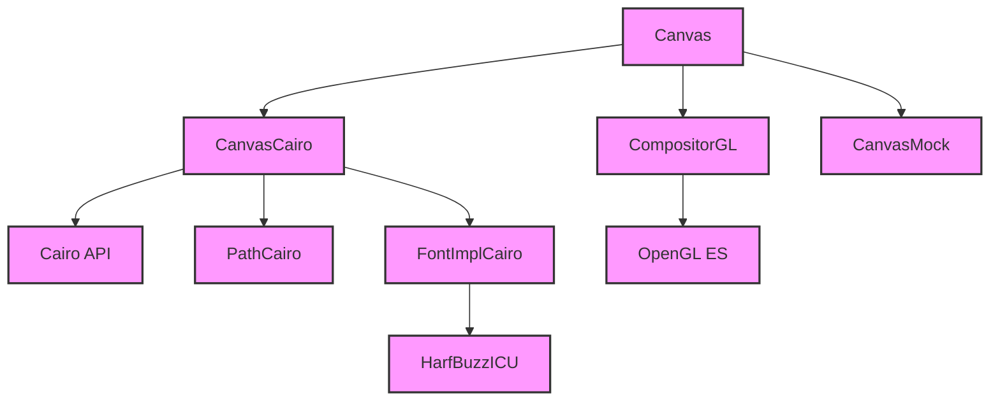

# Module Design Card — platform-canvas

> **Relevant source files**
> - [`CanvasCairo.cpp`](src:src/platform/canvas/CanvasCairo.cpp)
> - [`CanvasCairoUtils.h`](src:src/platform/canvas/CanvasCairoUtils.h)
> - [`CompositorGL.cpp`](src:src/platform/canvas/CompositorGL.cpp)
> - [`CompositorCairo.cpp`](src:src/platform/canvas/CompositorCairo.cpp)
> - [`PathCairo.h`](src:src/platform/canvas/PathCairo.h)
> - [`CanvasMock.cpp`](src:src/platform/canvas/CanvasMock.cpp)
> - [`font/FontImplCairo.h`](src:src/platform/canvas/font/FontImplCairo.h)
> - [`font/hb-icu/HarfBuzzICU.h`](src:src/platform/canvas/font/hb-icu/HarfBuzzICU.h)
> - [`gl/GL.h`](src:src/platform/canvas/gl/GL.h)
> - [`image/NativeImageDataImpl.cpp`](src:src/platform/canvas/image/NativeImageDataImpl.cpp)
> - (15 additional canvas files)

## Module Boundary

**Rationale:** Canvas rendering — Cairo and OpenGL backends, font shaping, image data [`module-groups.yaml`](src:code2spec/.analysis/state/delta/module-groups.yaml)
**Confidence:** 0.90

## Source Files

25 files in `src/platform/canvas/` including canvas backends (Cairo, GL, Mock), path rendering, font implementation, HarfBuzz/ICU shaping, GL wrappers, and image data implementations.

## Public Interface

| Component | Class | Source |
|---|---|---|
| Canvas (Cairo) | `CanvasCairo` | [`CanvasCairo.cpp`](src:src/platform/canvas/CanvasCairo.cpp#L23) |
| Compositor (GL) | `CompositorGL` | [`CompositorGL.cpp`](src:src/platform/canvas/CompositorGL.cpp) |
| Path (Cairo) | `PathCairo` | [`PathCairo.h`](src:src/platform/canvas/PathCairo.h) |
| Font (Cairo) | `FontImplCairo` | [`font/FontImplCairo.h`](src:src/platform/canvas/font/FontImplCairo.h) |

## Key Flow

## Architectural Rules

- Cairo backend requires `PORT_PIXEL_ORDER_BGRA` [`CanvasCairo.cpp`](src:src/platform/canvas/CanvasCairo.cpp#L25)
- Gated by `PORT_CANVAS_BACKEND_CAIRO` [`CanvasCairo.cpp`](src:src/platform/canvas/CanvasCairo.cpp#L23)
- GL compositor uses SkMatrix for transforms [`CanvasCairo.cpp`](src:src/platform/canvas/CanvasCairo.cpp#L49)
- Font shaping via HarfBuzz + ICU [`HarfBuzzICU.h`](src:src/platform/canvas/font/hb-icu/HarfBuzzICU.h)
- Image data implementations: Native, Compressed, AnimatedGIF, SVG [`image/`](src:src/platform/canvas/image/)

## Dependencies

| Dependency | Type |
|---|---|
| Cairo | External |
| OpenGL ES / EGL | External |
| HarfBuzz | External |
| ICU | External |
| Skia (SkMatrix) | External |
| core-engine (Canvas, Font, Path) | Internal |

## IPC / Message / Interface Contracts

- No cross-module IPC. Canvas rendering is in-process.

## Quick Navigation

- [FR Document](../functional-requirements/platform-canvas-fr.md)
- [Architecture](../02-architecture.md)
