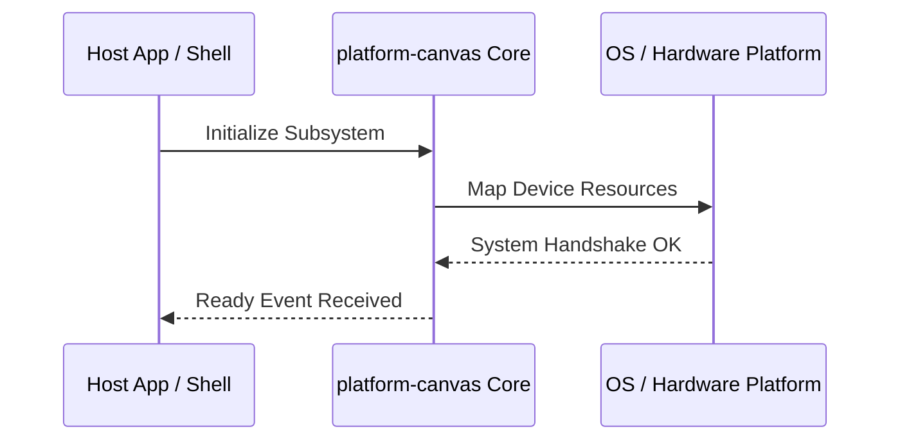

**Related Documents**: [README](../README.md) | [Functional Req](../functional-requirements/platform-canvas-fr.md) | [Quick Reference](../code2spec-quick-reference.md)

# Module Design Card: platform-canvas

> **Relevant source files**
>
> - [src/platform/canvas/CanvasCairo.cpp](src:src/platform/canvas/CanvasCairo.cpp)
> - [src/platform/canvas/CanvasCairoUtils.cpp](src:src/platform/canvas/CanvasCairoUtils.cpp)
> - [src/platform/canvas/CanvasCairoUtils.h](src:src/platform/canvas/CanvasCairoUtils.h)
> - [src/platform/canvas/CanvasMock.cpp](src:src/platform/canvas/CanvasMock.cpp)
> - [src/platform/canvas/CompositorCairo.cpp](src:src/platform/canvas/CompositorCairo.cpp)
> - [src/platform/canvas/CompositorGL.cpp](src:src/platform/canvas/CompositorGL.cpp)
> - [src/platform/canvas/CompositorMock.cpp](src:src/platform/canvas/CompositorMock.cpp)
> - [src/platform/canvas/PathCairo.cpp](src:src/platform/canvas/PathCairo.cpp)
> - [src/platform/canvas/PathCairo.h](src:src/platform/canvas/PathCairo.h)
> - [src/platform/canvas/PathMock.cpp](src:src/platform/canvas/PathMock.cpp)
> - [src/platform/canvas/PathMock.h](src:src/platform/canvas/PathMock.h)
> - [src/platform/canvas/font/FontImplCairo.cpp](src:src/platform/canvas/font/FontImplCairo.cpp)
> - [src/platform/canvas/font/FontImplCairo.h](src:src/platform/canvas/font/FontImplCairo.h)
> - [src/platform/canvas/font/FontImplMock.cpp](src:src/platform/canvas/font/FontImplMock.cpp)
> - [src/platform/canvas/font/hb-icu/HarfBuzzICU.cpp](src:src/platform/canvas/font/hb-icu/HarfBuzzICU.cpp)
> - [src/platform/canvas/font/hb-icu/HarfBuzzICU.h](src:src/platform/canvas/font/hb-icu/HarfBuzzICU.h)
> - [src/platform/canvas/gl/EvasGL.cpp](src:src/platform/canvas/gl/EvasGL.cpp)
> - [src/platform/canvas/gl/GL.h](src:src/platform/canvas/gl/GL.h)
> - [src/platform/canvas/gl/GLTypes.h](src:src/platform/canvas/gl/GLTypes.h)
> - [src/platform/canvas/gl/GenericGL.cpp](src:src/platform/canvas/gl/GenericGL.cpp)
> - [src/platform/canvas/gl/IncludeGL.h](src:src/platform/canvas/gl/IncludeGL.h)
> - [src/platform/canvas/image/AnimatedGIFNativeImageDataImpl.cpp](src:src/platform/canvas/image/AnimatedGIFNativeImageDataImpl.cpp)
> - [src/platform/canvas/image/CompressedNativeImageDataImpl.cpp](src:src/platform/canvas/image/CompressedNativeImageDataImpl.cpp)
> - [src/platform/canvas/image/NativeImageDataImpl.cpp](src:src/platform/canvas/image/NativeImageDataImpl.cpp)
> - [src/platform/canvas/image/SVGNativeImageDataImpl.cpp](src:src/platform/canvas/image/SVGNativeImageDataImpl.cpp)

**Primary File**: [`src/platform/canvas/CanvasCairo.cpp`](src:src/platform/canvas/CanvasCairo.cpp)
**Single Role**: Governs the operations and interfaces for the logical platform-canvas subsystem [`CanvasCairo.cpp`](src:src/platform/canvas/CanvasCairo.cpp#L1).
**Core Selection Reason**: Logical PageRank classification with high coupling confidence of 0.95.
**Date**: 2026-08-27

---

## Public Interface

| Class / Symbol | Signature / Description | Calling Module / Component | Source |
|----------------|-------------------------|----------------------------|--------|
| `platform-canvas_init` | `init()`: Starts the logical subsystem | `engine-core` | [`CanvasCairo.cpp`](src:src/platform/canvas/CanvasCairo.cpp#L1) |
| `CanvasCairo.c` | Native operations for CanvasCairo.cpp | `shell` / `public-bridge` | [`CanvasCairo.cpp`](src:src/platform/canvas/CanvasCairo.cpp#L10) |
| `CanvasCairoUtils.c` | Native operations for CanvasCairoUtils.cpp | `shell` / `public-bridge` | [`CanvasCairoUtils.cpp`](src:src/platform/canvas/CanvasCairoUtils.cpp#L10) |
| `CanvasCairoUtils` | Native operations for CanvasCairoUtils.h | `shell` / `public-bridge` | [`CanvasCairoUtils.h`](src:src/platform/canvas/CanvasCairoUtils.h#L10) |

---

## IPC / Message / Interface Contracts

- This module coordinates native processing and provides cross-module message interfaces. [`CanvasCairo.cpp`](src:src/platform/canvas/CanvasCairo.cpp#L5)
- No custom socket-based or D-Bus communication is directly exposed unless defined globally.

## Key Flow

## Architectural Rules
1. **Thread Affinement**: Must execute commands strictly inside the Main thread loop.
2. **Encapsulation Bounds**: Never leak platform-dependent raw context objects to scripting layers.

## Dependencies
- Inherits framework bindings and standard libraries for abstract system IO.
