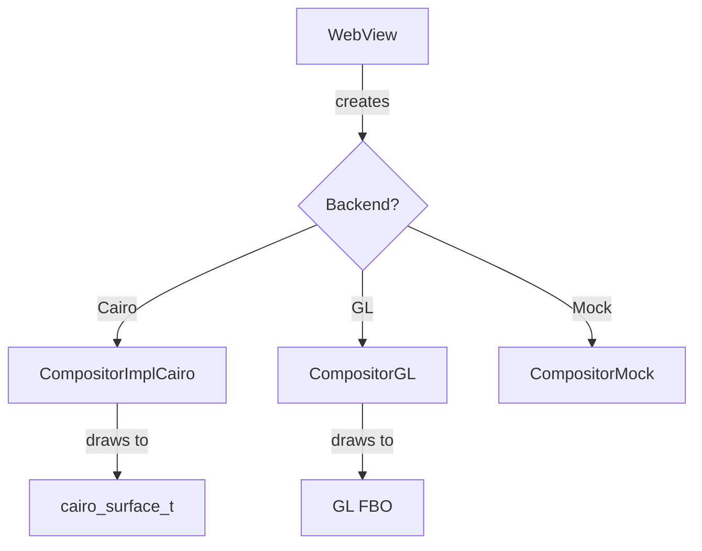

# Module Design Card: platform-canvas

> **Relevant source files**
> - [`CompositorCairo.cpp`](src/platform/canvas/CompositorCairo.cpp#L42)
> - [`CompositorGL.cpp`](src/platform/canvas/CompositorGL.cpp#L1)
> - [`CanvasCairo.cpp`](src/platform/canvas/CanvasCairo.cpp#L1)
> - [`PathCairo.h`](src/platform/canvas/PathCairo.h#L1)
> - [`FontImplCairo.h`](src/platform/canvas/font/FontImplCairo.h#L1)
> - [`CompositorMock.cpp`](src/platform/canvas/CompositorMock.cpp#L1)

## Module Boundary
Canvas rendering, compositing (Cairo/GL), path drawing, font rendering (HarfBuzz/ICU), image decoding.

**Confidence**: 0.93

## Source Files
25 files in `src/platform/canvas/` including `font/` subdirectory

## Public Interface
- `CompositorImplCairo` — Cairo-based compositor using `cairo_image_surface_create_for_data`. [`CompositorCairo.cpp:42`](src/platform/canvas/CompositorCairo.cpp#L42)
- `CompositorGL` — OpenGL-based compositor with Clipper2 path clipping. [`CompositorGL.cpp`](src/platform/canvas/CompositorGL.cpp#L1)
- `CompositorMock` — Mock compositor for testing. [`CompositorMock.cpp`](src/platform/canvas/CompositorMock.cpp#L1)
- `CanvasCairo` — Cairo canvas 2D context implementation.
- `PathCairo` — Cairo path operations. [`PathCairo.h`](src/platform/canvas/PathCairo.h#L1)
- `FontImplCairo` — Font rendering via Cairo/Freetype/HarfBuzz. [`FontImplCairo.h`](src/platform/canvas/font/FontImplCairo.h#L1)

## Key Flow

## Architectural Rules
- CAIRO_FORMAT = CAIRO_FORMAT_ARGB32. [`CompositorCairo.cpp:38`](src/platform/canvas/CompositorCairo.cpp#L38)
- Three backend strategy: Cairo (software), GL (hardware), Mock (testing)
- CompositorGL uses Clipper2Lib::PointD for path clipping. [`CompositorGL.cpp:54`](src/platform/canvas/CompositorGL.cpp#L54)
- GL compositor commands: MoveTo, LineTo, ArcNegative. [`CompositorGL.cpp:477`](src/platform/canvas/CompositorGL.cpp#L477)

## Dependencies
- Depends on: engine-core (Starfish, WebView)
- External: Cairo, OpenGL/EGL, Clipper2, HarfBuzz, Freetype, ICU, libjpeg, libpng, libwebp, libgif

## IPC / Message / Interface Contracts
- GL compositor calls OpenGL socket-like API (bindTexture, bindBuffer, bindFramebuffer). [`CompositorGL.cpp`](src/platform/canvas/CompositorGL.cpp#L1)
- These are GPU API calls, not cross-process IPC.

## Quick Navigation
- [FR Document](../functional-requirements/platform-canvas-fr.md)
- [Architecture](../02-architecture.md)
