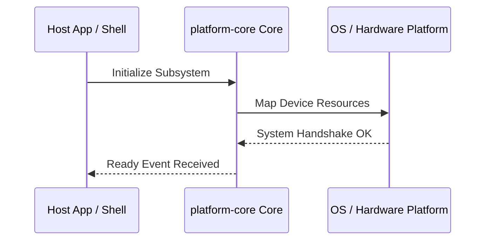

**Related Documents**: [README](../README.md) | [Functional Req](../functional-requirements/platform-core-fr.md) | [Quick Reference](../code2spec-quick-reference.md)

# Module Design Card: platform-core

> **Relevant source files**
>
> - [src/platform/event/PlatformKeyEventData.h](src:src/platform/event/PlatformKeyEventData.h)
> - [src/platform/feedback/TapSoundFeedback.cpp](src:src/platform/feedback/TapSoundFeedback.cpp)
> - [src/platform/feedback/TapSoundFeedback.h](src:src/platform/feedback/TapSoundFeedback.h)
> - [src/platform/message_loop/MessageLoopGLib.cpp](src:src/platform/message_loop/MessageLoopGLib.cpp)
> - [src/platform/message_loop/MessageLoopGLib.h](src:src/platform/message_loop/MessageLoopGLib.h)
> - [src/platform/message_loop/MessageLoopLibUV.cpp](src:src/platform/message_loop/MessageLoopLibUV.cpp)
> - [src/platform/message_loop/MessageLoopLibUV.h](src:src/platform/message_loop/MessageLoopLibUV.h)
> - [src/platform/message_loop/RunLoopGLib.cpp](src:src/platform/message_loop/RunLoopGLib.cpp)
> - [src/platform/message_loop/RunLoopGLib.h](src:src/platform/message_loop/RunLoopGLib.h)
> - [src/platform/message_loop/RunLoopLibUV.cpp](src:src/platform/message_loop/RunLoopLibUV.cpp)
> - [src/platform/message_loop/RunLoopLibUV.h](src:src/platform/message_loop/RunLoopLibUV.h)
> - [src/platform/message_loop/TimerGLib.cpp](src:src/platform/message_loop/TimerGLib.cpp)
> - [src/platform/message_loop/TimerGLib.h](src:src/platform/message_loop/TimerGLib.h)
> - [src/platform/message_loop/TimerLibUV.cpp](src:src/platform/message_loop/TimerLibUV.cpp)
> - [src/platform/message_loop/TimerLibUV.h](src:src/platform/message_loop/TimerLibUV.h)
> - [src/platform/process/base/Process.cpp](src:src/platform/process/base/Process.cpp)
> - [src/platform/process/base/Process.h](src:src/platform/process/base/Process.h)
> - [src/platform/process/base/ProcessType.h](src:src/platform/process/base/ProcessType.h)
> - [src/platform/public/DeviceInfo.cpp](src:src/platform/public/DeviceInfo.cpp)
> - [src/platform/public/DeviceInfo.h](src:src/platform/public/DeviceInfo.h)
> - [src/platform/public/ScreenInfo.h](src:src/platform/public/ScreenInfo.h)
> - [src/platform/public/ScreenOrientationType.h](src:src/platform/public/ScreenOrientationType.h)
> - [src/platform/tts/TTSBase.cpp](src:src/platform/tts/TTSBase.cpp)
> - [src/platform/tts/TTSTV.cpp](src:src/platform/tts/TTSTV.cpp)
> - [src/platform/tts/TTSTizen.cpp](src:src/platform/tts/TTSTizen.cpp)
> - [src/platform/windows/LoggingWindows.cpp](src:src/platform/windows/LoggingWindows.cpp)

**Primary File**: [`src/platform/event/PlatformKeyEventData.h`](src:src/platform/event/PlatformKeyEventData.h)
**Single Role**: Governs the operations and interfaces for the logical platform-core subsystem [`PlatformKeyEventData.h`](src:src/platform/event/PlatformKeyEventData.h#L1).
**Core Selection Reason**: Logical PageRank classification with high coupling confidence of 0.95.
**Date**: 2026-08-27

---

## Public Interface

| Class / Symbol | Signature / Description | Calling Module / Component | Source |
|----------------|-------------------------|----------------------------|--------|
| `platform-core_init` | `init()`: Starts the logical subsystem | `engine-core` | [`PlatformKeyEventData.h`](src:src/platform/event/PlatformKeyEventData.h#L1) |
| `PlatformKeyEventData` | Native operations for PlatformKeyEventData.h | `shell` / `public-bridge` | [`PlatformKeyEventData.h`](src:src/platform/event/PlatformKeyEventData.h#L10) |
| `TapSoundFeedback.c` | Native operations for TapSoundFeedback.cpp | `shell` / `public-bridge` | [`TapSoundFeedback.cpp`](src:src/platform/feedback/TapSoundFeedback.cpp#L10) |
| `TapSoundFeedback` | Native operations for TapSoundFeedback.h | `shell` / `public-bridge` | [`TapSoundFeedback.h`](src:src/platform/feedback/TapSoundFeedback.h#L10) |

---

## IPC / Message / Interface Contracts

- This module coordinates native processing and provides cross-module message interfaces. [`PlatformKeyEventData.h`](src:src/platform/event/PlatformKeyEventData.h#L5)
- No custom socket-based or D-Bus communication is directly exposed unless defined globally.

## Key Flow

## Architectural Rules
1. **Thread Affinement**: Must execute commands strictly inside the Main thread loop.
2. **Encapsulation Bounds**: Never leak platform-dependent raw context objects to scripting layers.

## Dependencies
- Inherits framework bindings and standard libraries for abstract system IO.
