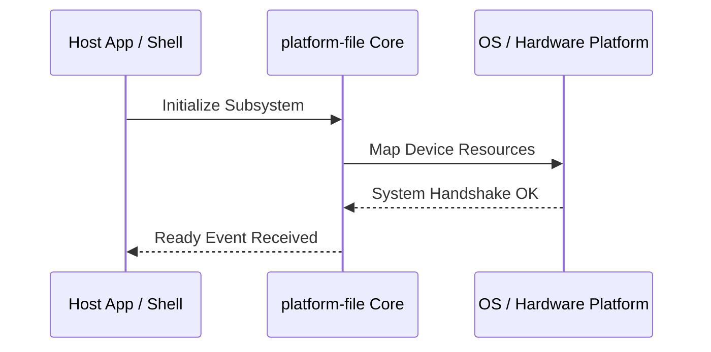

**Related Documents**: [README](../README.md) | [Functional Req](../functional-requirements/platform-file-fr.md) | [Quick Reference](../code2spec-quick-reference.md)

# Module Design Card: platform-file

> **Relevant source files**
>
> - [src/platform/file/PlatformDirectory.cpp](src:src/platform/file/PlatformDirectory.cpp)
> - [src/platform/file/PlatformDirectory.h](src:src/platform/file/PlatformDirectory.h)
> - [src/platform/file/PlatformFile.cpp](src:src/platform/file/PlatformFile.cpp)
> - [src/platform/file/PlatformFile.h](src:src/platform/file/PlatformFile.h)

**Primary File**: [`src/platform/file/PlatformDirectory.cpp`](src:src/platform/file/PlatformDirectory.cpp)
**Single Role**: Governs the operations and interfaces for the logical platform-file subsystem [`PlatformDirectory.cpp`](src:src/platform/file/PlatformDirectory.cpp#L1).
**Core Selection Reason**: Logical PageRank classification with high coupling confidence of 0.95.
**Date**: 2026-08-27

---

## Public Interface

| Class / Symbol | Signature / Description | Calling Module / Component | Source |
|----------------|-------------------------|----------------------------|--------|
| `platform-file_init` | `init()`: Starts the logical subsystem | `engine-core` | [`PlatformDirectory.cpp`](src:src/platform/file/PlatformDirectory.cpp#L1) |
| `PlatformDirectory.c` | Native operations for PlatformDirectory.cpp | `shell` / `public-bridge` | [`PlatformDirectory.cpp`](src:src/platform/file/PlatformDirectory.cpp#L10) |
| `PlatformDirectory` | Native operations for PlatformDirectory.h | `shell` / `public-bridge` | [`PlatformDirectory.h`](src:src/platform/file/PlatformDirectory.h#L10) |
| `PlatformFile.c` | Native operations for PlatformFile.cpp | `shell` / `public-bridge` | [`PlatformFile.cpp`](src:src/platform/file/PlatformFile.cpp#L10) |

---

## IPC / Message / Interface Contracts

- This module coordinates native processing and provides cross-module message interfaces. [`PlatformDirectory.cpp`](src:src/platform/file/PlatformDirectory.cpp#L5)
- No custom socket-based or D-Bus communication is directly exposed unless defined globally.

## Key Flow

## Architectural Rules
1. **Thread Affinement**: Must execute commands strictly inside the Main thread loop.
2. **Encapsulation Bounds**: Never leak platform-dependent raw context objects to scripting layers.

## Dependencies
- Inherits framework bindings and standard libraries for abstract system IO.
