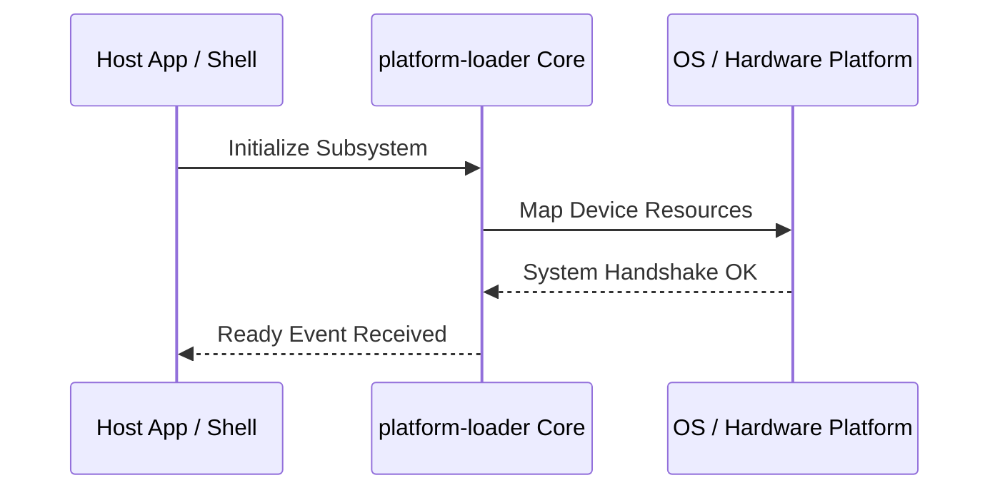

**Related Documents**: [README](../README.md) | [Functional Req](../functional-requirements/platform-loader-fr.md) | [Quick Reference](../code2spec-quick-reference.md)

# Module Design Card: platform-loader

> **Relevant source files**
>
> - [src/platform/loader/ElementResourceClient.cpp](src:src/platform/loader/ElementResourceClient.cpp)
> - [src/platform/loader/ElementResourceClient.h](src:src/platform/loader/ElementResourceClient.h)
> - [src/platform/loader/FontResource.cpp](src:src/platform/loader/FontResource.cpp)
> - [src/platform/loader/FontResource.h](src:src/platform/loader/FontResource.h)
> - [src/platform/loader/HeaderResource.cpp](src:src/platform/loader/HeaderResource.cpp)
> - [src/platform/loader/HeaderResource.h](src:src/platform/loader/HeaderResource.h)
> - [src/platform/loader/ImageResource.cpp](src:src/platform/loader/ImageResource.cpp)
> - [src/platform/loader/ImageResource.h](src:src/platform/loader/ImageResource.h)
> - [src/platform/loader/Resource.cpp](src:src/platform/loader/Resource.cpp)
> - [src/platform/loader/Resource.h](src:src/platform/loader/Resource.h)
> - [src/platform/loader/ResourceClient.h](src:src/platform/loader/ResourceClient.h)
> - [src/platform/loader/ResourceLoader.cpp](src:src/platform/loader/ResourceLoader.cpp)
> - [src/platform/loader/ResourceLoader.h](src:src/platform/loader/ResourceLoader.h)
> - [src/platform/loader/ResourceURL.cpp](src:src/platform/loader/ResourceURL.cpp)
> - [src/platform/loader/ResourceURL.h](src:src/platform/loader/ResourceURL.h)
> - [src/platform/loader/TextResource.cpp](src:src/platform/loader/TextResource.cpp)
> - [src/platform/loader/TextResource.h](src:src/platform/loader/TextResource.h)

**Primary File**: [`src/platform/loader/ElementResourceClient.cpp`](src:src/platform/loader/ElementResourceClient.cpp)
**Single Role**: Governs the operations and interfaces for the logical platform-loader subsystem [`ElementResourceClient.cpp`](src:src/platform/loader/ElementResourceClient.cpp#L1).
**Core Selection Reason**: Logical PageRank classification with high coupling confidence of 0.95.
**Date**: 2026-08-27

---

## Public Interface

| Class / Symbol | Signature / Description | Calling Module / Component | Source |
|----------------|-------------------------|----------------------------|--------|
| `platform-loader_init` | `init()`: Starts the logical subsystem | `engine-core` | [`ElementResourceClient.cpp`](src:src/platform/loader/ElementResourceClient.cpp#L1) |
| `ElementResourceClient.c` | Native operations for ElementResourceClient.cpp | `shell` / `public-bridge` | [`ElementResourceClient.cpp`](src:src/platform/loader/ElementResourceClient.cpp#L10) |
| `ElementResourceClient` | Native operations for ElementResourceClient.h | `shell` / `public-bridge` | [`ElementResourceClient.h`](src:src/platform/loader/ElementResourceClient.h#L10) |
| `FontResource.c` | Native operations for FontResource.cpp | `shell` / `public-bridge` | [`FontResource.cpp`](src:src/platform/loader/FontResource.cpp#L10) |

---

## IPC / Message / Interface Contracts

- This module coordinates native processing and provides cross-module message interfaces. [`ElementResourceClient.cpp`](src:src/platform/loader/ElementResourceClient.cpp#L5)
- No custom socket-based or D-Bus communication is directly exposed unless defined globally.

## Key Flow

## Architectural Rules
1. **Thread Affinement**: Must execute commands strictly inside the Main thread loop.
2. **Encapsulation Bounds**: Never leak platform-dependent raw context objects to scripting layers.

## Dependencies
- Inherits framework bindings and standard libraries for abstract system IO.
