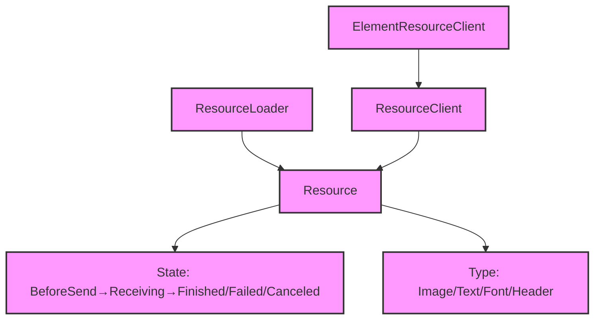

# Module Design Card — platform-loader

> **Relevant source files**
> - [`Resource.h`](src:src/platform/loader/Resource.h)
> - [`ResourceClient.h`](src:src/platform/loader/ResourceClient.h)
> - [`ElementResourceClient.cpp`](src:src/platform/loader/ElementResourceClient.cpp)
> - [`FontResource.cpp`](src:src/platform/loader/FontResource.cpp)
> - [`ImageResource.cpp`](src:src/platform/loader/ImageResource.cpp)
> - [`TextResource.cpp`](src:src/platform/loader/TextResource.cpp)
> - [`HeaderResource.cpp`](src:src/platform/loader/HeaderResource.cpp)
> - [`ResourceLoader.h`](src:src/platform/loader/ResourceLoader.h)
> - (9 additional loader files)

## Module Boundary

**Rationale:** Resource loading — font, image, text, header resources [`module-groups.yaml`](src:code2spec/.analysis/state/delta/module-groups.yaml)
**Confidence:** 0.88

## Source Files

17 files in `src/platform/loader/` including resource types, resource clients, and the resource loader.

## Public Interface

| Component | Class | Source |
|---|---|---|
| Resource | `Resource` | [`Resource.h`](src:src/platform/loader/Resource.h#L36) |
| Resource Loader | `ResourceLoader` | [`ResourceLoader.h`](src:src/platform/loader/ResourceLoader.h) |
| Resource Client | `ResourceClient` | [`ResourceClient.h`](src:src/platform/loader/ResourceClient.h) |

## Key Flow

## Architectural Rules

- `Resource` is GC-managed (inherits `gc`) [`Resource.h`](src:src/platform/loader/Resource.h#L36)
- Resource states: BeforeSend, Receiving, Finished, Failed, Canceled [`Resource.h`](src:src/platform/loader/Resource.h#L42)
- Resource types: ResourceType, ImageResourceType, TextResourceType, FontResourceType [`Resource.h`](src:src/platform/loader/Resource.h#L50)
- `Resource` is friend of `ResourceLoader`, `ResourceWatcher`, `ResourceLoaderTracer` [`Resource.h`](src:src/platform/loader/Resource.h#L37)

## Dependencies

| Dependency | Type |
|---|---|
| platform-network (HTTP) | Internal |
| core-engine (URL, ResourceRequest) | Internal |
| HTTPHeaderMap | Internal |

## IPC / Message / Interface Contracts

- No cross-module IPC. Resource loading is in-process via `ResourceLoader`.

## Quick Navigation

- [FR Document](../functional-requirements/platform-loader-fr.md)
- [Architecture](../02-architecture.md)
