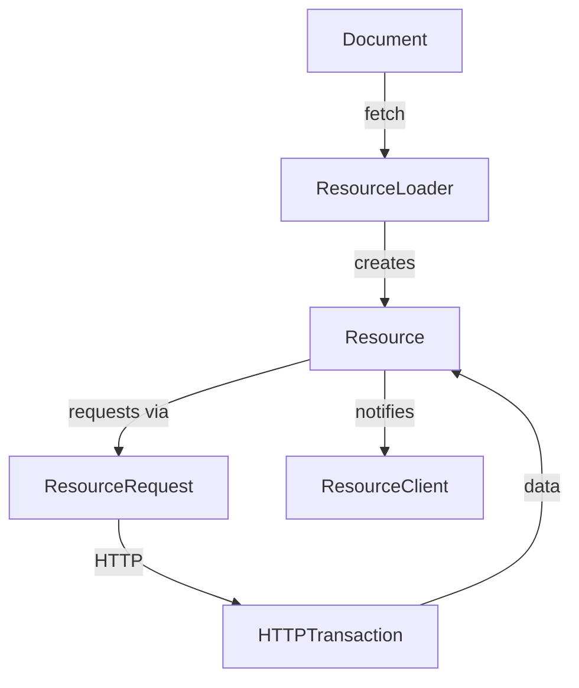

# Module Design Card: platform-loader

> **Relevant source files**
> - [`Resource.h`](src/platform/loader/Resource.h#L36)
> - [`ResourceLoader.h`](src/platform/loader/ResourceLoader.h#L40)
> - [`ResourceURL.h`](src/platform/loader/ResourceURL.h#L31)
> - [`ResourceClient.h`](src/platform/loader/ResourceClient.h#L1)
> - [`TextResource.h`](src/platform/loader/TextResource.h#L1)
> - [`ImageResource.h`](src/platform/loader/ImageResource.h#L1)
> - [`FontResource.h`](src/platform/loader/FontResource.h#L1)

## Module Boundary
Resource loading: URL resolution, resource types, resource clients and loader.

**Confidence**: 0.95

## Source Files
17 files in `src/platform/loader/`

## Public Interface
- `Resource` — Base class with State enum (BeforeSend, Receiving, Finished, Failed, Canceled) and Type enum. [`Resource.h:36`](src/platform/loader/Resource.h#L36)
- `ResourceLoader` — Main loader with fetch/fetchText/fetchImage/fetchFont/fetchHeader. [`ResourceLoader.h:40`](src/platform/loader/ResourceLoader.h#L40)
- `ResourceURL` — URL with Protocol enum (FILE, BLOB, DATA, ABOUT, HTTP, HTTPS, JAVASCRIPT, WS, WSS, UNKNOWN). [`ResourceURL.h:35`](src/platform/loader/ResourceURL.h#L35)
- `TextResource`, `ImageResource`, `FontResource`, `HeaderResource` — Typed resource subclasses.
- `ResourceClient` — Callback interface for resource state changes. [`ResourceClient.h`](src/platform/loader/ResourceClient.h#L1)
- `ResourceNetworkRequestClient` — Bridges ResourceRequest to Resource. [`Resource.h:265`](src/platform/loader/Resource.h#L265)

## Key Flow

## Architectural Rules
- Resource states: BeforeSend → Receiving → Finished/Failed/Canceled. [`Resource.h:42`](src/platform/loader/Resource.h#L42)
- Resource cache: font cache + image cache with LRU list. [`ResourceLoader.h:120`](src/platform/loader/ResourceLoader.h#L120)
- STARFISH_RESOURCE_CACHE_SIZE = 4MB. [`ResourceLoader.cpp:45`](src/platform/loader/ResourceLoader.cpp#L45)
- MAX_PORT_NUMBER = 65535, MAX_PORT_DIGITS = 5. [`ResourceURL.cpp:25`](src/platform/loader/ResourceURL.cpp#L25)
- LoadProgressState: Normal, ParsingEnd, DomContentLoaded. [`ResourceLoader.h:48`](src/platform/loader/ResourceLoader.h#L48)

## Dependencies
- Depends on: engine-core, platform-network (for HTTP resources)
- Used by: DOM (Document creates ResourceLoader)

## IPC / Message / Interface Contracts
- This module does not have cross-module IPC. Resource loading is in-process.

## Quick Navigation
- [FR Document](../functional-requirements/platform-loader-fr.md)
- [Architecture](../02-architecture.md)
