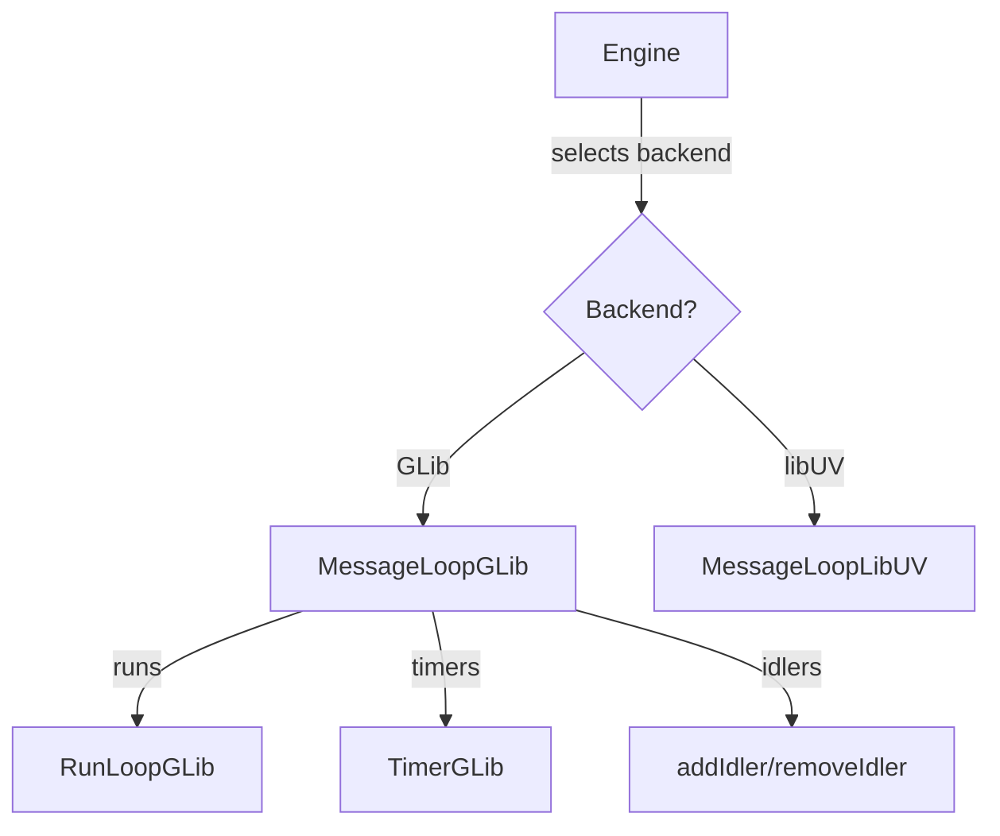

# Module Design Card: platform-message-loop

> **Relevant source files**
> - [`MessageLoopGLib.h`](src/platform/message_loop/MessageLoopGLib.h#L30)
> - [`RunLoopGLib.h`](src/platform/message_loop/RunLoopGLib.h#L1)
> - [`TimerGLib.h`](src/platform/message_loop/TimerGLib.h#L1)
> - [`MessageLoopLibUV.h`](src/platform/message_loop/MessageLoopLibUV.h#L1)

## Module Boundary
Event loop and timer abstraction with GLib and libUV backends.

**Confidence**: 0.95

## Source Files
12 files in `src/platform/message_loop/` (GLib and libUV variants)

## Public Interface
- `MessageLoopGLib` — GLib-backed event loop with init, run, stop, idler management. [`MessageLoopGLib.h:30`](src/platform/message_loop/MessageLoopGLib.h#L30)
- `RunLoopGLib` — GLib run loop wrapper. [`RunLoopGLib.h`](src/platform/message_loop/RunLoopGLib.h#L1)
- `TimerGLib` — GLib-backed timer. [`TimerGLib.h`](src/platform/message_loop/TimerGLib.h#L1)
- `MessageLoopLibUV` — libUV-backed event loop (alternative backend).
- `RunLoopLibUV`, `TimerLibUV` — libUV counterparts.

## Key Flow

## Architectural Rules
- Two backends: GLib (PORT_EVENTLOOP_BACKEND_GLIB) and libUV. [`MessageLoopGLib.h:20`](src/platform/message_loop/MessageLoopGLib.h#L20)
- MessageLoopGLib provides: init(), run(), stop(), runOnMainThreadSync(), runOnMainThreadAsync(). [`MessageLoopGLib.h:34`](src/platform/message_loop/MessageLoopGLib.h#L34)
- Idler management: addIdler (1/2/3 data args), removeIdler, clearPendingIdlers. [`MessageLoopGLib.h:42`](src/platform/message_loop/MessageLoopGLib.h#L42)
- RendezvousOwner enum: None, MainBlockedOnLWE, LWEPausingMain. [`MessageLoopGLib.cpp:99`](src/platform/message_loop/MessageLoopGLib.cpp#L99)

## Dependencies
- Depends on: engine-core
- External: GLib (glib-2.0), libtuv (libUV port)

## IPC / Message / Interface Contracts
- runWithProcessMainThreadPausedSync enables main thread rendezvous between LWE and host process. [`MessageLoopGLib.h:38`](src/platform/message_loop/MessageLoopGLib.h#L38)

## Quick Navigation
- [FR Document](../functional-requirements/platform-message-loop-fr.md)
- [Architecture](../02-architecture.md)
