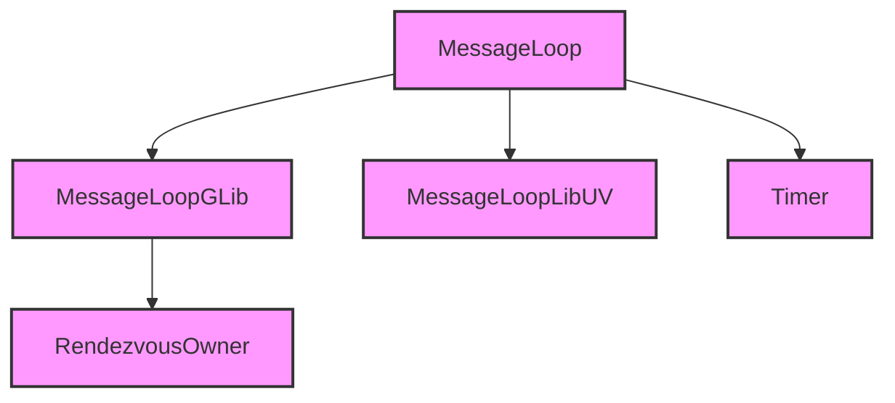

# Module Design Card — platform-message-loop

> **Relevant source files**
> - [`MessageLoopGLib.cpp`](src:src/platform/message_loop/MessageLoopGLib.cpp)
> - [`MessageLoopLibUV.cpp`](src:src/platform/message_loop/MessageLoopLibUV.cpp)
> - [`Timer.h`](src:src/core/modules/message_loop/Timer.h)
> - (9 additional message loop files)

## Module Boundary

**Rationale:** Event loop abstraction — GLib and libUV backends [`module-groups.yaml`](src:code2spec/.analysis/state/delta/module-groups.yaml)
**Confidence:** 0.86

## Source Files

12 files in `src/platform/message_loop/` providing GLib and libUV event loop backends, timers, and rendezvous management.

## Public Interface

| Component | Source |
|---|---|
| MessageLoopGLib | [`MessageLoopGLib.cpp`](src:src/platform/message_loop/MessageLoopGLib.cpp) |
| MessageLoopLibUV | [`MessageLoopLibUV.cpp`](src:src/platform/message_loop/MessageLoopLibUV.cpp) |
| Timer | [`Timer.h`](src:src/core/modules/message_loop/Timer.h) |

## Key Flow

## Architectural Rules

- RendezvousOwner states: None, MainBlockedOnLWE, LWEPausingMain [`MessageLoopGLib.cpp`](src:src/platform/message_loop/MessageLoopGLib.cpp#L99)
- Two backends: GLib (default) and libUV (optional)

## Dependencies

| Dependency | Type |
|---|---|
| GLib | External |
| libUV / libtuv | External (optional) |
| core-engine | Internal |

## IPC / Message / Interface Contracts

- Rendezvous mechanism coordinates main thread and LWE thread. [`MessageLoopGLib.cpp`](src:src/platform/message_loop/MessageLoopGLib.cpp#L99)

## Quick Navigation

- [FR Document](../functional-requirements/platform-message-loop-fr.md)
