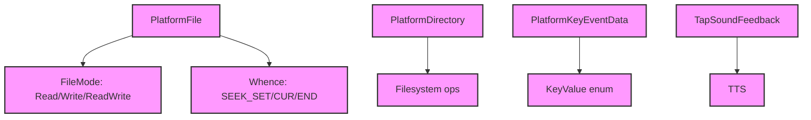

# Module Design Card — platform-misc

> **Relevant source files**
> - [`file/PlatformFile.h`](src:src/platform/file/PlatformFile.h)
> - [`file/PlatformDirectory.h`](src:src/platform/file/PlatformDirectory.h)
> - [`event/PlatformKeyEventData.h`](src:src/platform/event/PlatformKeyEventData.h)
> - [`feedback/TapSoundFeedback.h`](src:src/platform/feedback/TapSoundFeedback.h)
> - [`public/ScreenOrientationType.h`](src:src/platform/public/ScreenOrientationType.h)
> - (10 additional misc files)

## Module Boundary

**Rationale:** Misc platform services — file I/O, device info, screen info, TTS, key events, tap feedback [`module-groups.yaml`](src:code2spec/.analysis/state/delta/module-groups.yaml)
**Confidence:** 0.85

## Source Files

15 files in `src/platform/` covering file operations, directory operations, key event data, tap sound feedback, screen orientation, and other platform utilities.

## Public Interface

| Component | Class | Source |
|---|---|---|
| Platform File | `PlatformFile` | [`PlatformFile.h`](src:src/platform/file/PlatformFile.h#L33) |
| Platform Directory | `PlatformDirectory` | [`file/PlatformDirectory.h`](src:src/platform/file/PlatformDirectory.h) |
| Key Event Data | `PlatformKeyEventData` | [`event/PlatformKeyEventData.h`](src:src/platform/event/PlatformKeyEventData.h) |
| Tap Sound Feedback | `TapSoundFeedback` | [`feedback/TapSoundFeedback.h`](src:src/platform/feedback/TapSoundFeedback.h) |

## Key Flow

## Architectural Rules

- `PlatformFile` supports FileMode: Read (1), Write (2), ReadWrite (3) [`PlatformFile.h`](src:src/platform/file/PlatformFile.h#L35)
- `PlatformFile` supports Whence: SEEK_SET, SEEK_CUR, SEEK_END [`PlatformFile.h`](src:src/platform/file/PlatformFile.h#L41)
- `PlatformFileUtil` provides static utilities: removeFile, absolutePath, joinPath [`PlatformFile.h`](src:src/platform/file/PlatformFile.h#L25)
- Screen orientations: Undefined, PortraitPrimary, PortraitSecondary, LandscapePrimary, LandscapeSecondary [`ScreenOrientationType.h`](src:src/platform/public/ScreenOrientationType.h#L24)

## Dependencies

| Dependency | Type |
|---|---|
| core-engine (String) | Internal |
| TTS (optional) | External |

## IPC / Message / Interface Contracts

- No cross-module IPC. Platform misc services are in-process.

## Quick Navigation

- [FR Document](../functional-requirements/platform-misc-fr.md)
- [Architecture](../02-architecture.md)
