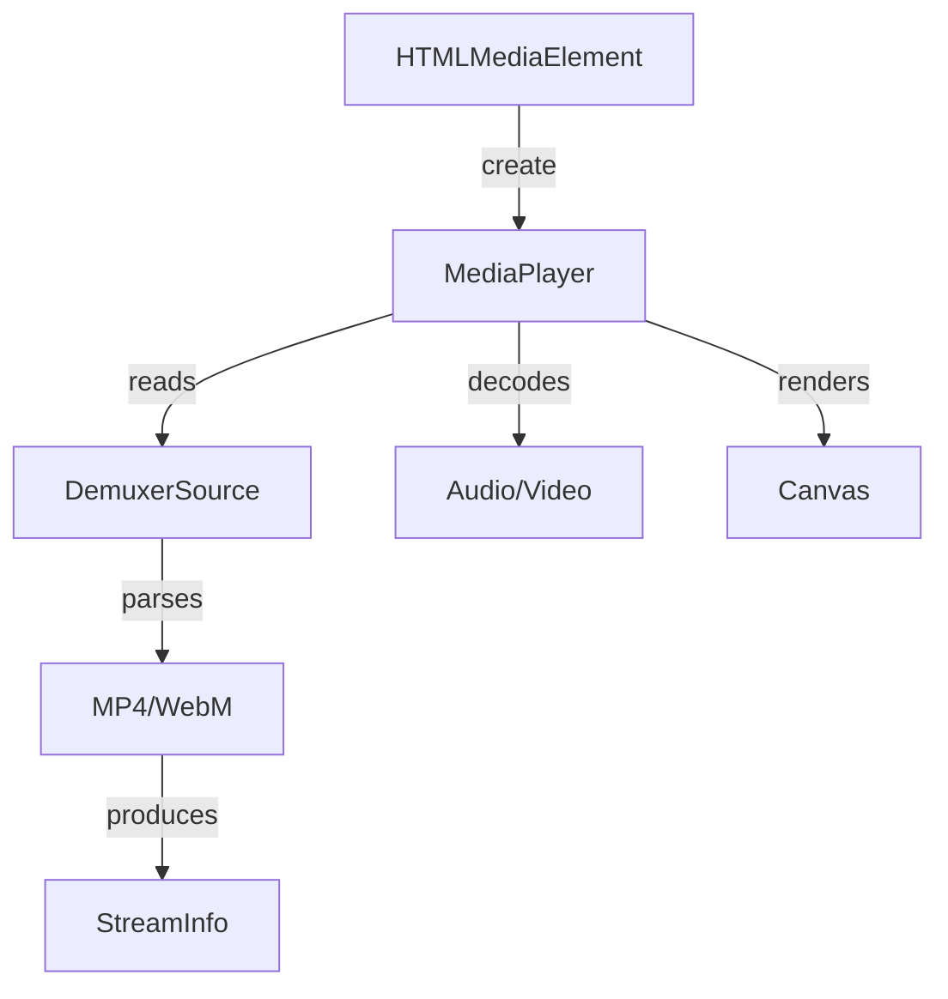

# Module Design Card: platform-multimedia

> **Relevant source files**
> - [`MediaPlayer.h`](src/platform/multimedia/MediaPlayer.h#L62)
> - [`StreamInfo.h`](src/platform/multimedia/StreamInfo.h#L52)
> - [`DemuxerSource.h`](src/platform/multimedia/DemuxerSource.h#L26)
> - [`MediaPlayerLinux.cpp`](src/platform/multimedia/MediaPlayerLinux.cpp#L1)

## Module Boundary
Multimedia playback: media player (Linux/Tizen/TV/WebRTC), demuxers (MP4/WebM), audio output.

**Confidence**: 0.95

## Source Files
33 files in `src/platform/multimedia/`

## Public Interface
- `MediaPlayer` — Abstract media player with PlaybackState and SeekState enums. [`MediaPlayer.h:62`](src/platform/multimedia/MediaPlayer.h#L62)
- `StreamInfo` — Stream metadata (codec, type, duration, framerate). [`StreamInfo.h:91`](src/platform/multimedia/StreamInfo.h#L91)
- `MediaCodec` enum — Unknown, AAC, MP3, Vorbis, Opus, H264, HEVC, VP9, AV1. [`StreamInfo.h:59`](src/platform/multimedia/StreamInfo.h#L59)
- `StreamType` enum — Unknown, Audio, Video, Subtitle. [`StreamInfo.h:52`](src/platform/multimedia/StreamInfo.h#L52)
- `AudioSampleFormat` enum — U8, S16, S32, FLT, DBL, U8P, S16P, S32P, FLTP, DBLP. [`StreamInfo.h:73`](src/platform/multimedia/StreamInfo.h#L73)
- `DemuxerSource` — Demuxer interface with SeekWhence enum. [`DemuxerSource.h:26`](src/platform/multimedia/DemuxerSource.h#L26)

## Key Flow

## Architectural Rules
- PlaybackState: NONE, PLAYING, PAUSED, END. [`MediaPlayer.h:67`](src/platform/multimedia/MediaPlayer.h#L67)
- SeekState: NO_SEEK, SEEKING, WAITING. [`MediaPlayer.h:73`](src/platform/multimedia/MediaPlayer.h#L73)
- STARFISH_VIDEO_MAX_WIDTH=1920, STARFISH_VIDEO_MAX_HEIGHT=1080. [`MediaPlayerLinux.cpp:134`](src/platform/multimedia/MediaPlayerLinux.cpp#L134)
- MediaPlayer::create() factory creates platform-specific player. [`MediaPlayer.h:82`](src/platform/multimedia/MediaPlayer.h#L82)
- Backends: MediaPlayerLinux, MediaPlayerTizen, MediaPlayerTV, MediaPlayerWebRtc, MediaPlayerESPlusPlayer

## Dependencies
- Depends on: engine-core, platform-canvas (for video rendering)
- External: ffmpeg (optional), GStreamer (optional), Tizen media framework

## IPC / Message / Interface Contracts
- This module does not have cross-module IPC. Media playback is in-process.

## Quick Navigation
- [FR Document](../functional-requirements/platform-multimedia-fr.md)
- [Architecture](../02-architecture.md)
