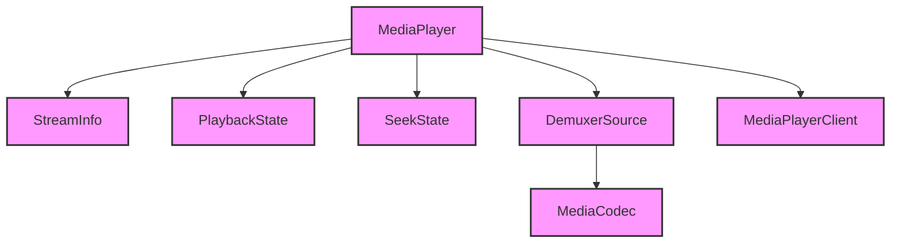

# Module Design Card — platform-multimedia

> **Relevant source files**
> - [`MediaPlayer.h`](src:src/platform/multimedia/MediaPlayer.h)
> - [`MediaPlayerESPlusPlayer.cpp`](src:src/platform/multimedia/MediaPlayerESPlusPlayer.cpp)
> - [`StreamInfo.h`](src:src/platform/multimedia/StreamInfo.h)
> - [`DemuxerSource.h`](src:src/platform/multimedia/DemuxerSource.h)
> - [`MediaPlayerWebRtc.h`](src:src/platform/multimedia/MediaPlayerWebRtc.h)
> - (26 additional multimedia files)

## Module Boundary

**Rationale:** Media playback — player implementations for Linux, Tizen, TV, WebRTC [`module-groups.yaml`](src:code2spec/.analysis/state/delta/module-groups.yaml)
**Confidence:** 0.88

## Source Files

32 files in `src/platform/multimedia/` including media player backends, stream info, demuxer, and WebRTC support.

## Public Interface

| Component | Class | Source |
|---|---|---|
| Media Player | `MediaPlayer` | [`MediaPlayer.h`](src:src/platform/multimedia/MediaPlayer.h#L60) |
| Stream Info | `StreamInfo` | [`StreamInfo.h`](src:src/platform/multimedia/StreamInfo.h) |
| Demuxer | `DemuxerSource` | [`DemuxerSource.h`](src:src/platform/multimedia/DemuxerSource.h) |

## Key Flow

## Architectural Rules

- Gated by `STARFISH_ENABLE_MULTIMEDIA` [`MediaPlayer.h`](src:src/platform/multimedia/MediaPlayer.h#L20)
- Playback states: NONE, PLAYING, PAUSED, END [`MediaPlayer.h`](src:src/platform/multimedia/MediaPlayer.h#L67)
- Seek states: NO_SEEK, SEEKING, WAITING [`MediaPlayer.h`](src:src/platform/multimedia/MediaPlayer.h#L73)
- Default video size when no video: 300x150 [`MediaPlayer.h`](src:src/platform/multimedia/MediaPlayer.h#L24)
- Error logging always on (`PLAYER_LOGE`) [`MediaPlayer.h`](src:src/platform/multimedia/MediaPlayer.h#L48)

## Dependencies

| Dependency | Type |
|---|---|
| core-engine (HTMLMediaElement) | Internal |
| platform-canvas (CanvasSurface) | Internal |
| libcurl (network) | External |

## IPC / Message / Interface Contracts

- `handleReadyToPrepare` and `handleReadyToSeek` are entry points for media pipeline state transitions. [`MediaPlayerESPlusPlayer.cpp`](src:src/platform/multimedia/MediaPlayerESPlusPlayer.cpp)
- No cross-module IPC; media pipeline is in-process.

## Quick Navigation

- [FR Document](../functional-requirements/platform-multimedia-fr.md)
- [Architecture](../02-architecture.md)
