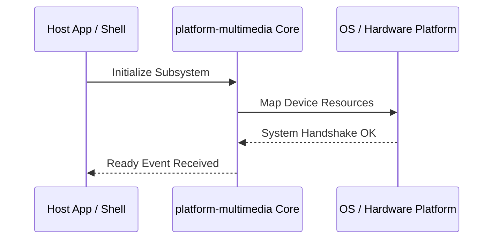

**Related Documents**: [README](../README.md) | [Functional Req](../functional-requirements/platform-multimedia-fr.md) | [Quick Reference](../code2spec-quick-reference.md)

# Module Design Card: platform-multimedia

> **Relevant source files**
>
> - [src/platform/multimedia/Demuxer.cpp](src:src/platform/multimedia/Demuxer.cpp)
> - [src/platform/multimedia/Demuxer.h](src:src/platform/multimedia/Demuxer.h)
> - [src/platform/multimedia/DemuxerMP4.cpp](src:src/platform/multimedia/DemuxerMP4.cpp)
> - [src/platform/multimedia/DemuxerSource.h](src:src/platform/multimedia/DemuxerSource.h)
> - [src/platform/multimedia/DemuxerWebM.cpp](src:src/platform/multimedia/DemuxerWebM.cpp)
> - [src/platform/multimedia/MP4PacketGenerator.cpp](src:src/platform/multimedia/MP4PacketGenerator.cpp)
> - [src/platform/multimedia/MediaPlayer.cpp](src:src/platform/multimedia/MediaPlayer.cpp)
> - [src/platform/multimedia/MediaPlayer.h](src:src/platform/multimedia/MediaPlayer.h)
> - [src/platform/multimedia/MediaPlayerAudio.cpp](src:src/platform/multimedia/MediaPlayerAudio.cpp)
> - [src/platform/multimedia/MediaPlayerAudio.h](src:src/platform/multimedia/MediaPlayerAudio.h)
> - [src/platform/multimedia/MediaPlayerAudioLinux.cpp](src:src/platform/multimedia/MediaPlayerAudioLinux.cpp)
> - [src/platform/multimedia/MediaPlayerAudioLinux.h](src:src/platform/multimedia/MediaPlayerAudioLinux.h)
> - [src/platform/multimedia/MediaPlayerAudioTizen.cpp](src:src/platform/multimedia/MediaPlayerAudioTizen.cpp)
> - [src/platform/multimedia/MediaPlayerAudioTizen.h](src:src/platform/multimedia/MediaPlayerAudioTizen.h)
> - [src/platform/multimedia/MediaPlayerESPlusPlayer.cpp](src:src/platform/multimedia/MediaPlayerESPlusPlayer.cpp)
> - [src/platform/multimedia/MediaPlayerESPlusPlayer.h](src:src/platform/multimedia/MediaPlayerESPlusPlayer.h)
> - [src/platform/multimedia/MediaPlayerLinux.cpp](src:src/platform/multimedia/MediaPlayerLinux.cpp)
> - [src/platform/multimedia/MediaPlayerLinux.h](src:src/platform/multimedia/MediaPlayerLinux.h)
> - [src/platform/multimedia/MediaPlayerTV.cpp](src:src/platform/multimedia/MediaPlayerTV.cpp)
> - [src/platform/multimedia/MediaPlayerTizen.cpp](src:src/platform/multimedia/MediaPlayerTizen.cpp)
> - [src/platform/multimedia/MediaPlayerTizen.h](src:src/platform/multimedia/MediaPlayerTizen.h)
> - [src/platform/multimedia/MediaPlayerTizenBase.cpp](src:src/platform/multimedia/MediaPlayerTizenBase.cpp)
> - [src/platform/multimedia/MediaPlayerWebRtc.cpp](src:src/platform/multimedia/MediaPlayerWebRtc.cpp)
> - [src/platform/multimedia/MediaPlayerWebRtc.h](src:src/platform/multimedia/MediaPlayerWebRtc.h)
> - [src/platform/multimedia/MediaPlayerWebRtcLinux.cpp](src:src/platform/multimedia/MediaPlayerWebRtcLinux.cpp)
> - [src/platform/multimedia/MediaPlayerWebRtcLinux.h](src:src/platform/multimedia/MediaPlayerWebRtcLinux.h)
> - [src/platform/multimedia/MediaPlayerWebRtcTizen.cpp](src:src/platform/multimedia/MediaPlayerWebRtcTizen.cpp)
> - [src/platform/multimedia/MediaPlayerWebRtcTizen.h](src:src/platform/multimedia/MediaPlayerWebRtcTizen.h)
> - [src/platform/multimedia/MockMediaPlayer.cpp](src:src/platform/multimedia/MockMediaPlayer.cpp)
> - [src/platform/multimedia/MockMediaPlayer.h](src:src/platform/multimedia/MockMediaPlayer.h)
> - [src/platform/multimedia/PacketGenerator.h](src:src/platform/multimedia/PacketGenerator.h)
> - [src/platform/multimedia/StreamInfo.cpp](src:src/platform/multimedia/StreamInfo.cpp)
> - [src/platform/multimedia/StreamInfo.h](src:src/platform/multimedia/StreamInfo.h)

**Primary File**: [`src/platform/multimedia/Demuxer.cpp`](src:src/platform/multimedia/Demuxer.cpp)
**Single Role**: Governs the operations and interfaces for the logical platform-multimedia subsystem [`Demuxer.cpp`](src:src/platform/multimedia/Demuxer.cpp#L1).
**Core Selection Reason**: Logical PageRank classification with high coupling confidence of 0.95.
**Date**: 2026-08-27

---

## Public Interface

| Class / Symbol | Signature / Description | Calling Module / Component | Source |
|----------------|-------------------------|----------------------------|--------|
| `platform-multimedia_init` | `init()`: Starts the logical subsystem | `engine-core` | [`Demuxer.cpp`](src:src/platform/multimedia/Demuxer.cpp#L1) |
| `Demuxer.c` | Native operations for Demuxer.cpp | `shell` / `public-bridge` | [`Demuxer.cpp`](src:src/platform/multimedia/Demuxer.cpp#L10) |
| `Demuxer` | Native operations for Demuxer.h | `shell` / `public-bridge` | [`Demuxer.h`](src:src/platform/multimedia/Demuxer.h#L10) |
| `DemuxerMP4.c` | Native operations for DemuxerMP4.cpp | `shell` / `public-bridge` | [`DemuxerMP4.cpp`](src:src/platform/multimedia/DemuxerMP4.cpp#L10) |

---

## IPC / Message / Interface Contracts

- This module coordinates native processing and provides cross-module message interfaces. [`Demuxer.cpp`](src:src/platform/multimedia/Demuxer.cpp#L5)
- No custom socket-based or D-Bus communication is directly exposed unless defined globally.

## Key Flow

## Architectural Rules
1. **Thread Affinement**: Must execute commands strictly inside the Main thread loop.
2. **Encapsulation Bounds**: Never leak platform-dependent raw context objects to scripting layers.

## Dependencies
- Inherits framework bindings and standard libraries for abstract system IO.
