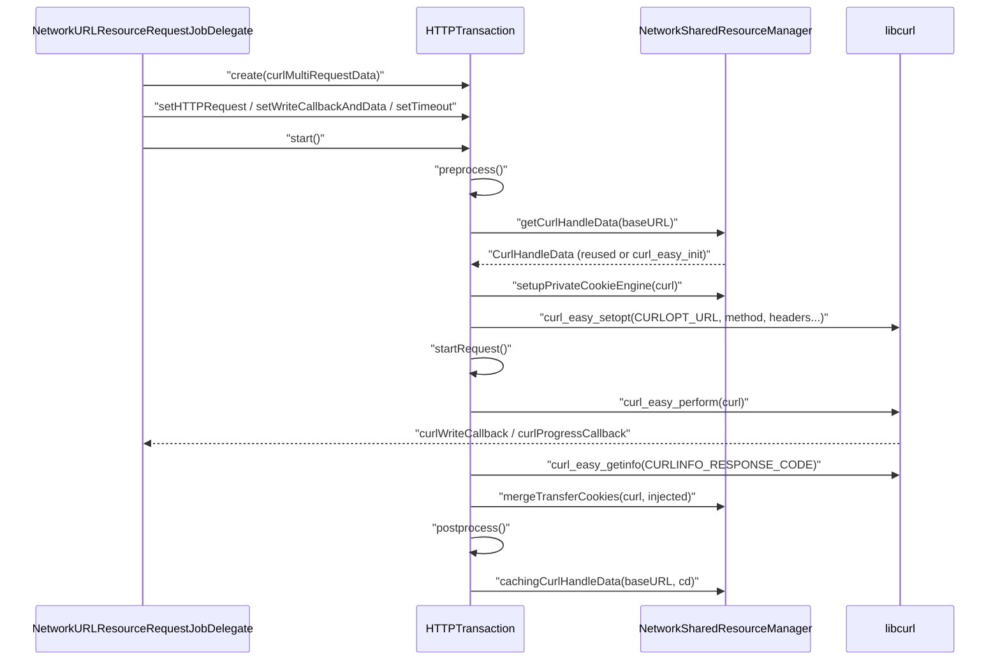
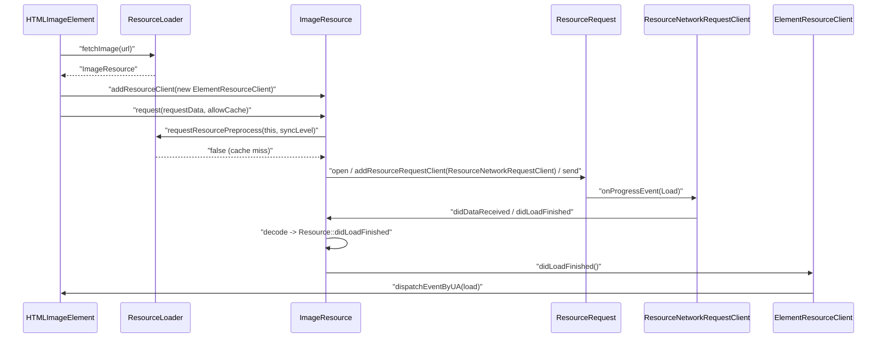

# Module Design Card: platform-network-loader

> **Relevant source files**
>
> - [src/platform/loader/ElementResourceClient.cpp](src:src/platform/loader/ElementResourceClient.cpp)
> - [src/platform/loader/ElementResourceClient.h](src:src/platform/loader/ElementResourceClient.h)
> - [src/platform/loader/FontResource.cpp](src:src/platform/loader/FontResource.cpp)
> - [src/platform/loader/FontResource.h](src:src/platform/loader/FontResource.h)
> - [src/platform/loader/HeaderResource.cpp](src:src/platform/loader/HeaderResource.cpp)
> - [src/platform/loader/HeaderResource.h](src:src/platform/loader/HeaderResource.h)
> - [src/platform/loader/ImageResource.cpp](src:src/platform/loader/ImageResource.cpp)
> - [src/platform/loader/ImageResource.h](src:src/platform/loader/ImageResource.h)
> - [src/platform/loader/Resource.cpp](src:src/platform/loader/Resource.cpp)
> - [src/platform/loader/Resource.h](src:src/platform/loader/Resource.h)
> - [src/platform/loader/ResourceClient.h](src:src/platform/loader/ResourceClient.h)
> - [src/platform/loader/ResourceLoader.cpp](src:src/platform/loader/ResourceLoader.cpp)
> - [src/platform/loader/ResourceLoader.h](src:src/platform/loader/ResourceLoader.h)
> - [src/platform/loader/ResourceURL.cpp](src:src/platform/loader/ResourceURL.cpp)
> - [src/platform/loader/ResourceURL.h](src:src/platform/loader/ResourceURL.h)
> - [src/platform/loader/TextResource.cpp](src:src/platform/loader/TextResource.cpp)
> - [src/platform/loader/TextResource.h](src:src/platform/loader/TextResource.h)
> - [src/platform/network/curl/NetworkSharedResourceManager.cpp](src:src/platform/network/curl/NetworkSharedResourceManager.cpp)
> - [src/platform/network/curl/NetworkSharedResourceManager.h](src:src/platform/network/curl/NetworkSharedResourceManager.h)
> - [src/platform/network/http/HTTPCache.cpp](src:src/platform/network/http/HTTPCache.cpp)
> - [src/platform/network/http/HTTPCache.h](src:src/platform/network/http/HTTPCache.h)
> - [src/platform/network/http/HTTPCacheEntry.cpp](src:src/platform/network/http/HTTPCacheEntry.cpp)
> - [src/platform/network/http/HTTPCacheEntry.h](src:src/platform/network/http/HTTPCacheEntry.h)
> - [src/platform/network/http/HTTPHeaderMap.cpp](src:src/platform/network/http/HTTPHeaderMap.cpp)
> - [src/platform/network/http/HTTPHeaderMap.h](src:src/platform/network/http/HTTPHeaderMap.h)
> - [src/platform/network/http/HTTPRequest.cpp](src:src/platform/network/http/HTTPRequest.cpp)
> - [src/platform/network/http/HTTPRequest.h](src:src/platform/network/http/HTTPRequest.h)
> - [src/platform/network/http/HTTPResponse.cpp](src:src/platform/network/http/HTTPResponse.cpp)
> - [src/platform/network/http/HTTPResponse.h](src:src/platform/network/http/HTTPResponse.h)
> - [src/platform/network/http/HTTPStatus.h](src:src/platform/network/http/HTTPStatus.h)
> - [src/platform/network/http/HTTPTransaction.cpp](src:src/platform/network/http/HTTPTransaction.cpp)
> - [src/platform/network/http/HTTPTransaction.h](src:src/platform/network/http/HTTPTransaction.h)
> - [src/platform/network/http/HTTPUtil.cpp](src:src/platform/network/http/HTTPUtil.cpp)
> - [src/platform/network/http/HTTPUtil.h](src:src/platform/network/http/HTTPUtil.h)
> - [src/core/modules/resource_request/NetworkURLResourceRequestJobDelegate.cpp](src:src/core/modules/resource_request/NetworkURLResourceRequestJobDelegate.cpp)
> - [src/core/modules/resource_request/NetworkURLResourceRequestJobDelegate.h](src:src/core/modules/resource_request/NetworkURLResourceRequestJobDelegate.h)
> - [src/core/modules/resource_request/ResourceRequest.h](src:src/core/modules/resource_request/ResourceRequest.h)
> - [src/Starfish.cpp](src:src/Starfish.cpp)
> - [src/core/dom/Document.cpp](src:src/core/dom/Document.cpp)
> - [src/core/dom/HTMLImageElement.cpp](src:src/core/dom/HTMLImageElement.cpp)
> - [src/core/dom/HTMLScriptElement.cpp](src:src/core/dom/HTMLScriptElement.cpp)
> - [src/core/dom/HTMLLinkElement.cpp](src:src/core/dom/HTMLLinkElement.cpp)
> - [src/core/dom/WebOrigin.cpp](src:src/core/dom/WebOrigin.cpp)
> - [src/core/style/ComputedStyle.cpp](src:src/core/style/ComputedStyle.cpp)
> - [src/core/page/Location.cpp](src:src/core/page/Location.cpp)
> - [src/core/page/EventSource.cpp](src:src/core/page/EventSource.cpp)
> - [src/core/fetch/Fetch.cpp](src:src/core/fetch/Fetch.cpp)
> - [src/core/fetch/HeadersData.h](src:src/core/fetch/HeadersData.h)
> - [src/core/xml/XMLHttpRequest.cpp](src:src/core/xml/XMLHttpRequest.cpp)
> - [src/core/cdp/CDPDispatcher.cpp](src:src/core/cdp/CDPDispatcher.cpp)
> - [src/core/cdp/domains/NetworkDomain.cpp](src:src/core/cdp/domains/NetworkDomain.cpp)
> - [src/public/delegate/CookieManagerDelegate.cpp](src:src/public/delegate/CookieManagerDelegate.cpp)
> - [src/public/delegate/LWEWebContainerDelegate.cpp](src:src/public/delegate/LWEWebContainerDelegate.cpp)
> - [src/platform/multimedia/MediaPlayerAudio.cpp](src:src/platform/multimedia/MediaPlayerAudio.cpp)
> - [build/config.cmake](src:build/config.cmake)

**Module**: `platform-network-loader` — 34 files under `src/platform/network/curl/` (2 files), `src/platform/network/http/` (15 files) and `src/platform/loader/` (17 files)
**Role**: Executes HTTP(S) transfers over libcurl with shared handles, a process-wide cookie store and an optional disk cache, and exposes a document-scoped resource loader that turns fetched bytes into text, image and font resources while notifying observers and driving the document load/onload state. [`HTTPTransaction`](src:src/platform/network/http/HTTPTransaction.h#L46), [`NetworkSharedResourceManager`](src:src/platform/network/curl/NetworkSharedResourceManager.h#L53), [`ResourceLoader`](src:src/platform/loader/ResourceLoader.h#L40)
**Module Boundary**: Network stack (curl/http) and the resource loader that consumes it are adjacent sibling directories forming one loading surface
**Confidence**: 0.82
**Core selection**: All approved modules are Core (boundary approved in W1 human review)
**Generated**: 2026-09-10

## Source Files

### src/platform/network/curl/
- [src/platform/network/curl/NetworkSharedResourceManager.cpp](src:src/platform/network/curl/NetworkSharedResourceManager.cpp)
- [src/platform/network/curl/NetworkSharedResourceManager.h](src:src/platform/network/curl/NetworkSharedResourceManager.h)

### src/platform/network/http/
- [src/platform/network/http/HTTPCache.cpp](src:src/platform/network/http/HTTPCache.cpp)
- [src/platform/network/http/HTTPCache.h](src:src/platform/network/http/HTTPCache.h)
- [src/platform/network/http/HTTPCacheEntry.cpp](src:src/platform/network/http/HTTPCacheEntry.cpp)
- [src/platform/network/http/HTTPCacheEntry.h](src:src/platform/network/http/HTTPCacheEntry.h)
- [src/platform/network/http/HTTPHeaderMap.cpp](src:src/platform/network/http/HTTPHeaderMap.cpp)
- [src/platform/network/http/HTTPHeaderMap.h](src:src/platform/network/http/HTTPHeaderMap.h)
- [src/platform/network/http/HTTPRequest.cpp](src:src/platform/network/http/HTTPRequest.cpp)
- [src/platform/network/http/HTTPRequest.h](src:src/platform/network/http/HTTPRequest.h)
- [src/platform/network/http/HTTPResponse.cpp](src:src/platform/network/http/HTTPResponse.cpp)
- [src/platform/network/http/HTTPResponse.h](src:src/platform/network/http/HTTPResponse.h)
- [src/platform/network/http/HTTPStatus.h](src:src/platform/network/http/HTTPStatus.h)
- [src/platform/network/http/HTTPTransaction.cpp](src:src/platform/network/http/HTTPTransaction.cpp)
- [src/platform/network/http/HTTPTransaction.h](src:src/platform/network/http/HTTPTransaction.h)
- [src/platform/network/http/HTTPUtil.cpp](src:src/platform/network/http/HTTPUtil.cpp)
- [src/platform/network/http/HTTPUtil.h](src:src/platform/network/http/HTTPUtil.h)

### src/platform/loader/
- [src/platform/loader/ElementResourceClient.cpp](src:src/platform/loader/ElementResourceClient.cpp)
- [src/platform/loader/ElementResourceClient.h](src:src/platform/loader/ElementResourceClient.h)
- [src/platform/loader/FontResource.cpp](src:src/platform/loader/FontResource.cpp)
- [src/platform/loader/FontResource.h](src:src/platform/loader/FontResource.h)
- [src/platform/loader/HeaderResource.cpp](src:src/platform/loader/HeaderResource.cpp)
- [src/platform/loader/HeaderResource.h](src:src/platform/loader/HeaderResource.h)
- [src/platform/loader/ImageResource.cpp](src:src/platform/loader/ImageResource.cpp)
- [src/platform/loader/ImageResource.h](src:src/platform/loader/ImageResource.h)
- [src/platform/loader/Resource.cpp](src:src/platform/loader/Resource.cpp)
- [src/platform/loader/Resource.h](src:src/platform/loader/Resource.h)
- [src/platform/loader/ResourceClient.h](src:src/platform/loader/ResourceClient.h)
- [src/platform/loader/ResourceLoader.cpp](src:src/platform/loader/ResourceLoader.cpp)
- [src/platform/loader/ResourceLoader.h](src:src/platform/loader/ResourceLoader.h)
- [src/platform/loader/ResourceURL.cpp](src:src/platform/loader/ResourceURL.cpp)
- [src/platform/loader/ResourceURL.h](src:src/platform/loader/ResourceURL.h)
- [src/platform/loader/TextResource.cpp](src:src/platform/loader/TextResource.cpp)
- [src/platform/loader/TextResource.h](src:src/platform/loader/TextResource.h)

## Public Interface

| Function/Class | Signature | Main callers | Source |
|---|---|---|---|
| `HTTPTransaction::create` | `static std::unique_ptr<HTTPTransaction> create(CurlMultiRequestData* curlMultiRequestData)` | [`NetworkURLResourceRequestJobDelegate.cpp`](src:src/core/modules/resource_request/NetworkURLResourceRequestJobDelegate.cpp#L87) | [`HTTPTransaction::create`](src:src/platform/network/http/HTTPTransaction.h#L48) |
| `HTTPTransaction::start` | `void start()` | [`NetworkURLResourceRequestJobDelegate::networkWorker`](src:src/core/modules/resource_request/NetworkURLResourceRequestJobDelegate.cpp#L181) | [`HTTPTransaction::start`](src:src/platform/network/http/HTTPTransaction.h#L58) |
| `HTTPTransaction::startPreFlightRequest` | `void startPreFlightRequest()` | [`NetworkURLResourceRequestJobDelegate.cpp`](src:src/core/modules/resource_request/NetworkURLResourceRequestJobDelegate.cpp#L158) | [`HTTPTransaction::startPreFlightRequest`](src:src/platform/network/http/HTTPTransaction.h#L59) |
| `HTTPTransaction::setWriteCallbackAndData` | `void setWriteCallbackAndData(Callback cb, void* data = nullptr)` | [`NetworkURLResourceRequestJobDelegate::send`](src:src/core/modules/resource_request/NetworkURLResourceRequestJobDelegate.cpp#L536) | [`HTTPTransaction::setWriteCallbackAndData`](src:src/platform/network/http/HTTPTransaction.h#L112) |
| `HTTPTransaction::setTimeout` / `setProxyURL` / `setUseHttp2` | `void setTimeout(const long timeout)`, `void setProxyURL(const std::string& url)`, `void setUseHttp2(bool b)` | [`NetworkURLResourceRequestJobDelegate.cpp`](src:src/core/modules/resource_request/NetworkURLResourceRequestJobDelegate.cpp#L530) | [`HTTPTransaction::setTimeout`](src:src/platform/network/http/HTTPTransaction.h#L85) |
| `HTTPTransaction::res` | `CURLcode res()` | [`NetworkURLWorkerHelper::responseHandler`](src:src/core/modules/resource_request/NetworkURLResourceRequestJobDelegate.cpp#L318) | [`HTTPTransaction::res`](src:src/platform/network/http/HTTPTransaction.h#L95) |
| `setGlobalIgnoreSSLVerify` | `void setGlobalIgnoreSSLVerify(bool b)` | [`CDPDispatcher.cpp`](src:src/core/cdp/CDPDispatcher.cpp#L490) | [`setGlobalIgnoreSSLVerify`](src:src/platform/network/http/HTTPTransaction.h#L43) |
| `HTTPRequest::create` | `static std::unique_ptr<HTTPRequest> create(const std::string& url, const std::string& baseURL, const std::string& method, const HTTPHeaderMap& headers, std::string&& entityBody, bool includeCredentials)` | [`NetworkURLResourceRequestJobDelegate.cpp`](src:src/core/modules/resource_request/NetworkURLResourceRequestJobDelegate.cpp#L522) | [`HTTPRequest::create`](src:src/platform/network/http/HTTPRequest.h#L29) |
| `NetworkSharedResourceManager::getInstance` | `static NetworkSharedResourceManager* getInstance()` | [`Starfish.cpp`](src:src/Starfish.cpp#L173), [`Document.cpp`](src:src/core/dom/Document.cpp#L344), [`CookieManagerDelegate.cpp`](src:src/public/delegate/CookieManagerDelegate.cpp#L59) | [`NetworkSharedResourceManager::getInstance`](src:src/platform/network/curl/NetworkSharedResourceManager.h#L58) |
| `NetworkSharedResourceManager::cookies` / `setCookies` | `String* cookies(ResourceURL* url)`, `void setCookies(ExecutionContext* executionContext, ResourceURL* url, String* value)` | [`Document.cpp`](src:src/core/dom/Document.cpp#L344), [`Document.cpp`](src:src/core/dom/Document.cpp#L359) | [`NetworkSharedResourceManager::cookies`](src:src/platform/network/curl/NetworkSharedResourceManager.h#L93) |
| `NetworkSharedResourceManager::setCookieStoreFilePath` / `initCookieSession` | `void setCookieStoreFilePath(const std::string& name)`, `void initCookieSession()` | [`Starfish.cpp`](src:src/Starfish.cpp#L173) | [`NetworkSharedResourceManager::setCookieStoreFilePath`](src:src/platform/network/curl/NetworkSharedResourceManager.h#L64) |
| `NetworkSharedResourceManager::allCookies` / `addCookieLine` | `struct curl_slist* allCookies()`, `void addCookieLine(const char* line)` | [`NetworkDomain.cpp`](src:src/core/cdp/domains/NetworkDomain.cpp#L109), [`NetworkDomain.cpp`](src:src/core/cdp/domains/NetworkDomain.cpp#L149) | [`NetworkSharedResourceManager::allCookies`](src:src/platform/network/curl/NetworkSharedResourceManager.h#L82) |
| `NetworkSharedResourceManager::hasCookies` / `clearCookies` | `bool hasCookies()`, `void clearCookies()` | [`CookieManagerDelegate.cpp`](src:src/public/delegate/CookieManagerDelegate.cpp#L59), [`CookieManagerDelegate.cpp`](src:src/public/delegate/CookieManagerDelegate.cpp#L66) | [`NetworkSharedResourceManager::hasCookies`](src:src/platform/network/curl/NetworkSharedResourceManager.h#L97) |
| `NetworkSharedResourceManager::startMultiRequestThreadIfNeeds` | `void startMultiRequestThreadIfNeeds(MessageLoop* ml, const std::string& origin)` | [`NetworkURLResourceRequestJobDelegate::send`](src:src/core/modules/resource_request/NetworkURLResourceRequestJobDelegate.cpp#L549) | [`NetworkSharedResourceManager::startMultiRequestThreadIfNeeds`](src:src/platform/network/curl/NetworkSharedResourceManager.h#L109) |
| `HTTPCache::getInstance` / `get` / `put` / `update` | `static Optional<HTTPCache*> getInstance(String* cacheDirPath)`, `Optional<HTTPCacheEntry*> get(ResourceURL* url)`, `void put(NetworkURLWorkerData* data)` | [`Starfish.cpp`](src:src/Starfish.cpp#L93), [`NetworkURLResourceRequestJobDelegate.cpp`](src:src/core/modules/resource_request/NetworkURLResourceRequestJobDelegate.cpp#L460), [`NetworkURLResourceRequestJobDelegate.cpp`](src:src/core/modules/resource_request/NetworkURLResourceRequestJobDelegate.cpp#L311) | [`HTTPCache::getInstance`](src:src/platform/network/http/HTTPCache.h#L40) |
| `HTTPCache::setCacheMode` | `void setCacheMode(int mode)` | [`NetworkDomain.cpp`](src:src/core/cdp/domains/NetworkDomain.cpp#L1346), [`LWEWebContainerDelegate.cpp`](src:src/public/delegate/LWEWebContainerDelegate.cpp#L1176) | [`HTTPCache::setCacheMode`](src:src/platform/network/http/HTTPCache.h#L60) |
| `HTTPStatusCode` / `httpStatusCodeToText` | `enum HTTPStatusCode`, `static String* httpStatusCodeToText(long responseCode)` | [`Fetch.cpp`](src:src/core/fetch/Fetch.cpp#L104), [`XMLHttpRequest.cpp`](src:src/core/xml/XMLHttpRequest.cpp#L572), [`EventSource.cpp`](src:src/core/page/EventSource.cpp#L87) | [`HTTPStatusCode`](src:src/platform/network/http/HTTPStatus.h#L94) |
| `HTTPHeaderMap` | `class HTTPHeaderMap` with `append`, `find`, `generateCurlList` | [`HeadersData.h`](src:src/core/fetch/HeadersData.h#L22), [`EventSource.cpp`](src:src/core/page/EventSource.cpp#L31) | [`HTTPHeaderMap`](src:src/platform/network/http/HTTPHeaderMap.h#L86) |
| `ResourceLoader::fetchImage` / `fetchText` / `fetchFont` / `fetch` / `fetchHeader` | `ImageResource* fetchImage(ResourceURL* url)`, `TextResource* fetchText(ResourceURL* url, String* preferredEncoding = String::emptyString)`, `FontResource* fetchFont(ResourceURL* url)`, `Resource* fetch(ResourceURL* url)`, `HeaderResource* fetchHeader(ResourceURL* url)` | [`ComputedStyle.cpp`](src:src/core/style/ComputedStyle.cpp#L478), [`HTMLScriptElement.cpp`](src:src/core/dom/HTMLScriptElement.cpp#L146), [`HTMLLinkElement.cpp`](src:src/core/dom/HTMLLinkElement.cpp#L289), [`MediaPlayerAudio.cpp`](src:src/platform/multimedia/MediaPlayerAudio.cpp#L116), [`Location.cpp`](src:src/core/page/Location.cpp#L376) | [`ResourceLoader::fetchImage`](src:src/platform/loader/ResourceLoader.h#L54) |
| `Resource::request` / `addResourceClient` | `virtual void request(RequestData* requestData, bool allowCache)`, `void addResourceClient(ResourceClient* rc)` | [`HTMLScriptElement.cpp`](src:src/core/dom/HTMLScriptElement.cpp#L505) | [`Resource::request`](src:src/platform/loader/Resource.h#L151) |
| `ElementResourceClient` | `ElementResourceClient(Element* element, Resource* resource, bool needsSyncEventDispatch = false)` | [`HTMLImageElement.cpp`](src:src/core/dom/HTMLImageElement.cpp#L342), [`HTMLLinkElement.cpp`](src:src/core/dom/HTMLLinkElement.cpp#L294), [`HTMLScriptElement.cpp`](src:src/core/dom/HTMLScriptElement.cpp#L505) | [`ElementResourceClient`](src:src/platform/loader/ElementResourceClient.h#L29) |
| `ResourceURL` | `class ResourceURL : public gc` with `parseURLString`, `origin`, `isHTTPFamilyURL` | [`WebOrigin.cpp`](src:src/core/dom/WebOrigin.cpp#L22), [`Location.cpp`](src:src/core/page/Location.cpp#L32) | [`ResourceURL`](src:src/platform/loader/ResourceURL.h#L31) |

## IPC / Message / Interface Contracts

- **HTTP(S) over libcurl (network protocol boundary).** Each transfer is one libcurl easy handle configured in [`HTTPTransaction::preprocess`](src:src/platform/network/http/HTTPTransaction.cpp#L88) and [`HTTPTransaction::start`](src:src/platform/network/http/HTTPTransaction.cpp#L196), then executed by [`curl_easy_perform`](src:src/platform/network/http/HTTPTransaction.cpp#L435) or handed to a per-origin multi handle in [`HTTPTransaction::startRequest`](src:src/platform/network/http/HTTPTransaction.cpp#L420). Request side: `CURLOPT_URL` from [`HTTPRequest::url`](src:src/platform/network/http/HTTPRequest.h#L53); method mapping POST→`CURLOPT_POSTFIELDS`, GET→`CURLOPT_HTTPGET`, HEAD→`CURLOPT_NOBODY`, PUT→`CURLOPT_UPLOAD`, PATCH and others→`CURLOPT_CUSTOMREQUEST` ([`HTTPTransaction.cpp`](src:src/platform/network/http/HTTPTransaction.cpp#L238)); headers as a `curl_slist` from [`HTTPHeaderMap::generateCurlList`](src:src/platform/network/http/HTTPHeaderMap.cpp#L126) with an empty `Expect:` header added for POST/PUT ([`HTTPTransaction.cpp`](src:src/platform/network/http/HTTPTransaction.cpp#L229)); `CURLOPT_FOLLOWLOCATION` with `CURLOPT_MAXREDIRS` 128 ([`HTTPTransaction.cpp`](src:src/platform/network/http/HTTPTransaction.cpp#L210)); HTTP version `CURL_HTTP_VERSION_2_0` or `CURL_HTTP_VERSION_1_1` by [`HTTPTransaction::useHttp2`](src:src/platform/network/http/HTTPTransaction.h#L129); `CURLOPT_ACCEPT_ENCODING ""`, TCP keepalive (idle 60 s, interval 30 s), `CURLOPT_TIMEOUT_MS` defaulting to 10 minutes, 64 KiB buffers, optional `CURLOPT_PROXY` ([`HTTPTransaction.cpp`](src:src/platform/network/http/HTTPTransaction.cpp#L130)). Response side: body/header/progress bytes arrive through `CURLOPT_WRITEFUNCTION`, `CURLOPT_HEADERFUNCTION`, `CURLOPT_XFERINFOFUNCTION` set in [`HTTPTransaction::registerCurlHandlers`](src:src/platform/network/http/HTTPTransaction.cpp#L381); the status code is read via `CURLINFO_RESPONSE_CODE` in [`HTTPTransaction::updateTransactionStatus`](src:src/platform/network/http/HTTPTransaction.cpp#L346) and classified by [`HTTPResponse::isSuccessfulResponseStatus`](src:src/platform/network/http/HTTPResponse.cpp#L40) / [`HTTPResponse::isRedirectionResponseStatus`](src:src/platform/network/http/HTTPResponse.cpp#L49) against [`HTTPStatusCode`](src:src/platform/network/http/HTTPStatus.h#L94). Error mapping: the `CURLcode` is kept in [`HTTPTransaction::res`](src:src/platform/network/http/HTTPTransaction.h#L95); `CURLE_RECV_ERROR` is remapped to `CURLE_OK` only when TLS checking is disabled ([`HTTPTransaction.cpp`](src:src/platform/network/http/HTTPTransaction.cpp#L266)); a non-`CURLE_OK` result discards the handle instead of caching it ([`HTTPTransaction::postprocess`](src:src/platform/network/http/HTTPTransaction.cpp#L174)). The consumer maps `CURLE_OPERATION_TIMEDOUT`→`RequestErrorType::TimeoutError`, `CURLE_COULDNT_RESOLVE_HOST`→`HostLookupError`, `CURLE_COULDNT_CONNECT`→`ConnectError`, `CURLE_UNSUPPORTED_PROTOCOL`→`UnsupportedSchemeError`, anything else→`UnknownError`, and treats `CURLE_ABORTED_BY_CALLBACK`/`CURLE_WRITE_ERROR` as caller-initiated aborts ([`NetworkURLWorkerHelper::responseHandler`](src:src/core/modules/resource_request/NetworkURLResourceRequestJobDelegate.cpp#L318), [`NetworkURLResourceRequestJobDelegate::networkWorker`](src:src/core/modules/resource_request/NetworkURLResourceRequestJobDelegate.cpp#L183), [`RequestErrorType`](src:src/core/modules/resource_request/ResourceRequest.h#L77)).
- **CORS preflight over the same transport.** [`HTTPTransaction::startPreFlightRequest`](src:src/platform/network/http/HTTPTransaction.cpp#L285) issues `OPTIONS` with redirects disabled, no cookies (`CURLOPT_COOKIEJAR`/`CURLOPT_COOKIEFILE` set to empty, non-cookie share handle), and adds `Access-Control-Request-Method` plus the lower-cased, sorted `Access-Control-Request-Headers` list from [`HTTPHeaderMap::generateAccessControlRequestHeaders`](src:src/platform/network/http/HTTPHeaderMap.cpp#L168).
- **Persisted cookie store file (Netscape cookie format).** A master easy handle that never transfers hosts the process-wide cookie engine; when a store path is set it is loaded/saved through `CURLOPT_COOKIEFILE`/`CURLOPT_COOKIEJAR` and `CURLOPT_COOKIELIST "RELOAD"`/`"FLUSH"` ([`NetworkSharedResourceManager::masterCookieHandleLocked`](src:src/platform/network/curl/NetworkSharedResourceManager.cpp#L476), [`NetworkSharedResourceManager::flushMasterCookiesLocked`](src:src/platform/network/curl/NetworkSharedResourceManager.cpp#L501)). Each credentialed transfer gets a private cookie engine seeded from a snapshot of the master store and merged back afterwards, including server-side deletions ([`NetworkSharedResourceManager::setupPrivateCookieEngine`](src:src/platform/network/curl/NetworkSharedResourceManager.cpp#L508), [`NetworkSharedResourceManager::mergeTransferCookies`](src:src/platform/network/curl/NetworkSharedResourceManager.cpp#L561)). The store path is provided at engine start ([`Starfish.cpp`](src:src/Starfish.cpp#L173)).
- **Disk HTTP cache index file.** Under `STARFISH_ENABLE_HTTPCACHE`, entries are persisted as one file per entry plus `"/index.txt"` with `NUM_OF_COL` (18) fields per line separated by `"\037"` ([`HTTPCache.cpp`](src:src/platform/network/http/HTTPCache.cpp#L43), [`HTTPCacheEntry::kSeparator`](src:src/platform/network/http/HTTPCacheEntry.cpp#L33), [`HTTPCacheEntry::toString`](src:src/platform/network/http/HTTPCacheEntry.cpp#L206)); the cache directory is exclusively locked with `flock(LOCK_EX | LOCK_NB)` ([`HTTPCache::lock`](src:src/platform/network/http/HTTPCache.cpp#L82)) and the index is read on start and rewritten on [`HTTPCache::flush`](src:src/platform/network/http/HTTPCache.cpp#L464).

These contracts form the engine's only outbound network boundary: every HTTP(S) request in the browser is funneled through the `HTTPTransaction` + `NetworkSharedResourceManager` pair, which decouple the calling worker thread from libcurl's connection, DNS and TLS-session sharing (`CURL_LOCK_DATA_DNS`, `CURL_LOCK_DATA_SSL_SESSION` in [`NetworkSharedResourceManager::NetworkSharedResourceManager`](src:src/platform/network/curl/NetworkSharedResourceManager.cpp#L353)). The cookie file and cache index are the module's persisted formats across process restarts.

## Key Flow


Entry: [`HTTPTransaction::start`](src:src/platform/network/http/HTTPTransaction.cpp#L196), invoked from [`NetworkURLResourceRequestJobDelegate::networkWorker`](src:src/core/modules/resource_request/NetworkURLResourceRequestJobDelegate.cpp#L154).

```mermaid
sequenceDiagram
    participant CurlMultiRequestData
    participant HTTPTransaction
    participant NetworkSharedResourceManager
    participant curlMultiWorker
    HTTPTransaction->>CurlMultiRequestData: "m_mutex->lock(); m_curl = handle"
    HTTPTransaction->>NetworkSharedResourceManager: "appendPendingMultiRequest(origin, r)"
    NetworkSharedResourceManager->>curlMultiWorker: "m_pendingRequests.push_back(r); restart thread if finishing"
    curlMultiWorker->>curlMultiWorker: "curl_multi_add_handle / curl_multi_wait / curl_multi_perform"
    curlMultiWorker->>CurlMultiRequestData: "m_result = msg->data.result; m_mutex->unlock()"
    HTTPTransaction->>CurlMultiRequestData: "m_mutex->lock() returns; m_res = m_result"
```
Entry: [`HTTPTransaction::startRequest`](src:src/platform/network/http/HTTPTransaction.cpp#L420) when a `CurlMultiRequestData` is present; the worker loop is [`NetworkSharedResourceManager::curlMultiWorker`](src:src/platform/network/curl/NetworkSharedResourceManager.cpp#L788).


Entry: [`Resource::request`](src:src/platform/loader/Resource.cpp#L60); network completion is bridged by [`ResourceNetworkRequestClient::onProgressEvent`](src:src/platform/loader/Resource.h#L280) and images are decoded in [`ImageResource::didLoadFinished`](src:src/platform/loader/ImageResource.cpp#L137).

## Architectural Rules

- [ ] Every transfer obtains its easy handle from the per-host handle cache and returns it only on success; a failed transfer's handle is destroyed rather than reused. [`NetworkSharedResourceManager::getCurlHandleData`](src:src/platform/network/curl/NetworkSharedResourceManager.cpp#L661), [`HTTPTransaction::postprocess`](src:src/platform/network/http/HTTPTransaction.cpp#L174)
- [ ] Cookies are never shared through a `CURLSH` handle; both share handles export only DNS and SSL-session data, and cookie state flows exclusively through the mutex-guarded master cookie handle. [`NetworkSharedResourceManager::NetworkSharedResourceManager`](src:src/platform/network/curl/NetworkSharedResourceManager.cpp#L353), [`NetworkSharedResourceManager::masterCookieHandleLocked`](src:src/platform/network/curl/NetworkSharedResourceManager.h#L142)
- [ ] Requests without credentials use the non-cookie share handle and no cookie engine; only `includeCredentials` requests receive the seeded private cookie engine. [`HTTPTransaction::start`](src:src/platform/network/http/HTTPTransaction.cpp#L214), [`HTTPRequest::includeCredentials`](src:src/platform/network/http/HTTPRequest.h#L78)
- [ ] Each reused handle is reset (`curl_easy_reset`) and its private cookie list cleared (`CURLOPT_COOKIELIST "ALL"`) before configuration. [`NetworkSharedResourceManager::getCurlHandleData`](src:src/platform/network/curl/NetworkSharedResourceManager.cpp#L661), [`HTTPTransaction::preprocess`](src:src/platform/network/http/HTTPTransaction.cpp#L101)
- [ ] `HTTPCache` methods that touch the entry table assert the main thread; the loader's image/font caches are keyed by the URL string and consulted only for non-`AlwaysSync` requests. [`HTTPCache::get`](src:src/platform/network/http/HTTPCache.cpp#L257), [`ResourceLoader::requestResourcePreprocess`](src:src/platform/loader/ResourceLoader.cpp#L435)
- [ ] Incoming header names are canonicalized to the `HTTPHeaderMap::k*` spellings before insertion, so lookups use those constants rather than raw strings. [`HTTPTransaction::didReceiveHeader`](src:src/platform/network/http/HTTPTransaction.cpp#L329), [`HTTPUtil::tryToConvertToHeaderMapString`](src:src/platform/network/http/HTTPUtil.cpp#L29)
- [ ] A `Resource` reaches exactly one terminal state (`Finished`, `Failed`, `Canceled`); on completion the client list is drained and cleared, and the request pointer is released. [`Resource::didLoadFinished`](src:src/platform/loader/Resource.cpp#L229), [`Resource::didLoadCanceled`](src:src/platform/loader/Resource.cpp#L290)
- [ ] Resource subclasses that are constructed only via `ResourceLoader::fetch*` keep their constructors private and declare `ResourceLoader` a friend. [`ImageResource`](src:src/platform/loader/ImageResource.h#L31), [`FontResource`](src:src/platform/loader/FontResource.h#L28), [`TextResource`](src:src/platform/loader/TextResource.h#L29)

## Dependencies

### Internal modules

| Module | File(s) | Purpose | Source |
|---|---|---|---|
| [modules-web-apis](../modules/modules-web-apis.md) | `core/modules/resource_request/ResourceRequest.h`, `NetworkURLResourceRequestJobDelegate.h` | `ResourceRequest` drives each `Resource` load; the job delegate is the sole driver of `HTTPTransaction` and `HTTPCache` | [`Resource.h`](src:src/platform/loader/Resource.h#L25), [`HTTPCache.cpp`](src:src/platform/network/http/HTTPCache.cpp#L23) |
| [modules-runtime](../modules/modules-runtime.md) | `core/modules/threading/Mutex.h`, `Thread.h`, `Locker.h`, `core/modules/message_loop/MessageLoop.h`, `Timer.h`, `core/modules/profiling/Profiling.h` | Mutexes for curl share locks and cookie store, worker thread for the multi loop, idlers/timers for deferred callbacks | [`NetworkSharedResourceManager.cpp`](src:src/platform/network/curl/NetworkSharedResourceManager.cpp#L25), [`ElementResourceClient.h`](src:src/platform/loader/ElementResourceClient.h#L24) |
| [modules-canvas](../modules/modules-canvas.md) | `core/modules/canvas/image/ImageDecoder.h`, `NativeImageData.h`, `CompressedNativeImageData.h`, `AnimatedGIFNativeImageData.h`, `core/modules/canvas/font/Font.h` | Decoding fetched image bytes and creating `FontFace` from font bytes | [`ImageResource.cpp`](src:src/platform/loader/ImageResource.cpp#L137), [`FontResource.cpp`](src:src/platform/loader/FontResource.cpp#L32) |
| [core-dom](../modules/core-dom.md) | `core/dom/Document.h`, `ExecutionContext.h`, `Element.h`, `Event.h`, `HTMLIFrameElement.h`, `HTMLImageElement.h` | Document ownership of the loader, element `load`/`error` events, SVG image documents in a mock iframe | [`ElementResourceClient.cpp`](src:src/platform/loader/ElementResourceClient.cpp#L22), [`ImageResource.h`](src:src/platform/loader/ImageResource.h#L29) |
| [core-page](../modules/core-page.md) | `core/page/WebView.h`, `Window.h`, `BrowsingContext.h` | Public WebView handlers (`OnProgressChanged`, `OnLoadResource`, `OnPageLoaded`), message loop access, parent browsing-context onload accounting | [`ResourceLoader.cpp`](src:src/platform/loader/ResourceLoader.cpp#L415), [`ResourceLoader.cpp`](src:src/platform/loader/ResourceLoader.cpp#L673) |
| [core-util](../modules/core-util.md) | `core/util/URL.h`, `TextConverter.h`, `RefCounted.h`, `RefPtr.h` | Text decoding of fetched text resources, ref-counted cache entries | [`TextResource.h`](src:src/platform/loader/TextResource.h#L24), [`HTTPCacheEntry.h`](src:src/platform/network/http/HTTPCacheEntry.h#L23) |
| [core-extras](../modules/core-extras.md) | `core/extra/MimeType.h`, `core/xml/FormData.h` | MIME sniffing for SVG detection; form submission body encoding | [`ImageResource.cpp`](src:src/platform/loader/ImageResource.cpp#L144), [`Resource.cpp`](src:src/platform/loader/Resource.cpp#L29) |
| [core-cdp](../modules/core-cdp.md) | `core/cdp/CDPServer.h`, `CDPDispatcher.h`, `core/cdp/domains/NetworkDomain.h` | Network event reporting and request blocking hooks (under `STARFISH_ENABLE_CDP`) | [`Resource.cpp`](src:src/platform/loader/Resource.cpp#L30) |
| [core-layout](../modules/core-layout.md), [core-style](../modules/core-style.md) | `core/layout/FrameReplacedImage.h`, `StackingContext.h`, computed style access | Enumerating image URLs still referenced by the frame tree during cache pruning | [`ResourceLoader.cpp`](src:src/platform/loader/ResourceLoader.cpp#L289) |
| [core-animation](../modules/core-animation.md) | `core/animation/AnimationExecutor.h` | Delays element `load`/`error` event dispatch until transform/opacity animations settle | [`ElementResourceClient.cpp`](src:src/platform/loader/ElementResourceClient.cpp#L34) |
| [core-fetch](../modules/core-fetch.md), [core-csp](../modules/core-csp.md) | `core/fetch/FetchUtils.h`, `core/csp/ContentSecurityPolicy.h` | Fetch utilities and content-security checks used by the loader | [`ResourceLoader.cpp`](src:src/platform/loader/ResourceLoader.cpp#L50) |
| [platform-base](../modules/platform-base.md) | `platform/file/PlatformFile.h`, `PlatformDirectory.h` | Cache directory creation, index/entry file read and write | [`HTTPCache.cpp`](src:src/platform/network/http/HTTPCache.cpp#L141), [`HTTPCacheEntry.cpp`](src:src/platform/network/http/HTTPCacheEntry.cpp#L108) |
| [binding](../modules/binding.md) | `binding/DocumentHoldable.h`, `binding/ScriptWrappable.h` | `ResourceLoader` is a `DocumentHoldable`; date parsing helper for freshness headers | [`ResourceLoader.h`](src:src/platform/loader/ResourceLoader.h#L23), [`HTTPUtil.cpp`](src:src/platform/network/http/HTTPUtil.cpp#L22) |
| [engine-entry](../modules/engine-entry.md) | `StarfishConfig.h`, `Starfish.h`, `src/Starfish.cpp` | Configuration macros; engine start wires the cookie store path and creates the `HTTPCache` | [`Starfish.cpp`](src:src/Starfish.cpp#L93) |

### External libraries

| Library | Version | Purpose | Source |
|---|---|---|---|
| libcurl (`<curl/curl.h>`) | Not specified in code (linked as `curl` in [`config.cmake`](src:build/config.cmake#L699)) | HTTP(S) transfers, share handles, multi interface, cookie engine | [`HTTPTransaction.h`](src:src/platform/network/http/HTTPTransaction.h#L23), [`NetworkSharedResourceManager.h`](src:src/platform/network/curl/NetworkSharedResourceManager.h#L23) |
| OpenSSL (`<openssl/crypto.h>`) | Not specified in code | Thread-safety locking callbacks (`CRYPTO_set_locking_callback`) on non-Windows, non-Android builds | [`NetworkSharedResourceManager.cpp`](src:src/platform/network/curl/NetworkSharedResourceManager.cpp#L39) |
| Boehm GC (`gc`, `GC_MALLOC_EXPLICITLY_TYPED`) | Not specified in code | Garbage-collected allocation of loader objects and cache entries with typed descriptors | [`HTTPCache.h`](src:src/platform/network/http/HTTPCache.h#L79), [`Resource.h`](src:src/platform/loader/Resource.h#L36) |
| POSIX (`<sys/file.h>`, `<unistd.h>`, `<linux/fs.h>`) | Not specified in code | `flock` cache-directory lock, `BLKGETSIZE` block size | [`HTTPCache.cpp`](src:src/platform/network/http/HTTPCache.cpp#L50), [`HTTPCache.cpp`](src:src/platform/network/http/HTTPCache.cpp#L86) |

## Quick Navigation

| To change… | Location |
|---|---|
| libcurl options applied to every transfer (timeouts, keepalive, HTTP version, proxy) | [`HTTPTransaction::preprocess`](src:src/platform/network/http/HTTPTransaction.cpp#L88) |
| HTTP method to curl option mapping and cookie/share selection | [`HTTPTransaction::start`](src:src/platform/network/http/HTTPTransaction.cpp#L196) |
| TLS certificate check override (build flag, `IGNORE_SSL_VERIFY`, runtime toggle) | [`HTTPTransaction::HTTPTransaction`](src:src/platform/network/http/HTTPTransaction.cpp#L49), [`setGlobalIgnoreSSLVerify`](src:src/platform/network/http/HTTPTransaction.cpp#L39) |
| Preflight (OPTIONS) request composition | [`HTTPTransaction::startPreFlightRequest`](src:src/platform/network/http/HTTPTransaction.cpp#L285) |
| Handle cache size/idle limits | [`NetworkSharedResourceManager::pruningIfNeed`](src:src/platform/network/curl/NetworkSharedResourceManager.cpp#L691) |
| Cookie store file, seeding and merge-back | [`NetworkSharedResourceManager::masterCookieHandleLocked`](src:src/platform/network/curl/NetworkSharedResourceManager.cpp#L476), [`NetworkSharedResourceManager::mergeTransferCookies`](src:src/platform/network/curl/NetworkSharedResourceManager.cpp#L561) |
| `document.cookie` read/write semantics | [`NetworkSharedResourceManager::cookies`](src:src/platform/network/curl/NetworkSharedResourceManager.cpp#L733), [`NetworkSharedResourceManager::setCookies`](src:src/platform/network/curl/NetworkSharedResourceManager.cpp#L765) |
| Per-origin multi-handle worker (pipelining, wait/sleep, idle exit) | [`NetworkSharedResourceManager::curlMultiWorker`](src:src/platform/network/curl/NetworkSharedResourceManager.cpp#L788) |
| Disk cache admission, size limit and eviction | [`HTTPCache::put`](src:src/platform/network/http/HTTPCache.cpp#L323), [`HTTPCache::pruneAsNeededForCacheSpace`](src:src/platform/network/http/HTTPCache.cpp#L509) |
| Freshness computation and cache-control directive parsing | [`HTTPCacheEntry::isFresh`](src:src/platform/network/http/HTTPCacheEntry.cpp#L179), [`HTTPUtil::parseCacheControl`](src:src/platform/network/http/HTTPUtil.cpp#L205) |
| Known header names / status codes | [`FOR_EACH_HTTPHEADERS`](src:src/platform/network/http/HTTPHeaderMap.h#L28), [`STARFISH_ENUM_HTTP_STATUS`](src:src/platform/network/http/HTTPStatus.h#L33) |
| Image/font in-memory cache hit and dedup logic | [`ResourceLoader::requestResourcePreprocess`](src:src/platform/loader/ResourceLoader.cpp#L435), [`ResourceLoader::cacheHit`](src:src/platform/loader/ResourceLoader.cpp#L504) |
| In-memory cache pruning thresholds | [`ResourceLoader::cachePruning`](src:src/platform/loader/ResourceLoader.cpp#L289), [`ResourceLoader.cpp`](src:src/platform/loader/ResourceLoader.cpp#L45) |
| Window onload firing and load progress reporting | [`ResourceLoader::fireDocumentOnLoadEventIfNeeded`](src:src/platform/loader/ResourceLoader.cpp#L538), [`ResourceLoader::updateLoadProgress`](src:src/platform/loader/ResourceLoader.cpp#L673) |
| Element `load`/`error` event timing | [`ElementResourceClient::didLoadFinished`](src:src/platform/loader/ElementResourceClient.cpp#L34) |
| URL parsing and component accessors | [`ResourceURL::parseURLString`](src:src/platform/loader/ResourceURL.cpp#L611), [`ResourceURL::resolvePositions`](src:src/platform/loader/ResourceURL.cpp#L492) |

## FR Linkage

- [FR-PLATFORM-NETWORK-LOADER-001](../functional-requirements/platform-network-loader-fr.md#fr-platform-network-loader-001): Execute an HTTP request over libcurl
- [FR-PLATFORM-NETWORK-LOADER-002](../functional-requirements/platform-network-loader-fr.md#fr-platform-network-loader-002): Configure transport, TLS checking and connection options
- [FR-PLATFORM-NETWORK-LOADER-003](../functional-requirements/platform-network-loader-fr.md#fr-platform-network-loader-003): Issue a CORS preflight request
- [FR-PLATFORM-NETWORK-LOADER-004](../functional-requirements/platform-network-loader-fr.md#fr-platform-network-loader-004): Share and reuse libcurl handles per host
- [FR-PLATFORM-NETWORK-LOADER-005](../functional-requirements/platform-network-loader-fr.md#fr-platform-network-loader-005): Maintain the process-wide cookie store
- [FR-PLATFORM-NETWORK-LOADER-006](../functional-requirements/platform-network-loader-fr.md#fr-platform-network-loader-006): Run same-origin transfers on a per-origin multi worker
- [FR-PLATFORM-NETWORK-LOADER-007](../functional-requirements/platform-network-loader-fr.md#fr-platform-network-loader-007): Cache HTTP responses on disk with freshness rules
- [FR-PLATFORM-NETWORK-LOADER-008](../functional-requirements/platform-network-loader-fr.md#fr-platform-network-loader-008): Canonicalize headers and classify status codes
- [FR-PLATFORM-NETWORK-LOADER-009](../functional-requirements/platform-network-loader-fr.md#fr-platform-network-loader-009): Fetch typed document resources and notify observers
- [FR-PLATFORM-NETWORK-LOADER-010](../functional-requirements/platform-network-loader-fr.md#fr-platform-network-loader-010): Deduplicate and prune in-memory image and font resources
- [FR-PLATFORM-NETWORK-LOADER-011](../functional-requirements/platform-network-loader-fr.md#fr-platform-network-loader-011): Track document open state, onload and load progress
- [FR-PLATFORM-NETWORK-LOADER-012](../functional-requirements/platform-network-loader-fr.md#fr-platform-network-loader-012): Parse and manipulate resource URLs
