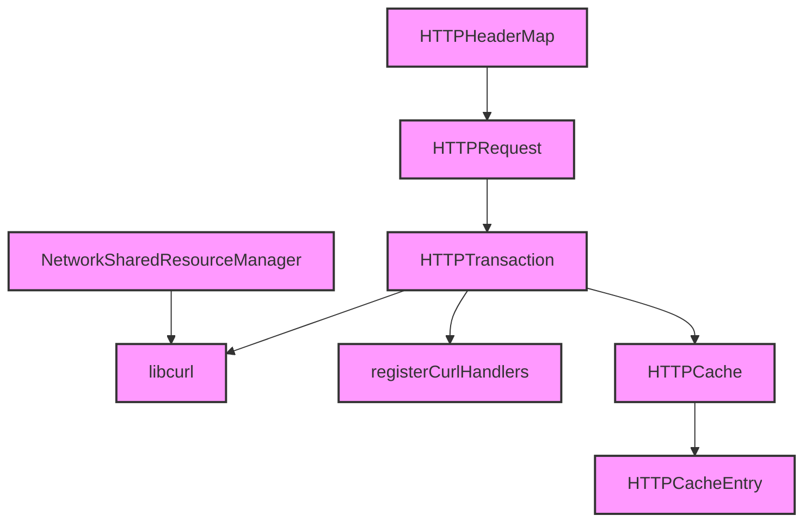

# Module Design Card — platform-network

> **Relevant source files**
> - [`http/HTTPRequest.h`](src:src/platform/network/http/HTTPRequest.h)
> - [`http/HTTPTransaction.h`](src:src/platform/network/http/HTTPTransaction.h)
> - [`http/HTTPHeaderMap.h`](src:src/platform/network/http/HTTPHeaderMap.h)
> - [`http/HTTPCache.h`](src:src/platform/network/http/HTTPCache.h)
> - [`http/HTTPCacheEntry.h`](src:src/platform/network/http/HTTPCacheEntry.h)
> - [`curl/NetworkSharedResourceManager.h`](src:src/platform/network/curl/NetworkSharedResourceManager.h)
> - (11 additional network files)

## Module Boundary

**Rationale:** HTTP networking — libcurl client, caching, transactions, headers [`module-groups.yaml`](src:code2spec/.analysis/state/delta/module-groups.yaml)
**Confidence:** 0.87

## Source Files

17 files in `src/platform/network/` including HTTP request/response, transactions, header maps, caching, and curl shared resource management.

## Public Interface

| Component | Class | Source |
|---|---|---|
| HTTP Request | `HTTPRequest` | [`HTTPRequest.h`](src:src/platform/network/http/HTTPRequest.h#L27) |
| HTTP Transaction | `HTTPTransaction` | [`HTTPTransaction.h`](src:src/platform/network/http/HTTPTransaction.h) |
| HTTP Header Map | `HTTPHeaderMap` | [`HTTPHeaderMap.h`](src:src/platform/network/http/HTTPHeaderMap.h) |
| HTTP Cache | `HTTPCache` | [`HTTPCache.h`](src:src/platform/network/http/HTTPCache.h) |

## Key Flow

## Architectural Rules

- `HTTPRequest::create()` factory method with url, baseURL, method, headers, entityBody, credentials [`HTTPRequest.h`](src:src/platform/network/http/HTTPRequest.h#L29)
- `registerCurlHandlers` is an entry point for curl handler registration [`HTTPTransaction.h`](src:src/platform/network/http/HTTPTransaction.h)
- HTTP cache gated by `STARFISH_ENABLE_HTTPCACHE` [`Starfish.h`](src:src/Starfish.h#L35)
- `NetworkSharedResourceManager` manages shared curl resources [`curl/NetworkSharedResourceManager.h`](src:src/platform/network/curl/NetworkSharedResourceManager.h)

## Dependencies

| Dependency | Type |
|---|---|
| libcurl | External |
| OpenSSL | External |
| core-engine (URL) | Internal |
| platform-loader (Resource) | Internal |

## IPC / Message / Interface Contracts

- `registerCurlHandlers` registers curl multi/easy handle callbacks. [`HTTPTransaction.h`](src:src/platform/network/http/HTTPTransaction.h)
- No cross-process IPC; networking is in-process via libcurl.

## Quick Navigation

- [FR Document](../functional-requirements/platform-network-fr.md)
- [Architecture](../02-architecture.md)
