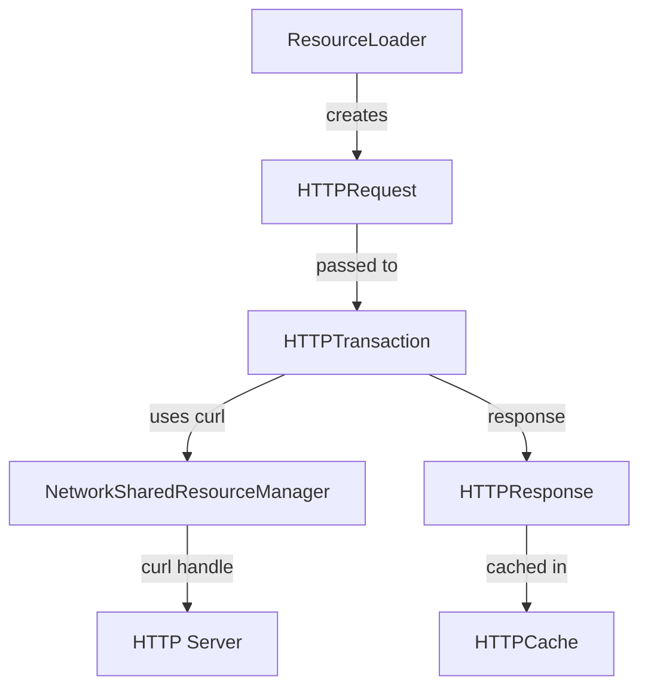

# Module Design Card: platform-network

> **Relevant source files**
> - [`HTTPTransaction.h`](src/platform/network/http/HTTPTransaction.h#L46)
> - [`HTTPRequest.h`](src/platform/network/http/HTTPRequest.h#L27)
> - [`HTTPCache.h`](src/platform/network/http/HTTPCache.h#L31)
> - [`HTTPHeaderMap.h`](src/platform/network/http/HTTPHeaderMap.h#L1)
> - [`HTTPStatus.h`](src/platform/network/http/HTTPStatus.h#L1)
> - [`NetworkSharedResourceManager.cpp`](src/platform/network/curl/NetworkSharedResourceManager.cpp#L1)

## Module Boundary
Network stack: curl handle management, HTTP request/response/transaction, HTTP caching.

**Confidence**: 0.95

## Source Files
17 files in `src/platform/network/http/` and `src/platform/network/curl/`

## Public Interface
- `HTTPTransaction` — curl-based HTTP transaction with HTTP/2 multiplexing. [`HTTPTransaction.h:46`](src/platform/network/http/HTTPTransaction.h#L46)
- `HTTPRequest` — Request object (url, method, headers, entityBody, credentials). [`HTTPRequest.h:27`](src/platform/network/http/HTTPRequest.h#L27)
- `HTTPResponse` — Response object.
- `HTTPCache` — On-disk HTTP response cache. [`HTTPCache.h:31`](src/platform/network/http/HTTPCache.h#L31)
- `HTTPHeaderMap` — HTTP header key-value store.
- `NetworkSharedResourceManager` — curl handle pool management. [`NetworkSharedResourceManager.cpp`](src/platform/network/curl/NetworkSharedResourceManager.cpp#L1)
- `setGlobalIgnoreSSLVerify` / `globalIgnoreSSLVerify` — Process-wide TLS verification override. [`HTTPTransaction.h:43`](src/platform/network/http/HTTPTransaction.h#L43)

## Key Flow

## Architectural Rules
- HTTPTransaction supports HTTP/2 multiplexing (CURLPIPE_MULTIPLEX). [`HTTPTransaction.cpp:49`](src/platform/network/http/HTTPTransaction.cpp#L49)
- HTTPCache modes: LOAD_DEFAULT(-1), LOAD_NORMAL(0), LOAD_CACHE_ELSE_NETWORK(1), LOAD_NO_CACHE(2), LOAD_CACHE_ONLY(3). [`HTTPCache.h:34`](src/platform/network/http/HTTPCache.h#L34)
- curl handle pool: CACHE_PRUNE_MINIMUM_SIZE=12, IDLE_TIME_LIMIT=60s. [`NetworkSharedResourceManager.cpp:42`](src/platform/network/curl/NetworkSharedResourceManager.cpp#L42)
- TLS verification can be overridden globally via setGlobalIgnoreSSLVerify (CDP Security). [`HTTPTransaction.h:43`](src/platform/network/http/HTTPTransaction.h#L43)

## Dependencies
- Depends on: engine-core, platform-loader (ResourceURL)
- External: libcurl, OpenSSL

## IPC / Message / Interface Contracts
- HTTP transactions communicate with remote HTTP servers via curl (http_client mechanism). [`HTTPTransaction.cpp:49`](src/platform/network/http/HTTPTransaction.cpp#L49)

## Quick Navigation
- [FR Document](../functional-requirements/platform-network-fr.md)
- [Architecture](../02-architecture.md)
