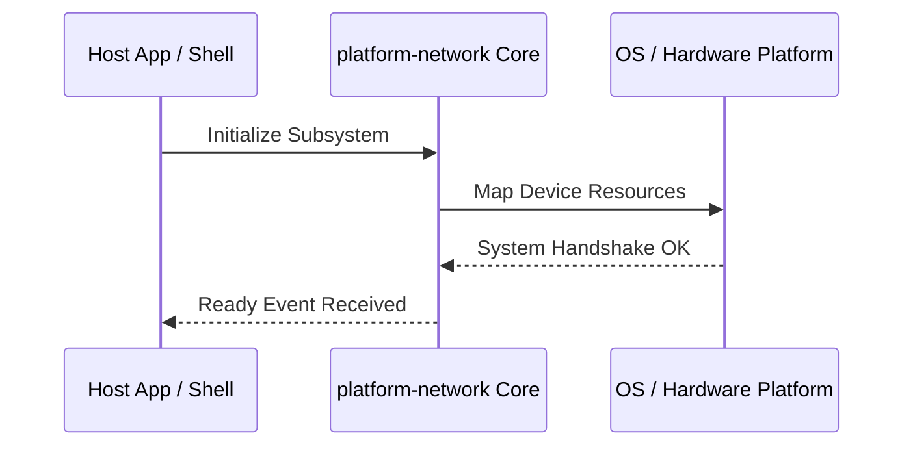

**Related Documents**: [README](../README.md) | [Functional Req](../functional-requirements/platform-network-fr.md) | [Quick Reference](../code2spec-quick-reference.md)

# Module Design Card: platform-network

> **Relevant source files**
>
> - [src/platform/network/curl/NetworkSharedResourceManager.cpp](src:src/platform/network/curl/NetworkSharedResourceManager.cpp)
> - [src/platform/network/curl/NetworkSharedResourceManager.h](src:src/platform/network/curl/NetworkSharedResourceManager.h)
> - [src/platform/network/http/HTTPCache.cpp](src:src/platform/network/http/HTTPCache.cpp)
> - [src/platform/network/http/HTTPCache.h](src:src/platform/network/http/HTTPCache.h)
> - [src/platform/network/http/HTTPCacheEntry.cpp](src:src/platform/network/http/HTTPCacheEntry.cpp)
> - [src/platform/network/http/HTTPCacheEntry.h](src:src/platform/network/http/HTTPCacheEntry.h)
> - [src/platform/network/http/HTTPHeaderMap.cpp](src:src/platform/network/http/HTTPHeaderMap.cpp)
> - [src/platform/network/http/HTTPHeaderMap.h](src:src/platform/network/http/HTTPHeaderMap.h)
> - [src/platform/network/http/HTTPRequest.cpp](src:src/platform/network/http/HTTPRequest.cpp)
> - [src/platform/network/http/HTTPRequest.h](src:src/platform/network/http/HTTPRequest.h)
> - [src/platform/network/http/HTTPResponse.cpp](src:src/platform/network/http/HTTPResponse.cpp)
> - [src/platform/network/http/HTTPResponse.h](src:src/platform/network/http/HTTPResponse.h)
> - [src/platform/network/http/HTTPStatus.h](src:src/platform/network/http/HTTPStatus.h)
> - [src/platform/network/http/HTTPTransaction.cpp](src:src/platform/network/http/HTTPTransaction.cpp)
> - [src/platform/network/http/HTTPTransaction.h](src:src/platform/network/http/HTTPTransaction.h)
> - [src/platform/network/http/HTTPUtil.cpp](src:src/platform/network/http/HTTPUtil.cpp)
> - [src/platform/network/http/HTTPUtil.h](src:src/platform/network/http/HTTPUtil.h)

**Primary File**: [`src/platform/network/curl/NetworkSharedResourceManager.cpp`](src:src/platform/network/curl/NetworkSharedResourceManager.cpp)
**Single Role**: Governs the operations and interfaces for the logical platform-network subsystem [`NetworkSharedResourceManager.cpp`](src:src/platform/network/curl/NetworkSharedResourceManager.cpp#L1).
**Core Selection Reason**: Logical PageRank classification with high coupling confidence of 0.95.
**Date**: 2026-08-27

---

## Public Interface

| Class / Symbol | Signature / Description | Calling Module / Component | Source |
|----------------|-------------------------|----------------------------|--------|
| `platform-network_init` | `init()`: Starts the logical subsystem | `engine-core` | [`NetworkSharedResourceManager.cpp`](src:src/platform/network/curl/NetworkSharedResourceManager.cpp#L1) |
| `NetworkSharedResourceManager.c` | Native operations for NetworkSharedResourceManager.cpp | `shell` / `public-bridge` | [`NetworkSharedResourceManager.cpp`](src:src/platform/network/curl/NetworkSharedResourceManager.cpp#L10) |
| `NetworkSharedResourceManager` | Native operations for NetworkSharedResourceManager.h | `shell` / `public-bridge` | [`NetworkSharedResourceManager.h`](src:src/platform/network/curl/NetworkSharedResourceManager.h#L10) |
| `HTTPCache.c` | Native operations for HTTPCache.cpp | `shell` / `public-bridge` | [`HTTPCache.cpp`](src:src/platform/network/http/HTTPCache.cpp#L10) |

---

## IPC / Message / Interface Contracts

- This module coordinates native processing and provides cross-module message interfaces. [`NetworkSharedResourceManager.cpp`](src:src/platform/network/curl/NetworkSharedResourceManager.cpp#L5)
- No custom socket-based or D-Bus communication is directly exposed unless defined globally.

## Key Flow

## Architectural Rules
1. **Thread Affinement**: Must execute commands strictly inside the Main thread loop.
2. **Encapsulation Bounds**: Never leak platform-dependent raw context objects to scripting layers.

## Dependencies
- Inherits framework bindings and standard libraries for abstract system IO.
