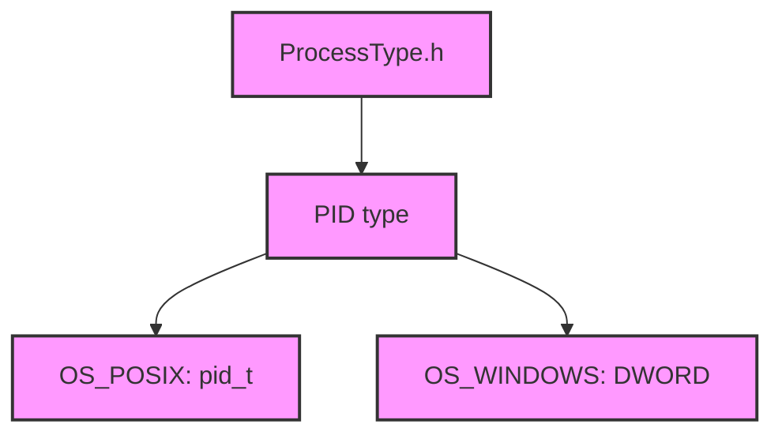

# Module Design Card — platform-process

> **Relevant source files**
> - [`base/ProcessType.h`](src:src/platform/process/base/ProcessType.h)
> - (2 additional process files)

## Module Boundary

**Rationale:** Process type management [`module-groups.yaml`](src:code2spec/.analysis/state/delta/module-groups.yaml)
**Confidence:** 0.85

## Source Files

3 files in `src/platform/process/` providing process type definitions and PID abstraction.

## Public Interface

| Component | Source |
|---|---|
| Process Type | [`base/ProcessType.h`](src:src/platform/process/base/ProcessType.h) |

## Key Flow

## Architectural Rules

- `PID` = `pid_t` on POSIX, `DWORD` on Windows [`ProcessType.h`](src:src/platform/process/base/ProcessType.h#L25)

## Dependencies

| Dependency | Type |
|---|---|
| POSIX / Windows API | External |

## IPC / Message / Interface Contracts

- No IPC. Process type definitions only.

## Quick Navigation

- [FR Document](../functional-requirements/platform-process-fr.md)
