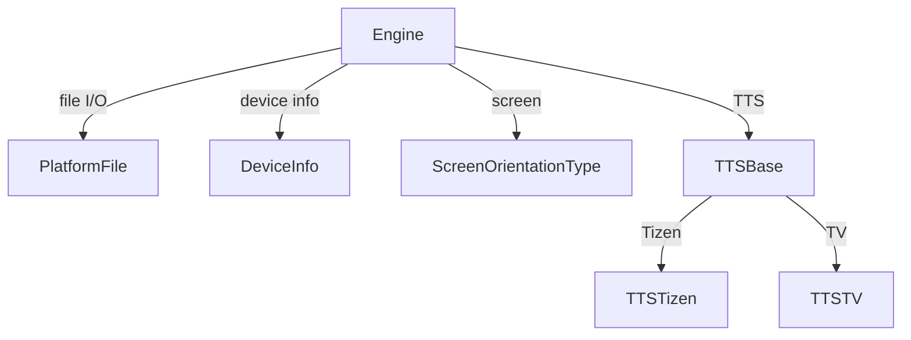

# Module Design Card: platform-system

> **Relevant source files**
> - [`PlatformFile.h`](src/platform/file/PlatformFile.h#L33)
> - [`DeviceInfo.h`](src/platform/public/DeviceInfo.h#L25)
> - [`ScreenOrientationType.h`](src/platform/public/ScreenOrientationType.h#L24)
> - [`TTSBase.cpp`](src/platform/tts/TTSBase.cpp#L1)

## Module Boundary
Platform system services: file I/O, directory, process, device/screen info, key events, TTS.

**Confidence**: 0.88

## Source Files
18 files across `src/platform/file/`, `src/platform/process/`, `src/platform/public/`, `src/platform/tts/`, `src/platform/windows/`

## Public Interface
- `PlatformFile` — File I/O with FileMode (Read, Write, ReadWrite) and Whence (Start, Current, End). [`PlatformFile.h:33`](src/platform/file/PlatformFile.h#L33)
- `PlatformFileUtil` — File utilities (removeFile, absolutePath, joinPath). [`PlatformFile.h:25`](src/platform/file/PlatformFile.h#L25)
- `DeviceInfo` — Device info (getLocalIPAddress). [`DeviceInfo.h:25`](src/platform/public/DeviceInfo.h#L25)
- `ScreenOrientationType` — Undefined, PortraitPrimary, PortraitSecondary, LandscapePrimary, LandscapeSecondary. [`ScreenOrientationType.h:24`](src/platform/public/ScreenOrientationType.h#L24)
- `TTSBase` — Text-to-speech base class. [`TTSBase.cpp`](src/platform/tts/TTSBase.cpp#L1)

## Key Flow

## Architectural Rules
- FileMode: Read=1, Write=2, ReadWrite=3. [`PlatformFile.h:35`](src/platform/file/PlatformFile.h#L35)
- Whence: Start=SEEK_SET, Current=SEEK_CUR, End=SEEK_END. [`PlatformFile.h:41`](src/platform/file/PlatformFile.h#L41)
- TTS backends: TTSTizen, TTSTV (gated by STARFISH_ENABLE_TTS). [`AGENTS.md`](AGENTS.md)

## Dependencies
- Depends on: engine-core
- Used by: multiple modules for file I/O and device info

## IPC / Message / Interface Contracts
- This module does not have cross-module IPC. System services are in-process.

## Quick Navigation
- [FR Document](../functional-requirements/platform-system-fr.md)
- [Architecture](../02-architecture.md)
