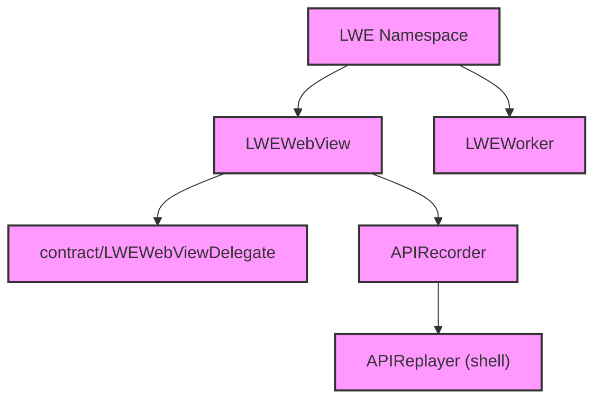

# Module Design Card — public-api

> **Relevant source files**
> - [`LWEWebView.cpp`](src:src/public/LWEWebView.cpp)
> - [`LWEWorker.cpp`](src:src/public/LWEWorker.cpp)
> - [`APIRecorder.cpp`](src:src/public/APIRecorder.cpp)
> - [`APIRecorder.h`](src:src/public/APIRecorder.h)
> - [`LWEDelegateLoader.h`](src:src/public/LWEDelegateLoader.h)
> - (5 additional public-api files)

## Module Boundary

**Rationale:** Public embedding API — LWEWebView, LWEWorker, APIRecorder [`module-groups.yaml`](src:code2spec/.analysis/state/delta/module-groups.yaml)
**Confidence:** 0.90

## Source Files

10 files in `src/public/` providing the LWEWebView/LWEWorker API implementation, API recording, and delegate loading.

## Public Interface

| Component | Class | Source |
|---|---|---|
| LWEWebView | `LWE::LWEWebView` | [`LWEWebView.cpp`](src:src/public/LWEWebView.cpp#L51) |
| LWEWorker | `LWE::LWEWorker` | [`LWEWorker.cpp`](src:src/public/LWEWorker.cpp) |
| APIRecorder | `APIRecorder` | [`APIRecorder.cpp`](src:src/public/APIRecorder.cpp) |

## Key Flow

## Architectural Rules

- `LWE_ASSERT` disabled in NDEBUG builds [`LWEWebView.cpp`](src:src/public/LWEWebView.cpp#L38)
- Tizen version compatibility checks: 5.0 vs 5.5 [`LWEWebView.cpp`](src:src/public/LWEWebView.cpp#L43)
- `STARFISH_API_ENABLE_LOADER` gates delegate loading mechanism [`LWEWebView.cpp`](src:src/public/LWEWebView.cpp#L21)
- `toImpl<T>()` template casts void* to implementation [`LWEWebView.cpp`](src:src/public/LWEWebView.cpp#L53)
- `SetVersionPreference` is a key API entry [`LWEWebView.cpp`](src:src/public/LWEWebView.cpp#L59)

## Dependencies

| Dependency | Type |
|---|---|
| public-contract | Internal |
| public-delegate | Internal |
| compat-headers | Internal |

## IPC / Message / Interface Contracts

- API calls cross the `.so` boundary via contract virtual dispatch. [`LWEWebView.cpp`](src:src/public/LWEWebView.cpp)
- `APIRecorder` records API calls for replay by `APIReplayer` in shell. [`APIRecorder.cpp`](src:src/public/APIRecorder.cpp)

## Quick Navigation

- [FR Document](../functional-requirements/public-api-fr.md)
- [Architecture](../02-architecture.md)
