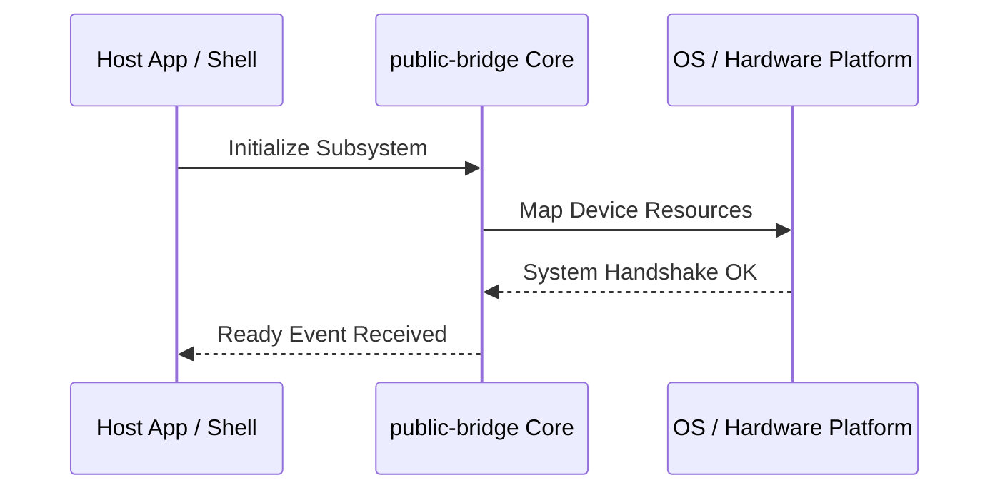

**Related Documents**: [README](../README.md) | [Functional Req](../functional-requirements/public-bridge-fr.md) | [Quick Reference](../code2spec-quick-reference.md)

# Module Design Card: public-bridge

> **Relevant source files**
>
> - [src/public/APIRecorder.cpp](src:src/public/APIRecorder.cpp)
> - [src/public/APIRecorder.h](src:src/public/APIRecorder.h)
> - [src/public/LWEDelegateLoader.cpp](src:src/public/LWEDelegateLoader.cpp)
> - [src/public/LWEDelegateLoader.h](src:src/public/LWEDelegateLoader.h)
> - [src/public/LWELoaderUtils.cpp](src:src/public/LWELoaderUtils.cpp)
> - [src/public/LWELoaderUtils.h](src:src/public/LWELoaderUtils.h)
> - [src/public/LWEWebView.cpp](src:src/public/LWEWebView.cpp)
> - [src/public/LWEWorker.cpp](src:src/public/LWEWorker.cpp)
> - [src/public/LWEWorkerDelegateLoader.cpp](src:src/public/LWEWorkerDelegateLoader.cpp)
> - [src/public/LWEWorkerDelegateLoader.h](src:src/public/LWEWorkerDelegateLoader.h)
> - [src/public/bridge/android/AndroidBridge.cpp](src:src/public/bridge/android/AndroidBridge.cpp)
> - [src/public/bridge/android/java/com/samsung/android/lightweightwebengine/DownloadListener.java](src:src/public/bridge/android/java/com/samsung/android/lightweightwebengine/DownloadListener.java)
> - [src/public/bridge/android/java/com/samsung/android/lightweightwebengine/WebChromeClient.java](src:src/public/bridge/android/java/com/samsung/android/lightweightwebengine/WebChromeClient.java)
> - [src/public/bridge/android/java/com/samsung/android/lightweightwebengine/WebResourceError.java](src:src/public/bridge/android/java/com/samsung/android/lightweightwebengine/WebResourceError.java)
> - [src/public/bridge/android/java/com/samsung/android/lightweightwebengine/WebResourceRequest.java](src:src/public/bridge/android/java/com/samsung/android/lightweightwebengine/WebResourceRequest.java)
> - [src/public/bridge/android/java/com/samsung/android/lightweightwebengine/WebResourceRequestImpl.java](src:src/public/bridge/android/java/com/samsung/android/lightweightwebengine/WebResourceRequestImpl.java)
> - [src/public/bridge/android/java/com/samsung/android/lightweightwebengine/WebResourceResponse.java](src:src/public/bridge/android/java/com/samsung/android/lightweightwebengine/WebResourceResponse.java)
> - [src/public/bridge/android/java/com/samsung/android/lightweightwebengine/WebSettings.java](src:src/public/bridge/android/java/com/samsung/android/lightweightwebengine/WebSettings.java)
> - [src/public/bridge/android/java/com/samsung/android/lightweightwebengine/WebView.java](src:src/public/bridge/android/java/com/samsung/android/lightweightwebengine/WebView.java)
> - [src/public/bridge/android/java/com/samsung/android/lightweightwebengine/WebViewClient.java](src:src/public/bridge/android/java/com/samsung/android/lightweightwebengine/WebViewClient.java)
> - [src/public/bridge/android/java/com/samsung/android/lightweightwebengine/internal/LweWebView.java](src:src/public/bridge/android/java/com/samsung/android/lightweightwebengine/internal/LweWebView.java)
> - [src/public/bridge/android/java/com/samsung/android/lightweightwebengine/internal/LweWebViewImpl.java](src:src/public/bridge/android/java/com/samsung/android/lightweightwebengine/internal/LweWebViewImpl.java)
> - [src/public/bridge/ecore_wl2/LWEWebViewEcoreWl2.cpp](src:src/public/bridge/ecore_wl2/LWEWebViewEcoreWl2.cpp)
> - [src/public/bridge/ecore_x/LWEWebViewEcoreX.cpp](src:src/public/bridge/ecore_x/LWEWebViewEcoreX.cpp)
> - [src/public/bridge/efl/A11yAtspiBridge.cpp](src:src/public/bridge/efl/A11yAtspiBridge.cpp)
> - [src/public/bridge/efl/A11yAtspiBridge.h](src:src/public/bridge/efl/A11yAtspiBridge.h)
> - [src/public/bridge/efl/LWEWebViewEFL.cpp](src:src/public/bridge/efl/LWEWebViewEFL.cpp)
> - [src/public/bridge/flutter/LWEWebViewFlutter.cpp](src:src/public/bridge/flutter/LWEWebViewFlutter.cpp)
> - [src/public/bridge/tcore_wl/LWEWebViewTcoreWl.cpp](src:src/public/bridge/tcore_wl/LWEWebViewTcoreWl.cpp)
> - [src/public/bridge/x11/LWEWebViewX11.cpp](src:src/public/bridge/x11/LWEWebViewX11.cpp)
> - [src/public/contract/CookieManagerDelegate.h](src:src/public/contract/CookieManagerDelegate.h)
> - [src/public/contract/LWEDelegate.h](src:src/public/contract/LWEDelegate.h)
> - [src/public/contract/LWEDelegateConfig.h](src:src/public/contract/LWEDelegateConfig.h)
> - [src/public/contract/LWEDelegateContract.h](src:src/public/contract/LWEDelegateContract.h)
> - [src/public/contract/LWEWebContainerDelegate.h](src:src/public/contract/LWEWebContainerDelegate.h)
> - [src/public/contract/LWEWebViewDelegate.h](src:src/public/contract/LWEWebViewDelegate.h)
> - [src/public/contract/LWEWorkerDelegate.h](src:src/public/contract/LWEWorkerDelegate.h)
> - [src/public/contract/ResourceErrorDelegate.h](src:src/public/contract/ResourceErrorDelegate.h)
> - [src/public/contract/SettingsDelegate.h](src:src/public/contract/SettingsDelegate.h)
> - [src/public/delegate/CookieManagerDelegate.cpp](src:src/public/delegate/CookieManagerDelegate.cpp)
> - [src/public/delegate/JavaScriptNativeHandler.cpp](src:src/public/delegate/JavaScriptNativeHandler.cpp)
> - [src/public/delegate/JavaScriptNativeHandler.h](src:src/public/delegate/JavaScriptNativeHandler.h)
> - [src/public/delegate/LWEDelegate.cpp](src:src/public/delegate/LWEDelegate.cpp)
> - [src/public/delegate/LWEWebContainerDelegate.cpp](src:src/public/delegate/LWEWebContainerDelegate.cpp)
> - [src/public/delegate/LWEWebViewDelegate.cpp](src:src/public/delegate/LWEWebViewDelegate.cpp)
> - [src/public/delegate/LWEWebViewDelegateImpl.cpp](src:src/public/delegate/LWEWebViewDelegateImpl.cpp)
> - [src/public/delegate/LWEWebViewDelegateImpl.h](src:src/public/delegate/LWEWebViewDelegateImpl.h)
> - [src/public/delegate/LWEWorkerDelegate.cpp](src:src/public/delegate/LWEWorkerDelegate.cpp)
> - [src/public/delegate/ResourceErrorDelegate.cpp](src:src/public/delegate/ResourceErrorDelegate.cpp)
> - [src/public/delegate/SettingsBoolean.h](src:src/public/delegate/SettingsBoolean.h)
> - [src/public/delegate/SettingsDelegate.cpp](src:src/public/delegate/SettingsDelegate.cpp)
> - [src/public/delegate/ThreadedCallHelper.cpp](src:src/public/delegate/ThreadedCallHelper.cpp)
> - [src/public/delegate/ThreadedCallHelper.h](src:src/public/delegate/ThreadedCallHelper.h)

**Primary File**: [`src/public/APIRecorder.cpp`](src:src/public/APIRecorder.cpp)
**Single Role**: Governs the operations and interfaces for the logical public-bridge subsystem [`APIRecorder.cpp`](src:src/public/APIRecorder.cpp#L1).
**Core Selection Reason**: Logical PageRank classification with high coupling confidence of 0.95.
**Date**: 2026-08-27

---

## Public Interface

| Class / Symbol | Signature / Description | Calling Module / Component | Source |
|----------------|-------------------------|----------------------------|--------|
| `public-bridge_init` | `init()`: Starts the logical subsystem | `engine-core` | [`APIRecorder.cpp`](src:src/public/APIRecorder.cpp#L1) |
| `APIRecorder.c` | Native operations for APIRecorder.cpp | `shell` / `public-bridge` | [`APIRecorder.cpp`](src:src/public/APIRecorder.cpp#L10) |
| `APIRecorder` | Native operations for APIRecorder.h | `shell` / `public-bridge` | [`APIRecorder.h`](src:src/public/APIRecorder.h#L10) |
| `LWEDelegateLoader.c` | Native operations for LWEDelegateLoader.cpp | `shell` / `public-bridge` | [`LWEDelegateLoader.cpp`](src:src/public/LWEDelegateLoader.cpp#L10) |

---

## IPC / Message / Interface Contracts

- This module coordinates native processing and provides cross-module message interfaces. [`APIRecorder.cpp`](src:src/public/APIRecorder.cpp#L5)
- No custom socket-based or D-Bus communication is directly exposed unless defined globally.

## Key Flow

## Architectural Rules
1. **Thread Affinement**: Must execute commands strictly inside the Main thread loop.
2. **Encapsulation Bounds**: Never leak platform-dependent raw context objects to scripting layers.

## Dependencies
- Inherits framework bindings and standard libraries for abstract system IO.
