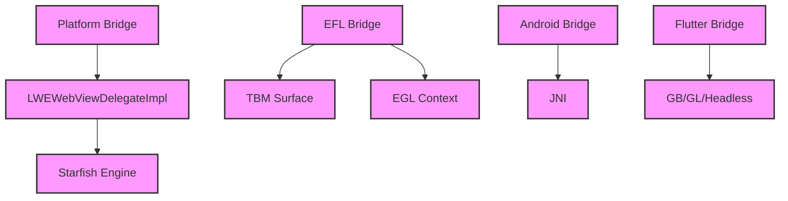

# Module Design Card — public-bridge

> **Relevant source files**
> - [`efl/LWEWebViewEFL.cpp`](src:src/public/bridge/efl/LWEWebViewEFL.cpp)
> - [`ecore_wl2/LWEWebViewEcoreWl2.cpp`](src:src/public/bridge/ecore_wl2/LWEWebViewEcoreWl2.cpp)
> - [`ecore_x/LWEWebViewEcoreX.cpp`](src:src/public/bridge/ecore_x/LWEWebViewEcoreX.cpp)
> - [`flutter/LWEWebViewFlutter.cpp`](src:src/public/bridge/flutter/LWEWebViewFlutter.cpp)
> - [`x11/LWEWebViewX11.cpp`](src:src/public/bridge/x11/LWEWebViewX11.cpp)
> - [`tcore_wl/LWEWebViewTcoreWl.cpp`](src:src/public/bridge/tcore_wl/LWEWebViewTcoreWl.cpp)
> - [`android/AndroidBridge.cpp`](src:src/public/bridge/android/AndroidBridge.cpp)
> - [`efl/A11yAtspiBridge.h`](src:src/public/bridge/efl/A11yAtspiBridge.h)
> - (12 additional bridge files)

## Module Boundary

**Rationale:** Platform-specific window system integration bridges [`module-groups.yaml`](src:code2spec/.analysis/state/delta/module-groups.yaml)
**Confidence:** 0.87

## Source Files

20 files in `src/public/bridge/` covering EFL, Ecore WL2, Ecore X, Flutter, X11, Tcore WL, and Android platform bridges.

## Public Interface

| Component | Entry Point | Source |
|---|---|---|
| EFL Bridge | `LWEWebViewEFL` | [`efl/LWEWebViewEFL.cpp`](src:src/public/bridge/efl/LWEWebViewEFL.cpp) |
| Android Bridge | `AndroidBridge` | [`android/AndroidBridge.cpp`](src:src/public/bridge/android/AndroidBridge.cpp) |
| Flutter Bridge | `LWEWebViewFlutter` | [`flutter/LWEWebViewFlutter.cpp`](src:src/public/bridge/flutter/LWEWebViewFlutter.cpp) |

## Key Flow

## Architectural Rules

- EFL bridge uses threaded TBM presenter with raw EGL context [`LWEWebViewEFL.cpp`](src:src/public/bridge/efl/LWEWebViewEFL.cpp#L34)
- EGL headers must precede Elementary.h to avoid type conflicts [`LWEWebViewEFL.cpp`](src:src/public/bridge/efl/LWEWebViewEFL.cpp#L43)
- Flutter bridge supports window backends: GB, GL, HEADLESS [`LWEWebViewFlutter.cpp`](src:src/public/bridge/flutter/LWEWebViewFlutter.cpp#L82)
- Flutter bridge supports compositor backends: CAIRO, GL, MOCK [`LWEWebViewFlutter.cpp`](src:src/public/bridge/flutter/LWEWebViewFlutter.cpp#L83)
- Owner states: FREE, ENGINE, READY, DISPLAYING/PRESENTING [`LWEWebViewEFL.cpp`](src:src/public/bridge/efl/LWEWebViewEFL.cpp#L153)
- `setupEventHandlers` is an entry point for Ecore bridges [`ecore_wl2/LWEWebViewEcoreWl2.cpp`](src:src/public/bridge/ecore_wl2/LWEWebViewEcoreWl2.cpp)

## Dependencies

| Dependency | Type |
|---|---|
| public-delegate (LWEWebViewDelegateImpl) | Internal |
| public-contract | Internal |
| EGL/OpenGL ES | External |
| EFL/Ecore (Tizen) | External |
| JNI (Android) | External |

## IPC / Message / Interface Contracts

- Android bridge uses JNI for Java↔C++ communication. [`AndroidBridge.cpp`](src:src/public/bridge/android/AndroidBridge.cpp)
- `callOnLoadResourceHandler` and `registerWebContainerHandler` are Android bridge entry points. [`AndroidBridge.cpp`](src:src/public/bridge/android/AndroidBridge.cpp)
- EFL bridge uses Ecore evas callbacks for event handling. [`LWEWebViewEFL.cpp`](src:src/public/bridge/efl/LWEWebViewEFL.cpp)

## Quick Navigation

- [FR Document](../functional-requirements/public-bridge-fr.md)
- [Architecture](../02-architecture.md)
