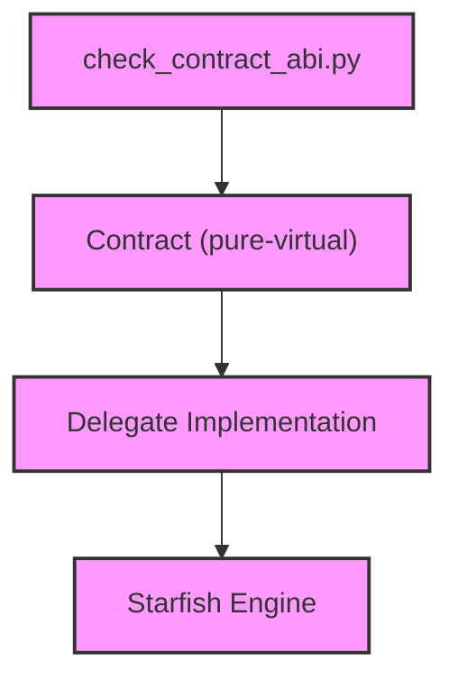

# Module Design Card — public-contract

> **Relevant source files**
> - [`LWEWebViewDelegate.h`](src:src/public/contract/LWEWebViewDelegate.h)
> - [`LWEDelegate.h`](src:src/public/contract/LWEDelegate.h)
> - [`LWEWebContainerDelegate.h`](src:src/public/contract/LWEWebContainerDelegate.h)
> - [`LWEWorkerDelegate.h`](src:src/public/contract/LWEWorkerDelegate.h)
> - [`CookieManagerDelegate.h`](src:src/public/contract/CookieManagerDelegate.h)
> - [`SettingsDelegate.h`](src:src/public/contract/SettingsDelegate.h)
> - [`ResourceErrorDelegate.h`](src:src/public/contract/ResourceErrorDelegate.h)
> - [`LWEDelegateConfig.h`](src:src/public/contract/LWEDelegateConfig.h)
> - [`LWEWorkerDelegate.h`](src:src/public/contract/LWEWorkerDelegate.h)

## Module Boundary

**Rationale:** Pure-virtual interfaces across the .so boundary [`module-groups.yaml`](src:code2spec/.analysis/state/delta/module-groups.yaml)
**Confidence:** 0.90

## Source Files

9 files in `src/public/contract/` defining pure-virtual interfaces for WebView, WebContainer, Worker, Cookie, Settings, and ResourceError delegates.

## Public Interface

| Contract | Class | Source |
|---|---|---|
| WebView | `LWEDelegate::WebView` | [`LWEWebViewDelegate.h`](src:src/public/contract/LWEWebViewDelegate.h#L35) |
| WebContainer | `LWEDelegate::WebContainer` | [`LWEWebContainerDelegate.h`](src:src/public/contract/LWEWebContainerDelegate.h) |
| Worker | `LWEDelegate::Worker` | [`LWEWorkerDelegate.h`](src:src/public/contract/LWEWorkerDelegate.h) |
| Cookie | `LWEDelegate::CookieManager` | [`CookieManagerDelegate.h`](src:src/public/contract/CookieManagerDelegate.h) |
| Settings | `LWEDelegate::Settings` | [`SettingsDelegate.h`](src:src/public/contract/SettingsDelegate.h) |

## Key Flow

## Architectural Rules

- `WebView::Create` is a static factory: win, x, y, width, height, devicePixelRatio, defaultFontName, locale, timezoneID [`LWEWebViewDelegate.h`](src:src/public/contract/LWEWebViewDelegate.h#L37)
- All methods are pure virtual (`= 0`) [`LWEWebViewDelegate.h`](src:src/public/contract/LWEWebViewDelegate.h#L42)
- `EXPORT_UNMANAGED_API` macro for .so export [`LWEWebViewDelegate.h`](src:src/public/contract/LWEWebViewDelegate.h#L35)
- ABI stability checked by `check_contract_abi.py` [`AGENTS.md`](src:AGENTS.md)

## Dependencies

| Dependency | Type |
|---|---|
| LWEDelegateConfig | Internal |

## IPC / Message / Interface Contracts

- Contract interfaces define the .so boundary API. All virtual methods cross this boundary. [`LWEWebViewDelegate.h`](src:src/public/contract/LWEWebViewDelegate.h)
- `RegisterOnStatusChangedHandler` in `LWEWorkerDelegate` is a worker status callback. [`LWEWorkerDelegate.h`](src:src/public/contract/LWEWorkerDelegate.h)

## Quick Navigation

- [FR Document](../functional-requirements/public-contract-fr.md)
- [Architecture](../02-architecture.md)
