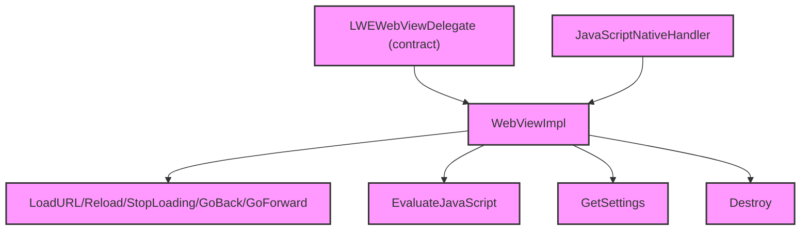

# Module Design Card — public-delegate

> **Relevant source files**
> - [`LWEWebViewDelegateImpl.h`](src:src/public/delegate/LWEWebViewDelegateImpl.h)
> - [`LWEWebViewDelegateImpl.cpp`](src:src/public/delegate/LWEWebViewDelegateImpl.cpp)
> - [`LWEWebContainerDelegate.cpp`](src:src/public/delegate/LWEWebContainerDelegate.cpp)
> - [`LWEWorkerDelegate.cpp`](src:src/public/delegate/LWEWorkerDelegate.cpp)
> - [`JavaScriptNativeHandler.cpp`](src:src/public/delegate/JavaScriptNativeHandler.cpp)
> - [`ThreadedCallHelper.h`](src:src/public/delegate/ThreadedCallHelper.h)
> - (8 additional delegate files)

## Module Boundary

**Rationale:** Concrete delegate implementations for the contract interfaces [`module-groups.yaml`](src:code2spec/.analysis/state/delta/module-groups.yaml)
**Confidence:** 0.89

## Source Files

14 files in `src/public/delegate/` implementing the contract interfaces for WebView, WebContainer, Worker, and JavaScript native handler.

## Public Interface

| Component | Class | Source |
|---|---|---|
| WebView Delegate | `WebViewImpl` | [`LWEWebViewDelegateImpl.h`](src:src/public/delegate/LWEWebViewDelegateImpl.h#L26) |
| WebContainer Delegate | `LWEWebContainerDelegate` | [`LWEWebContainerDelegate.cpp`](src:src/public/delegate/LWEWebContainerDelegate.cpp) |
| Worker Delegate | `LWEWorkerDelegate` | [`LWEWorkerDelegate.cpp`](src:src/public/delegate/LWEWorkerDelegate.cpp) |
| JS Native Handler | `JavaScriptNativeHandler` | [`JavaScriptNativeHandler.cpp`](src:src/public/delegate/JavaScriptNativeHandler.cpp) |

## Key Flow

## Architectural Rules

- `WebViewImpl` extends `WebView` (contract) and overrides all virtual methods [`LWEWebViewDelegateImpl.h`](src:src/public/delegate/LWEWebViewDelegateImpl.h#L26)
- Key methods: `Destroy`, `GetSettings`, `LoadURL`, `GetURL`, `LoadData`, `Reload`, `StopLoading`, `GoBack`, `GoForward`, `CanGoBack`, `CanGoForward`, `Pause`, `Resume`, `AddJavaScriptInterface`, `EvaluateJavaScript` [`LWEWebViewDelegateImpl.h`](src:src/public/delegate/LWEWebViewDelegateImpl.h#L28)
- `RegisterPreRenderingHandler`, `RegisterOnRenderedHandler`, `RegisterDebuggerShouldInitHandler`, `RegisterDebuggerShouldContinueWaitingHandler` are entry points [`LWEWebContainerDelegate.cpp`](src:src/public/delegate/LWEWebContainerDelegate.cpp)
- `JavaScriptNativeHandler` is an entry point for native JS callbacks [`JavaScriptNativeHandler.cpp`](src:src/public/delegate/JavaScriptNativeHandler.cpp)
- `ThreadedCallHelper` provides threaded call support for delegate methods [`ThreadedCallHelper.h`](src:src/public/delegate/ThreadedCallHelper.h)

## Dependencies

| Dependency | Type |
|---|---|
| public-contract | Internal |
| core-engine | Internal |
| compat-headers | Internal |

## IPC / Message / Interface Contracts

- Delegate methods cross the `.so` boundary via virtual dispatch. [`LWEWebViewDelegateImpl.h`](src:src/public/delegate/LWEWebViewDelegateImpl.h)
- `RegisterOnStatusChangedHandler` in `LWEWorkerDelegate` is a worker status callback entry point. [`LWEWorkerDelegate.cpp`](src:src/public/delegate/LWEWorkerDelegate.cpp)

## Quick Navigation

- [FR Document](../functional-requirements/public-delegate-fr.md)
- [Architecture](../02-architecture.md)
