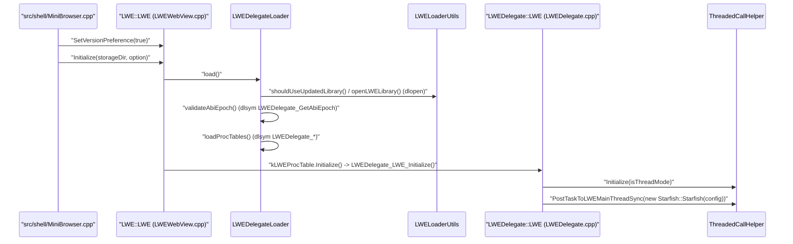
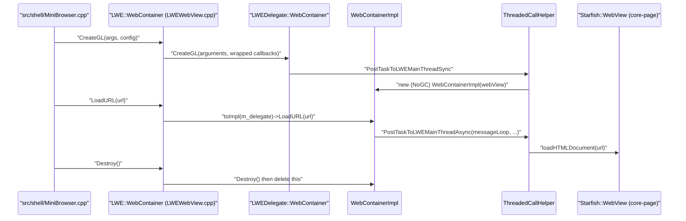
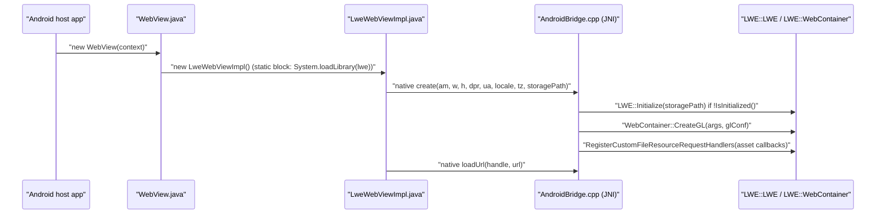

# Module Design Card: public-embedder-api

> **Relevant source files**
>
> - [compat/tizen_5.0/inc/LWEWebView.h](src:compat/tizen_5.0/inc/LWEWebView.h)
> - [inc/LWEWebView.h](src:inc/LWEWebView.h)
> - [inc/LWEWorker.h](src:inc/LWEWorker.h)
> - [inc/PlatformIntegrationData.h](src:inc/PlatformIntegrationData.h)
> - [src/public/APIRecorder.cpp](src:src/public/APIRecorder.cpp)
> - [src/public/APIRecorder.h](src:src/public/APIRecorder.h)
> - [src/public/LWEDelegateLoader.cpp](src:src/public/LWEDelegateLoader.cpp)
> - [src/public/LWEDelegateLoader.h](src:src/public/LWEDelegateLoader.h)
> - [src/public/LWELoaderUtils.cpp](src:src/public/LWELoaderUtils.cpp)
> - [src/public/LWELoaderUtils.h](src:src/public/LWELoaderUtils.h)
> - [src/public/LWEWebView.cpp](src:src/public/LWEWebView.cpp)
> - [src/public/LWEWorker.cpp](src:src/public/LWEWorker.cpp)
> - [src/public/LWEWorkerDelegateLoader.cpp](src:src/public/LWEWorkerDelegateLoader.cpp)
> - [src/public/LWEWorkerDelegateLoader.h](src:src/public/LWEWorkerDelegateLoader.h)
> - [src/public/bridge/android/AndroidBridge.cpp](src:src/public/bridge/android/AndroidBridge.cpp)
> - [src/public/bridge/android/java/com/samsung/android/lightweightwebengine/DownloadListener.java](src:src/public/bridge/android/java/com/samsung/android/lightweightwebengine/DownloadListener.java)
> - [src/public/bridge/android/java/com/samsung/android/lightweightwebengine/WebChromeClient.java](src:src/public/bridge/android/java/com/samsung/android/lightweightwebengine/WebChromeClient.java)
> - [src/public/bridge/android/java/com/samsung/android/lightweightwebengine/WebResourceError.java](src:src/public/bridge/android/java/com/samsung/android/lightweightwebengine/WebResourceError.java)
> - [src/public/bridge/android/java/com/samsung/android/lightweightwebengine/WebResourceRequest.java](src:src/public/bridge/android/java/com/samsung/android/lightweightwebengine/WebResourceRequest.java)
> - [src/public/bridge/android/java/com/samsung/android/lightweightwebengine/WebResourceRequestImpl.java](src:src/public/bridge/android/java/com/samsung/android/lightweightwebengine/WebResourceRequestImpl.java)
> - [src/public/bridge/android/java/com/samsung/android/lightweightwebengine/WebResourceResponse.java](src:src/public/bridge/android/java/com/samsung/android/lightweightwebengine/WebResourceResponse.java)
> - [src/public/bridge/android/java/com/samsung/android/lightweightwebengine/WebSettings.java](src:src/public/bridge/android/java/com/samsung/android/lightweightwebengine/WebSettings.java)
> - [src/public/bridge/android/java/com/samsung/android/lightweightwebengine/WebView.java](src:src/public/bridge/android/java/com/samsung/android/lightweightwebengine/WebView.java)
> - [src/public/bridge/android/java/com/samsung/android/lightweightwebengine/WebViewClient.java](src:src/public/bridge/android/java/com/samsung/android/lightweightwebengine/WebViewClient.java)
> - [src/public/bridge/android/java/com/samsung/android/lightweightwebengine/internal/LweWebView.java](src:src/public/bridge/android/java/com/samsung/android/lightweightwebengine/internal/LweWebView.java)
> - [src/public/bridge/android/java/com/samsung/android/lightweightwebengine/internal/LweWebViewImpl.java](src:src/public/bridge/android/java/com/samsung/android/lightweightwebengine/internal/LweWebViewImpl.java)
> - [src/public/bridge/ecore_wl2/LWEWebViewEcoreWl2.cpp](src:src/public/bridge/ecore_wl2/LWEWebViewEcoreWl2.cpp)
> - [src/public/bridge/ecore_x/LWEWebViewEcoreX.cpp](src:src/public/bridge/ecore_x/LWEWebViewEcoreX.cpp)
> - [src/public/bridge/efl/A11yAtspiBridge.cpp](src:src/public/bridge/efl/A11yAtspiBridge.cpp)
> - [src/public/bridge/efl/A11yAtspiBridge.h](src:src/public/bridge/efl/A11yAtspiBridge.h)
> - [src/public/bridge/efl/LWEWebViewEFL.cpp](src:src/public/bridge/efl/LWEWebViewEFL.cpp)
> - [src/public/bridge/flutter/LWEWebViewFlutter.cpp](src:src/public/bridge/flutter/LWEWebViewFlutter.cpp)
> - [src/public/bridge/tcore_wl/LWEWebViewTcoreWl.cpp](src:src/public/bridge/tcore_wl/LWEWebViewTcoreWl.cpp)
> - [src/public/bridge/x11/LWEWebViewX11.cpp](src:src/public/bridge/x11/LWEWebViewX11.cpp)
> - [src/public/contract/CookieManagerDelegate.h](src:src/public/contract/CookieManagerDelegate.h)
> - [src/public/contract/LWEDelegate.h](src:src/public/contract/LWEDelegate.h)
> - [src/public/contract/LWEDelegateConfig.h](src:src/public/contract/LWEDelegateConfig.h)
> - [src/public/contract/LWEDelegateContract.h](src:src/public/contract/LWEDelegateContract.h)
> - [src/public/contract/LWEWebContainerDelegate.h](src:src/public/contract/LWEWebContainerDelegate.h)
> - [src/public/contract/LWEWebViewDelegate.h](src:src/public/contract/LWEWebViewDelegate.h)
> - [src/public/contract/LWEWorkerDelegate.h](src:src/public/contract/LWEWorkerDelegate.h)
> - [src/public/contract/ResourceErrorDelegate.h](src:src/public/contract/ResourceErrorDelegate.h)
> - [src/public/contract/SettingsDelegate.h](src:src/public/contract/SettingsDelegate.h)
> - [src/public/delegate/CookieManagerDelegate.cpp](src:src/public/delegate/CookieManagerDelegate.cpp)
> - [src/public/delegate/JavaScriptNativeHandler.cpp](src:src/public/delegate/JavaScriptNativeHandler.cpp)
> - [src/public/delegate/JavaScriptNativeHandler.h](src:src/public/delegate/JavaScriptNativeHandler.h)
> - [src/public/delegate/LWEDelegate.cpp](src:src/public/delegate/LWEDelegate.cpp)
> - [src/public/delegate/LWEWebContainerDelegate.cpp](src:src/public/delegate/LWEWebContainerDelegate.cpp)
> - [src/public/delegate/LWEWebViewDelegate.cpp](src:src/public/delegate/LWEWebViewDelegate.cpp)
> - [src/public/delegate/LWEWebViewDelegateImpl.cpp](src:src/public/delegate/LWEWebViewDelegateImpl.cpp)
> - [src/public/delegate/LWEWebViewDelegateImpl.h](src:src/public/delegate/LWEWebViewDelegateImpl.h)
> - [src/public/delegate/LWEWorkerDelegate.cpp](src:src/public/delegate/LWEWorkerDelegate.cpp)
> - [src/public/delegate/ResourceErrorDelegate.cpp](src:src/public/delegate/ResourceErrorDelegate.cpp)
> - [src/public/delegate/SettingsBoolean.h](src:src/public/delegate/SettingsBoolean.h)
> - [src/public/delegate/SettingsDelegate.cpp](src:src/public/delegate/SettingsDelegate.cpp)
> - [src/public/delegate/ThreadedCallHelper.cpp](src:src/public/delegate/ThreadedCallHelper.cpp)
> - [src/public/delegate/ThreadedCallHelper.h](src:src/public/delegate/ThreadedCallHelper.h)
> - [docs/uwe.md](src:docs/uwe.md)
> - [build/starfish_public_api.cmake](src:build/starfish_public_api.cmake)
> - [build/worker_public_api.cmake](src:build/worker_public_api.cmake)
> - [tool/lint/contract_abi/contract_shim.cpp](src:tool/lint/contract_abi/contract_shim.cpp)
> - [tool/lint/check_contract_abi.py](src:tool/lint/check_contract_abi.py)
> - [src/shell/MiniBrowser.cpp](src:src/shell/MiniBrowser.cpp)
> - [src/shell/APIReplayer.cpp](src:src/shell/APIReplayer.cpp)
> - [src/shell/windows/StarfishShell.cpp](src:src/shell/windows/StarfishShell.cpp)
> - [src/shell/test/WebViewTest.cpp](src:src/shell/test/WebViewTest.cpp)
> - [src/launcher/ServiceWorkerEntry.cpp](src:src/launcher/ServiceWorkerEntry.cpp)
> - [src/launcher/SharedWorkerEntry.cpp](src:src/launcher/SharedWorkerEntry.cpp)
> - [src/Starfish.cpp](src:src/Starfish.cpp)

**Module**: `public-embedder-api` — 57 files under `inc/`, `compat/tizen_5.0/inc/`, `src/public/` (root, `bridge/`, `contract/`, `delegate/`)
**Role**: Exposes the embedder-facing `LWE::` API (engine lifecycle, WebContainer, WebView, Settings, CookieManager, ResourceError, worker hosts) as thin wrappers that hold an opaque delegate handle and forward every call to an `LWEDelegate::` implementation that is either linked directly or resolved at run time through a shared-library loader. [`LWE`](src:inc/LWEWebView.h#L97) [`LWEDelegateRef`](src:inc/LWEWebView.h#L49) [`LWEDelegateLoader`](src:src/public/LWEDelegateLoader.h#L36)
**Module Boundary**: Public embedder API implementation (src/public/LWEWebView.cpp, bridge/, delegate/, contract/) with its exported headers inc/LWEWebView.h, inc/LWEWorker.h and the compat/tizen_5.0 header copy — strong LWEWebView name match across directories
**Confidence**: 0.88 (taken from the confidence column of code2spec/.analysis/analysis-notes/module-priority-reviewed.md; the module-groups.yaml entry records no value)
**Core selection**: All approved modules are Core (boundary approved in W1 human review)
**Generated**: 2026-09-10

## Source Files

### Exported headers (`inc/`, `compat/`)
- [inc/LWEWebView.h](src:inc/LWEWebView.h) — `LWE`, `CookieManager`, `Settings`, `ResourceError`, `WebContainer`, `WebView`
- [inc/LWEWorker.h](src:inc/LWEWorker.h) — `ServiceWorker`, `SharedWorker`, `WorkerProcessState`
- [inc/PlatformIntegrationData.h](src:inc/PlatformIntegrationData.h) — `KeyValue`, `MouseButtonValue`, `MouseButtonsValue`, `TTSMode`, `WebSecurityMode`, `IdleModeJob`
- [compat/tizen_5.0/inc/LWEWebView.h](src:compat/tizen_5.0/inc/LWEWebView.h) — Tizen 5.0 header copy (`WebContainer::Create` takes a caller-owned buffer)

### API library side (`src/public/`)
- [src/public/LWEWebView.cpp](src:src/public/LWEWebView.cpp)
- [src/public/LWEWorker.cpp](src:src/public/LWEWorker.cpp)
- [src/public/LWEDelegateLoader.h](src:src/public/LWEDelegateLoader.h), [src/public/LWEDelegateLoader.cpp](src:src/public/LWEDelegateLoader.cpp)
- [src/public/LWEWorkerDelegateLoader.h](src:src/public/LWEWorkerDelegateLoader.h), [src/public/LWEWorkerDelegateLoader.cpp](src:src/public/LWEWorkerDelegateLoader.cpp)
- [src/public/LWELoaderUtils.h](src:src/public/LWELoaderUtils.h), [src/public/LWELoaderUtils.cpp](src:src/public/LWELoaderUtils.cpp)
- [src/public/APIRecorder.h](src:src/public/APIRecorder.h), [src/public/APIRecorder.cpp](src:src/public/APIRecorder.cpp)

### Binary contract (`src/public/contract/`)
- [src/public/contract/LWEDelegateConfig.h](src:src/public/contract/LWEDelegateConfig.h)
- [src/public/contract/LWEDelegateContract.h](src:src/public/contract/LWEDelegateContract.h)
- [src/public/contract/LWEDelegate.h](src:src/public/contract/LWEDelegate.h)
- [src/public/contract/LWEWebContainerDelegate.h](src:src/public/contract/LWEWebContainerDelegate.h)
- [src/public/contract/LWEWebViewDelegate.h](src:src/public/contract/LWEWebViewDelegate.h)
- [src/public/contract/SettingsDelegate.h](src:src/public/contract/SettingsDelegate.h)
- [src/public/contract/CookieManagerDelegate.h](src:src/public/contract/CookieManagerDelegate.h)
- [src/public/contract/ResourceErrorDelegate.h](src:src/public/contract/ResourceErrorDelegate.h)
- [src/public/contract/LWEWorkerDelegate.h](src:src/public/contract/LWEWorkerDelegate.h)

### Implementation side (`src/public/delegate/`)
- [src/public/delegate/LWEDelegate.cpp](src:src/public/delegate/LWEDelegate.cpp)
- [src/public/delegate/LWEWebContainerDelegate.cpp](src:src/public/delegate/LWEWebContainerDelegate.cpp)
- [src/public/delegate/LWEWebViewDelegate.cpp](src:src/public/delegate/LWEWebViewDelegate.cpp)
- [src/public/delegate/LWEWebViewDelegateImpl.h](src:src/public/delegate/LWEWebViewDelegateImpl.h), [src/public/delegate/LWEWebViewDelegateImpl.cpp](src:src/public/delegate/LWEWebViewDelegateImpl.cpp)
- [src/public/delegate/SettingsDelegate.cpp](src:src/public/delegate/SettingsDelegate.cpp), [src/public/delegate/SettingsBoolean.h](src:src/public/delegate/SettingsBoolean.h)
- [src/public/delegate/CookieManagerDelegate.cpp](src:src/public/delegate/CookieManagerDelegate.cpp)
- [src/public/delegate/ResourceErrorDelegate.cpp](src:src/public/delegate/ResourceErrorDelegate.cpp)
- [src/public/delegate/LWEWorkerDelegate.cpp](src:src/public/delegate/LWEWorkerDelegate.cpp)
- [src/public/delegate/JavaScriptNativeHandler.h](src:src/public/delegate/JavaScriptNativeHandler.h), [src/public/delegate/JavaScriptNativeHandler.cpp](src:src/public/delegate/JavaScriptNativeHandler.cpp)
- [src/public/delegate/ThreadedCallHelper.h](src:src/public/delegate/ThreadedCallHelper.h), [src/public/delegate/ThreadedCallHelper.cpp](src:src/public/delegate/ThreadedCallHelper.cpp)

### Platform bridges (`src/public/bridge/`)
- [src/public/bridge/efl/LWEWebViewEFL.cpp](src:src/public/bridge/efl/LWEWebViewEFL.cpp), [src/public/bridge/efl/A11yAtspiBridge.h](src:src/public/bridge/efl/A11yAtspiBridge.h), [src/public/bridge/efl/A11yAtspiBridge.cpp](src:src/public/bridge/efl/A11yAtspiBridge.cpp)
- [src/public/bridge/ecore_wl2/LWEWebViewEcoreWl2.cpp](src:src/public/bridge/ecore_wl2/LWEWebViewEcoreWl2.cpp)
- [src/public/bridge/ecore_x/LWEWebViewEcoreX.cpp](src:src/public/bridge/ecore_x/LWEWebViewEcoreX.cpp)
- [src/public/bridge/tcore_wl/LWEWebViewTcoreWl.cpp](src:src/public/bridge/tcore_wl/LWEWebViewTcoreWl.cpp)
- [src/public/bridge/x11/LWEWebViewX11.cpp](src:src/public/bridge/x11/LWEWebViewX11.cpp)
- [src/public/bridge/flutter/LWEWebViewFlutter.cpp](src:src/public/bridge/flutter/LWEWebViewFlutter.cpp)
- [src/public/bridge/android/AndroidBridge.cpp](src:src/public/bridge/android/AndroidBridge.cpp)
- Android Java facade: [WebView.java](src:src/public/bridge/android/java/com/samsung/android/lightweightwebengine/WebView.java), [WebViewClient.java](src:src/public/bridge/android/java/com/samsung/android/lightweightwebengine/WebViewClient.java), [WebChromeClient.java](src:src/public/bridge/android/java/com/samsung/android/lightweightwebengine/WebChromeClient.java), [WebSettings.java](src:src/public/bridge/android/java/com/samsung/android/lightweightwebengine/WebSettings.java), [DownloadListener.java](src:src/public/bridge/android/java/com/samsung/android/lightweightwebengine/DownloadListener.java), [WebResourceError.java](src:src/public/bridge/android/java/com/samsung/android/lightweightwebengine/WebResourceError.java), [WebResourceRequest.java](src:src/public/bridge/android/java/com/samsung/android/lightweightwebengine/WebResourceRequest.java), [WebResourceRequestImpl.java](src:src/public/bridge/android/java/com/samsung/android/lightweightwebengine/WebResourceRequestImpl.java), [WebResourceResponse.java](src:src/public/bridge/android/java/com/samsung/android/lightweightwebengine/WebResourceResponse.java), [internal/LweWebView.java](src:src/public/bridge/android/java/com/samsung/android/lightweightwebengine/internal/LweWebView.java), [internal/LweWebViewImpl.java](src:src/public/bridge/android/java/com/samsung/android/lightweightwebengine/internal/LweWebViewImpl.java)

## Public Interface

| Function/Class | Signature | Main callers | Source |
|---|---|---|---|
| `LWE::LWE::Initialize` | `static void Initialize(const char* storageDirectoryPath, InitializeOption option = InitializeOption::None)` | src/shell/MiniBrowser.cpp, src/shell/windows/StarfishShell.cpp, src/public/bridge/android/AndroidBridge.cpp | [`LWE::Initialize`](src:inc/LWEWebView.h#L137) |
| `LWE::LWE::SetVersionPreference` | `static void SetVersionPreference(bool preferUpdatedVersion)` | src/shell/MiniBrowser.cpp | [`LWE::SetVersionPreference`](src:inc/LWEWebView.h#L107) |
| `LWE::LWE::IsInitialized` | `static bool IsInitialized()` | src/public/bridge/android/AndroidBridge.cpp | [`LWE::IsInitialized`](src:inc/LWEWebView.h#L147) |
| `LWE::LWE::GetVersion` | `static void GetVersion(int* major, int* minor, int* patch)` | src/shell/MiniBrowser.cpp | [`LWE::GetVersion`](src:inc/LWEWebView.h#L177) |
| `LWE::LWE::SetGCFrequency` | `static void SetGCFrequency(unsigned char freq)` | src/shell/MiniBrowser.cpp | [`LWE::SetGCFrequency`](src:inc/LWEWebView.h#L172) |
| `LWE::WebContainer::CreateGL` | `static WebContainer* CreateGL(const WebContainerArguments& args, const RendererGLConfiguration& config)` | src/shell/MiniBrowser.cpp, src/shell/windows/StarfishShell.cpp, src/public/bridge/android/AndroidBridge.cpp | [`WebContainer::CreateGL`](src:inc/LWEWebView.h#L361) |
| `LWE::WebContainer::CreateHeadless` | `static WebContainer* CreateHeadless(unsigned width, unsigned height, float devicePixelRatio, const char* defaultFontName, const char* locale, const char* timezoneID)` | src/shell/MiniBrowser.cpp | [`WebContainer::CreateHeadless`](src:inc/LWEWebView.h#L375) |
| `LWE::WebContainer::Create` | `static WebContainer* Create(unsigned width, unsigned height, float devicePixelRatio, const char* defaultFontName, const char* locale, const char* timezoneID)` | Compat build: `compat/tizen_5.0/inc/LWEWebView.h` overload with caller buffer; no caller found under src/shell | [`WebContainer::Create`](src:inc/LWEWebView.h#L293) |
| `LWE::WebView::Create` | `static WebView* Create(void* win, unsigned x, unsigned y, unsigned width, unsigned height, float devicePixelRatio, const char* defaultFontName, const char* locale, const char* timezoneID)` | src/shell/MiniBrowser.cpp, src/shell/test/WebViewTest.cpp | [`WebView::Create`](src:inc/LWEWebView.h#L575) |
| `LWE::WebView::Unwrap` | `void* Unwrap()` | src/shell/MiniBrowser.cpp | [`WebView::Unwrap`](src:inc/LWEWebView.h#L1030) |
| `LWE::CookieManager::GetInstance` | `static CookieManager* GetInstance()` | src/shell/APIReplayer.cpp | [`CookieManager::GetInstance`](src:inc/LWEWebView.h#L201) |
| `LWE::Settings::UpdateSetting` | `bool UpdateSetting(const std::string& key, const std::string& value)` | Public setting store used by `WebContainer::SetSettings` callers in src/shell and AndroidBridge.cpp | [`Settings::UpdateSetting`](src:inc/LWEWebView.h#L222) |
| `LWE::ServiceWorker::Initialize` | `static void Initialize(const std::string &storageDirectoryPath)` | src/launcher/ServiceWorkerEntry.cpp | [`ServiceWorker::Initialize`](src:inc/LWEWorker.h#L75) |
| `LWE::SharedWorker::Initialize` | `static void Initialize(const std::string &storageDirectoryPath)` | src/launcher/SharedWorkerEntry.cpp | [`SharedWorker::Initialize`](src:inc/LWEWorker.h#L136) |
| `LWE::ServiceWorker::RegisterOnStatusChangedHandler` | `static void RegisterOnStatusChangedHandler(const std::function<void(WorkerProcessState)> &cb)` | src/launcher/ServiceWorkerEntry.cpp | [`ServiceWorker::RegisterOnStatusChangedHandler`](src:inc/LWEWorker.h#L94) |
| `LWEDelegate_GetAbiEpoch` (C symbol) | `uint32_t LWEDelegate_GetAbiEpoch()` | Resolved with `dlsym` by `LWEDelegateLoader` and `LWEWorkerDelegateLoader`; compiled by tool/lint/contract_abi/contract_shim.cpp | [`LWEDelegate_GetAbiEpoch`](src:src/public/contract/LWEDelegateContract.h#L26) |
| `LWEProcTable` | `typedef struct { void (*Initialize)(const char*, uint32_t); bool (*IsInitialized)(); void (*Finalize)(); unsigned char (*GetGCFrequency)(); void (*SetGCFrequency)(unsigned char); void (*GetVersion)(int*, int*, int*); bool (*IsUsingSeparateThread)(); } LWEProcTable` | src/public/LWEDelegateLoader.h (`kLWEProcTable`) | [`LWEProcTable`](src:src/public/contract/LWEDelegate.h#L78) |
| `WebContainerProcTable` | `typedef struct { ... } WebContainerProcTable` (Create, CreateWithBuffer, CreateWithPlatformImage, CreateGL, CreateGLWithPlatformImage, CreateHeadless) | src/public/LWEDelegateLoader.cpp | [`WebContainerProcTable`](src:src/public/contract/LWEWebContainerDelegate.h#L353) |
| `com.samsung.android.lightweightwebengine.WebView` (Java) | `public class WebView extends SurfaceView` | Android host application (outside this repository); instantiates `LweWebViewImpl` | [`WebView`](src:src/public/bridge/android/java/com/samsung/android/lightweightwebengine/WebView.java#L33) |
| `Java_com_samsung_android_lightweightwebengine_internal_LweWebViewImpl_create` (JNI) | `jlong create(JNIEnv*, jobject, jobject assetManager, jint w, jint h, jfloat devicePixelRatio, jstring jua, jstring locale, jstring timezoneID, jstring storagePath)` | `native private long create(...)` in LweWebViewImpl.java | [`Java_com_samsung_android_lightweightwebengine_internal_LweWebViewImpl_create`](src:src/public/bridge/android/AndroidBridge.cpp#L637) |

## IPC / Message / Interface Contracts

- **Delegate binary contract (in-process, shared-library boundary, not IPC).** When built with `STARFISH_API_ENABLE_LOADER`, the API library `dlopen`s the implementation library, resolves `LWEDelegate_GetAbiEpoch` with `dlsym` and rejects the library unless the returned epoch equals `kDelegateAbiEpoch` (value 1); only then are the `LWEDelegate_*` C symbols resolved into the static ProcTables. [`LWEDelegateLoader::validateAbiEpoch`](src:src/public/LWEDelegateLoader.cpp#L86) [`LWEDelegateLoader::loadProcTables`](src:src/public/LWEDelegateLoader.cpp#L106) [`kDelegateAbiEpoch`](src:src/public/contract/LWEDelegateContract.h#L21) [`LWEDelegate_GetAbiEpoch`](src:src/public/delegate/LWEDelegate.cpp#L214)
- **Worker delegate contract.** The worker host performs the same epoch check and resolves `LWEWorkerDelegate_LWEWorker_Initialize`, `..._RegisterOnStatusChangedHandler`, `..._Finalize` into `LWEWorkerProcTable`. [`LWEWorkerDelegateLoader::validateAbiEpoch`](src:src/public/LWEWorkerDelegateLoader.cpp#L90) [`LWEWorkerDelegateLoader::loadLWEWorkerProcTable`](src:src/public/LWEWorkerDelegateLoader.cpp#L129) [`LWEWorkerProcTable`](src:src/public/contract/LWEWorkerDelegate.h#L61)
- **AT-SPI2 accessibility bus (cross-process, D-Bus; EFL bridge only).** The EFL bridge registers an ATK plug with `atk_bridge_adaptor_init`, publishes its plug id, and installs a D-Bus filter that answers method calls on interface `org.a11y.atspi.Accessible`, member `DoGesture`, replying with a boolean "consumed" flag. [`a11yDbusFilter`](src:src/public/bridge/efl/A11yAtspiBridge.cpp#L1309) [`handleA11yGesture`](src:src/public/bridge/efl/A11yAtspiBridge.cpp#L1275) [`A11yAtspiBridge::registerWindow`](src:src/public/bridge/efl/A11yAtspiBridge.cpp#L1574)
- **JNI language bridge (in-process, not IPC).** Java `LweWebViewImpl` natives map to `Java_com_samsung_android_lightweightwebengine_internal_LweWebViewImpl_*` functions; native-to-Java callbacks are cached `jmethodID`s in `WindowGlue`. [`WindowGlue`](src:src/public/bridge/android/AndroidBridge.cpp#L34) [`Java_com_samsung_android_lightweightwebengine_internal_LweWebViewImpl_init`](src:src/public/bridge/android/AndroidBridge.cpp#L123)
- **Worker process state callback (in-process callback here).** `WorkerProcessState::Terminated` is relayed from `Starfish::WorkerAgentState`; any process boundary behind it belongs to the owning worker module. [`LWEWorker::RegisterOnStatusChangedHandler`](src:src/public/delegate/LWEWorkerDelegate.cpp#L74) [`ToWorkerState`](src:src/public/delegate/LWEWorkerDelegate.cpp#L45)

The delegate contract is the module's central architectural boundary: `src/public/contract/*.h` is the only thing an already-installed API library and a later implementation library share, so the headers are treated as append-only and gated by `tool/lint/check_contract_abi.py` ([`contract_shim.cpp`](src:tool/lint/contract_abi/contract_shim.cpp#L79), [`uwe.md`](src:docs/uwe.md#L1)). The D-Bus contract is the only cross-process interface in this module and exists solely so the platform screen reader can drive the web content.

## Key Flow

Entry: [`LWE::Initialize`](src:src/public/LWEWebView.cpp#L68), which calls [`LWEDelegateLoader::load`](src:src/public/LWEDelegateLoader.cpp#L56) and then the implementation [`LWE::Initialize`](src:src/public/delegate/LWEDelegate.cpp#L88).

Entry: [`WebContainer::CreateGL`](src:src/public/LWEWebView.cpp#L617); creation runs in [`WebContainer::Create`](src:src/public/delegate/LWEWebContainerDelegate.cpp#L441)-style factories, navigation in [`WebContainerImpl::LoadURL`](src:src/public/delegate/LWEWebContainerDelegate.cpp#L850), teardown in [`WebContainer::Destroy`](src:src/public/LWEWebView.cpp#L1078).

Entry: [`getLWEWebViewInstance`](src:src/public/bridge/android/java/com/samsung/android/lightweightwebengine/WebView.java#L47) creates [`LweWebViewImpl`](src:src/public/bridge/android/java/com/samsung/android/lightweightwebengine/internal/LweWebViewImpl.java#L67), whose natives reach [`Java_com_samsung_android_lightweightwebengine_internal_LweWebViewImpl_create`](src:src/public/bridge/android/AndroidBridge.cpp#L637).

## Architectural Rules

- [ ] Public API classes hold the implementation only as an opaque `LWEDelegateRef` (`std::unique_ptr<void, std::function<void(void*)>>`) and forward every method through the `toImpl` cast helper; no engine type appears in `inc/`. [`LWEDelegateRef`](src:inc/LWEWebView.h#L49) [`toImpl`](src:src/public/LWEWebView.cpp#L54)
- [ ] Every public method has two build paths selected by `STARFISH_API_ENABLE_LOADER`: ProcTable call through `LWEDelegateLoader::getSafeInstance()` or direct call into `LWEDelegate::`. [`LWE::Initialize`](src:src/public/LWEWebView.cpp#L68) [`LWEDelegateLoader::getSafeInstance`](src:src/public/LWEDelegateLoader.cpp#L47)
- [ ] Contract headers are append-only; `kDelegateAbiEpoch` is incremented only for an intentional incompatible change, and the main engine, SharedWorker and ServiceWorker contracts share the single epoch. [`kDelegateAbiEpoch`](src:src/public/contract/LWEDelegateContract.h#L21) [`uwe.md`](src:docs/uwe.md#L7)
- [ ] `dlsym` results are cast with `decltype(<ProcTable>::<member>)` so the contract typedef is the single place the signature is spelled. [`LWEDelegateLoader::loadLWEProcTable`](src:src/public/LWEDelegateLoader.cpp#L168) [`LWEWorkerDelegateLoader::loadLWEWorkerProcTable`](src:src/public/LWEWorkerDelegateLoader.cpp#L129)
- [ ] The implementation side never touches the engine from the caller thread: engine access is posted to the LWE main thread through `ThreadedCallHelper` (sync for creation/queries, async for navigation). [`ThreadedCallHelper::PostTaskToLWEMainThreadSync`](src:src/public/delegate/ThreadedCallHelper.cpp#L62) [`ThreadedCallHelper::PostTaskToLWEMainThreadAsync`](src:src/public/delegate/ThreadedCallHelper.cpp#L68)
- [ ] `WebContainer` and `WebView` have private destructors and are released only through `Destroy()`, which destroys the delegate and then deletes the wrapper. [`WebContainer::Destroy`](src:src/public/LWEWebView.cpp#L1078) [`WebView::Destroy`](src:src/public/LWEWebView.cpp#L1762)
- [ ] `LWE::Initialize` must run before any other API: the implementation asserts it is not yet initialized, and `CookieManager::GetInstance` logs an error and asserts when called first. [`LWE::Initialize`](src:src/public/delegate/LWEDelegate.cpp#L88) [`CookieManager::GetInstance`](src:src/public/delegate/CookieManagerDelegate.cpp#L70)
- [ ] Each platform bridge supplies exactly one `LWEDelegate::WebView::Create` that returns a `WebViewImpl` subclass; the shared `WebViewImpl` base forwards to the owned `WebContainer`. [`WebViewImpl`](src:src/public/delegate/LWEWebViewDelegateImpl.h#L26) [`WebViewEFL`](src:src/public/bridge/efl/LWEWebViewEFL.cpp#L865) [`WebView::Create`](src:src/public/bridge/efl/LWEWebViewEFL.cpp#L2157)

## Dependencies

### Internal modules

| Module | File(s) | Purpose | Source |
|---|---|---|---|
| [engine-entry](engine-entry.md) | `src/Starfish.h`, `src/StarfishConfig.h`, `src/browser/history/HistoryManager.h` | Engine instance (`Starfish::Starfish`, `StarfishConfiguration`) created by the delegate; history access | [`LWEDelegate.cpp`](src:src/public/delegate/LWEDelegate.cpp#L21) [`LWEWebContainerDelegate.cpp`](src:src/public/delegate/LWEWebContainerDelegate.cpp#L33) |
| [core-page](core-page.md) | `src/core/page/WebView.h`, `Window.h`, `WebBase.h`, `BrowsingContext.h`, `History.h`, `Location.h` | `Starfish::WebView` wrapped by `WebContainerImpl` | [`LWEWebContainerDelegate.cpp`](src:src/public/delegate/LWEWebContainerDelegate.cpp#L36) [`LWEDelegate.cpp`](src:src/public/delegate/LWEDelegate.cpp#L26) |
| [core-dom](core-dom.md) | `src/core/dom/Document.h`, `ExecutionContext.h`, `MouseEvent.h`, `KeyboardEvent.h`, `Touch.h` | Event and document types for input dispatch | [`LWEWebContainerDelegate.cpp`](src:src/public/delegate/LWEWebContainerDelegate.cpp#L39) [`LWEDelegate.cpp`](src:src/public/delegate/LWEDelegate.cpp#L28) |
| [binding](binding.md) | `src/binding/ScriptWrappable.h`, `WebViewHoldable.h`, `ScriptEngineInstance.h` | `JavaScriptNativeHandler` base classes; script engine init | [`JavaScriptNativeHandler.h`](src:src/public/delegate/JavaScriptNativeHandler.h#L23) [`LWEDelegate.cpp`](src:src/public/delegate/LWEDelegate.cpp#L32) |
| [modules-runtime](modules-runtime.md) | `src/core/modules/message_loop/MessageLoop.h`, `Timer.h`, `renderer/Renderer.h`, `profiling/Profiling.h` | Main-thread hop and idle/timeout scheduling | [`ThreadedCallHelper.cpp`](src:src/public/delegate/ThreadedCallHelper.cpp#L24) [`LWEWebContainerDelegate.cpp`](src:src/public/delegate/LWEWebContainerDelegate.cpp#L31) |
| [modules-workers](modules-workers.md) | `src/core/modules/worker/WorkerAgent.h` | Worker agent started by `LWEWorker::Initialize` | [`LWEWorkerDelegate.cpp`](src:src/public/delegate/LWEWorkerDelegate.cpp#L31) |
| [platform-network-loader](platform-network-loader.md) | `src/platform/network/curl/NetworkSharedResourceManager.h`, `platform/network/http/HTTPCache.h`, `platform/loader/ResourceLoader.h`, `ResourceURL.h` | Cookie store, cache mode, custom file resource handlers | [`CookieManagerDelegate.cpp`](src:src/public/delegate/CookieManagerDelegate.cpp#L26) [`LWEWebContainerDelegate.cpp`](src:src/public/delegate/LWEWebContainerDelegate.cpp#L48) |
| [modules-web-apis](modules-web-apis.md) | `src/core/modules/tts/TTS.h` | TTS settings applied by `SetSettings` | [`LWEWebContainerDelegate.cpp`](src:src/public/delegate/LWEWebContainerDelegate.cpp#L45) |
| [platform-base](platform-base.md) | `src/platform/event/PlatformKeyEventData.h` | Key event data for `DispatchKey*Event` | [`LWEWebContainerDelegate.cpp`](src:src/public/delegate/LWEWebContainerDelegate.cpp#L49) |
| [shell](shell.md) (consumer) | `src/shell/MiniBrowser.cpp`, `src/shell/windows/StarfishShell.cpp`, `src/shell/APIReplayer.cpp` | Embedders that call the public API | [`MiniBrowser.cpp`](src:src/shell/MiniBrowser.cpp#L224) [`StarfishShell.cpp`](src:src/shell/windows/StarfishShell.cpp#L482) |
| [support-tools](support-tools.md) (consumer) | `tool/lint/check_contract_abi.py`, `tool/lint/contract_abi/contract_shim.cpp` | ABI-layout gate over `src/public/contract/*.h` | [`contract_shim.cpp`](src:tool/lint/contract_abi/contract_shim.cpp#L79) |

### External libraries

| Library | Version | Purpose | Source |
|---|---|---|---|
| dlfcn (`dlopen`/`dlsym`/`dlclose`) | Not specified in code | Load implementation library and resolve `LWEDelegate_*` symbols | [`LWELoaderUtils.cpp`](src:src/public/LWELoaderUtils.cpp#L24) [`LWEDelegateLoader.cpp`](src:src/public/LWEDelegateLoader.cpp#L25) |
| Escargot (`EscargotPublic.h`) | Not specified in code | GC event listener registration at initialization | [`LWEDelegate.cpp`](src:src/public/delegate/LWEDelegate.cpp#L34) |
| fontconfig | Not specified in code | Windows: load embedded fontconfig configuration; worker host | [`LWEDelegate.cpp`](src:src/public/delegate/LWEDelegate.cpp#L37) [`LWEWorkerDelegate.cpp`](src:src/public/delegate/LWEWorkerDelegate.cpp#L34) |
| pthread | Not specified in code | Dedicated LWE main thread with enlarged stack | [`ThreadedCallHelper::CreateLWEMainThread`](src:src/public/delegate/ThreadedCallHelper.cpp#L74) |
| JNI, Android NDK (`jni.h`, `android/log.h`, `android/bitmap.h`, `android/asset_manager*.h`) | Not specified in code | Java facade bridge, asset-backed file resources | [`AndroidBridge.cpp`](src:src/public/bridge/android/AndroidBridge.cpp#L26) |
| EGL / GLES2 | Not specified in code | GL context hooks for `RendererGLConfiguration` | [`AndroidBridge.cpp`](src:src/public/bridge/android/AndroidBridge.cpp#L31) [`LWEWebViewEFL.cpp`](src:src/public/bridge/efl/LWEWebViewEFL.cpp#L54) |
| EFL (Ecore, Ecore_Wl2, Ecore_Input, Ecore_IMF, Elementary, Evas_GL) | Not specified in code | Windowed WebView on Tizen/EFL | [`LWEWebViewEFL.cpp`](src:src/public/bridge/efl/LWEWebViewEFL.cpp#L77) |
| TBM (`tbm_surface.h`) | Not specified in code | Threaded buffer presentation on EFL | [`LWEWebViewEFL.cpp`](src:src/public/bridge/efl/LWEWebViewEFL.cpp#L58) |
| ATK / atk-bridge / D-Bus / vconf | Not specified in code | AT-SPI2 accessibility plug, gesture method handling, TTS setting watch | [`A11yAtspiBridge.cpp`](src:src/public/bridge/efl/A11yAtspiBridge.cpp#L30) |

## Quick Navigation

| To change… | Location |
|---|---|
| Engine initialization options or the thread/GC preference handling | [`LWE::Initialize`](src:src/public/delegate/LWEDelegate.cpp#L88), [`InitializeOption`](src:inc/LWEWebView.h#L58) |
| Which library (default vs updated) is loaded and how versions compare | [`LWELoaderUtils::shouldUseUpdatedLibrary`](src:src/public/LWELoaderUtils.cpp#L70), [`compareVersions`](src:src/public/LWELoaderUtils.cpp#L31) |
| ABI epoch check or fallback after a failed load | [`LWEDelegateLoader::tryLoadAndValidate`](src:src/public/LWEDelegateLoader.cpp#L66), [`kDelegateAbiEpoch`](src:src/public/contract/LWEDelegateContract.h#L21) |
| Symbols resolved into a ProcTable | [`LWEDelegateLoader::loadWebContainerProcTable`](src:src/public/LWEDelegateLoader.cpp#L219), [`WebContainerProcTable`](src:src/public/contract/LWEWebContainerDelegate.h#L353) |
| A public WebContainer method's forwarding or recording | [`WebContainer::LoadURL`](src:src/public/LWEWebView.cpp#L992), [`WebContainer::EvaluateJavaScript`](src:src/public/LWEWebView.cpp#L1057) |
| The engine-side behavior of a WebContainer method | [`WebContainerImpl`](src:src/public/delegate/LWEWebContainerDelegate.cpp#L200), [`WebContainerImpl::Destroy`](src:src/public/delegate/LWEWebContainerDelegate.cpp#L1092) |
| Default setting values or boolean spelling | [`SettingsImpl`](src:src/public/delegate/SettingsDelegate.cpp#L96), [`ToBoolString`](src:src/public/delegate/SettingsBoolean.h#L37) |
| Windowed WebView behavior on a platform | [`WebViewEFL`](src:src/public/bridge/efl/LWEWebViewEFL.cpp#L865), [`WebViewEcoreWl2`](src:src/public/bridge/ecore_wl2/LWEWebViewEcoreWl2.cpp#L556), [`WebViewFlutter`](src:src/public/bridge/flutter/LWEWebViewFlutter.cpp#L85) |
| Java-facing callbacks or new JNI natives | [`WindowGlue`](src:src/public/bridge/android/AndroidBridge.cpp#L34), [`LweWebViewImpl`](src:src/public/bridge/android/java/com/samsung/android/lightweightwebengine/internal/LweWebViewImpl.java#L67) |
| Worker host lifecycle | [`initializeWorkerProcess`](src:src/public/LWEWorker.cpp#L49), [`LWEWorker::Initialize`](src:src/public/delegate/LWEWorkerDelegate.cpp#L55) |
| Test-time API recording (environment variable, trigger file) | [`APIRecorder::initialize`](src:src/public/APIRecorder.cpp#L79), [`STARFISH_API_RECORD_EVENT`](src:src/public/APIRecorder.h#L83) |
| Accessibility bus registration | [`A11yAtspiBridge::registerWindow`](src:src/public/bridge/efl/A11yAtspiBridge.cpp#L1574), [`a11yDbusFilter`](src:src/public/bridge/efl/A11yAtspiBridge.cpp#L1309) |

## FR Linkage

- [FR-PUBLIC-EMBEDDER-API-001](../functional-requirements/public-embedder-api-fr.md#fr-public-embedder-api-001): Engine lifecycle control (Initialize / IsInitialized / Finalize)
- [FR-PUBLIC-EMBEDDER-API-002](../functional-requirements/public-embedder-api-fr.md#fr-public-embedder-api-002): Updated-library preference and fallback loading
- [FR-PUBLIC-EMBEDDER-API-003](../functional-requirements/public-embedder-api-fr.md#fr-public-embedder-api-003): ABI epoch validation and ProcTable resolution
- [FR-PUBLIC-EMBEDDER-API-004](../functional-requirements/public-embedder-api-fr.md#fr-public-embedder-api-004): WebContainer creation for buffer, platform-image, GL and headless rendering
- [FR-PUBLIC-EMBEDDER-API-005](../functional-requirements/public-embedder-api-fr.md#fr-public-embedder-api-005): Windowed WebView creation through platform bridges
- [FR-PUBLIC-EMBEDDER-API-006](../functional-requirements/public-embedder-api-fr.md#fr-public-embedder-api-006): Navigation and script execution
- [FR-PUBLIC-EMBEDDER-API-007](../functional-requirements/public-embedder-api-fr.md#fr-public-embedder-api-007): Embedder event handler registration
- [FR-PUBLIC-EMBEDDER-API-008](../functional-requirements/public-embedder-api-fr.md#fr-public-embedder-api-008): Input event dispatch
- [FR-PUBLIC-EMBEDDER-API-009](../functional-requirements/public-embedder-api-fr.md#fr-public-embedder-api-009): Settings store and cookie management
- [FR-PUBLIC-EMBEDDER-API-010](../functional-requirements/public-embedder-api-fr.md#fr-public-embedder-api-010): Worker host lifecycle (ServiceWorker / SharedWorker)
- [FR-PUBLIC-EMBEDDER-API-011](../functional-requirements/public-embedder-api-fr.md#fr-public-embedder-api-011): Android Java facade and JNI bridge
- [FR-PUBLIC-EMBEDDER-API-012](../functional-requirements/public-embedder-api-fr.md#fr-public-embedder-api-012): Test-build API call recording
