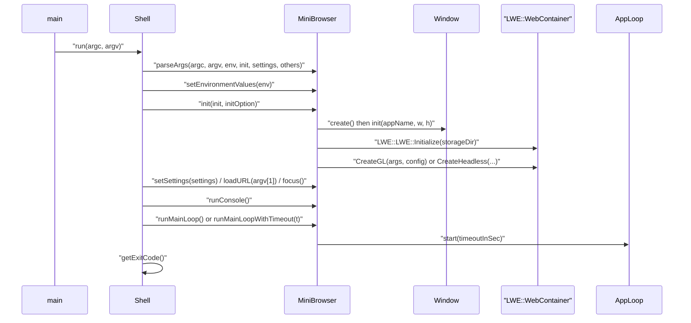
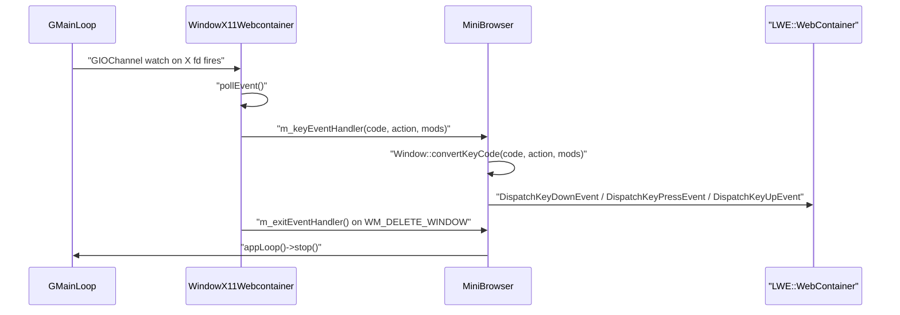
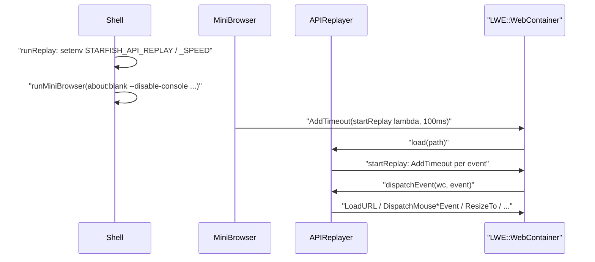

# Module Design Card: shell

> **Relevant source files**
>
> - [src/shell/APIReplayer.cpp](src:src/shell/APIReplayer.cpp)
> - [src/shell/APIReplayer.h](src:src/shell/APIReplayer.h)
> - [src/shell/AppLoop.h](src:src/shell/AppLoop.h)
> - [src/shell/Console.cpp](src:src/shell/Console.cpp)
> - [src/shell/Console.h](src:src/shell/Console.h)
> - [src/shell/MiniBrowser.cpp](src:src/shell/MiniBrowser.cpp)
> - [src/shell/MiniBrowser.h](src:src/shell/MiniBrowser.h)
> - [src/shell/RendererDelegate.h](src:src/shell/RendererDelegate.h)
> - [src/shell/Shell.cpp](src:src/shell/Shell.cpp)
> - [src/shell/Shell.h](src:src/shell/Shell.h)
> - [src/shell/ShellConfig.h](src:src/shell/ShellConfig.h)
> - [src/shell/UnitTestRunner.cpp](src:src/shell/UnitTestRunner.cpp)
> - [src/shell/UnitTestRunner.h](src:src/shell/UnitTestRunner.h)
> - [src/shell/Window.h](src:src/shell/Window.h)
> - [src/shell/WindowKeyType.h](src:src/shell/WindowKeyType.h)
> - [src/shell/dummy/WindowDummy.cpp](src:src/shell/dummy/WindowDummy.cpp)
> - [src/shell/ecore/AppLoopEcore.cpp](src:src/shell/ecore/AppLoopEcore.cpp)
> - [src/shell/ecore/ConsoleEcore.cpp](src:src/shell/ecore/ConsoleEcore.cpp)
> - [src/shell/efl/AppLoopEFL.cpp](src:src/shell/efl/AppLoopEFL.cpp)
> - [src/shell/efl/AppLoopEFLHeadless.cpp](src:src/shell/efl/AppLoopEFLHeadless.cpp)
> - [src/shell/efl/ConsoleEFL.cpp](src:src/shell/efl/ConsoleEFL.cpp)
> - [src/shell/efl/WindowEFL.cpp](src:src/shell/efl/WindowEFL.cpp)
> - [src/shell/glib/AppLoopGlib.cpp](src:src/shell/glib/AppLoopGlib.cpp)
> - [src/shell/glib/ConsoleGlib.cpp](src:src/shell/glib/ConsoleGlib.cpp)
> - [src/shell/headless/WindowHeadless.cpp](src:src/shell/headless/WindowHeadless.cpp)
> - [src/shell/libuv/AppLoopLibuv.cpp](src:src/shell/libuv/AppLoopLibuv.cpp)
> - [src/shell/libuv/ConsoleLibuv.cpp](src:src/shell/libuv/ConsoleLibuv.cpp)
> - [src/shell/tcore_wl/AppLoopTcoreWl.cpp](src:src/shell/tcore_wl/AppLoopTcoreWl.cpp)
> - [src/shell/tcore_wl/ConsoleTcoreWl.cpp](src:src/shell/tcore_wl/ConsoleTcoreWl.cpp)
> - [src/shell/test/APIRecorderTest.cpp](src:src/shell/test/APIRecorderTest.cpp)
> - [src/shell/test/CookieManagerTest.cpp](src:src/shell/test/CookieManagerTest.cpp)
> - [src/shell/test/LWETest.cpp](src:src/shell/test/LWETest.cpp)
> - [src/shell/test/SettingsTest.cpp](src:src/shell/test/SettingsTest.cpp)
> - [src/shell/test/WebContainerTest.cpp](src:src/shell/test/WebContainerTest.cpp)
> - [src/shell/test/WebViewTest.cpp](src:src/shell/test/WebViewTest.cpp)
> - [src/shell/windows/RendererWGL.cpp](src:src/shell/windows/RendererWGL.cpp)
> - [src/shell/windows/RendererWGL.h](src:src/shell/windows/RendererWGL.h)
> - [src/shell/windows/StarfishShell.cpp](src:src/shell/windows/StarfishShell.cpp)
> - [src/shell/x11_webcontainer/WindowX11Webcontainer.cpp](src:src/shell/x11_webcontainer/WindowX11Webcontainer.cpp)
> - [inc/LWEWebView.h](src:inc/LWEWebView.h)
> - [inc/PlatformIntegrationData.h](src:inc/PlatformIntegrationData.h)
> - [build/starfish_shell.cmake](src:build/starfish_shell.cmake)
> - [build/starfish_shell_defines.cmake](src:build/starfish_shell_defines.cmake)
> - [build/windows.cmake](src:build/windows.cmake)
> - [README.md](src:README.md)
> - [src/public/APIRecorder.cpp](src:src/public/APIRecorder.cpp)
> - [src/core/page/WebView.cpp](src:src/core/page/WebView.cpp)
> - [src/binding/WindowCustomBinding.cpp](src:src/binding/WindowCustomBinding.cpp)
> - [src/platform/network/http/HTTPTransaction.cpp](src:src/platform/network/http/HTTPTransaction.cpp)

**Module**: `shell` — 39 files under `src/shell/` (root, `dummy/`, `ecore/`, `efl/`, `glib/`, `headless/`, `libuv/`, `tcore_wl/`, `test/`, `windows/`, `x11_webcontainer/`)
**Role**: Builds the `Starfish` executable front-ends that host the engine through the public `LWE::` embedder API: a command-line mini browser that creates a native window, an event loop and an `LWE::WebContainer` or `LWE::WebView`, plus a gtest runner and an API-recording replayer, with one `Window`/`AppLoop`/`Console` implementation per windowing backend selected at build time. [`Shell::run`](src:src/shell/Shell.cpp#L74) [`MiniBrowser::createLWE`](src:src/shell/MiniBrowser.cpp#L349) [`Window::create`](src:src/shell/Window.h#L50)
**Module Boundary**: Windowing/shell port directories (efl, glib, libuv, x11, windows, headless, dummy); shell/test stays with its directory module
**Confidence**: 0.88
**Core selection**: All approved modules are Core (boundary approved in W1 human review)
**Generated**: 2026-09-10

## Source Files

### Entry point and mini browser (`src/shell/`)
- [src/shell/Shell.h](src:src/shell/Shell.h), [src/shell/Shell.cpp](src:src/shell/Shell.cpp) — `main`, sub-command dispatch (`unit-test`, `create-destroy-test`, `replay`, default mini browser)
- [src/shell/ShellConfig.h](src:src/shell/ShellConfig.h) — maps CMake `STARFISH_SHELL_*` defines to `SHELL_*` macros
- [src/shell/MiniBrowser.h](src:src/shell/MiniBrowser.h), [src/shell/MiniBrowser.cpp](src:src/shell/MiniBrowser.cpp) — argument parsing, environment export, engine creation, input forwarding
- [src/shell/UnitTestRunner.h](src:src/shell/UnitTestRunner.h), [src/shell/UnitTestRunner.cpp](src:src/shell/UnitTestRunner.cpp) — gtest bootstrap
- [src/shell/APIReplayer.h](src:src/shell/APIReplayer.h), [src/shell/APIReplayer.cpp](src:src/shell/APIReplayer.cpp) — JSONL recording loader and timed replay

### Backend abstractions (`src/shell/`)
- [src/shell/AppLoop.h](src:src/shell/AppLoop.h) — main-loop interface
- [src/shell/Window.h](src:src/shell/Window.h), [src/shell/WindowKeyType.h](src:src/shell/WindowKeyType.h) — window interface, input event handler types, `INPUT`/`MOD`/`ASCII` enums
- [src/shell/RendererDelegate.h](src:src/shell/RendererDelegate.h) — GL context callbacks handed to `LWE::WebContainer::RendererGLConfiguration`
- [src/shell/Console.h](src:src/shell/Console.h), [src/shell/Console.cpp](src:src/shell/Console.cpp) — stdin reader thread and command interpreter

### Backend implementations
- glib: [src/shell/glib/AppLoopGlib.cpp](src:src/shell/glib/AppLoopGlib.cpp), [src/shell/glib/ConsoleGlib.cpp](src:src/shell/glib/ConsoleGlib.cpp)
- libuv: [src/shell/libuv/AppLoopLibuv.cpp](src:src/shell/libuv/AppLoopLibuv.cpp), [src/shell/libuv/ConsoleLibuv.cpp](src:src/shell/libuv/ConsoleLibuv.cpp)
- ecore: [src/shell/ecore/AppLoopEcore.cpp](src:src/shell/ecore/AppLoopEcore.cpp), [src/shell/ecore/ConsoleEcore.cpp](src:src/shell/ecore/ConsoleEcore.cpp)
- efl: [src/shell/efl/AppLoopEFL.cpp](src:src/shell/efl/AppLoopEFL.cpp), [src/shell/efl/AppLoopEFLHeadless.cpp](src:src/shell/efl/AppLoopEFLHeadless.cpp), [src/shell/efl/ConsoleEFL.cpp](src:src/shell/efl/ConsoleEFL.cpp), [src/shell/efl/WindowEFL.cpp](src:src/shell/efl/WindowEFL.cpp)
- tcore_wl: [src/shell/tcore_wl/AppLoopTcoreWl.cpp](src:src/shell/tcore_wl/AppLoopTcoreWl.cpp), [src/shell/tcore_wl/ConsoleTcoreWl.cpp](src:src/shell/tcore_wl/ConsoleTcoreWl.cpp)
- x11_webcontainer: [src/shell/x11_webcontainer/WindowX11Webcontainer.cpp](src:src/shell/x11_webcontainer/WindowX11Webcontainer.cpp)
- headless: [src/shell/headless/WindowHeadless.cpp](src:src/shell/headless/WindowHeadless.cpp)
- dummy: [src/shell/dummy/WindowDummy.cpp](src:src/shell/dummy/WindowDummy.cpp)
- windows (separate `starfish.windows_shell` target): [src/shell/windows/StarfishShell.cpp](src:src/shell/windows/StarfishShell.cpp), [src/shell/windows/RendererWGL.h](src:src/shell/windows/RendererWGL.h), [src/shell/windows/RendererWGL.cpp](src:src/shell/windows/RendererWGL.cpp)

### gtest suites (`src/shell/test/`)
- [src/shell/test/LWETest.cpp](src:src/shell/test/LWETest.cpp), [src/shell/test/SettingsTest.cpp](src:src/shell/test/SettingsTest.cpp), [src/shell/test/CookieManagerTest.cpp](src:src/shell/test/CookieManagerTest.cpp), [src/shell/test/WebContainerTest.cpp](src:src/shell/test/WebContainerTest.cpp), [src/shell/test/WebViewTest.cpp](src:src/shell/test/WebViewTest.cpp), [src/shell/test/APIRecorderTest.cpp](src:src/shell/test/APIRecorderTest.cpp)

## Public Interface

The shell is a leaf executable: no other module includes `src/shell/` headers (a grep of `src/` outside `src/shell/` finds no `shell/` include). The entry points below are the process entry points and the intra-module seams that each backend must implement.

| Function/Class | Signature | Main callers | Source |
|---|---|---|---|
| `main` | `int main(int argc, char* argv[])` | Process entry of `starfish.executable` ([`starfish_shell.cmake`](src:build/starfish_shell.cmake#L155)) | [`main`](src:src/shell/Shell.cpp#L355) |
| `Shell::run` | `int run(int argc, char* argv[])` | `main` | [`Shell::run`](src:src/shell/Shell.cpp#L74) |
| `Shell::runMiniBrowser` | `int runMiniBrowser(int argc, char* argv[])` | `Shell::run`, `Shell::runCreateDestroyTest`, `Shell::runReplay` | [`Shell::runMiniBrowser`](src:src/shell/Shell.cpp#L129) |
| `Shell::runUnitTest` | `int runUnitTest(int argc, char* argv[])` | `Shell::run` on `unit-test` | [`Shell::runUnitTest`](src:src/shell/Shell.cpp#L97) |
| `MiniBrowser::parseArgs` | `static void parseArgs(int argc, char* argv[], EnvironmentValues&, InitOption&, Settings&, OtherOptions&)` | `Shell::runMiniBrowser` | [`MiniBrowser::parseArgs`](src:src/shell/MiniBrowser.cpp#L47) |
| `MiniBrowser::setEnvironmentValues` | `static void setEnvironmentValues(const EnvironmentValues& env)` | `Shell::runMiniBrowser` | [`MiniBrowser::setEnvironmentValues`](src:src/shell/MiniBrowser.cpp#L150) |
| `MiniBrowser::init` | `bool init(const InitOption&, LWE::InitializeOption = None)` | `Shell::runMiniBrowser` | [`MiniBrowser::init`](src:src/shell/MiniBrowser.cpp#L214) |
| `MiniBrowser::runMainLoop` / `runMainLoopWithTimeout` | `int runMainLoop()`, `int runMainLoopWithTimeout(double timeoutInSec)` | `Shell::runMiniBrowser` | [`MiniBrowser::runMainLoop`](src:src/shell/MiniBrowser.cpp#L316) |
| `Window::create` | `static Window* create()` | `MiniBrowser::createWindow`; gtest fixtures in `WebContainerTest.cpp`, `WebViewTest.cpp`, `APIRecorderTest.cpp` | [`Window::create`](src:src/shell/Window.h#L50) |
| `Window::convertKeyCode` | `static LWE::KeyValue convertKeyCode(unsigned long key, INPUT action, unsigned mods)` | key handler lambda in `MiniBrowser::createLWE` | [`Window::convertKeyCode`](src:src/shell/Window.h#L51) |
| `Window::init` | `virtual bool init(const char* applicationName, int width, int height) = 0` | `MiniBrowser::createWindow`, gtest fixtures | [`Window::init`](src:src/shell/Window.h#L107) |
| `Window::renderer` | `virtual RendererDelegate* renderer() = 0` | `RendererGLConfiguration` lambdas in `MiniBrowser::createLWE` | [`Window::renderer`](src:src/shell/Window.h#L120) |
| `AppLoop::create` | `static std::unique_ptr<AppLoop> create()` | `Window` constructor | [`AppLoop::create`](src:src/shell/AppLoop.h#L29) |
| `AppLoop::start` | `virtual int start(double timeoutInSec = 0) = 0` | `MiniBrowser::runMainLoop` | [`AppLoop::start`](src:src/shell/AppLoop.h#L33) |
| `Console::create` | `static Console* create(MiniBrowser* browser)` | `MiniBrowser::runConsole` | [`Console::create`](src:src/shell/Console.h#L38) |
| `Console::write` | `void write(const std::string& input)` | backend `send` implementations (glib idle, uv async, ecore animator, tizen-core idle job) | [`Console::write`](src:src/shell/Console.cpp#L114) |
| `RendererDelegate` | abstract: `makeCurrent`, `swapBuffers`, `createSharedContext`, `destroyContext`, `clearCurrentContext`, `makeCurrentWithContext`, `getProcAddress`, `isSupportedExtension` | `MiniBrowser::createLWE`, `WebContainerTest.cpp` config builder | [`RendererDelegate`](src:src/shell/RendererDelegate.h#L27) |
| `UnitTestRunner::runAllTests` | `int runAllTests()` | `Shell::runUnitTest` | [`UnitTestRunner::runAllTests`](src:src/shell/UnitTestRunner.cpp#L44) |
| `APIReplayer::load` / `startReplay` | `bool load(const char* path)`, `void startReplay(LWE::WebContainer* wc, float speedFactor = 1.0f)` | timeout lambda in `MiniBrowser::createLWE`; `APIReplayerParserTest` | [`APIReplayer::load`](src:src/shell/APIReplayer.cpp#L189), [`APIReplayer::startReplay`](src:src/shell/APIReplayer.cpp#L407) |
| `wmain` | `int wmain(int argumentCount, wchar_t** arguments)` | Process entry of `starfish.windows_shell` ([`windows.cmake`](src:build/windows.cmake#L373)) | [`wmain`](src:src/shell/windows/StarfishShell.cpp#L934) |

## IPC / Message / Interface Contracts

- X11 display-server connection: `WindowX11Webcontainer::init` opens the display with `XOpenDisplay`, creates a window, registers the `WM_DELETE_WINDOW` protocol atom and opens an X input method (`XOpenIM`/`XCreateIC`); the X connection file descriptor (`ConnectionNumber`) is watched from the GLib main loop and drained by `pollEvent`, which converts X events into the `Window` handler callbacks. [`WindowX11Webcontainer::init`](src:src/shell/x11_webcontainer/WindowX11Webcontainer.cpp#L318) [`WindowX11Webcontainer::registerX11Fd`](src:src/shell/x11_webcontainer/WindowX11Webcontainer.cpp#L389) [`WindowX11Webcontainer::pollEvent`](src:src/shell/x11_webcontainer/WindowX11Webcontainer.cpp#L459)
- Win32 window message queue: the Windows shell registers a window class, runs `GetMessageW`/`DispatchMessageW`, and `windowProc` maps `WM_SIZE`, `WM_MOUSEMOVE`, `WM_LBUTTONDOWN`, `WM_MOUSEWHEEL`, `WM_KEYDOWN`, `WM_IME_*`, `WM_TIMER`, `WM_CLOSE` to `LWE::WebContainer` calls; a private `kMessagePageLoaded` (`WM_APP + 1`) is posted from the engine's page-loaded callback back to the UI thread. [`Shell::runMessageLoop`](src:src/shell/windows/StarfishShell.cpp#L461) [`Shell::windowProc`](src:src/shell/windows/StarfishShell.cpp#L593) [`kMessagePageLoaded`](src:src/shell/windows/StarfishShell.cpp#L253)
- Process-environment contract with the engine: `MiniBrowser::setEnvironmentValues` exports `SCREEN_SHOT`, `SCREEN_SHOT_FILE`, `EXIT_AFTER_SCREEN_SHOT`, `SCREEN_SHOT_WIDTH`, `SCREEN_SHOT_HEIGHT`, `HIDE_WINDOW`, `NETWORK_LOG_VERBOSE`, `IGNORE_SSL_VERIFY`, `LWE_GL_COMPOSITOR_SCALE`, `PIXEL_TEST`, `REF_TEST_STATE`, `START_UP_FLAG`, `EXIT_CODE`; the engine reads e.g. `START_UP_FLAG` and `LWE_GL_COMPOSITOR_SCALE` in `WebView.cpp`, `EXIT_CODE`/`HIDE_WINDOW` in `WindowCustomBinding.cpp`, `IGNORE_SSL_VERIFY`/`NETWORK_LOG_VERBOSE` in `HTTPTransaction.cpp`, and the shell reads `EXIT_CODE` back as the process exit status. [`MiniBrowser::setEnvironmentValues`](src:src/shell/MiniBrowser.cpp#L150) [`WebView.cpp`](src:src/core/page/WebView.cpp#L341) [`WindowCustomBinding.cpp`](src:src/binding/WindowCustomBinding.cpp#L67) [`HTTPTransaction.cpp`](src:src/platform/network/http/HTTPTransaction.cpp#L75) [`Shell::getExitCode`](src:src/shell/Shell.cpp#L297)
- API recording/replay file contract: `Shell::runReplay` exports `STARFISH_API_REPLAY` and `STARFISH_API_REPLAY_SPEED`; `MiniBrowser::createLWE` reads them and `APIReplayer` parses a JSONL file whose lines carry `type`, `ts_us` and per-call fields (`LoadURL`, `DispatchMouseDownEvent`, `ResizeTo`, `SetSettings`, ...) and re-issues them on `LWE::WebContainer`. The producer is the engine-side `APIRecorder`, enabled by `STARFISH_API_RECORD` (set by `APIRecorderRecordingTest`). [`Shell::runReplay`](src:src/shell/Shell.cpp#L307) [`APIReplayer::parseLine`](src:src/shell/APIReplayer.cpp#L215) [`APIRecorder.cpp`](src:src/public/APIRecorder.cpp#L85) [`APIRecorderRecordingTest`](src:src/shell/test/APIRecorderTest.cpp#L68)
- POSIX signals: the GLib loop stops on `SIGINT`/`SIGTERM` via `g_unix_signal_add`; the libuv-build loop installs a `SIGINT` handler that calls `_exit(0)`; the backtrace handler installs `SIGSEGV`/`SIGABRT` handlers that print `[STARFISH_TEST] Got signal` and re-raise. [`AppLoopGlib::init`](src:src/shell/glib/AppLoopGlib.cpp#L67) [`AppLoopSimple::start`](src:src/shell/libuv/AppLoopLibuv.cpp#L85) [`Shell::setBacktraceHandler`](src:src/shell/Shell.cpp#L253)
- Candidate: Wayland client connection for the `ecore_wl2`/`tcore_wl` shells; confidence=LOW (only the pkg-config dependency `wayland-client` is declared in the build file; no Wayland call exists in `src/shell/`). [`starfish_shell.cmake`](src:build/starfish_shell.cmake#L22)

These contracts sit at the process boundary between the shell executable and (a) the display server / OS window system, (b) the engine library, which is configured through environment variables rather than a typed API for test-only switches, and (c) recorded API traces used to reproduce embedder call sequences.

## Key Flow

Entry: [`Shell::runMiniBrowser`](src:src/shell/Shell.cpp#L129) drives the mini-browser lifecycle; engine creation happens in [`MiniBrowser::createLWE`](src:src/shell/MiniBrowser.cpp#L349).

Entry: [`WindowX11Webcontainer::pollEvent`](src:src/shell/x11_webcontainer/WindowX11Webcontainer.cpp#L459) translates X events into the handlers installed by [`MiniBrowser.cpp`](src:src/shell/MiniBrowser.cpp#L396).

Entry: [`Shell::runReplay`](src:src/shell/Shell.cpp#L307); scheduling in [`APIReplayer::startReplay`](src:src/shell/APIReplayer.cpp#L407).

## Architectural Rules

- [ ] Exactly one `Window::create`, one `AppLoop::create` and one `Console::create` definition is compiled per build: every backend `.cpp` is wrapped in `#if defined(STARFISH_SHELL_*)` guards keyed to the CMake `SHELL` value. [`WindowX11Webcontainer.cpp`](src:src/shell/x11_webcontainer/WindowX11Webcontainer.cpp#L22) [`AppLoopGlib.cpp`](src:src/shell/glib/AppLoopGlib.cpp#L22) [`SET_STARFISH_SHELL_DEFINES`](src:build/starfish_shell_defines.cmake#L3)
- [ ] The engine handle type follows the backend: `LWEType` is `LWE::WebContainer*` for headless and `x11_webcontainer` builds and `LWE::WebView*` for `efl`, `x11`, `ecore_x`, `ecore_wl2`, `tcore_wl`. [`LWEType`](src:src/shell/MiniBrowser.h#L42)
- [ ] The window must be created before `LWE::LWE::Initialize` because the EFL window performs `elm_init`. [`MiniBrowser::init`](src:src/shell/MiniBrowser.cpp#L214)
- [ ] All shell files include `ShellConfig.h` first so that `SHELL_*` feature macros are derived from `STARFISH_*` defines before any other header. [`ShellConfig.h`](src:src/shell/ShellConfig.h#L25) [`Shell.cpp`](src:src/shell/Shell.cpp#L20)
- [ ] Console input is read on a separate pthread and handed to the main loop through each backend's `send`, so `Console::write` always runs on the loop thread. [`Console::run`](src:src/shell/Console.cpp#L52) [`Console::send`](src:src/shell/Console.h#L42)
- [ ] The `Window` destructor calls `AppLoop::deinit` and releases the loop; `MiniBrowser::~MiniBrowser` blurs and destroys the engine handle, terminates the window, then calls `LWE::LWE::Finalize`. [`Window::~Window`](src:src/shell/Window.h#L54) [`MiniBrowser::~MiniBrowser`](src:src/shell/MiniBrowser.cpp#L200)
- [ ] Test-only switches (`--pixel-test`, `--ref-test`, replay mode, backtrace handler) compile only when `STARFISH_ENABLE_TEST` is defined. [`SHELL_ENABLE_TEST`](src:src/shell/ShellConfig.h#L39) [`Shell::runReplay`](src:src/shell/Shell.cpp#L307)
- [ ] The Windows shell is a separate executable (`starfish.windows_shell`) that links `Starfish.dll` as an embedder and must not define `STARFISH_EXPORTS`. [`windows.cmake`](src:build/windows.cmake#L370)

## Dependencies

### Internal modules
| Module | File(s) | Purpose | Source |
|---|---|---|---|
| [public-embedder-api](public-embedder-api.md) | `inc/LWEWebView.h`, `inc/PlatformIntegrationData.h` | `LWE::LWE` lifecycle, `LWE::WebContainer`/`LWE::WebView` creation, `LWE::Settings`, `LWE::KeyValue`, mouse enums | [`LWE`](src:inc/LWEWebView.h#L97) [`WebContainer::CreateGL`](src:inc/LWEWebView.h#L361) [`WebView::Create`](src:inc/LWEWebView.h#L575) [`KeyValue`](src:inc/PlatformIntegrationData.h#L7) |
| [public-embedder-api](public-embedder-api.md) | `src/public/APIRecorder.cpp` | Producer of the JSONL recording consumed by `APIReplayer` (via `STARFISH_API_RECORD`) | [`APIRecorder.cpp`](src:src/public/APIRecorder.cpp#L85) |
| core-page (not a separate card) | `src/core/page/WebView.cpp` | Reads `START_UP_FLAG` and `LWE_GL_COMPOSITOR_SCALE` exported by the shell | [`WebView.cpp`](src:src/core/page/WebView.cpp#L341) |
| [binding](../02-architecture.md) | `src/binding/WindowCustomBinding.cpp` | Reads/writes `EXIT_CODE`, reads `HIDE_WINDOW` | [`WindowCustomBinding.cpp`](src:src/binding/WindowCustomBinding.cpp#L67) |

### External libraries
| Library | Version | Purpose | Source |
|---|---|---|---|
| GLib (`glib.h`, `glib-unix.h`) | Not specified in code | `GMainLoop`, `g_unix_signal_add`, `g_timeout_add_seconds`, `g_io_add_watch_full`, `g_idle_add_full` | [`AppLoopGlib.cpp`](src:src/shell/glib/AppLoopGlib.cpp#L29) [`WindowX11Webcontainer.cpp`](src:src/shell/x11_webcontainer/WindowX11Webcontainer.cpp#L30) |
| Xlib (`X11/Xlib.h`, `Xutil.h`, `Xlocale.h`) | Not specified in code | Display/window creation, event polling, XIM input method | [`WindowX11Webcontainer.cpp`](src:src/shell/x11_webcontainer/WindowX11Webcontainer.cpp#L26) |
| EGL (`EGL/egl.h`) | Not specified in code | Window-surface GL context (x11_webcontainer) and 1x1 pbuffer offscreen context (dummy) | [`RendererDelegateEGL`](src:src/shell/x11_webcontainer/WindowX11Webcontainer.cpp#L169) [`RendererDelegateOffscreen`](src:src/shell/dummy/WindowDummy.cpp#L35) |
| libuv (`uv.h`) | Not specified in code | `uv_async_t` hand-off of console input | [`ConsoleLibuv.cpp`](src:src/shell/libuv/ConsoleLibuv.cpp#L25) |
| Ecore (`Ecore.h`) | Not specified in code | `ecore_main_loop_begin`, `ecore_timer_add`, `ecore_animator_add` | [`AppLoopEcore.cpp`](src:src/shell/ecore/AppLoopEcore.cpp#L26) [`AppLoopEFLHeadless.cpp`](src:src/shell/efl/AppLoopEFLHeadless.cpp#L25) |
| Elementary (`Elementary.h`) | Not specified in code | `elm_init`, `elm_run`, `elm_win_add`, engine/accel configuration | [`AppLoopEFL.cpp`](src:src/shell/efl/AppLoopEFL.cpp#L26) [`WindowEFL.cpp`](src:src/shell/efl/WindowEFL.cpp#L26) |
| tizen-core (`tizen_core.h`) | Not specified in code | `tizen_core_task_run`, `tizen_core_add_timer`, `tizen_core_add_idle_job` | [`AppLoopTcoreWl.cpp`](src:src/shell/tcore_wl/AppLoopTcoreWl.cpp#L26) [`ConsoleTcoreWl.cpp`](src:src/shell/tcore_wl/ConsoleTcoreWl.cpp#L25) |
| googletest (`gtest/gtest.h`) | Not specified in code (built from `third_party/googletest`) | `InitGoogleTest`, `UnitTest::GetInstance()->Run()` | [`UnitTestRunner.cpp`](src:src/shell/UnitTestRunner.cpp#L24) [`starfish_shell.cmake`](src:build/starfish_shell.cmake#L117) |
| libbacktrace (`backtrace.h`, `execinfo.h`) | Not specified in code | Signal-time stack dump on x86_64 Linux test builds | [`Shell.cpp`](src:src/shell/Shell.cpp#L32) [`starfish_shell.cmake`](src:build/starfish_shell.cmake#L111) |
| Win32 / WGL (`opengl32.dll`) | Not specified in code | Window class, message loop, IME, `wglGetProcAddress`/`LoadLibraryW("opengl32.dll")` | [`RendererWGL::getProcAddress`](src:src/shell/windows/RendererWGL.cpp#L301) |
| pthread, POSIX (`select`, `sigaction`, `mallopt`) | Not specified in code | Console thread, signal handling, allocator tuning | [`Console::run`](src:src/shell/Console.cpp#L52) [`Shell::Shell`](src:src/shell/Shell.cpp#L58) |

## Quick Navigation

| To change… | Location |
|---|---|
| Sub-command names (`unit-test`, `create-destroy-test`, `replay`) | [`Shell::run`](src:src/shell/Shell.cpp#L74) |
| Add or rename a `--option` of the mini browser | [`MiniBrowser::parseArgs`](src:src/shell/MiniBrowser.cpp#L47) |
| Environment variables exported to the engine | [`MiniBrowser::setEnvironmentValues`](src:src/shell/MiniBrowser.cpp#L150) |
| Default window size (1920x1080) | [`kDefaultWidth`](src:src/shell/Shell.cpp#L51) |
| Engine settings applied from options | [`MiniBrowser::setSettings`](src:src/shell/MiniBrowser.cpp#L242) |
| Container arguments (`serif`, `ko-KR`, `Asia/Seoul`) and GL callbacks | [`MiniBrowser::createLWE`](src:src/shell/MiniBrowser.cpp#L349) |
| Storage directory default (`$HOME/Starfish-storage`) | [`MiniBrowser::storageDir`](src:src/shell/MiniBrowser.cpp#L518) |
| Console commands (`\reload`, `\rotate`, `\dpr`) | [`Console::write`](src:src/shell/Console.cpp#L114) |
| X11 event to handler mapping | [`WindowX11Webcontainer::pollEvent`](src:src/shell/x11_webcontainer/WindowX11Webcontainer.cpp#L459) |
| Key code translation to `LWE::KeyValue` (X11) | [`Window::convertKeyCode`](src:src/shell/x11_webcontainer/WindowX11Webcontainer.cpp#L602) |
| EGL config attributes for the on-screen context | [`WindowX11Webcontainer.cpp`](src:src/shell/x11_webcontainer/WindowX11Webcontainer.cpp#L63) |
| EFL engine/accel environment (`STARFISH_ELM_ENGINE`, `STARFISH_ELM_CONFIG`) | [`WindowEFL::initConfig`](src:src/shell/efl/WindowEFL.cpp#L94) |
| Replay JSONL event schema | [`APIReplayer::parseLine`](src:src/shell/APIReplayer.cpp#L215) |
| Windows shell options (`--screenshot`, `--timeout-ms`, `--window-size`) | [`Shell::parseArguments`](src:src/shell/windows/StarfishShell.cpp#L419) |
| Backend-to-define mapping for `-DSHELL=` | [`SET_STARFISH_SHELL_DEFINES`](src:build/starfish_shell_defines.cmake#L3) |

## FR Linkage
- [FR-SHELL-001](../functional-requirements/shell-fr.md#fr-shell-001): Dispatch the executable by first argument into mini browser, unit-test, create-destroy-test or replay mode
- [FR-SHELL-002](../functional-requirements/shell-fr.md#fr-shell-002): Parse mini-browser command-line options into environment, geometry, settings and run options
- [FR-SHELL-003](../functional-requirements/shell-fr.md#fr-shell-003): Export test and debug switches to the engine through process environment variables
- [FR-SHELL-004](../functional-requirements/shell-fr.md#fr-shell-004): Initialize the engine and create the backend-specific `LWE::WebContainer` or `LWE::WebView`
- [FR-SHELL-005](../functional-requirements/shell-fr.md#fr-shell-005): Run the backend main loop with optional timeout and signal-driven stop
- [FR-SHELL-006](../functional-requirements/shell-fr.md#fr-shell-006): Translate X11 window, pointer, key and input-method events into engine dispatch calls
- [FR-SHELL-007](../functional-requirements/shell-fr.md#fr-shell-007): Provide GL context callbacks to the engine through `RendererDelegate` (EGL on-screen, EGL offscreen, WGL)
- [FR-SHELL-008](../functional-requirements/shell-fr.md#fr-shell-008): Accept interactive stdin commands and JavaScript on a console thread
- [FR-SHELL-009](../functional-requirements/shell-fr.md#fr-shell-009): Run the embedded gtest suites in `unit-test` mode
- [FR-SHELL-010](../functional-requirements/shell-fr.md#fr-shell-010): Replay a recorded embedder API trace against a `LWE::WebContainer`
- [FR-SHELL-011](../functional-requirements/shell-fr.md#fr-shell-011): Host the engine in a Win32 window with screenshot and timeout options
