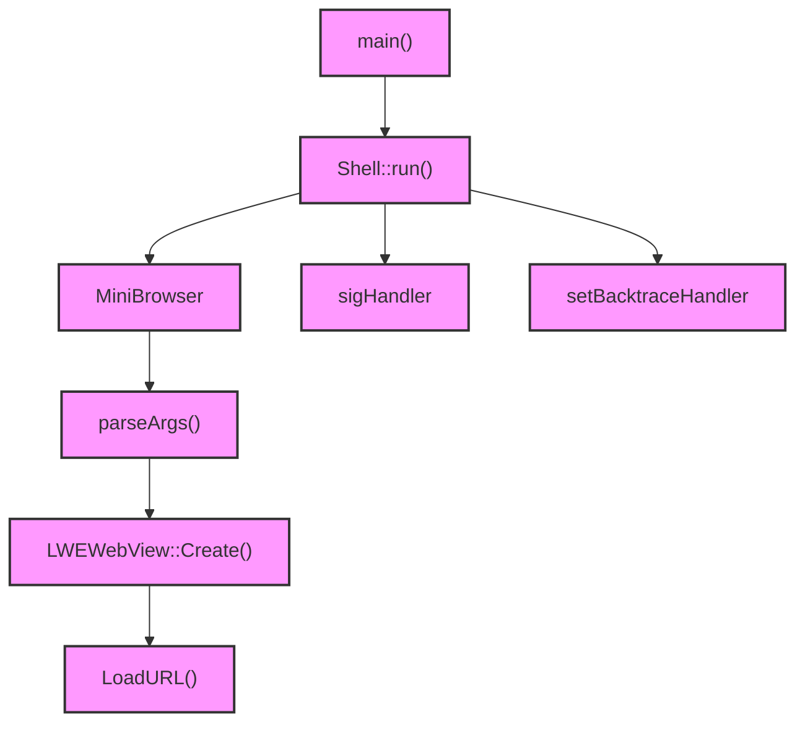

# Module Design Card — shell

> **Relevant source files**
> - [`MiniBrowser.cpp`](src:src/shell/MiniBrowser.cpp)
> - [`Shell.cpp`](src:src/shell/Shell.cpp)
> - [`Console.cpp`](src:src/shell/Console.cpp)
> - [`Window.h`](src:src/shell/Window.h)
> - [`UnitTestRunner.cpp`](src:src/shell/UnitTestRunner.cpp)
> - [`APIReplayer.cpp`](src:src/shell/APIReplayer.cpp)
> - [`ShellConfig.h`](src:src/shell/ShellConfig.h)
> - [`WindowKeyType.h`](src:src/shell/WindowKeyType.h)
> - [`windows/StarfishShell.cpp`](src:src/shell/windows/StarfishShell.cpp)
> - [`windows/RendererWGL.cpp`](src:src/shell/windows/RendererWGL.cpp)
> - [`test/WebViewTest.cpp`](src:src/shell/test/WebViewTest.cpp)
> - [`test/CookieManagerTest.cpp`](src:src/shell/test/CookieManagerTest.cpp)
> - [`test/LWETest.cpp`](src:src/shell/test/LWETest.cpp)
> - [`test/SettingsTest.cpp`](src:src/shell/test/SettingsTest.cpp)
> - [`test/WebContainerTest.cpp`](src:src/shell/test/WebContainerTest.cpp)
> - (24 additional shell files)

## Module Boundary

**Rationale:** Browser shell — MiniBrowser, Shell, Console, Window, AppLoop, Renderer, tests, platform backends [`module-groups.yaml`](src:code2spec/.analysis/state/delta/module-groups.yaml)
**Confidence:** 0.94

## Source Files

39 files spanning `src/shell/` including platform-specific window backends (EFL, Ecore, GLib, libUV, headless, Windows, X11), unit tests, and API replayer.

## Public Interface

| Component | Entry Point | Source |
|---|---|---|
| Shell | `Shell::run()` | [`Shell.cpp`](src:src/shell/Shell.cpp#L74) |
| MiniBrowser | `MiniBrowser::parseArgs()` | [`MiniBrowser.cpp`](src:src/shell/MiniBrowser.cpp#L47) |
| UnitTestRunner | `UnitTestRunner` | [`UnitTestRunner.cpp`](src:src/shell/UnitTestRunner.cpp) |

## Key Flow

## Architectural Rules

- Default window size: 1920x1080 [`Shell.cpp`](src:src/shell/Shell.cpp#L51)
- `mallopt(M_MMAP_THRESHOLD, 2048)` for MSE packet memory [`Shell.cpp`](src:src/shell/Shell.cpp#L66)
- Startup flags: `enableComputedStyleDump`, `enableFrameTreeDump`, etc. [`MiniBrowser.cpp`](src:src/shell/MiniBrowser.cpp#L34)
- Signal handler and backtrace handler registered [`Shell.cpp`](src:src/shell/Shell.cpp)

## Dependencies

| Dependency | Type |
|---|---|
| core-engine | Internal |
| public-api (LWEWebView) | Internal |
| compat-headers | Internal |
| Platform window system (EFL/X11/Windows) | External |

## IPC / Message / Interface Contracts

- Shell registers signal handlers for process signals. [`Shell.cpp`](src:src/shell/Shell.cpp)
- APIReplayer records and replays LWEWebView API calls for testing. [`APIReplayer.cpp`](src:src/shell/APIReplayer.cpp)

## Quick Navigation

- [FR Document](../functional-requirements/shell-fr.md)
- [Architecture](../02-architecture.md)
