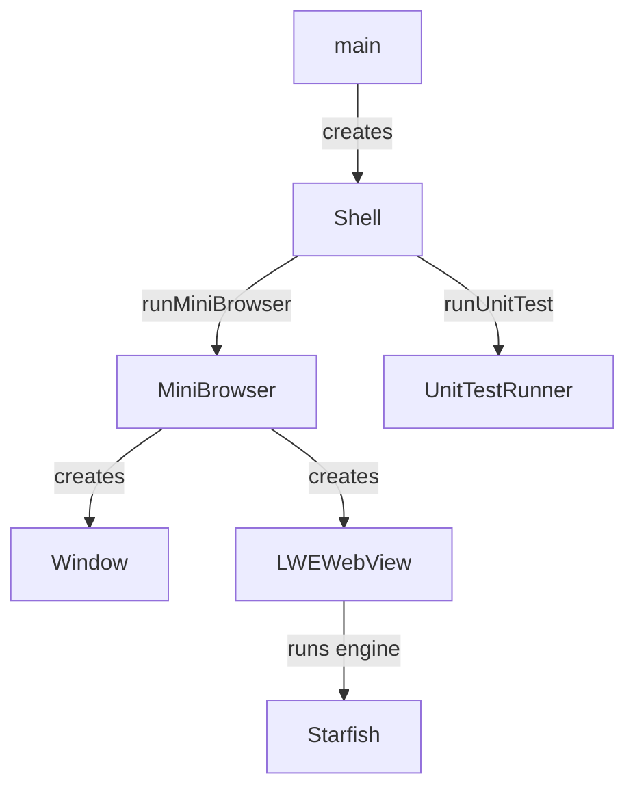

# Module Design Card: shell

> **Relevant source files**
> - [`Shell.h`](src/shell/Shell.h#L31)
> - [`MiniBrowser.cpp`](src/shell/MiniBrowser.cpp#L34)
> - [`Console.h`](src/shell/Console.h#L1)
> - [`Window.h`](src/shell/Window.h#L1)
> - [`WindowKeyType.h`](src/shell/WindowKeyType.h#L1)
> - [`AppLoop.h`](src/shell/AppLoop.h#L1)

## Module Boundary
Browser shell: MiniBrowser, Console, window management (EFL/headless/X11/Windows), app loops, API recorder, unit test runner.

**Confidence**: 0.93

## Source Files
39 files in `src/shell/` including platform subdirs (ecore, efl, glib, headless, libuv, tcore_wl, windows, x11_webcontainer)

## Public Interface
- `Shell` — Entry point with run(), runMiniBrowser(), runUnitTest(), runCreateDestroyTest(). [`Shell.h:31`](src/shell/Shell.h#L31)
- `MiniBrowser` — Browser shell with arg parsing (StarfishStartUpFlag). [`MiniBrowser.cpp:34`](src/shell/MiniBrowser.cpp#L34)
- `Console` — Interactive console.
- `Window` — Abstract window with platform implementations.
- `AppLoop` — Application event loop with platform backends.
- `UnitTestRunner` — Runs unit tests via Starfish unit-test API.
- `APIReplayer` — Replays recorded API sequences (test mode).

## Key Flow

## Architectural Rules
- StarfishStartUpFlag: enableComputedStyleDump, enableFrameTreeDump, enableStackingContextDump, enableHitTestDump, enableDebugGraphicsLayer, enableDebugRepaintRegion, enableRegressionTest. [`MiniBrowser.cpp:34`](src/shell/MiniBrowser.cpp#L34)
- Shell modes: MiniBrowser, UnitTest, CreateDestroyTest, Replay (test mode). [`Shell.h:39`](src/shell/Shell.h#L39)
- Window backends: EFL, headless, X11 webcontainer, Windows WGL.
- AppLoop backends: Ecore, EFL (incl. headless), Glib, libUV, TcoreWl.

## Dependencies
- Depends on: embedding-api (LWEWebView), engine-core
- External: EFL, X11, Windows Win32, GLib, libUV

## IPC / Message / Interface Contracts
- sigaction signal handler registered in AppLoopLibuv for process signal handling. [`AppLoopLibuv.cpp:101`](src/shell/libuv/AppLoopLibuv.cpp#L101)

## Quick Navigation
- [FR Document](../functional-requirements/shell-fr.md)
- [Architecture](../02-architecture.md)
