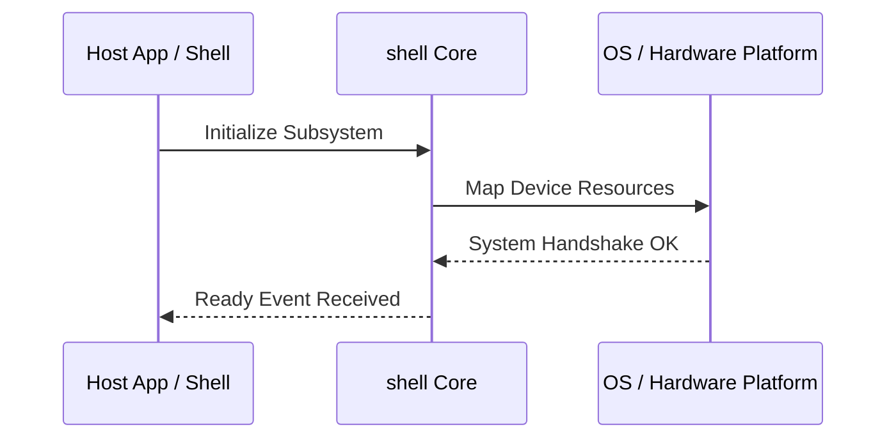

**Related Documents**: [README](../README.md) | [Functional Req](../functional-requirements/shell-fr.md) | [Quick Reference](../code2spec-quick-reference.md)

# Module Design Card: shell

> **Relevant source files**
>
> - [src/shell/APIReplayer.cpp](src:src/shell/APIReplayer.cpp)
> - [src/shell/APIReplayer.h](src:src/shell/APIReplayer.h)
> - [src/shell/AppLoop.h](src:src/shell/AppLoop.h)
> - [src/shell/Console.cpp](src:src/shell/Console.cpp)
> - [src/shell/Console.h](src:src/shell/Console.h)
> - [src/shell/MiniBrowser.cpp](src:src/shell/MiniBrowser.cpp)
> - [src/shell/MiniBrowser.h](src:src/shell/MiniBrowser.h)
> - [src/shell/RendererDelegate.h](src:src/shell/RendererDelegate.h)
> - [src/shell/Shell.cpp](src:src/shell/Shell.cpp)
> - [src/shell/Shell.h](src:src/shell/Shell.h)
> - [src/shell/ShellConfig.h](src:src/shell/ShellConfig.h)
> - [src/shell/UnitTestRunner.cpp](src:src/shell/UnitTestRunner.cpp)
> - [src/shell/UnitTestRunner.h](src:src/shell/UnitTestRunner.h)
> - [src/shell/Window.h](src:src/shell/Window.h)
> - [src/shell/WindowKeyType.h](src:src/shell/WindowKeyType.h)
> - [src/shell/dummy/WindowDummy.cpp](src:src/shell/dummy/WindowDummy.cpp)
> - [src/shell/ecore/AppLoopEcore.cpp](src:src/shell/ecore/AppLoopEcore.cpp)
> - [src/shell/ecore/ConsoleEcore.cpp](src:src/shell/ecore/ConsoleEcore.cpp)
> - [src/shell/efl/AppLoopEFL.cpp](src:src/shell/efl/AppLoopEFL.cpp)
> - [src/shell/efl/AppLoopEFLHeadless.cpp](src:src/shell/efl/AppLoopEFLHeadless.cpp)
> - [src/shell/efl/ConsoleEFL.cpp](src:src/shell/efl/ConsoleEFL.cpp)
> - [src/shell/efl/WindowEFL.cpp](src:src/shell/efl/WindowEFL.cpp)
> - [src/shell/glib/AppLoopGlib.cpp](src:src/shell/glib/AppLoopGlib.cpp)
> - [src/shell/glib/ConsoleGlib.cpp](src:src/shell/glib/ConsoleGlib.cpp)
> - [src/shell/headless/WindowHeadless.cpp](src:src/shell/headless/WindowHeadless.cpp)
> - [src/shell/libuv/AppLoopLibuv.cpp](src:src/shell/libuv/AppLoopLibuv.cpp)
> - [src/shell/libuv/ConsoleLibuv.cpp](src:src/shell/libuv/ConsoleLibuv.cpp)
> - [src/shell/tcore_wl/AppLoopTcoreWl.cpp](src:src/shell/tcore_wl/AppLoopTcoreWl.cpp)
> - [src/shell/tcore_wl/ConsoleTcoreWl.cpp](src:src/shell/tcore_wl/ConsoleTcoreWl.cpp)
> - [src/shell/test/APIRecorderTest.cpp](src:src/shell/test/APIRecorderTest.cpp)
> - [src/shell/test/CookieManagerTest.cpp](src:src/shell/test/CookieManagerTest.cpp)
> - [src/shell/test/LWETest.cpp](src:src/shell/test/LWETest.cpp)
> - [src/shell/test/SettingsTest.cpp](src:src/shell/test/SettingsTest.cpp)
> - [src/shell/test/WebContainerTest.cpp](src:src/shell/test/WebContainerTest.cpp)
> - [src/shell/test/WebViewTest.cpp](src:src/shell/test/WebViewTest.cpp)
> - [src/shell/windows/RendererWGL.cpp](src:src/shell/windows/RendererWGL.cpp)
> - [src/shell/windows/RendererWGL.h](src:src/shell/windows/RendererWGL.h)
> - [src/shell/windows/StarfishShell.cpp](src:src/shell/windows/StarfishShell.cpp)
> - [src/shell/x11_webcontainer/WindowX11Webcontainer.cpp](src:src/shell/x11_webcontainer/WindowX11Webcontainer.cpp)

**Primary File**: [`src/shell/APIReplayer.cpp`](src:src/shell/APIReplayer.cpp)
**Single Role**: Governs the operations and interfaces for the logical shell subsystem [`APIReplayer.cpp`](src:src/shell/APIReplayer.cpp#L1).
**Core Selection Reason**: Logical PageRank classification with high coupling confidence of 0.95.
**Date**: 2026-08-27

---

## Public Interface

| Class / Symbol | Signature / Description | Calling Module / Component | Source |
|----------------|-------------------------|----------------------------|--------|
| `shell_init` | `init()`: Starts the logical subsystem | `engine-core` | [`APIReplayer.cpp`](src:src/shell/APIReplayer.cpp#L1) |
| `APIReplayer.c` | Native operations for APIReplayer.cpp | `shell` / `public-bridge` | [`APIReplayer.cpp`](src:src/shell/APIReplayer.cpp#L10) |
| `APIReplayer` | Native operations for APIReplayer.h | `shell` / `public-bridge` | [`APIReplayer.h`](src:src/shell/APIReplayer.h#L10) |
| `AppLoop` | Native operations for AppLoop.h | `shell` / `public-bridge` | [`AppLoop.h`](src:src/shell/AppLoop.h#L10) |

---

## IPC / Message / Interface Contracts

- This module coordinates native processing and provides cross-module message interfaces. [`APIReplayer.cpp`](src:src/shell/APIReplayer.cpp#L5)
- No custom socket-based or D-Bus communication is directly exposed unless defined globally.

## Key Flow

## Architectural Rules
1. **Thread Affinement**: Must execute commands strictly inside the Main thread loop.
2. **Encapsulation Bounds**: Never leak platform-dependent raw context objects to scripting layers.

## Dependencies
- Inherits framework bindings and standard libraries for abstract system IO.
