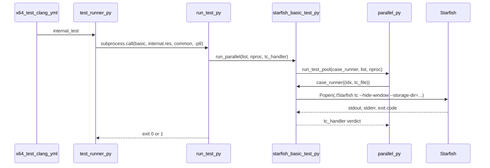
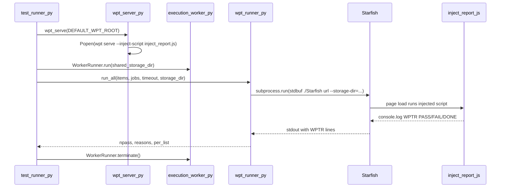
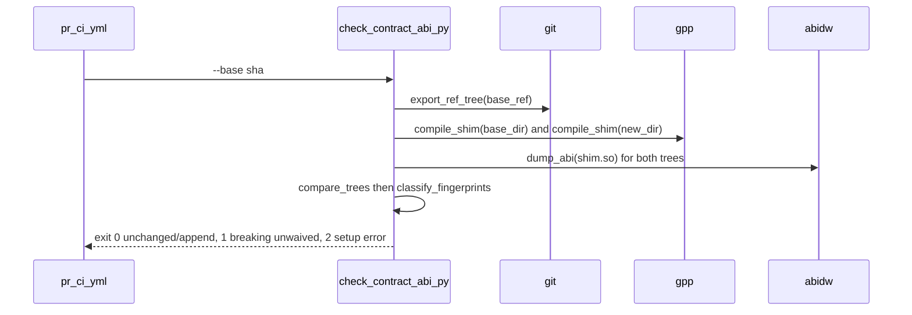

# Module Design Card: support-tools

> **Relevant source files**
>
> - [docs/generator/__init__.py](src:docs/generator/__init__.py)
> - [docs/generator/run.py](src:docs/generator/run.py)
> - [docs/webpages/webapi/webapi_main.js](src:docs/webpages/webapi/webapi_main.js)
> - [tool/ci/check_render_bmp.py](src:tool/ci/check_render_bmp.py)
> - [tool/coverage/csv2xml.py](src:tool/coverage/csv2xml.py)
> - [tool/coverage/genDomMethods.js](src:tool/coverage/genDomMethods.js)
> - [tool/coverage/genTable.js](src:tool/coverage/genTable.js)
> - [tool/drivers/basics/__init__.py](src:tool/drivers/basics/__init__.py)
> - [tool/drivers/basics/constants.py](src:tool/drivers/basics/constants.py)
> - [tool/drivers/basics/parallel.py](src:tool/drivers/basics/parallel.py)
> - [tool/drivers/basics/starfish_basic_test.py](src:tool/drivers/basics/starfish_basic_test.py)
> - [tool/drivers/basics/starfish_pixel_test.py](src:tool/drivers/basics/starfish_pixel_test.py)
> - [tool/drivers/basics/starfish_pixel_with_remote_test.py](src:tool/drivers/basics/starfish_pixel_with_remote_test.py)
> - [tool/drivers/basics/utils.py](src:tool/drivers/basics/utils.py)
> - [tool/drivers/run_test.py](src:tool/drivers/run_test.py)
> - [tool/drivers/tests/__init__.py](src:tool/drivers/tests/__init__.py)
> - [tool/drivers/tests/csswg_test.py](src:tool/drivers/tests/csswg_test.py)
> - [tool/drivers/tests/dom_conformance_test.py](src:tool/drivers/tests/dom_conformance_test.py)
> - [tool/drivers/tests/multi_results_test.py](src:tool/drivers/tests/multi_results_test.py)
> - [tool/drivers/tests/vendor_test.py](src:tool/drivers/tests/vendor_test.py)
> - [tool/drivers/tests/wpt_test.py](src:tool/drivers/tests/wpt_test.py)
> - [tool/imgdiff/imgdiff.cpp](src:tool/imgdiff/imgdiff.cpp)
> - [tool/lint/check_contract_abi.py](src:tool/lint/check_contract_abi.py)
> - [tool/lint/check_tidy.py](src:tool/lint/check_tidy.py)
> - [tool/lint/contract_abi/contract_shim.cpp](src:tool/lint/contract_abi/contract_shim.cpp)
> - [tool/perf_tools/measure-bench/server.py](src:tool/perf_tools/measure-bench/server.py)
> - [tool/perf_tools/mp4-avc-equiv/equiv.cpp](src:tool/perf_tools/mp4-avc-equiv/equiv.cpp)
> - [tool/perf_tools/mse-smoke/gen_webm.py](src:tool/perf_tools/mse-smoke/gen_webm.py)
> - [tool/perf_tools/mse-smoke/server.py](src:tool/perf_tools/mse-smoke/server.py)
> - [tool/perf_tools/style-smoke/server.py](src:tool/perf_tools/style-smoke/server.py)
> - [tool/pixel_test/nw_capture/capture.js](src:tool/pixel_test/nw_capture/capture.js)
> - [tool/pixel_test/nw_capture/inject.js](src:tool/pixel_test/nw_capture/inject.js)
> - [tool/pixel_test/syntaxChecker.js](src:tool/pixel_test/syntaxChecker.js)
> - [tool/pixel_test/syntaxCoverage.js](src:tool/pixel_test/syntaxCoverage.js)
> - [tool/reftest/draw_mem_chart.py](src:tool/reftest/draw_mem_chart.py)
> - [tool/reftest/search_webkit_test.py](src:tool/reftest/search_webkit_test.py)
> - [tool/repo_paths.py](src:tool/repo_paths.py)
> - [tool/runner/execution_test.py](src:tool/runner/execution_test.py)
> - [tool/runner/execution_worker.py](src:tool/runner/execution_worker.py)
> - [tool/runner/http_server.py](src:tool/runner/http_server.py)
> - [tool/runner/test_runner.py](src:tool/runner/test_runner.py)
> - [tool/runner/update_result.py](src:tool/runner/update_result.py)
> - [tool/runner/uwe_loader_test.py](src:tool/runner/uwe_loader_test.py)
> - [tool/runner/uwe_worker_loader_test.py](src:tool/runner/uwe_worker_loader_test.py)
> - [tool/wpt/inject_report.js](src:tool/wpt/inject_report.js)
> - [tool/wpt/scripts/wpt_annotate.py](src:tool/wpt/scripts/wpt_annotate.py)
> - [tool/wpt/scripts/wpt_audit.py](src:tool/wpt/scripts/wpt_audit.py)
> - [tool/wpt/scripts/wpt_generate_dashboard.py](src:tool/wpt/scripts/wpt_generate_dashboard.py)
> - [tool/wpt/scripts/wpt_manifest_lists.py](src:tool/wpt/scripts/wpt_manifest_lists.py)
> - [tool/wpt/scripts/wpt_reftest.py](src:tool/wpt/scripts/wpt_reftest.py)
> - [tool/wpt/scripts/wpt_runner.py](src:tool/wpt/scripts/wpt_runner.py)
> - [tool/wpt/scripts/wpt_server.py](src:tool/wpt/scripts/wpt_server.py)
> - [tool/wpt/scripts/wpt_status.py](src:tool/wpt/scripts/wpt_status.py)
> - [tool/wpt/scripts/wpt_update_data.py](src:tool/wpt/scripts/wpt_update_data.py)
> - [tool/pixel_test/pixel_test.sh](src:tool/pixel_test/pixel_test.sh)
> - [tool/pixel_test/syntaxChecker.sh](src:tool/pixel_test/syntaxChecker.sh)
> - [tool/reftest/cairo/internal.sh](src:tool/reftest/cairo/internal.sh)
> - [tool/reftest/reftest.sh](src:tool/reftest/reftest.sh)
> - [tool/coverage/README](src:tool/coverage/README)
> - [src/shell/MiniBrowser.cpp](src:src/shell/MiniBrowser.cpp)
> - [src/shell/Shell.cpp](src:src/shell/Shell.cpp)
> - [src/core/page/WebView.cpp](src:src/core/page/WebView.cpp)
> - [src/binding/WindowCustomBinding.cpp](src:src/binding/WindowCustomBinding.cpp)
> - [src/public/contract/LWEDelegateContract.h](src:src/public/contract/LWEDelegateContract.h)
> - [.github/workflows/pr_ci.yml](src:.github/workflows/pr_ci.yml)
> - [.github/workflows/x64_test_clang.yml](src:.github/workflows/x64_test_clang.yml)
> - [.github/workflows/worker.yml](src:.github/workflows/worker.yml)
> - [.github/workflows/dynamic_loader.yml](src:.github/workflows/dynamic_loader.yml)

**Module**: `support-tools` — 54 files under `tool/` (ci, coverage, drivers, imgdiff, lint, perf_tools, pixel_test, reftest, runner, wpt) and `docs/` (generator, webpages/webapi)
**Role**: Developer tooling that launches the `./Starfish` shell binary as a child process for each test case, judges the result from the process's stdout and exit status, and gates CI with lint/ABI checks. [`test_runner.py::run_test`](src:tool/runner/test_runner.py#L55)
**Module Boundary**: Developer tooling (drivers, wpt, runner, perf_tools, pixel_test, coverage, lint, ci, reftest, imgdiff) and docs generator/webpages — support artifacts, not product domain modules
**Confidence**: 0.85
**Core selection**: All approved modules are Core (boundary approved in W1 human review)
**Generated**: 2026-09-10

## Source Files

### tool/runner — suite orchestration (CI entry points)
- [tool/runner/test_runner.py](src:tool/runner/test_runner.py)
- [tool/runner/execution_worker.py](src:tool/runner/execution_worker.py)
- [tool/runner/execution_test.py](src:tool/runner/execution_test.py)
- [tool/runner/http_server.py](src:tool/runner/http_server.py)
- [tool/runner/update_result.py](src:tool/runner/update_result.py)
- [tool/runner/uwe_loader_test.py](src:tool/runner/uwe_loader_test.py)
- [tool/runner/uwe_worker_loader_test.py](src:tool/runner/uwe_worker_loader_test.py)

### tool/drivers — per-case drivers
- [tool/drivers/run_test.py](src:tool/drivers/run_test.py)
- [tool/drivers/basics/__init__.py](src:tool/drivers/basics/__init__.py)
- [tool/drivers/basics/constants.py](src:tool/drivers/basics/constants.py)
- [tool/drivers/basics/parallel.py](src:tool/drivers/basics/parallel.py)
- [tool/drivers/basics/starfish_basic_test.py](src:tool/drivers/basics/starfish_basic_test.py)
- [tool/drivers/basics/starfish_pixel_test.py](src:tool/drivers/basics/starfish_pixel_test.py)
- [tool/drivers/basics/starfish_pixel_with_remote_test.py](src:tool/drivers/basics/starfish_pixel_with_remote_test.py)
- [tool/drivers/basics/utils.py](src:tool/drivers/basics/utils.py)
- [tool/drivers/tests/__init__.py](src:tool/drivers/tests/__init__.py)
- [tool/drivers/tests/csswg_test.py](src:tool/drivers/tests/csswg_test.py)
- [tool/drivers/tests/dom_conformance_test.py](src:tool/drivers/tests/dom_conformance_test.py)
- [tool/drivers/tests/multi_results_test.py](src:tool/drivers/tests/multi_results_test.py)
- [tool/drivers/tests/vendor_test.py](src:tool/drivers/tests/vendor_test.py)
- [tool/drivers/tests/wpt_test.py](src:tool/drivers/tests/wpt_test.py)

### tool/wpt — Web Platform Tests tooling
- [tool/wpt/inject_report.js](src:tool/wpt/inject_report.js)
- [tool/wpt/scripts/wpt_runner.py](src:tool/wpt/scripts/wpt_runner.py)
- [tool/wpt/scripts/wpt_server.py](src:tool/wpt/scripts/wpt_server.py)
- [tool/wpt/scripts/wpt_reftest.py](src:tool/wpt/scripts/wpt_reftest.py)
- [tool/wpt/scripts/wpt_status.py](src:tool/wpt/scripts/wpt_status.py)
- [tool/wpt/scripts/wpt_manifest_lists.py](src:tool/wpt/scripts/wpt_manifest_lists.py)
- [tool/wpt/scripts/wpt_annotate.py](src:tool/wpt/scripts/wpt_annotate.py)
- [tool/wpt/scripts/wpt_audit.py](src:tool/wpt/scripts/wpt_audit.py)
- [tool/wpt/scripts/wpt_update_data.py](src:tool/wpt/scripts/wpt_update_data.py)
- [tool/wpt/scripts/wpt_generate_dashboard.py](src:tool/wpt/scripts/wpt_generate_dashboard.py)

### tool/lint, tool/ci — PR gates
- [tool/lint/check_contract_abi.py](src:tool/lint/check_contract_abi.py)
- [tool/lint/contract_abi/contract_shim.cpp](src:tool/lint/contract_abi/contract_shim.cpp)
- [tool/lint/check_tidy.py](src:tool/lint/check_tidy.py)
- [tool/ci/check_render_bmp.py](src:tool/ci/check_render_bmp.py)

### tool/imgdiff, tool/pixel_test, tool/reftest — image comparison and legacy list tooling
- [tool/imgdiff/imgdiff.cpp](src:tool/imgdiff/imgdiff.cpp)
- [tool/pixel_test/nw_capture/capture.js](src:tool/pixel_test/nw_capture/capture.js)
- [tool/pixel_test/nw_capture/inject.js](src:tool/pixel_test/nw_capture/inject.js)
- [tool/pixel_test/syntaxChecker.js](src:tool/pixel_test/syntaxChecker.js)
- [tool/pixel_test/syntaxCoverage.js](src:tool/pixel_test/syntaxCoverage.js)
- [tool/reftest/draw_mem_chart.py](src:tool/reftest/draw_mem_chart.py)
- [tool/reftest/search_webkit_test.py](src:tool/reftest/search_webkit_test.py)

### tool/coverage, tool/perf_tools — coverage tables and perf smoke servers
- [tool/coverage/csv2xml.py](src:tool/coverage/csv2xml.py)
- [tool/coverage/genDomMethods.js](src:tool/coverage/genDomMethods.js)
- [tool/coverage/genTable.js](src:tool/coverage/genTable.js)
- [tool/perf_tools/measure-bench/server.py](src:tool/perf_tools/measure-bench/server.py)
- [tool/perf_tools/mp4-avc-equiv/equiv.cpp](src:tool/perf_tools/mp4-avc-equiv/equiv.cpp)
- [tool/perf_tools/mse-smoke/gen_webm.py](src:tool/perf_tools/mse-smoke/gen_webm.py)
- [tool/perf_tools/mse-smoke/server.py](src:tool/perf_tools/mse-smoke/server.py)
- [tool/perf_tools/style-smoke/server.py](src:tool/perf_tools/style-smoke/server.py)

### shared anchor and docs
- [tool/repo_paths.py](src:tool/repo_paths.py)
- [docs/generator/__init__.py](src:docs/generator/__init__.py)
- [docs/generator/run.py](src:docs/generator/run.py)
- [docs/webpages/webapi/webapi_main.js](src:docs/webpages/webapi/webapi_main.js)

## Public Interface

The module's public surface is its command-line entry points (script name plus argparse options) and the few Python symbols imported across script families.

| Function/Class | Signature | Main callers | Source |
|---|---|---|---|
| `test_runner.py` (CLI) | `./tool/runner/test_runner.py [test_suite_names ...] [-t/--timeout N] [-f/--force] [--out-pass-list] [--out-pass-list-filename F]` | `.github/workflows/x64_test_clang.yml` (`internal_test`, `reftest_all`), `.github/workflows/worker.yml` (`wpt_serve_testharness_worker`, `wpt_serve_testharness_serviceworker`), `update_result.py` | [`test_runner.py`](src:tool/runner/test_runner.py#L496) |
| `run_test.py` (CLI) | `./tool/drivers/run_test.py test_kind list_file backend [--font-dep] [-p/--proc N] [--out-file F]` | `test_runner.run_test` (spawns it as a child process) | [`run_test.py`](src:tool/drivers/run_test.py#L114) |
| `run_test` | `def run_test(argv_input, env=None)` | every suite function in `test_runner.py` (`internal_test`, `vendor_test`, `wpt_all`, ...) | [`run_test`](src:tool/runner/test_runner.py#L55) |
| `WorkerRunner` | `class WorkerRunner: run(data_dir=None), terminate()` | `test_runner._wpt_serve_run` | [`WorkerRunner`](src:tool/runner/execution_worker.py#L24) |
| `run_parallel` (basic) | `def run_parallel(list_file, nproc=None, width=None, height=None, regression=None, show_progress=None, tc_handler=None, result_handler=None)` | `run_test.py` suite functions, `vendor_test.py`, `dom_conformance_test.py` | [`run_parallel`](src:tool/drivers/basics/starfish_basic_test.py#L156) |
| `run_parallel` (pixel) | `def run_parallel(list_file, backend, nproc=None, width=None, height=None, ...)` | `run_test.py` (`run_vendor_pixel_test`, `run_csswg_test`, `run_default_pixel_test`) | [`run_parallel`](src:tool/drivers/basics/starfish_pixel_test.py#L151) |
| `run_test_pool` | `def run_test_pool(case_runner, in_path, nproc, out_path=None, result_handler=None)` | `starfish_basic_test.run_parallel`, `starfish_pixel_test.run_parallel`, `run_test.run_wpt_reference_test` | [`run_test_pool`](src:tool/drivers/basics/parallel.py#L26) |
| `wpt_runner.py` (CLI) | `wpt_runner.py res [--wpt-root P] [-j/--jobs N] [--timeout S] [-f/--force] [--results F] [--resume] [--no-serve] [--mode {testharness,reftest,crashtest}] [-v/--verbose] [--log-lines N]` | developers, `wpt_annotate.py` consumes its `--results` file | [`main`](src:tool/wpt/scripts/wpt_runner.py#L482) |
| `run_all` | `def run_all(items, jobs, timeout, results_path, append=False, mode="testharness", manifest=None, verbose=False, log_lines=100, storage_dir=None)` | `test_runner._wpt_serve_run`, `test_runner._wpt_manifest_run` | [`run_all`](src:tool/wpt/scripts/wpt_runner.py#L383) |
| `wpt_serve` | `@contextmanager def wpt_serve(wpt_root, inject_script=DEFAULT_INJECT, http2=False, startup_timeout=60, verbose=False)` | `wpt_runner.main`, `wpt_status.main`, `wpt_audit.main`, `test_runner._wpt_serve_run` | [`wpt_serve`](src:tool/wpt/scripts/wpt_server.py#L127) |
| `run_reftest` / `wpt_reftest.py` (CLI) | `def run_reftest(url, wpt_root=DEFAULT_WPT_ROOT, manifest=None, timeout=15, tmp_dir=None, width=800, height=600)`; CLI `wpt_reftest.py url [--wpt-root P] [--timeout S]` | `wpt_runner.run_one_reftest` | [`run_reftest`](src:tool/wpt/scripts/wpt_reftest.py#L291) |
| `wpt_status.py` (CLI) | `wpt_status.py [--targets F] [--only DIR]... [--wpt-root P] [--manifest F] [-j N] [--timeout S] [--limit N] [-o/--output F] [--output-json F] [--no-serve] [--test-types LIST]` | nightly report generation (per module docstring) | [`main`](src:tool/wpt/scripts/wpt_status.py#L567) |
| `wpt_manifest_lists.py` (CLI) | `wpt_manifest_lists.py --mode {reftest,crashtest} --out-dir DIR [--wpt-root P] [--targets F]` | developers; `test_runner._wpt_manifest_run` prints this command when lists are missing | [`main`](src:tool/wpt/scripts/wpt_manifest_lists.py#L58) |
| `wpt_annotate.py` (CLI) | `wpt_annotate.py RESULTS_FILE RES_DIR_OR_FILE` | developers refreshing `.res` gates | [`main`](src:tool/wpt/scripts/wpt_annotate.py#L99) |
| `wpt_audit.py` (CLI) | `wpt_audit.py [--wpt-root P] [--res-dir D] [--include-commented] [--out-dir D] [--no-remap] [--workers N] [--no-serve]` | developers curating lists | [`main`](src:tool/wpt/scripts/wpt_audit.py#L221) |
| `wpt_update_data.py` / `wpt_generate_dashboard.py` (CLI) | `wpt_update_data.py --metrics F [--data-file F]`; `wpt_generate_dashboard.py [--data-file F] [--output/-o F]` | nightly dashboard workflow (per docstrings) | [`main`](src:tool/wpt/scripts/wpt_update_data.py#L78), [`main`](src:tool/wpt/scripts/wpt_generate_dashboard.py#L386) |
| `check_contract_abi.py` (CLI) | `check_contract_abi.py [--base REF] [--verbose] [--verify-checker]` | `.github/workflows/pr_ci.yml` line 92 | [`main`](src:tool/lint/check_contract_abi.py#L1270) |
| `check_tidy.py` (CLI) | `check_tidy.py [--clang-format PATH] [--update] [dir ...]` | `.github/workflows/pr_ci.yml` line 47 | [`main`](src:tool/lint/check_tidy.py#L113) |
| `check_render_bmp.py` (CLI) | `check_render_bmp.py bmp [--require paint,image,font]` | CI render check (Windows, per module docstring) | [`main`](src:tool/ci/check_render_bmp.py#L86) |
| `execution_test.py`, `uwe_loader_test.py`, `uwe_worker_loader_test.py` (CLI) | no options; run from repo root | `.github/workflows/dynamic_loader.yml` lines 72-76 | [`run`](src:tool/runner/execution_test.py#L26), [`main`](src:tool/runner/uwe_loader_test.py#L267), [`main`](src:tool/runner/uwe_worker_loader_test.py#L234) |
| `imgdiff` (CLI) | `tool/imgdiff/imgdiff a.png b.png` | `starfish_pixel_test.pixel_diff`, `wpt_reftest._images_differ`, `pixel_test.sh` | [`main`](src:tool/imgdiff/imgdiff.cpp#L217) |
| `docs/generator/run.py` (CLI) | `run.py root_path` | documentation build | [`run.py`](src:docs/generator/run.py#L82) |

## IPC / Message / Interface Contracts

All contracts below cross a process boundary: a Python driver spawns the `./Starfish` shell (or a helper binary) as a child process and parses its stdout, or an HTTP server receives a POST from a page running inside Starfish.

- **`WPTR` stdout protocol** — `inject_report.js` (injected into every page by `wpt serve --inject-script`) prints `WPTR PASS <name>` / `WPTR FAIL <name>` per subtest and `WPTR DONE status=<n> count=<n>` at completion, or `WPTR CRASHOK` on the crashtest path; `wpt_runner.run_one` parses these with `RE_PASS`/`RE_FAIL`/`RE_DONE`/`RE_CRASHOK` to compute the verdict. [`emit`](src:tool/wpt/inject_report.js#L22), [`RE_DONE`](src:tool/wpt/scripts/wpt_runner.py#L129), [`run_one`](src:tool/wpt/scripts/wpt_runner.py#L227)
- **Crashtest query marker** — `wpt_runner` appends `__starfish_crashtest=1` to the test URL query; `inject_report.js` checks `location.search` for the same literal to switch to the crashtest completion path (the two literals are kept in sync by comment, no shared constant). [`CRASHTEST_QUERY`](src:tool/wpt/scripts/wpt_runner.py#L137), [`inject_report.js`](src:tool/wpt/inject_report.js#L46)
- **Starfish shell command line** — drivers pass `--hide-window`, `--width=`, `--height=`, `--storage-dir=`, `--screen-shot=`, `--timeout=`, `--regression-test`, `--pixel-test`, `--ref-test`, `--disable-console`; these are parsed by the shell's argument parser. [`case_runner`](src:tool/drivers/basics/starfish_basic_test.py#L98), [`MiniBrowser::parseArgs`](src:src/shell/MiniBrowser.cpp#L47)
- **Crash marker** — the shell prints `[STARFISH_TEST] Got signal ...` from its signal handler; `starfish_basic_test.case_runner` treats that substring in stdout as a crash. [`Shell.cpp`](src:src/shell/Shell.cpp#L226), [`case_runner`](src:tool/drivers/basics/starfish_basic_test.py#L98)
- **Legacy `--ref-test` markers** — `WebView.cpp` logs `STARFISH_RTPASS` / `STARFISH_RTERROR <msg>`; `wpt_test.py` matches them with `RE_RTPASS` / `RE_RTERROR`. [`WebView.cpp`](src:src/core/page/WebView.cpp#L225), [`RE_RTERROR`](src:tool/drivers/tests/wpt_test.py#L20)
- **`wptTestEnd() called` marker** — the binding prints this line when a page calls `wptTestEnd()`; `vendor_test.tc_handler` slices stdout at it before comparing PASS/FAIL tokens. [`WindowCustomBinding.cpp`](src:src/binding/WindowCustomBinding.cpp#L776), [`tc_handler`](src:tool/drivers/tests/vendor_test.py#L11)
- **`imgdiff` stdout** — `imgdiff` always prints a `diff: X.XX% passed|failed[imgdiff-fail]` line; `wpt_reftest._images_differ` parses the percentage with `_DIFF_RE`, `starfish_pixel_test.pixel_diff` passes the raw line to its handler. [`main`](src:tool/imgdiff/imgdiff.cpp#L217), [`_DIFF_RE`](src:tool/wpt/scripts/wpt_reftest.py#L250), [`pixel_diff`](src:tool/drivers/basics/starfish_pixel_test.py#L66)
- **Worker daemon spawn** — `WorkerRunner.run` starts `./Starfish-sharedworker` / `./Starfish-serviceworker` with `--data-dir=<dir>` in a new session and `terminate` kills the process group; the same `--data-dir` is used by `uwe_worker_loader_test.run_worker`. [`WorkerRunner::run`](src:tool/runner/execution_worker.py#L30), [`run_worker`](src:tool/runner/uwe_worker_loader_test.py#L175)
- **`wpt serve` child process** — `wpt_serve` launches `python <wpt_root>/wpt serve --no-h2 --inject-script <inject_report.js>` and probes `http://web-platform.test:8000/` until three consecutive successes. [`wpt_serve`](src:tool/wpt/scripts/wpt_server.py#L127), [`HTTP_PORT`](src:tool/wpt/scripts/wpt_server.py#L43)
- **Perf smoke HTTP result channel** — the perf servers serve a page over HTTP on 127.0.0.1 (ports 8802 / 8801 / 8799) and append the body of any POST to a results file. [`H`](src:tool/perf_tools/measure-bench/server.py#L7), [`H`](src:tool/perf_tools/style-smoke/server.py#L7), [`H`](src:tool/perf_tools/mse-smoke/server.py#L4)
- **ABI checker external tools** — `check_contract_abi.py` runs `git`, `g++`, `abidw` and `abidiff` as subprocesses and reads `abidw` XML output. [`compile_shim`](src:tool/lint/check_contract_abi.py#L305), [`dump_abi`](src:tool/lint/check_contract_abi.py#L361), [`run_abidiff`](src:tool/lint/check_contract_abi.py#L748)

Architecturally these contracts decouple the test harness from the engine: verdicts are derived from text the child process prints (stdout pipe) and from its exit status, so no engine-internal API is linked into the tooling. The one long-lived process pair (worker daemon + client shells) must share a storage directory because the worker socket path is derived from it. [`_storage_dir_scope`](src:tool/wpt/scripts/wpt_runner.py#L97)

## Key Flow

Entry point: [`internal_test`](src:tool/runner/test_runner.py#L77) calls [`run_test`](src:tool/runner/test_runner.py#L55), which spawns `run_test.py`; the driver then fans out through [`run_test_pool`](src:tool/drivers/basics/parallel.py#L26) to [`case_runner`](src:tool/drivers/basics/starfish_basic_test.py#L98).

Entry point: [`_wpt_serve_run`](src:tool/runner/test_runner.py#L257) brings up [`wpt_serve`](src:tool/wpt/scripts/wpt_server.py#L127), optional daemons via [`WorkerRunner::run`](src:tool/runner/execution_worker.py#L30), and judges each URL in [`run_one`](src:tool/wpt/scripts/wpt_runner.py#L227).

Entry point: [`compare`](src:tool/lint/check_contract_abi.py#L964) drives [`export_ref_tree`](src:tool/lint/check_contract_abi.py#L196), [`compile_shim`](src:tool/lint/check_contract_abi.py#L305), [`dump_abi`](src:tool/lint/check_contract_abi.py#L361) and [`compare_trees`](src:tool/lint/check_contract_abi.py#L772).

## Architectural Rules

- [ ] Scripts locate the repository root through the single `REPO_ROOT` anchor in `tool/repo_paths.py` (put `tool/` on `sys.path`, then import) rather than counting `..` hops. [`REPO_ROOT`](src:tool/repo_paths.py#L29)
- [ ] Every Starfish invocation receives its own throwaway `--storage-dir=` (created with `tempfile.mkdtemp(prefix="starfish-storage-")` and removed afterwards); the only exception is a daemon suite, where the daemon and all client shells share one directory. [`isolated_storage_dir`](src:tool/wpt/scripts/wpt_runner.py#L74), [`case_runner`](src:tool/drivers/basics/starfish_basic_test.py#L98), [`_wpt_serve_run`](src:tool/runner/test_runner.py#L257)
- [ ] WPT invocations of Starfish are prefixed with `stdbuf -oL -eL` so that captured output is line-buffered and survives a SIGKILL on timeout. [`STARFISH_CMD_PREFIX`](src:tool/wpt/scripts/wpt_runner.py#L70)
- [ ] `.res` list convention: active lines are expected to pass, `#`-commented lines are known failures; `--force` / `TC_FORCE_ENABLE` re-includes commented entries. [`read_res`](src:tool/wpt/scripts/wpt_runner.py#L154), [`run_test_pool`](src:tool/drivers/basics/parallel.py#L26), [`annotate_file`](src:tool/wpt/scripts/wpt_annotate.py#L63)
- [ ] Suite exit codes are the `ERRORCODE` values 0 (passed), 1 (failed), 2 (stopped). [`ERRORCODE`](src:tool/drivers/basics/constants.py#L12)
- [ ] WPT verdicts are computed only from the `WPTR` lines the shell prints; no stored expected `.txt` files are read. [`run_one`](src:tool/wpt/scripts/wpt_runner.py#L227)
- [ ] The ABI gate compares against a git base ref exported into a temporary tree (including the base copy of the shim), never against a checked-in snapshot. [`compare`](src:tool/lint/check_contract_abi.py#L964), [`export_ref_tree`](src:tool/lint/check_contract_abi.py#L196)
- [ ] Long-lived child processes (`wpt serve`, worker daemons, timed-out shells) are started with `start_new_session=True` and stopped with `os.killpg` (SIGTERM then SIGKILL). [`_terminate`](src:tool/wpt/scripts/wpt_server.py#L186), [`WorkerRunner::terminate`](src:tool/runner/execution_worker.py#L53), [`open_subprocess`](src:tool/drivers/basics/starfish_basic_test.py#L72)

## Dependencies

### Internal modules

| Module | File(s) | Purpose | Source |
|---|---|---|---|
| [shell](shell.md) | `src/shell/MiniBrowser.cpp`, `src/shell/Shell.cpp` | The `./Starfish` binary spawned by every driver; its argument parser defines the CLI flags the tools pass, and its signal handler prints the crash marker the drivers look for | [`MiniBrowser::parseArgs`](src:src/shell/MiniBrowser.cpp#L47), [`Shell.cpp`](src:src/shell/Shell.cpp#L226) |
| [engine-entry](engine-entry.md) | `src/launcher/SharedWorkerEntry.cpp` | `./Starfish-sharedworker` / `./Starfish-serviceworker` daemons launched by `WorkerRunner` with `--data-dir=` | [`WorkerRunner::run`](src:tool/runner/execution_worker.py#L30) |
| [public-embedder-api](public-embedder-api.md) | `src/public/contract/*.h`, `inc/LWEWorker.h`, `inc/PlatformIntegrationData.h` | Headers whose layout is fingerprinted by the ABI checker; `kDelegateAbiEpoch` policy is enforced there | [`CONTRACT_DIR`](src:tool/lint/check_contract_abi.py#L104), [`LWEDelegateContract.h`](src:src/public/contract/LWEDelegateContract.h#L21) |
| [core-page](core-page.md) | `src/core/page/WebView.cpp` | Emits `STARFISH_RTPASS` / `STARFISH_RTERROR` consumed by the legacy `--ref-test` driver | [`WebView.cpp`](src:src/core/page/WebView.cpp#L225) |
| [binding](binding.md) | `src/binding/WindowCustomBinding.cpp` | Prints `wptTestEnd() called`, the slice marker used by `vendor_test.tc_handler` | [`WindowCustomBinding.cpp`](src:src/binding/WindowCustomBinding.cpp#L776) |
| [modules-workers](modules-workers.md) | `src/core/modules/worker/WorkerIPCAddress.cpp` | Derives the worker socket path from the storage directory, which is why daemon suites share one `--storage-dir` (stated in tool comments) | [`_storage_dir_scope`](src:tool/wpt/scripts/wpt_runner.py#L97) |

### External libraries

| Library | Version | Purpose | Source |
|---|---|---|---|
| libpng (`<png.h>`) | Not specified in code | PNG decoding in `imgdiff` | [`imgdiff.cpp`](src:tool/imgdiff/imgdiff.cpp#L34) |
| abidw / abidiff (libabigail tools) | `abidw >= 2.0` required at runtime | ABI dump and diff of the compiled contract shim | [`check_abidw_version`](src:tool/lint/check_contract_abi.py#L162) |
| g++ | Not specified in code | Compiles `contract_shim.cpp` with `COMPILE_FLAGS` | [`COMPILE_FLAGS`](src:tool/lint/check_contract_abi.py#L128) |
| clang-format | Not specified in code | Source formatting check (`-style=file`) | [`check_tidy`](src:tool/lint/check_tidy.py#L63) |
| Jinja2 | Not specified in code | HTML rendering in the docs generator | [`run.py`](src:docs/generator/run.py#L12) |
| matplotlib | Not specified in code | Memory chart rendering | [`draw_mem_chart.py`](src:tool/reftest/draw_mem_chart.py#L1) |
| Node.js `fs` / nw.js / phantomjs `webpage` | Not specified in code | Coverage table generation, expected-image capture, syntax checking of test HTML | [`genTable.js`](src:tool/coverage/genTable.js#L1), [`capture.js`](src:tool/pixel_test/nw_capture/capture.js#L7), [`syntaxChecker.js`](src:tool/pixel_test/syntaxChecker.js#L134) |
| WPT checkout (`third_party/wpt`, `wpt serve`, `wpt manifest`) | Not specified in code | Test server and manifest for the WPT scripts | [`DEFAULT_WPT_ROOT`](src:tool/wpt/scripts/wpt_server.py#L53), [`ensure_manifest`](src:tool/wpt/scripts/wpt_reftest.py#L97) |

## Quick Navigation

| To change… | Location |
|---|---|
| Add or rename a CI test suite | [`test_all`](src:tool/runner/test_runner.py#L481) and sibling suite functions such as [`internal_test`](src:tool/runner/test_runner.py#L77) |
| Add a driver test kind (`basic`, `pixel`, `wpt_ref`, ...) | [`run_test.py`](src:tool/drivers/run_test.py#L99) |
| Starfish flags passed by the text-based driver | [`case_runner`](src:tool/drivers/basics/starfish_basic_test.py#L98) |
| Starfish flags passed by the golden-image driver | [`case_runner`](src:tool/drivers/basics/starfish_pixel_test.py#L92) |
| WPT verdict rules (PASS/FAIL reasons) | [`run_one`](src:tool/wpt/scripts/wpt_runner.py#L227), [`run_one_crashtest`](src:tool/wpt/scripts/wpt_runner.py#L302) |
| `WPTR` line emission inside the page | [`emit`](src:tool/wpt/inject_report.js#L22) |
| `wpt serve` host/ports and health probing | [`HTTP_PORT`](src:tool/wpt/scripts/wpt_server.py#L43), [`wpt_serve`](src:tool/wpt/scripts/wpt_server.py#L127) |
| Reftest reference resolution and image comparison | [`resolve_references`](src:tool/wpt/scripts/wpt_reftest.py#L160), [`_images_differ`](src:tool/wpt/scripts/wpt_reftest.py#L253) |
| ABI change classification (unchanged / append / breaking) | [`classify_fingerprints`](src:tool/lint/check_contract_abi.py#L517) |
| Track a new contract interface in the ABI shim | [`ContractAbiWitness`](src:tool/lint/contract_abi/contract_shim.cpp#L201), [`CONTRACT_ABI_CHECK_WRAPPER`](src:tool/lint/contract_abi/contract_shim.cpp#L110) |
| Render-check colour thresholds | [`TOLERANCE`](src:tool/ci/check_render_bmp.py#L30), [`MIN_PAINT_FRACTION`](src:tool/ci/check_render_bmp.py#L38) |
| Auto-fail marker written into `.res` lists | [`MARK_FMT`](src:tool/wpt/scripts/wpt_annotate.py#L41) |
| Dashboard HTML | [`generate_html`](src:tool/wpt/scripts/wpt_generate_dashboard.py#L53) |
| Web API documentation pages | [`generate_html`](src:docs/generator/run.py#L44), [`buildUI`](src:docs/webpages/webapi/webapi_main.js#L1) |

## FR Linkage

- [FR-SUPPORT-TOOLS-001](../functional-requirements/support-tools-fr.md#fr-support-tools-001): Test-suite orchestration by name with unified exit codes
- [FR-SUPPORT-TOOLS-002](../functional-requirements/support-tools-fr.md#fr-support-tools-002): Parallel per-case execution of the Starfish shell from `.res` lists
- [FR-SUPPORT-TOOLS-003](../functional-requirements/support-tools-fr.md#fr-support-tools-003): Golden-image pixel comparison with `imgdiff`
- [FR-SUPPORT-TOOLS-004](../functional-requirements/support-tools-fr.md#fr-support-tools-004): WPT testharness execution under an on-demand `wpt serve` with `WPTR` verdicts
- [FR-SUPPORT-TOOLS-005](../functional-requirements/support-tools-fr.md#fr-support-tools-005): WPT reftest and crashtest execution from `MANIFEST.json`
- [FR-SUPPORT-TOOLS-006](../functional-requirements/support-tools-fr.md#fr-support-tools-006): WPT status reporting, list annotation and dashboard data
- [FR-SUPPORT-TOOLS-007](../functional-requirements/support-tools-fr.md#fr-support-tools-007): UWE delegate contract ABI gate
- [FR-SUPPORT-TOOLS-008](../functional-requirements/support-tools-fr.md#fr-support-tools-008): Source formatting gate
- [FR-SUPPORT-TOOLS-009](../functional-requirements/support-tools-fr.md#fr-support-tools-009): CI smoke checks for rendering and the UWE dynamic loader
- [FR-SUPPORT-TOOLS-010](../functional-requirements/support-tools-fr.md#fr-support-tools-010): Web API documentation generation and coverage/perf helpers
