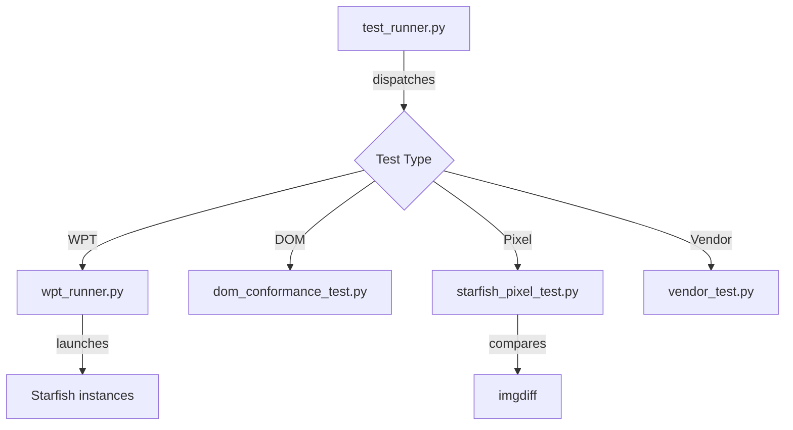

# Module Design Card: test-tooling

> **Relevant source files**
> - [`test_runner.py`](tool/runner/test_runner.py#L1)
> - [`constants.py`](tool/drivers/basics/constants.py#L13)
> - [`check_tidy.py`](tool/lint/check_tidy.py#L1)
> - [`check_contract_abi.py`](tool/lint/check_contract_abi.py#L1)
> - [`wpt_runner.py`](tool/wpt/scripts/wpt_runner.py#L1)

## Module Boundary
Test framework and tooling: test runners, WPT scripts, pixel tests, lint checkers, performance tools, coverage tools.

**Confidence**: 0.90

## Source Files
51 files in `tool/` including `ci/`, `coverage/`, `drivers/`, `imgdiff/`, `lint/`, `perf_tools/`, `pixel_test/`, `reftest/`, `runner/`, `wpt/`

## Public Interface
- `test_runner.py` — Main test runner orchestrator. [`test_runner.py`](tool/runner/test_runner.py#L1)
- `check_tidy.py` — C++ style checker (PR CI gate). [`check_tidy.py`](tool/lint/check_tidy.py#L1)
- `check_contract_abi.py` — Delegate contract ABI checker. [`check_contract_abi.py`](tool/lint/check_contract_abi.py#L1)
- `wpt_runner.py` — Web Platform Tests runner. [`wpt_runner.py`](tool/wpt/scripts/wpt_runner.py#L1)
- `wpt_annotate.py` — WPT .res list annotation tool. [`wpt_annotate.py`](tool/wpt/scripts/wpt_annotate.py#L1)
- `imgdiff` — Image diff tool for pixel tests. [`imgdiff.cpp`](tool/imgdiff/imgdiff.cpp#L1)

## Key Flow

## Architectural Rules
- Test result constants: TEST_PASSED=0, TEST_FAILED=1, TEST_STOPPED=2. [`constants.py:13`](tool/drivers/basics/constants.py#L13)
- All test runs require xvfb-run with 1920x1080x24 virtual screen. [`README.md:302`](README.md#L302)
- WPT .res lists: # commented lines are tracked known-failures. [`AGENTS.md`](AGENTS.md)
- wpt_annotate.py markers are write-once. [`AGENTS.md`](AGENTS.md)
- Parallel test execution: 8-way by default. [`README.md:303`](README.md#L303)

## Dependencies
- Depends on: shell (launches Starfish binary)
- External: Python 3, xvfb, Node.js (for pixel tests)

## IPC / Message / Interface Contracts
- HTTP server (http_server.py) serves test pages to Starfish instances. [`http_server.py`](tool/runner/http_server.py#L1)

## Quick Navigation
- [FR Document](../functional-requirements/test-tooling-fr.md)
- [Architecture](../02-architecture.md)
