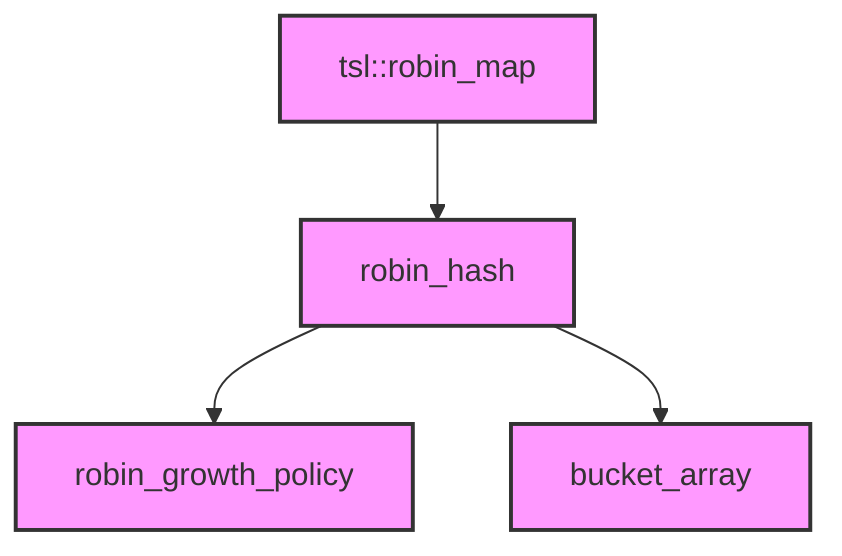

# Module Design Card — third-party

> **Relevant source files**
> - [`robin_map.h`](src:third_party/robin_map/include/tsl/robin_map.h)
> - [`robin_hash.h`](src:third_party/robin_map/include/tsl/robin_hash.h)
> - [`robin_growth_policy.h`](src:third_party/robin_map/include/tsl/robin_growth_policy.h)
> - [`robin_set.h`](src:third_party/robin_map/include/tsl/robin_set.h)
> - [`robin_vector.h`](src:third_party/robin_map/include/tsl/robin_vector.h)

## Module Boundary

**Rationale:** Third-party library — robin_map header-only hash map [`module-groups.yaml`](src:code2spec/.analysis/state/delta/module-groups.yaml)
**Confidence:** 0.95

## Source Files

5 files in `third_party/robin_map/include/tsl/` providing a header-only hash map implementation using robin hood hashing.

## Public Interface

| Component | Class | Source |
|---|---|---|
| Hash Map | `tsl::robin_map` | [`robin_map.h`](src:third_party/robin_map/include/tsl/robin_map.h#L36) |
| Hash Set | `tsl::robin_set` | [`robin_set.h`](src:third_party/robin_map/include/tsl/robin_set.h) |

## Key Flow

## Architectural Rules

- Open-addressing with robin hood hashing and backward shift deletion [`robin_map.h`](src:third_party/robin_map/include/tsl/robin_map.h#L39)
- Strong exception guarantee when `is_nothrow_swappable` and `is_nothrow_move_constructible` [`robin_map.h`](src:third_party/robin_map/include/tsl/robin_map.h#L43)
- Optional `StoreHash` (32-bit hash storage) for lookup performance [`robin_map.h`](src:third_party/robin_map/include/tsl/robin_map.h#L52)
- MIT License [`robin_map.h`](src:third_party/robin_map/include/tsl/robin_map.h#L2)

## Dependencies

None (header-only, C++ standard library)

## IPC / Message / Interface Contracts

- No IPC. Pure data structure library.

## Quick Navigation

- [FR Document](../functional-requirements/third-party-fr.md)
