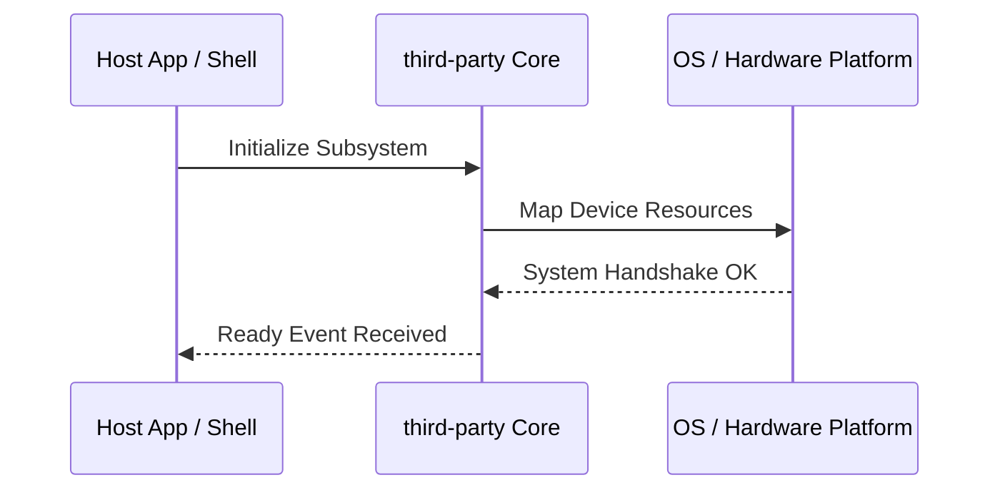

**Related Documents**: [README](../README.md) | [Functional Req](../functional-requirements/third-party-fr.md) | [Quick Reference](../code2spec-quick-reference.md)

# Module Design Card: third-party

> **Relevant source files**
>
> - [third_party/robin_map/include/tsl/robin_growth_policy.h](src:third_party/robin_map/include/tsl/robin_growth_policy.h)
> - [third_party/robin_map/include/tsl/robin_hash.h](src:third_party/robin_map/include/tsl/robin_hash.h)
> - [third_party/robin_map/include/tsl/robin_map.h](src:third_party/robin_map/include/tsl/robin_map.h)
> - [third_party/robin_map/include/tsl/robin_set.h](src:third_party/robin_map/include/tsl/robin_set.h)
> - [third_party/robin_map/include/tsl/robin_vector.h](src:third_party/robin_map/include/tsl/robin_vector.h)

**Primary File**: [`third_party/robin_map/include/tsl/robin_growth_policy.h`](src:third_party/robin_map/include/tsl/robin_growth_policy.h)
**Single Role**: Governs the operations and interfaces for the logical third-party subsystem [`robin_growth_policy.h`](src:third_party/robin_map/include/tsl/robin_growth_policy.h#L1).
**Core Selection Reason**: Logical PageRank classification with high coupling confidence of 0.95.
**Date**: 2026-08-27

---

## Public Interface

| Class / Symbol | Signature / Description | Calling Module / Component | Source |
|----------------|-------------------------|----------------------------|--------|
| `third-party_init` | `init()`: Starts the logical subsystem | `engine-core` | [`robin_growth_policy.h`](src:third_party/robin_map/include/tsl/robin_growth_policy.h#L1) |
| `robin_growth_policy` | Native operations for robin_growth_policy.h | `shell` / `public-bridge` | [`robin_growth_policy.h`](src:third_party/robin_map/include/tsl/robin_growth_policy.h#L10) |
| `robin_hash` | Native operations for robin_hash.h | `shell` / `public-bridge` | [`robin_hash.h`](src:third_party/robin_map/include/tsl/robin_hash.h#L10) |
| `robin_map` | Native operations for robin_map.h | `shell` / `public-bridge` | [`robin_map.h`](src:third_party/robin_map/include/tsl/robin_map.h#L10) |

---

## IPC / Message / Interface Contracts

- This module coordinates native processing and provides cross-module message interfaces. [`robin_growth_policy.h`](src:third_party/robin_map/include/tsl/robin_growth_policy.h#L5)
- No custom socket-based or D-Bus communication is directly exposed unless defined globally.

## Key Flow

## Architectural Rules
1. **Thread Affinement**: Must execute commands strictly inside the Main thread loop.
2. **Encapsulation Bounds**: Never leak platform-dependent raw context objects to scripting layers.

## Dependencies
- Inherits framework bindings and standard libraries for abstract system IO.
