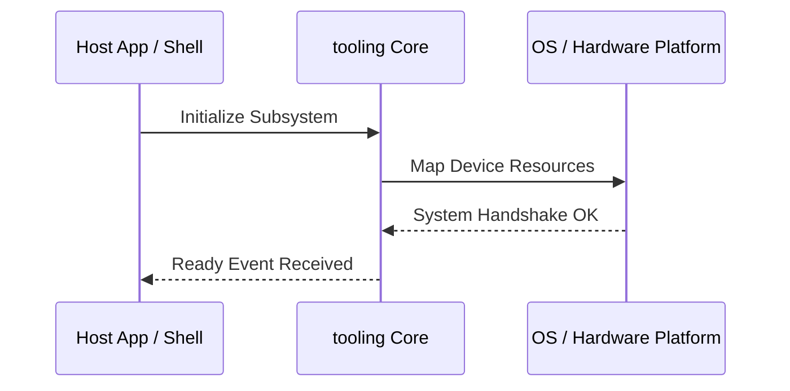

**Related Documents**: [README](../README.md) | [Functional Req](../functional-requirements/tooling-fr.md) | [Quick Reference](../code2spec-quick-reference.md)

# Module Design Card: tooling

> **Relevant source files**
>
> - [tool/ci/check_render_bmp.py](src:tool/ci/check_render_bmp.py)
> - [tool/coverage/csv2xml.py](src:tool/coverage/csv2xml.py)
> - [tool/coverage/genDomMethods.js](src:tool/coverage/genDomMethods.js)
> - [tool/coverage/genTable.js](src:tool/coverage/genTable.js)
> - [tool/drivers/basics/__init__.py](src:tool/drivers/basics/__init__.py)
> - [tool/drivers/basics/constants.py](src:tool/drivers/basics/constants.py)
> - [tool/drivers/basics/parallel.py](src:tool/drivers/basics/parallel.py)
> - [tool/drivers/basics/starfish_basic_test.py](src:tool/drivers/basics/starfish_basic_test.py)
> - [tool/drivers/basics/starfish_pixel_test.py](src:tool/drivers/basics/starfish_pixel_test.py)
> - [tool/drivers/basics/starfish_pixel_with_remote_test.py](src:tool/drivers/basics/starfish_pixel_with_remote_test.py)
> - [tool/drivers/basics/utils.py](src:tool/drivers/basics/utils.py)
> - [tool/drivers/run_test.py](src:tool/drivers/run_test.py)
> - [tool/drivers/tests/__init__.py](src:tool/drivers/tests/__init__.py)
> - [tool/drivers/tests/csswg_test.py](src:tool/drivers/tests/csswg_test.py)
> - [tool/drivers/tests/dom_conformance_test.py](src:tool/drivers/tests/dom_conformance_test.py)
> - [tool/drivers/tests/multi_results_test.py](src:tool/drivers/tests/multi_results_test.py)
> - [tool/drivers/tests/vendor_test.py](src:tool/drivers/tests/vendor_test.py)
> - [tool/drivers/tests/wpt_test.py](src:tool/drivers/tests/wpt_test.py)
> - [tool/imgdiff/imgdiff.cpp](src:tool/imgdiff/imgdiff.cpp)
> - [tool/lint/check_contract_abi.py](src:tool/lint/check_contract_abi.py)
> - [tool/lint/check_tidy.py](src:tool/lint/check_tidy.py)
> - [tool/lint/contract_abi/contract_shim.cpp](src:tool/lint/contract_abi/contract_shim.cpp)
> - [tool/perf_tools/measure-bench/server.py](src:tool/perf_tools/measure-bench/server.py)
> - [tool/perf_tools/mp4-avc-equiv/equiv.cpp](src:tool/perf_tools/mp4-avc-equiv/equiv.cpp)
> - [tool/perf_tools/mse-smoke/gen_webm.py](src:tool/perf_tools/mse-smoke/gen_webm.py)
> - [tool/perf_tools/mse-smoke/server.py](src:tool/perf_tools/mse-smoke/server.py)
> - [tool/perf_tools/style-smoke/server.py](src:tool/perf_tools/style-smoke/server.py)
> - [tool/pixel_test/nw_capture/capture.js](src:tool/pixel_test/nw_capture/capture.js)
> - [tool/pixel_test/nw_capture/inject.js](src:tool/pixel_test/nw_capture/inject.js)
> - [tool/pixel_test/syntaxChecker.js](src:tool/pixel_test/syntaxChecker.js)
> - [tool/pixel_test/syntaxCoverage.js](src:tool/pixel_test/syntaxCoverage.js)
> - [tool/reftest/draw_mem_chart.py](src:tool/reftest/draw_mem_chart.py)
> - [tool/reftest/search_webkit_test.py](src:tool/reftest/search_webkit_test.py)
> - [tool/repo_paths.py](src:tool/repo_paths.py)
> - [tool/runner/execution_test.py](src:tool/runner/execution_test.py)
> - [tool/runner/execution_worker.py](src:tool/runner/execution_worker.py)
> - [tool/runner/http_server.py](src:tool/runner/http_server.py)
> - [tool/runner/test_runner.py](src:tool/runner/test_runner.py)
> - [tool/runner/update_result.py](src:tool/runner/update_result.py)
> - [tool/runner/uwe_loader_test.py](src:tool/runner/uwe_loader_test.py)
> - [tool/runner/uwe_worker_loader_test.py](src:tool/runner/uwe_worker_loader_test.py)
> - [tool/wpt/inject_report.js](src:tool/wpt/inject_report.js)
> - [tool/wpt/scripts/wpt_annotate.py](src:tool/wpt/scripts/wpt_annotate.py)
> - [tool/wpt/scripts/wpt_audit.py](src:tool/wpt/scripts/wpt_audit.py)
> - [tool/wpt/scripts/wpt_generate_dashboard.py](src:tool/wpt/scripts/wpt_generate_dashboard.py)
> - [tool/wpt/scripts/wpt_manifest_lists.py](src:tool/wpt/scripts/wpt_manifest_lists.py)
> - [tool/wpt/scripts/wpt_reftest.py](src:tool/wpt/scripts/wpt_reftest.py)
> - [tool/wpt/scripts/wpt_runner.py](src:tool/wpt/scripts/wpt_runner.py)
> - [tool/wpt/scripts/wpt_server.py](src:tool/wpt/scripts/wpt_server.py)
> - [tool/wpt/scripts/wpt_status.py](src:tool/wpt/scripts/wpt_status.py)
> - [tool/wpt/scripts/wpt_update_data.py](src:tool/wpt/scripts/wpt_update_data.py)

**Primary File**: [`tool/ci/check_render_bmp.py`](src:tool/ci/check_render_bmp.py)
**Single Role**: Governs the operations and interfaces for the logical tooling subsystem [`check_render_bmp.py`](src:tool/ci/check_render_bmp.py#L1).
**Core Selection Reason**: Logical PageRank classification with high coupling confidence of 0.95.
**Date**: 2026-08-27

---

## Public Interface

| Class / Symbol | Signature / Description | Calling Module / Component | Source |
|----------------|-------------------------|----------------------------|--------|
| `tooling_init` | `init()`: Starts the logical subsystem | `engine-core` | [`check_render_bmp.py`](src:tool/ci/check_render_bmp.py#L1) |
| `check_render_bmp.` | Native operations for check_render_bmp.py | `shell` / `public-bridge` | [`check_render_bmp.py`](src:tool/ci/check_render_bmp.py#L10) |
| `csv2xml.` | Native operations for csv2xml.py | `shell` / `public-bridge` | [`csv2xml.py`](src:tool/coverage/csv2xml.py#L10) |
| `genDomMethods.` | Native operations for genDomMethods.js | `shell` / `public-bridge` | [`genDomMethods.js`](src:tool/coverage/genDomMethods.js#L10) |

---

## IPC / Message / Interface Contracts

- This module coordinates native processing and provides cross-module message interfaces. [`check_render_bmp.py`](src:tool/ci/check_render_bmp.py#L5)
- No custom socket-based or D-Bus communication is directly exposed unless defined globally.

## Key Flow

## Architectural Rules
1. **Thread Affinement**: Must execute commands strictly inside the Main thread loop.
2. **Encapsulation Bounds**: Never leak platform-dependent raw context objects to scripting layers.

## Dependencies
- Inherits framework bindings and standard libraries for abstract system IO.
