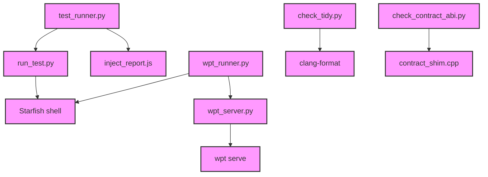

# Module Design Card — tooling

> **Relevant source files**
> - [`test_runner.py`](src:tool/runner/test_runner.py)
> - [`constants.py`](src:tool/drivers/basics/constants.py)
> - [`check_tidy.py`](src:tool/lint/check_tidy.py)
> - [`check_contract_abi.py`](src:tool/lint/check_contract_abi.py)
> - [`wpt_runner.py`](src:tool/wpt/scripts/wpt_runner.py)
> - [`wpt_server.py`](src:tool/wpt/scripts/wpt_server.py)
> - [`wpt_annotate.py`](src:tool/wpt/scripts/wpt_annotate.py)
> - [`wpt_manifest_lists.py`](src:tool/wpt/scripts/wpt_manifest_lists.py)
> - [`wpt_status.py`](src:tool/wpt/scripts/wpt_status.py)
> - [`http_server.py`](src:tool/runner/http_server.py)
> - [`execution_worker.py`](src:tool/runner/execution_worker.py)
> - [`starfish_basic_test.py`](src:tool/drivers/basics/starfish_basic_test.py)
> - [`starfish_pixel_test.py`](src:tool/drivers/basics/starfish_pixel_test.py)
> - [`run_test.py`](src:tool/drivers/run_test.py)
> - [`wpt_test.py`](src:tool/drivers/tests/wpt_test.py)
> - [`check_render_bmp.py`](src:tool/ci/check_render_bmp.py)
> - [`imgdiff.cpp`](src:tool/imgdiff/imgdiff.cpp)
> - [`repo_paths.py`](src:tool/repo_paths.py)
> - [`webapi_main.js`](src:docs/webpages/webapi/webapi_main.js)
> - [`run.py`](src:docs/generator/run.py)
> - [`streamline_annotate.h`](src:src/streamline_annotate.h)
> - (35 additional tool files)

## Module Boundary

**Rationale:** Build, test, CI, and development tooling [`module-groups.yaml`](src:code2spec/.analysis/state/delta/module-groups.yaml)
**Confidence:** 0.91

## Source Files

55 files spanning `tool/runner/`, `tool/drivers/`, `tool/wpt/`, `tool/lint/`, `tool/ci/`, `tool/coverage/`, `tool/perf_tools/`, `tool/pixel_test/`, `tool/reftest/`, `docs/generator/`, `docs/webpages/`.

## Public Interface

| Component | Entry Point | Source |
|---|---|---|
| Test Runner | `test_runner.py` main | [`test_runner.py`](src:tool/runner/test_runner.py) |
| WPT Runner | `wpt_runner.py` main | [`wpt_runner.py`](src:tool/wpt/scripts/wpt_runner.py) |
| Tidy Check | `check_tidy.py` main | [`check_tidy.py`](src:tool/lint/check_tidy.py) |
| Contract ABI Check | `check_contract_abi.py` main | [`check_contract_abi.py`](src:tool/lint/check_contract_abi.py) |
| HTTP Test Server | `http_server.py` | [`http_server.py`](src:tool/runner/http_server.py) |

## Key Flow

## Architectural Rules

- Test results use `WPTR PASS/FAIL/DONE` protocol [`wpt_runner.py`](src:tool/wpt/scripts/wpt_runner.py#L22)
- Error codes: `TEST_PASSED=0`, `TEST_FAILED=1`, `TEST_STOPPED=2` [`constants.py`](src:tool/drivers/basics/constants.py#L12)
- Tidy check skips `third_party/`, `test/`, `build/`, `out/` dirs [`check_tidy.py`](src:tool/lint/check_tidy.py#L34)
- WPT runner uses `stdbuf -oL -eL` to force line buffering [`wpt_runner.py`](src:tool/wpt/scripts/wpt_runner.py#L70)

## Dependencies

| Dependency | Type |
|---|---|
| Starfish executable | External (subprocess) |
| clang-format | External (subprocess) |
| wpt serve | External (subprocess) |
| Python 3 | Runtime |

## IPC / Message / Interface Contracts

- Test runner communicates with Starfish shell via subprocess and `WPTR` stdout protocol. [`wpt_runner.py`](src:tool/wpt/scripts/wpt_runner.py#L22)
- HTTP test server uses Python `http.server` for test page delivery. [`http_server.py`](src:tool/runner/http_server.py)
- WPT server manages `wpt serve` subprocess lifecycle. [`wpt_server.py`](src:tool/wpt/scripts/wpt_server.py)

## Quick Navigation

- [FR Document](../functional-requirements/tooling-fr.md)
- [Architecture](../02-architecture.md)
