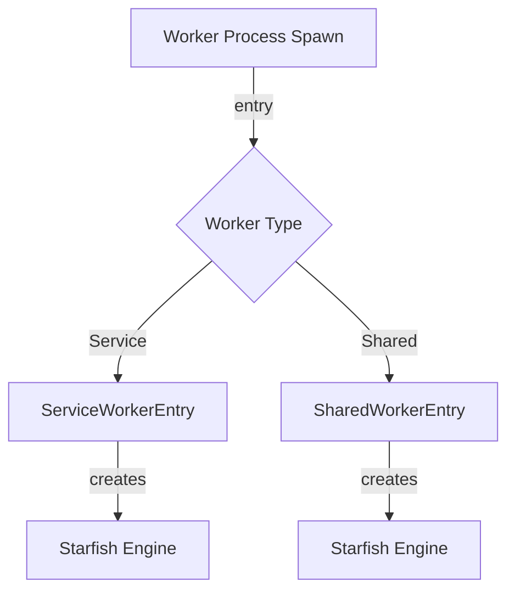

# Module Design Card: worker-launcher

> **Relevant source files**
> - [`ServiceWorkerEntry.cpp`](src/launcher/ServiceWorkerEntry.cpp#L1)
> - [`SharedWorkerEntry.cpp`](src/launcher/SharedWorkerEntry.cpp#L1)

## Module Boundary
Worker process entry points for ServiceWorker and SharedWorker.

**Confidence**: 0.95

## Source Files
2 files in `src/launcher/`

## Public Interface
- `ServiceWorkerEntry` — Process entry point for ServiceWorker. [`ServiceWorkerEntry.cpp`](src/launcher/ServiceWorkerEntry.cpp#L1)
- `SharedWorkerEntry` — Process entry point for SharedWorker. [`SharedWorkerEntry.cpp`](src/launcher/SharedWorkerEntry.cpp#L1)

## Key Flow

## Architectural Rules
- Worker entry points are separate process main functions.
- Gated by WORKER=1, SHARED_WORKER=1, SERVICE_WORKER=1 build flags. [`docs/Spec.md:48`](docs/Spec.md#L48)

## Dependencies
- Depends on: engine-core, js-binding (ScriptBindingWorkerInstance), embedding-api (LWEWorker)

## IPC / Message / Interface Contracts
- Worker processes communicate with the main process via the Starfish worker IPC mechanism (gated by STARFISH_USE_WORKER_PROCESS).

## Quick Navigation
- [FR Document](../functional-requirements/worker-launcher-fr.md)
- [Architecture](../02-architecture.md)
